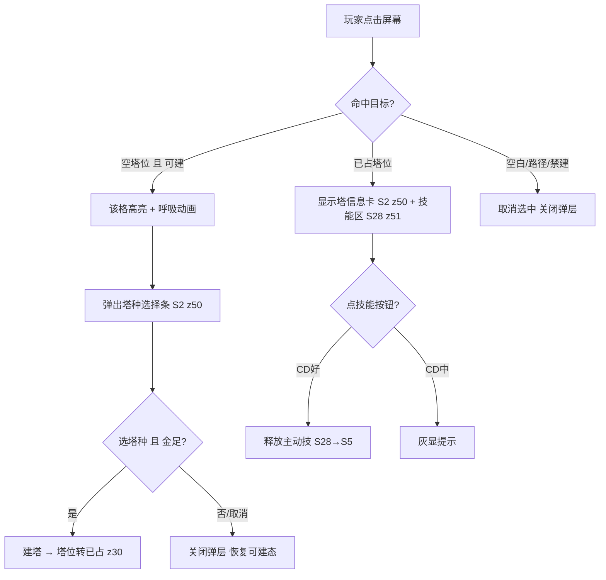
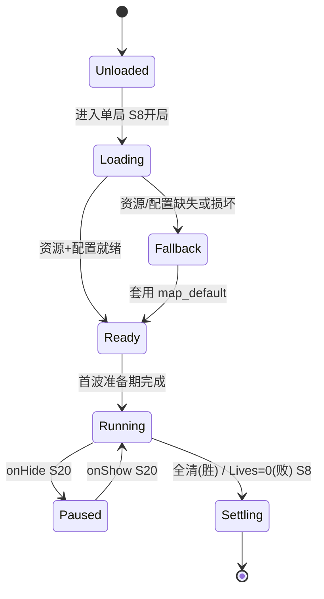
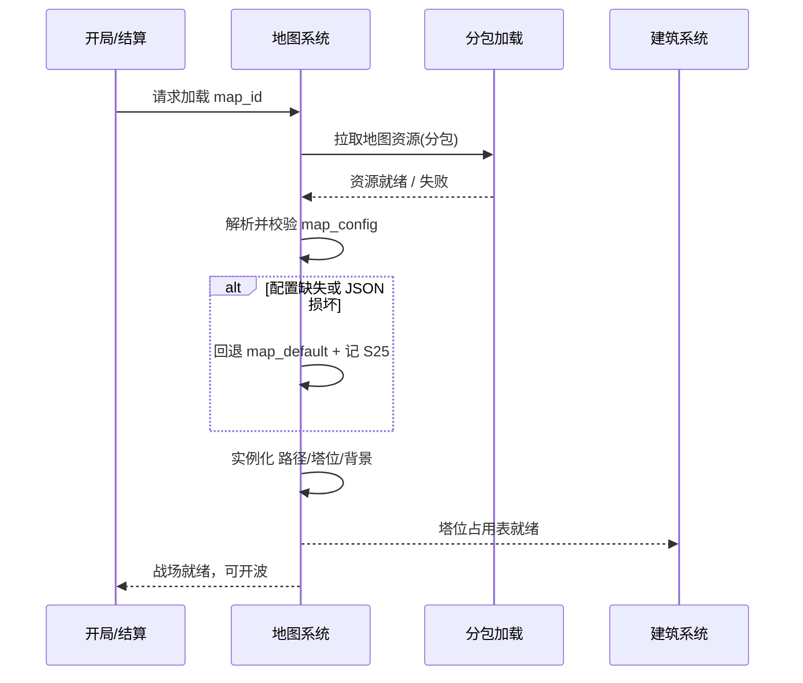

<!-- 编码: UTF-8 -->
# 系统策划案：S1 地图系统 (Map System)

> 归属域：A 核心战斗域 · 层级/优先级：MVP / P0 · 关联 F 码：F1 · 关联：GDD §4；SYSTEM_BREAKDOWN §S1
> 状态：v0.2-detailed · 日期 2026-07-17
> 版本说明：在 v0.1-draft 基础上补全 像素级 UI 线框 / 状态机 / 时序图 / 异常边界用例 / 完整配置字段与多行示例 / 美术资源帧数·分辨率·格式·切片。
> **v0.2-rev（耦合重构）：** 按 DO 新规新增地图 UI——选中塔**技能按钮区**(S28 z51)、**木掉落实时指示**(z52)、木计数 HUD 位置明确；线框补**分辨率自适应**(锚点/九宫格/相对比例/安全区/letterbox/DPR)；交互流程图加入技能按钮分支。
> 平衡数值（圈数、环线半径、怪物移速、塔位总数等）保持 `[PLACEHOLDER]`，仅标注"调优杆"说明其影响，禁止硬编码。

---

## 0. 元数据头

> 归属域：A 核心战斗域 · 层级/优先级：MVP / P0 · 关联 F 码：F1 · 关联：GDD §4；SYSTEM_BREAKDOWN §S1
> 状态：v0.2-detailed · 日期 2026-07-17
> 版本说明：在 v0.1-draft 基础上补全 像素级 UI 线框 / 状态机 / 时序图 / 异常边界用例 / 完整配置字段与多行示例 / 美术资源帧数·分辨率·格式·切片。
> **v0.2-rev（耦合重构）：** 按 DO 新规新增地图 UI——选中塔**技能按钮区**(S28 z51)、**木掉落实时指示**(z52)、木计数 HUD 位置明确；线框补**分辨率自适应**(锚点/九宫格/相对比例/安全区/letterbox/DPR)；交互流程图加入技能按钮分支。
> 平衡数值（圈数、环线半径、怪物移速、塔位总数等）保持 `[PLACEHOLDER]`，仅标注"调优杆"说明其影响，禁止硬编码。

---

## 1. 系统 UI 布局

地图系统是"战斗内主场景"，其界面即战场视图；无独立菜单页。

### 1.1 布局层级（z 轴，全局统一基准）

| 层级 z | 名称 | 说明 |
|---|---|---|
| 0 | 背景层 | 主题背景底图，全屏，安全区外可被刘海遮挡 |
| 10 | 路径层 | 环形路径贴图，居中 |
| 20 | 塔位层 | 网格塔位覆盖路径内侧；可建格呼吸高亮 |
| 30 | 单位层 | 怪物沿路径移动、塔模型立于塔位（塔渲染属 S2） |
| 35–36 | 战斗反馈层 | 伤害飘字 / 状态图标 / 击杀粒子（属 S5） |
| 40 | 交互层 | 选中态、射程范围圈 |
| 45 | HUD 信息条 | 顶栏金/木/波次/Lives（属 S3/S4/S6/S7）；木计数 HUD 实时刷新（木为 session 货币，见 S03/S28） |
| 50–55 | 操作层 | 塔种选择条 / 塔信息卡 / 养塔面板（属 S2） |
| 51–52 | 技能层 | 选中塔**技能按钮区** + 被动指示 + CD 环（属 S28，附 S2 信息卡） |
| 52 | 木掉落实时层 | 怪物掉木飘字 +🪵 落点提示（接 S3/S4/S28） |
| 60 | 预警层 | Boss 预警 / 漏怪红闪（属 S4/S6） |
| 70–71 | 结算层 | 失败遮罩 / 结算面板（属 S6/S8） |

### 1.2 像素级线框（750 × 1334 设计基准，坐标 = 左上角原点）

```
  (0,0)┌─────────────────────────────────────────── 750 ──┐
       │  顶栏 z45 [金 S3]   [第X/Y波 S4]   [木 S3] [♥×N S6] │ y=20..90
       │        ↕ 木掉落实时飘字 +🪵 z52 (怪死亡落点上方 0.6s)  │
       │ ─────────────────────────────────────────────────  │
       │                  ╭── 环形路径 z10 ──╮               │
       │                 │   (怪物绕圈行进)    │              │
       │    ⬡塔位z20     │    ◯塔(已占)z30    │   ⬡塔位z20  │ y≈300
       │   (300,400)     │   ⟲被动光环z30     │  (450,400)  │
       │   80×80         │      (内侧)        │   80×80     │
       │                 │   ◎终点标记z10     │             │
       │                 ╰────────────────────╯              │
       │    选中塔位→射程圈 z40 + 被动光环 z30 (半透明)      │
       │                                                      │
       │  ┌── 塔信息卡 z50 (点已占塔位) ──────────┐          │ y≈700
       │  │ 箭塔 Lv.3  DPS 120  范围 160          │          │
       │  │ [养塔 木×N] [卖塔] [索敌]             │          │
       │  │ ── 技能区 z51 (本系统 S28) ─────────  │          │
       │  │ [⚔主动技] CD环▩▩▩░ 12s  被动①✔ 被动②✔│          │
       │  └──────────────────────────────────────┘          │
       │  ── 底部操作条 z50 ──────────────────────────────  │ y=1230
       │  [2x S7]                              [⏸ S7]        │
       │  [塔种选择条 z50 上滑: 图标96×96 图标96×96 ...]      │ y=1150
       └────────────────────────────────────────────── 1334 ┘
```

> **分辨率自适应（强制）**：以 750×1334 为逻辑设计基准（@1x）。
> - **锚点**：顶栏组件锚 Top（y 比例 0–0.067）；底部操作条锚 Bottom（y=1334 比例 1.0）；塔信息卡/技能区锚"塔位上方 + 安全区"。
> - **九宫格**：塔信息卡、技能按钮底、CD 环底均九宫（边 16px 圆角 12），拉伸不变形。
> - **相对比例**：技能按钮 = `96×96 × safe_scale`，`safe_scale = min(screen_w/750, screen_h/1334)`；CD 环按相对半径绘制。
> - **安全区**：所有可点组件内缩至 `top≥状态栏+20, bottom≥手势条+20`（刘海/灵动岛/手势条不遮挡）；技能按钮最小可点区 ≥ 88×88（P3 一指可玩）。
> - **Letterbox**：渲染分辨率 ≠ 设计基准时按 **contain** 留黑边（不裁切玩法），HUD 相对设计基准定位后整体缩放。
> - **DPR**：美术提供 @2x/@3x（见 S28 §4），引擎 `cc.view` 设 `resolutionPolicy = FIT`，`devicePixelRatio` 对齐真机。

### 1.3 组件表（坐标 x,y 为左上角；w×h 为尺寸；z 为层级）

| 组件 | 坐标(x,y) | 尺寸(w×h) | z | 响应行为 |
|---|---|---|---|---|
| 背景底图 | (0,0) | 750×1334 | 0 | 无交互 |
| 环形路径 | (75,300) 居中 | 600×600（外径） | 10 | 无交互 |
| 塔位格（可建） | 路径内侧网格，如 (300,400) | 80×80 | 20 | 点击→选中+呼吸高亮；交由 S2 弹选择条 |
| 塔位格（已占） | 同塔位坐标 | 80×80 | 20→30 | 点击→S2 信息卡 |
| 塔位格（禁建/障碍） | 路径/越界处 | 80×80 | 20 | 半透明，点击无效 |
| 射程圈 | 以选中塔位中心 | 半径 = range×scale | 40 | 选中显示，松手/开建消失 |
| 终点标记 | 环线收尾，如 (375,260) | 60×60 | 10 | 漏怪时红闪（触发 S6） |
| 塔模型 | 塔位中心 | 96×96 | 30 | 渲染属 S2，无点击（点击用塔位格） |
| 被动光环 | 塔位中心，半径=aura | 世界空间 | 30 | 被动解锁后常驻渲染（属 S28） |
| 怪物单位 | 沿 path_points | 64×64 | 30 | 渲染属 S5，无点击 |
| 木掉落实时飘字 | 怪物死亡落点动态 | 文本 20px + 🪵 | 52 | 怪掉木时 +🪵N 上浮 0.6s（接 S3/S4/S28） |
| 技能按钮（主动） | 信息卡内 (245,820) | 96×96 | 51 | 点→释放主动技(CD好)；CD中灰显+CD环（属 S28） |
| 主动技 CD 环 | 覆盖技能按钮 | 同 96×96 环形 | 51 | 顺时针消退，剩 0 亮起可点（属 S28） |
| 被动①/② 指示 | 信息卡内 (355,820)/(415,820) | 48×48 | 51 | 解锁✔亮 / 未解锁🔒灰（显解锁等级，属 S28） |
| 技能说明弹层 | 长按技能按钮弹出 (195,560) | 360×240 | 70 | 显 desc+CD+解锁条件，松手收起（属 S28） |

### 1.4 交互流程图（mermaid flowchart）



---

## 2. 逻辑功能

### 2.1 功能模块表（触发 / 处理 / 输出，含正常与异常分支）

| 模块 | 触发条件 | 处理流程（正常） | 输出 |
|---|---|---|---|
| 地图加载 | 进入单局（S8 开局） | 读 `map_config[map_id]` → 拉分包资源(S19) → 解析路径/塔位/背景 → 初始化塔位占用表 | 战场场景就绪，回调 S2/S5 可建 |
| 塔位占用管理 | S2 建/卖塔 | 占用表置位/复位 + 校验可建态 + 重绘高亮 | 塔位状态与渲染同步 |
| 怪物寻路 | 波次出怪（S4→S5） | 沿 `path_points` 路点线性插值移动，累计行进距离；满 `loop_count` 圈到达终点 → 回调 S6 | 怪物位置每帧更新 |
| 可建判定 | 点击塔位 | 查占用表 + 资源校验（金由 S2 调 S3） | 可建/不可建反馈 |
| 主题切换 | 关卡切换（S14） | 按 `map_id`/theme 换皮肤资源 | 视觉变体 |

### 2.2 状态机（mermaid stateDiagram-v2 — 地图运行时）



### 2.3 时序流程图（mermaid sequenceDiagram — 开局加载）



### 2.4 异常与边界用例表

| 场景 | 触发条件 | 处理流程 | 输出 / 兜底 |
|---|---|---|---|
| 网络中断（分包下载 S19） | 加载地图分包时微信断网 | 重试 3 次（指数退避）→ 失败则用内置默认图(map_default)+本地缓存 | 不阻断开局；记 S25 异常事件 |
| 切后台（S20） | `onHide` 触发 | 全局暂停广播；怪物移动计时挂起；地图不卸载 | `onShow` 恢复，坐标/塔位状态零错乱 |
| 数据损坏（配置/S18） | `map_config` JSON 解析失败或 schema 校验失败 | 丢弃坏档 → 套用 `map_default` | 不崩；S25 记"坏档回退" |
| 并发操作 | 200ms 内连点多个塔位 | 首次命中为准，后续点击入防抖队列/忽略；建塔中再点同格→忽略 | 仅一个选择条弹出，无重复建造 |
| 数值极值 | `ring_count`=0 或 >6 | 钳制到 `[1,6]` 并告警 | 路径仍闭合可玩 |
| 数值极值 | `move_speed`≤0 | 钳制到最小值 20(px/s) | 怪物仍可移动 |
| 数值极值 | `ring_radius` 含 0/负 | 剔除该圈并重算路径 | 余圈正常 |
| 配置缺失 | `map_id` 不存在 / `path_points` 缺 | `path_points` < 2 视为严重错误 → 阻断该局并上报 | 安全退出到 S10 大厅 |
| 坐标越界 | `tower_slots` 坐标超 750×1334 或落在路径上 | 忽略该格（不参与占用表） | 其余正常；S25 告警 |
| 塔位重叠 | 两 slot 中心距 < `slot_size` | 保留其一、剔除重叠者 | 不出现不可点塔位 |

---

## 3. 配置表设计

**表名：`map_config`（地图配置）**

| 字段 | 类型 | 取值范围 | 默认值（指针） | 说明 |
|---|---|---|---|---|
| map_id | string | 唯一，如 "map_01" | — | 地图主键 |
| map_name | string | 非空 | "默认图" | 显示名（S14 选关用） |
| theme | enum | grass / ice / lava / desert | "grass" | 视觉主题，决定皮肤包 |
| ring_count | int | 1–6 | `value_ref: balance/S01_map.json#sys_ring_count` | 环形路径圈数。**调优杆**：影响怪物被多塔命中次数与单局时长（P1/P5） |
| ring_radius | float[] | 每元素 >0，长度=ring_count | `value_ref: balance/S01_map.json#sys_ring_radius` | 每圈半径(px，设计基准)。**调优杆**：内/外圈覆盖差异 |
| loop_count | int | 1–N | `value_ref: balance/S01_map.json#sys_loop_count` | 怪物需绕满圈数才抵达终点出口。**调优杆**：与单局波数共同决定时长 |
| path_points | json | 合法坐标数组，≥2 点 | — | 路点序列（怪物移动轨迹，闭环） |
| tower_slots | json | 合法坐标数组 | — | 塔位中心坐标列表（路径内侧） |
| slot_size | int | 40–160 | 80 | 单塔位点击区边长（结构值，可默认） |
| slot_inner_count | int | 0–200 | `value_ref: balance/S01_map.json#sys_slot_inner_count` | 内环塔位数。**调优杆**：内圈 DPS 利用率 |
| slot_outer_count | int | 0–200 | `value_ref: balance/S01_map.json#sys_slot_outer_count` | 外环塔位数（贵但覆盖长） |
| move_speed | float | 20–200 | `value_ref: balance/S01_map.json#sys_move_speed` | 怪物基础移动速度(px/s)。**调优杆**：出怪节奏与反应窗口 |
| bg_res | string | 资源 id | "bg_grass" | 背景底图资源名（S19 分包） |
| path_res | string | 资源 id | "path_grass" | 路径贴图资源名 |
| pack_id | string | 分包 id | "pkg_map" | 归属分包（S19） |

**多行示例数据（CSV 头部 + 3 行；平衡字段全部改 `value_ref` 指针，结构字段给示例值）**

```csv
map_id,map_name,theme,ring_count,ring_radius,loop_count,path_points,tower_slots,slot_size,slot_inner_count,slot_outer_count,move_speed,bg_res,path_res,pack_id
map_01,青草环,grass,value_ref:balance/S01_map.json#sys_ring_count,"value_ref:balance/S01_map.json#sys_ring_radius","value_ref:balance/S01_map.json#sys_loop_count","[[375,300],[575,300],[575,700],[175,700],[175,300]]","[[300,420],[450,420],[300,560],[450,560]]",80,value_ref:balance/S01_map.json#sys_slot_inner_count,value_ref:balance/S01_map.json#sys_slot_outer_count,value_ref:balance/S01_map.json#sys_move_speed,bg_grass,path_grass,pkg_map
map_02,寒冰环,ice,value_ref:balance/S01_map.json#sys_ring_count,"value_ref:balance/S01_map.json#sys_ring_radius","value_ref:balance/S01_map.json#sys_loop_count","[[375,320],[560,320],[560,720],[190,720],[190,320]]","[[310,440],[440,440],[310,580],[440,580]]",80,value_ref:balance/S01_map.json#sys_slot_inner_count,value_ref:balance/S01_map.json#sys_slot_outer_count,value_ref:balance/S01_map.json#sys_move_speed,bg_ice,path_ice,pkg_map
map_default,默认环,grass,value_ref:balance/S01_map.json#sys_ring_count,"value_ref:balance/S01_map.json#sys_ring_radius","value_ref:balance/S01_map.json#sys_loop_count","[[375,300],[575,300],[575,700],[175,700],[175,300]]","[[300,450],[450,450]]",80,value_ref:balance/S01_map.json#sys_slot_inner_count,value_ref:balance/S01_map.json#sys_slot_outer_count,value_ref:balance/S01_map.json#sys_move_speed,bg_grass,path_grass,pkg_map
```

> 说明：`path_points`/`tower_slots` 在 CSV 中以 JSON 字符串存储；引擎侧建议直读 JSON 配置表避免转义。平衡字段（标 `[PLACEHOLDER]`）须经试玩调优，禁止在代码硬编码。

---

## 4. 美术资源需求

| 资源 | 帧数 | 分辨率 | 格式 | 切片要求 |
|---|---|---|---|---|
| 地图背景底图 | 1（静态） | 750×1334 | PNG（≤200KB） | 九宫/平铺，安全区外可裁 |
| 环形路径贴图 | 1（静态） | 1024×1024 透明 | PNG / Atlas | 无切片，描边清晰，支持主题换色 |
| 塔位格（可建·呼吸） | 4 帧（呼吸 0.4s 循环） | 80×80 | Atlas | 单格切片，锚点中心 |
| 塔位格（已占） | 1（静态） | 80×80 | Atlas | 单格切片 |
| 塔位格（禁建/障碍） | 1（静态，半透明） | 80×80 | Atlas | 单格切片 |
| 射程范围圈 | 1（静态，半透明环） | 512×512 透明 | PNG | 九宫环形，按射程缩放 |
| 终点标记 | 3 帧（红闪 0.3s） | 60×60 | Atlas | 单格切片 |
| 主题皮肤包（grass/ice/lava/desert） | — | 各 750×1334 + 1024×1024 | PNG/Atlas | 替换底图/路径色，按 theme 加载 |

> 资源经 S19 分包加载；压缩规范与图集打包见 S19/S34。

---

## 5. 实现契约

### 5.1 输入数据结构

| 字段 | 类型 | 来源 config 字段 |
|---|---|---|
| map_id | string | `map_config.map_id`（本系统 §3） |
| map_variant | string | `stage_config.map_variant`（S32 §3，FK→map_id） |
| session_player_level | int | `player_level_config[level]`（S29，建塔时套用） |
| tower_slot_events | event | S2 建/卖塔 → 占用表回调 |
| path_points / tower_slots | json | `map_config`（本系统 §3） |

### 5.2 输出数据结构

| 字段 | 类型 | 说明 |
|---|---|---|
| tower_slot_table | bool[][] | 塔位占用表（S2 消费） |
| battlefield_ready | event | 战场就绪（→S2/S5） |
| map_default_applied | flag | 配置缺失时回退 map_default（记 S25） |

### 5.3 跨系统接口调用表

| caller | callee | function | 方向 | 用途 |
|---|---|---|---|---|
| S8 | S1 | `loadMap(map_id)` | in | 开局加载地图 |
| S1 | S19 | `pullSubpackage(pack_id)` | in | 拉取地图分包资源 |
| S1 | S2 | `onTowerSlotsReady(slot_table)` | out | 塔位占用表就绪 |
| S1 | S8 | `onBattlefieldReady()` | out | 战场就绪可开波 |
| S2 | S1 | `occupySlot(slot_id)` / `releaseSlot(slot_id)` | in | 建/卖塔占/释塔位 |
| S1 | S5 | `spawnEnemyOnPath(enemy, path_points)` | out | 怪物沿路径布点 |
| S1 | S6 | `onReachEnd(enemy)` | out | 漏怪回调（终点） |

### 5.4 错误码表

| E# | 场景 | 兜底 | 涉及 |
|---|---|---|---|
| E01 | 分包下载失败（S19） | 重试 3 次 → 内置默认图 + 本地缓存，记 S25 | S19/S25 |
| E02 | 切后台 onHide(S20) | 全局暂停广播，坐标/塔位零错乱 | S20 |
| E03 | map_config 损坏/缺 | 回退 map_default，记 S25 | S25 |
| E04 | 并发连点塔位 | 首次命中为准，防抖队列 | S2 |
| E05 | ring_count=0 或 >6 | 钳制 [1,6] + 告警 | S24 |
| E06 | move_speed≤0 | 钳制 min 20(px/s) | S24 |
| E07 | ring_radius 含 0/负 | 剔除该圈重算 | S24 |
| E08 | map_id 不存在 / path_points<2 | 阻断该局，上报 S10 | S10/S25 |
| E09 | tower_slots 越界/重叠 | 忽略该格 / 保留其一 | S25 |

### 5.5 状态转换表

| state | event | transition | action |
|---|---|---|---|
| Unloaded | 进入单局(S8开局) | → Loading | 读 map_config，拉分包 |
| Loading | 资源+配置就绪 | → Ready | 解析路径/塔位/背景 |
| Loading | 资源/配置缺失或损坏 | → Fallback | 套用 map_default，记 S25 |
| Fallback | 套用 map_default | → Ready | 实例化场景 |
| Ready | 首波准备期完成 | → Running | 进入战斗 |
| Running | onHide(S20) | → Paused | 全局暂停广播 |
| Paused | onShow(S20) | → Running | 恢复计时 |
| Running | 全清(胜)/Lives=0(败)(S8) | → Settling | 进结算 |

### 5.6 数值消费清单

| param_id | 来源 balance 文件 |
|---|---|
| sys_ring_count | balance/S01_map.json |
| sys_ring_radius | balance/S01_map.json |
| sys_loop_count | balance/S01_map.json |
| sys_slot_inner_count | balance/S01_map.json |
| sys_slot_outer_count | balance/S01_map.json |
| sys_move_speed | balance/S01_map.json |

---

## 6. 冲突与待裁定

本系统无跨系统冲突或待裁定项；命名（armor_type 枚举、电塔 id 等）均按 S30 权威对齐，数值初值已全部锁定于 `balance/S01_map.json`，无 `NEEDS-DESIGN`。
