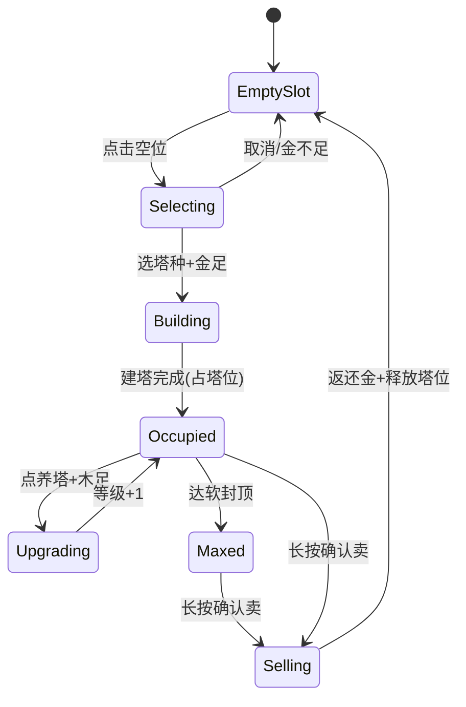
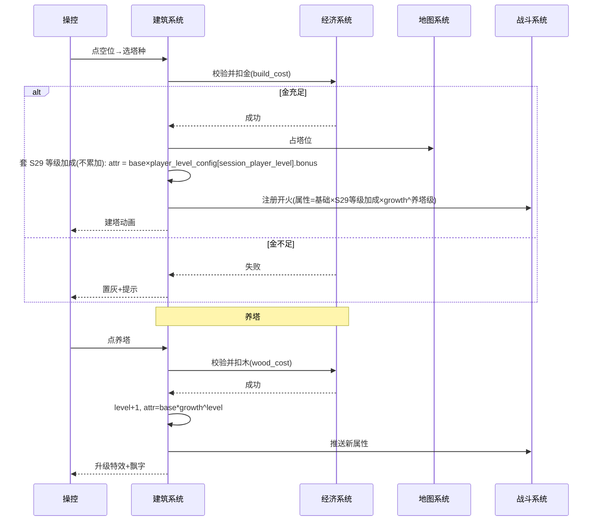

<!-- 编码: UTF-8 -->
# 系统策划案：S2 建筑（塔）系统 (Building / Tower System)

## 0. 元数据头

> 归属域：A 核心战斗域 · 层级/优先级：MVP / P0 · 关联 F 码：F2 F3 F4 · 关联：GDD §5.1/§5.2/§5.7；SYSTEM_BREAKDOWN §S2
> 状态：v0.2-detailed · 日期 2026-07-17
> 版本说明：在 v0.1-draft 基础上补全 像素级 UI 线框 / 状态机 / 时序图 / 异常边界用例 / 完整配置字段与多行示例 / 美术资源帧数·分辨率·格式·切片。
> **v0.2-rev（耦合重构）：** 按 DO 新规——**移除木房(wood)塔**，换**新风种「风塔 / t_wind」（DO 已确认定稿）**；塔信息卡新增**技能按钮区**(引 S28)；**养塔(木升级)明确为 session（副本内），每局重来、不跨局保留**；木来源改"怪掉+应急兑换"(见 S03/S04)。
> 平衡数值（建造成本、各塔 DPS、养塔成长系数、软封顶等级、售卖返还率等）保持 `[PLACEHOLDER]`，仅标注"调优杆"，禁止硬编码。原"木房产木速率"字段已删除。
> **v0.2（S29 等级系统）**：建塔时塔基础属性按 **`session_player_level`（= S18 存档 player_level 快照）** 查 `player_level_config` 修正（dmg/range/atk_speed，**不累加**）——加成在开局/建塔时应用、玩家无需操作；养塔成长在此基础上叠加。详见 S29。

---

## 1. 系统 UI 布局

### 1.1 布局层级（z 轴）

| 层级 z | 名称 | 说明 |
|---|---|---|
| 30 | 塔模型层 | 塔立于塔位（来自 S1 渲染） |
| 45 | HUD 信息条 | 顶栏（属 S7） |
| 50 | 塔种选择条 / 塔信息卡 | 点空位上滑 / 点已占浮窗 |
| 51 | 技能按钮区 | 选中塔信息卡内，**主动技按钮 + 被动指示 + CD 环**（属 S28） |
| 55 | 养塔面板 | 养塔时弹出，含下一级预览 |

### 1.2 像素级线框（750 × 1334）

```
  (0,0)┌─────────────────────────────────────────── 750 ──┐
       │  顶栏 z45 [金] [波次] [木] [♥]                    │ y=20..90
       │        （战场：路径+塔位，见 S1）                   │
       │                                                    │
       │  ┌── 塔信息卡 z50 (点已占塔位) ──────────┐         │ y≈700
       │  │ 箭塔 Lv.3  DPS 120  范围 160          │         │
       │  │ [养塔 木×N] [卖塔 返还金×R] [索敌]    │         │
       │  │ ── 技能区 z51 (S28) ────────────────  │         │
       │  │ [⚔主动技] CD环▩▩░ 被动①✔ 被动②✔     │         │
       │  └──────────────────────────────────────┘         │
       │                                                    │
       │  ── 塔种选择条 z50 上滑 (点空位) ───────────────  │ y=1150
       │  [箭 金N][炮 金N][冰 金N][风 金N]  ←横滑→       │ 高160
       │  ── 底部操作条 z50 ────────────────────────────  │ y=1230
       │  [2x]                                [⏸]          │
       └────────────────────────────────────────────── 1334 ┘
```

### 1.3 组件表（x,y 左上角；w×h 尺寸；z 层级）

| 组件 | 坐标(x,y) | 尺寸(w×h) | z | 响应行为 |
|---|---|---|---|---|
| 塔种选择条 | (0,1150) 底部 | 750×160（图标 96×96） | 50 | 点击图标→校验金(S3)→建塔/置灰 |
| 塔种图标 | 选择条内 | 96×96 | 50 | 角标显示造价（金）；不可建灰显；首发 4=箭/炮/冰/风，解锁 3=魔/毒/电 |
| 塔信息卡 | 选中塔位上方浮窗，如 (225,700) | 300×260 | 50 | 显示属性+养/卖/索敌+技能区(S28) |
| 技能按钮（主动） | 信息卡内，(245,830) | 96×96 | 51 | 点→释放主动技(CD好)；CD中灰显(属 S28) |
| 被动①/② 指示 | 信息卡内 (355,830)/(415,830) | 48×48 | 51 | 解锁✔/未解锁🔒(属 S28) |
| 养塔按钮 | 信息卡内，(245,900) | 120×64 | 50 | 点→扣木(S3)→升级(session)，属性动画 |
| 卖塔按钮 | 信息卡内，(385,900) | 120×64 | 50 | 长按确认→返还金(S3)→释放塔位 |
| 索敌模式切换 | 信息卡内，(225,970)（增强） | 80×64 | 50 | 切换 最前/最强/范围 |
| 养塔预览面板 | 信息卡上方，(225,640) | 300×140 | 55 | 显示下一级属性预览+喂木量 |

### 1.4 交互流程图（mermaid flowchart）

```mermaid
flowchart TD
    A[点击塔位 S1] --> B{空位 且 可建?}
    B -->|是| C[塔种选择条上滑 z50]
    C --> D{选塔种 且 金足?}
    D -->|是| E[建塔动画 → 塔位转已占 z30]
    D -->|否| F[置灰+抖+金不足提示]
    B -->|已占| G[塔信息卡 z50 + 技能区 z51]
    G --> H{操作?}
    H -->|养塔+木足| I[升级动画, DPS↑, 木↓(session)]
    H -->|点技能按钮(S28)| S[CD好?→释放主动技]
    H -->|卖塔长按确认| J[返还金, 释放塔位(Lv1重置)]
    H -->|索敌(增强)| K[切换 target_mode]
```

---

## 2. 逻辑功能

### 2.1 功能模块表（触发 / 处理 / 输出）

| 模块 | 触发条件 | 处理流程（正常） | 输出 |
|---|---|---|---|
| 建造（F2） | 点空塔位 + 选塔种 | 校验金(S3) → 占塔位(S1) → 实例化塔(Lv1) → **按 `session_player_level` 套 S29 等级加成(不累加)** → 扣金 | 新塔入战(已含等级增益)，金减少 |
| 塔种库（F3） | 开局 / 解锁(S11) | 读 `tower_config`，按 `unlock_by` 过滤可建列表（首发 4=箭/炮/冰/风，解锁 3=魔/毒/电，经 S11 等级门槛 S29） | 选择条内容 |
| 养塔升级（F4） | 点养塔 + 木足 | 等级+1 → 属性=(基础×**S29 等级加成(不累加)**)×`growth`^养塔等级 → 扣木(**session 木，每局重来**) | 塔变强，木减少（不跨局） |
| 售卖退款 | 长按确认卖 | 返还 金×`sell_refund_rate` → 释放塔位(S1) → 塔回 Lv1 | 塔移除，金回（被动重新锁定，见 S28） |
| 索敌模式（增强） | 点模式键 | 设 `target_mode` | 命中逻辑变化(S5) |
| 技能入口（S28） | 选中塔→信息卡技能区 | 展示主动技按钮 + 被动指示（技能逻辑/激活归 S28） | UI 出口，释放经 S28→S5 |

### 2.2 状态机（mermaid stateDiagram-v2 — 单塔生命周期）



### 2.3 时序流程图（mermaid sequenceDiagram — 建造 / 养塔）



### 2.4 异常与边界用例表

| 场景 | 触发条件 | 处理流程 | 输出 / 兜底 |
|---|---|---|---|
| 网络中断 | 解锁态(S11)需远程校验 | 用本地已解锁列表，建造/养塔全本地（木为 session 掉落实时） | 不阻塞；恢复后同步 |
| 切后台（S20） | `onHide` | 建造/养塔协程挂起；升级动画暂停 | `onShow` 恢复，状态零损失 |
| 数据损坏（S18） | `tower_config` 缺/损坏 | 该塔种不进选择条；已建塔以默认属性加载或移除+补偿 | 记 S25，不崩 |
| 并发操作 | 200ms 内连点建造 | 防抖：仅首次生效，其余忽略 | 无重复建造 |
| 并发操作 | 同时点养塔与卖塔 | 互斥锁，先到先得；后到提示"塔操作中" | 不出现半卖半养 |
| 数值极值 | `build_cost`≤0 | 钳制到最小正价 | 可建 |
| 数值极值 | 木为负/不足 | 养按钮禁用，预览灰显 | 不扣负木 |
| 数值极值 | 等级≥软封顶 | 养按钮隐藏，显"已满级" | 停止养 |
| 数值极值 | `base_dps` 异常(≤0/溢出) | 钳制最小 1，对 S24 报可疑 | 塔可战 |
| 配置缺失 | 某塔 `tower_config` 缺 | 选择条跳过该塔 | 其余正常 |
| 配置缺失 | `upgrade_config` 缺 | 用 `base×growth^level` 公式兜底 | 升级照常 |
| 卖塔重置技能 | 卖塔后同格重建 | 等级回 Lv1 → 被动重新锁定(关 S28)；主动技 CD 重置 | 符合 session 不跨局(R3) |
| 养塔木不足(session) | 木为 0 或不足 | 养按钮禁用，提示"去刷木/应急兑换"(见 S03) | 不扣负木 |
| 卖塔正开火 | 卖塔时塔在射击 | 允许卖，终止射击协程，进行中弹道自然消失(S5) | 无残留弹道 |
| 等级加成未生效 | 建塔时 `session_player_level` 未读/读脏 | 建塔前强制 `session_player_level = save.player_level`；缺失降级为 1 级(无加成，安全) | 不崩，合规降级 |

---

## 3. 配置表设计

**表名：`tower_config`（塔基础配置）**

| 字段 | 类型 | 取值范围 | 默认值 | 说明 |
|---|---|---|---|---|
| tower_id | string | 唯一 | — | 塔主键 |
| name | string | 非空 | — | 显示名 |
| type | enum | arrow/cannon/ice/wind/magic/poison/electric | arrow | 塔种（首发 4=箭/炮/冰/风，解锁 3=魔/毒/电 经 S11） |
| build_cost | int | 10–500 | `value_ref: balance/S02_building_tower.json#t_<tower>_build_cost` | 建造成本（金）。**调优杆**：经济节奏 |
| max_level | int | 1–30 | `value_ref: balance/S02_building_tower.json#t_<tower>_max_level` | 软封顶等级（GDD：等级无硬上限软封顶）。**调优杆**：养成上限 |
| base_dps | float | 1–1000 | `value_ref: balance/S02_building_tower.json#t_<tower>_base_dps` | 1 级 DPS。**调优杆**：清屏爽点(P2) |
| growth | float | 1.1–3.0 | `value_ref: balance/S02_building_tower.json#t_<tower>_growth` | 每级成长系数（养塔指数，session 升级曲线）。**调优杆**：P2 指数感，建议 1.5–2.0x |
| range | float | 50–400 | `value_ref: balance/S02_building_tower.json#t_<tower>_range` | 射程(px)。**调优杆**：内外圈覆盖 |
| attack_speed | float | 0.2–5 | `value_ref: balance/S02_building_tower.json#t_<tower>_attack_speed` | 攻速(次/s)。**调优杆**：DPS 构成 |
| unlock_by | string | null 或 meta 节点 id | null | 解锁来源(S11)；null=首发（箭/炮/冰/风） |
| status_effect | enum | none/slow/poison/chain/knockback | none | 状态类型(S5)；风塔=knockback(击退) |
| sell_refund_rate | float | 0.3–0.9 | `value_ref: balance/S02_building_tower.json#t_<tower>_sell_refund_rate` | 卖塔返还比例。**调优杆**：防卡死兜底 |
| skill_ref | string | 关联 `skill_config.tower_id` | — | 技能配置外键（见 S28；三技能按塔种唯一） |

**表名：`upgrade_config`（升级曲线，建议合并入 tower_config）**

| 字段 | 类型 | 取值范围 | 默认值 | 说明 |
|---|---|---|---|---|
| level | int | 1–max_level | — | 等级 |
| wood_cost | int | 5–999 | `value_ref: balance/S02_building_tower.json#t_wood_cost` | 该级喂木量。**调优杆**：养塔经济曲线 |
| dps_mult | float | — | growth^level | 累计 DPS 倍率（公式兜底） |

**多行示例数据（CSV；示例仅展示字段格式与多塔种差异，数值列 `[PLACEHOLDER]` 表示待调优，非最终值）**

```csv
tower_id,name,type,build_cost,max_level,base_dps,growth,range,attack_speed,unlock_by,status_effect,sell_refund_rate,skill_ref
t_arrow,箭塔,arrow,value_ref:balance/S02_building_tower.json#t_arrow_build_cost,value_ref:balance/S02_building_tower.json#t_arrow_max_level,value_ref:balance/S02_building_tower.json#t_arrow_base_dps,value_ref:balance/S02_building_tower.json#t_arrow_growth,value_ref:balance/S02_building_tower.json#t_arrow_range,value_ref:balance/S02_building_tower.json#t_arrow_attack_speed,null,none,value_ref:balance/S02_building_tower.json#t_arrow_sell_refund_rate,t_arrow
t_cannon,炮塔,cannon,value_ref:balance/S02_building_tower.json#t_cannon_build_cost,value_ref:balance/S02_building_tower.json#t_cannon_max_level,value_ref:balance/S02_building_tower.json#t_cannon_base_dps,value_ref:balance/S02_building_tower.json#t_cannon_growth,value_ref:balance/S02_building_tower.json#t_cannon_range,value_ref:balance/S02_building_tower.json#t_cannon_attack_speed,null,none,value_ref:balance/S02_building_tower.json#t_cannon_sell_refund_rate,t_cannon
t_ice,冰塔,ice,value_ref:balance/S02_building_tower.json#t_ice_build_cost,value_ref:balance/S02_building_tower.json#t_ice_max_level,value_ref:balance/S02_building_tower.json#t_ice_base_dps,value_ref:balance/S02_building_tower.json#t_ice_growth,value_ref:balance/S02_building_tower.json#t_ice_range,value_ref:balance/S02_building_tower.json#t_ice_attack_speed,null,slow,value_ref:balance/S02_building_tower.json#t_ice_sell_refund_rate,t_ice
t_wind,风塔,wind,value_ref:balance/S02_building_tower.json#t_wind_build_cost,value_ref:balance/S02_building_tower.json#t_wind_max_level,value_ref:balance/S02_building_tower.json#t_wind_base_dps,value_ref:balance/S02_building_tower.json#t_wind_growth,value_ref:balance/S02_building_tower.json#t_wind_range,value_ref:balance/S02_building_tower.json#t_wind_attack_speed,null,knockback,value_ref:balance/S02_building_tower.json#t_wind_sell_refund_rate,t_wind
t_magic,魔法塔,magic,value_ref:balance/S02_building_tower.json#t_magic_build_cost,value_ref:balance/S02_building_tower.json#t_magic_max_level,value_ref:balance/S02_building_tower.json#t_magic_base_dps,value_ref:balance/S02_building_tower.json#t_magic_growth,value_ref:balance/S02_building_tower.json#t_magic_range,value_ref:balance/S02_building_tower.json#t_magic_attack_speed,meta_magic,none,value_ref:balance/S02_building_tower.json#t_magic_sell_refund_rate,t_magic
t_poison,毒塔,poison,value_ref:balance/S02_building_tower.json#t_poison_build_cost,value_ref:balance/S02_building_tower.json#t_poison_max_level,value_ref:balance/S02_building_tower.json#t_poison_base_dps,value_ref:balance/S02_building_tower.json#t_poison_growth,value_ref:balance/S02_building_tower.json#t_poison_range,value_ref:balance/S02_building_tower.json#t_poison_attack_speed,meta_poison,poison,value_ref:balance/S02_building_tower.json#t_poison_sell_refund_rate,t_poison
t_electric,电塔,electric,value_ref:balance/S02_building_tower.json#t_electric_build_cost,value_ref:balance/S02_building_tower.json#t_electric_max_level,value_ref:balance/S02_building_tower.json#t_electric_base_dps,value_ref:balance/S02_building_tower.json#t_electric_growth,value_ref:balance/S02_building_tower.json#t_electric_range,value_ref:balance/S02_building_tower.json#t_electric_attack_speed,meta_electric,chain,value_ref:balance/S02_building_tower.json#t_electric_sell_refund_rate,t_electric
```
> 注：`t_wind` 风塔为**新风种（DO 已确认**命名/定位：风塔 t_wind，击退控制）**；`wood_rate` 字段已删除（木房移除）；技能三字段迁至 `skill_config`（S28）。木来源现为"怪掉 + 应急兑换"(S03/S04)。

---

## 4. 美术资源需求

| 资源 | 帧数 | 分辨率 | 格式 | 切片要求 |
|---|---|---|---|---|
| 7 塔种 站立模型 | 待定（idle 2–4 帧） | 96×96 / 骨骼 | Atlas / Skeleton | 锚点底部中心，按 type 区分 |
| 7 塔种 图标（选择条） | 1（静态）+ disabled 态 | 96×96 | Atlas | 单格切片，角标区预留 |
| 塔升级特效 | 8 帧（闪光 0.4s） | 128×128 | Atlas | 中心爆炸，additive |
| 塔攻击动效（按 type） | 箭4 / 炮6 / 冰4 / 风4 | 96×96 | Atlas | 箭=发射、炮=溅射、冰=冻环、风=气旋 |
| 塔种选择条底 | 1（静态，半透明） | 750×160 | PNG | 九宫 |
| 塔信息卡 | 1（静态） | 300×260 | PNG | 九宫（含技能区 z51） |
| 养塔按钮 / 卖塔按钮 | normal+press+disabled 各1 | 120×64 | Atlas | 单格切片 |
| 技能按钮（主动）底 + CD 环 | 1（静态）+ 环形遮罩 | 96×96 | Atlas/PNG | 单格切片 + 程序化扫光（属 S28） |
| 被动①/② 指示 | 2 态（✔/🔒） | 48×48 | Atlas | 单格切片（属 S28） |
| 索敌模式切换 | 3 态（最前/最强/范围） | 80×64 | Atlas | 单格切片 |
| 塔满级标识 | 1（静态，金边） | 32×32 | Atlas | 角标 |
| 技能图标/特效/光环 | 见 S28 §4 | — | — | 技能表现统一在 S28 定义 |

> 塔模型格式（图集/骨骼）与压缩规范见 S19/S34；攻击动效细节与打击感合并见 S23。

---

## 5. 实现契约

### 5.1 输入数据结构

| 字段 | 类型 | 来源 config 字段 |
|---|---|---|
| tower_id | string | `tower_config.tower_id`（本系统 §3） |
| tower_type | enum | `tower_config.type`（arrow/cannon/ice/wind/magic/poison/electric） |
| session_player_level | int | `player_level_config[level]`（S29，建塔时单行套用，不累加） |
| gold / wood | int | `economy_config`（S03，建造扣金 / 养塔扣木） |
| slot_state | bool | `map_config.tower_slots` 占用状态（S1） |
| skill_config_ref | string | `skill_config.tower_id` FK（S28 §3） |

### 5.2 输出数据结构

| 字段 | 类型 | 说明 |
|---|---|---|
| tower_instance | object | 已建塔实例（属性 = base × S29 等级加成 × growth^养塔级） |
| slot_occupied / slot_released | event | 占/释塔位回调（→S1） |
| effective_attrs | object | 推送 S5 的开火属性（dmg/range/atk_speed/status_effect） |
| skill_state | object | 被动锁定态 + 主动技 CD（→S28） |

### 5.3 跨系统接口调用表

| caller | callee | function | 方向 | 用途 |
|---|---|---|---|---|
| S2 | S3 | `queryGold()` / `deductGold(cost)` | in | 校验并扣建造金 |
| S2 | S3 | `queryWood()` / `deductWood(cost)` | in | 校验并扣养塔木 |
| S2 | S1 | `occupySlot(slot_id)` / `releaseSlot(slot_id)` | in | 建/卖塔占/释塔位 |
| S2 | S5 | `registerTower(towerAttrs)` / `updateTowerAttrs(towerId, attrs)` | out | 注册 / 更新开火属性 |
| S2 | S28 | `getSkillConfig(towerId)` / `castActiveSkill(towerId)` | in/out | 读技能配置 / 释放主动技 |
| S2 | S29 | `getLevelBonus(sessionPlayerLevel)` | in | 建塔时单行等级加成（不累加） |
| S2 | S11 | `isUnlocked(towerId)` | in | 解锁门槛校验 |
| S2 | S8 | `notifyTowerBuilt()` / `notifyTowerSold()` | out | 建/卖塔事件（→S8 统计/结算） |

### 5.4 错误码表

| E# | 场景 | 兜底 | 涉及 |
|---|---|---|---|
| E01 | 解锁态需远程校验(S11)断网 | 用本地已解锁列表，建造/养塔全本地 | S11/S18 |
| E02 | 切后台 onHide(S20) | 建造/养塔协程挂起；onShow 恢复零损失 | S20 |
| E03 | `tower_config` 缺/损坏(S18) | 该塔种不进选择条；已建塔默认属性/移除补偿，记 S25 | S18/S25 |
| E04 | 200ms 内连点建造 | 防抖，仅首次生效 | S2 |
| E05 | 同时点养塔与卖塔 | 互斥锁，先到先得，后到提示"塔操作中" | S2 |
| E06 | `build_cost`≤0 | 钳制最小正价 | S24 |
| E07 | 木为负/不足 | 养按钮禁用，预览灰显 | S03 |
| E08 | 等级≥软封顶 | 养按钮隐藏，显"已满级" | S2 |
| E09 | `base_dps` 异常(≤0/溢出) | 钳制最小 1，对 S24 报可疑 | S24/S25 |
| E10 | `upgrade_config` 缺 | 用 `base×growth^level` 公式兜底 | S2 |
| E11 | `session_player_level` 未读/脏 | 降级 1 级（无加成，安全） | S29/S18 |
| E12 | 卖塔时塔正开火(S5) | 终止射击协程，进行中弹道自然消失 | S5 |

### 5.5 状态转换表

| state | event | transition | action |
|---|---|---|---|
| EmptySlot | 点击空位 | → Selecting | 弹选择条 |
| Selecting | 选塔种+金足 | → Building | 校验金(S3) |
| Selecting | 取消/金不足 | → EmptySlot | 关闭弹层/置灰 |
| Building | 建塔完成(占塔位) | → Occupied | 实例化塔，套 S29 加成 |
| Occupied | 点养塔+木足 | → Upgrading | 等级+1 |
| Upgrading | 等级+1 | → Occupied | 推送新属性(S5) |
| Occupied | 达软封顶 | → Maxed | 停止养 |
| Maxed | 长按确认卖 | → Selling | 返还金 |
| Occupied | 长按确认卖 | → Selling | 返还金 |
| Selling | 返还金+释放塔位 | → EmptySlot | 塔回 Lv1，被动重锁(S28) |

### 5.6 数值消费清单

| param_id | 来源 balance 文件 |
|---|---|
| t_arrow_build_cost / t_arrow_max_level / t_arrow_base_dps / t_arrow_growth / t_arrow_range / t_arrow_attack_speed / t_arrow_sell_refund_rate | balance/S02_building_tower.json |
| t_cannon_build_cost / t_cannon_max_level / t_cannon_base_dps / t_cannon_growth / t_cannon_range / t_cannon_attack_speed / t_cannon_sell_refund_rate | balance/S02_building_tower.json |
| t_ice_build_cost / t_ice_max_level / t_ice_base_dps / t_ice_growth / t_ice_range / t_ice_attack_speed / t_ice_sell_refund_rate | balance/S02_building_tower.json |
| t_wind_build_cost / t_wind_max_level / t_wind_base_dps / t_wind_growth / t_wind_range / t_wind_attack_speed / t_wind_sell_refund_rate | balance/S02_building_tower.json |
| t_magic_build_cost / t_magic_max_level / t_magic_base_dps / t_magic_growth / t_magic_range / t_magic_attack_speed / t_magic_sell_refund_rate | balance/S02_building_tower.json |
| t_poison_build_cost / t_poison_max_level / t_poison_base_dps / t_poison_growth / t_poison_range / t_poison_attack_speed / t_poison_sell_refund_rate | balance/S02_building_tower.json |
| t_electric_build_cost / t_electric_max_level / t_electric_base_dps / t_electric_growth / t_electric_range / t_electric_attack_speed / t_electric_sell_refund_rate | balance/S02_building_tower.json |
| t_wood_cost | balance/S02_building_tower.json |

---

## 6. 冲突与待裁定

本系统无跨系统冲突或待裁定项。命名已对齐：电塔 id 为 `t_electric`（N1 已落地，无 `t_thunder` 残留）；`type` 枚举（含 `electric`）与 S30 权威一致；`status_effect` 枚举（none/slow/poison/chain/knockback）与 S5/S33 对齐。数值初值已全部锁定于 `balance/S02_building_tower.json`（50 个 param_id，含 `t_wood_cost`），无 `NEEDS-DESIGN`。

> 注（非冲突，仅记录）：doc §3 字段表 `growth` 建议上界「1.5–2.0x」为参考上界，balance 初值取 1.15–1.20（偏保守，贴近《绿色循环圈》养塔直觉），待试玩上调；终值以 `balance/S02_building_tower.json#t_<tower>_growth` 为准。
