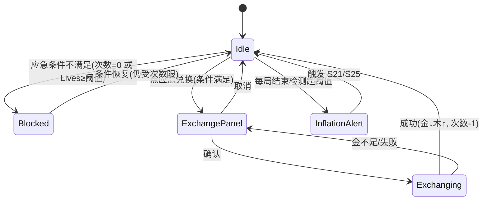

<!-- 编码: UTF-8 -->
# 系统策划案：S3 经济系统 (Economy System)

> 归属域：A 核心战斗域 · 层级/优先级：MVP / P0 · 关联 F 码：F5 · 关联：GDD §6；SYSTEM_BREAKDOWN §S3
> 状态：v0.2-detailed · 日期 2026-07-17
> 版本说明：在 v0.1-draft 基础上补全 像素级 UI 线框 / 状态机 / 时序图 / 异常边界用例 / 完整配置字段与多行示例 / 美术资源帧数·分辨率·格式·切片。
> **v0.2-rev（耦合重构）：** 按 DO 新规——**木 = session 货币**：仅来自怪物概率掉落(S04)，**不可带出副本、不持久化**；移除木房产木(wood_house_rate 删除)。金↔木兑换保留为**「应急兑换」特例**：限定每副本次数 / 触发条件(如 Lives 低于阈值) / 较差汇率，全部 `[PLACEHOLDER]`，**不能成为木主来源**(主源=怪掉)。双经济(金建/木养)仍独立，应急兑换为其唯一破例桥。
> 平衡数值（起始金、金木兑换率、击杀/Boss 奖励、应急兑换参数、怪掉木率、通胀阈值、售卖返还率等）保持 `[PLACEHOLDER]`，仅标注"调优杆"，禁止硬编码。原"木房产木速率"字段已删除。

---

## 1. 系统 UI 布局

### 1.1 布局层级（z 轴，HUD 内）

| 层级 z | 名称 | 说明 |
|---|---|---|
| 45 | 货币条 | 顶部固定：金(左) / 木(右) |
| 45 | 变动飘字 | 余额增减飘 +/- 数字 |
| 50 | 应急兑换入口 | 金旁"应急兑换"按钮（受限） |
| 55 | 兑换面板 | 居中弹层，汇率/数量/确认 |

### 1.2 像素级线框（750 × 1334）

```
  (0,0)┌─────────────────────────────────────────── 750 ──┐
       │ 顶栏 z45                                      │ y=20
       │ [🪙 金 N] [应急兑换]    [第X/Y波]      [🪵 木 M] │ y=40
       │        ↕ 飘字 +N / -N (0.6s 淡出)                │
       │        ↕ 木掉落实时 +🪵 (怪死亡落点, 接 S04)      │
       │                                                │
       │        （战场）                                 │
       │                                                │
       │  ┌── 应急兑换面板 z55 (点应急兑换) ──────┐       │ y≈500
       │  │ ⚠应急: 仅 Lives<阈值 或 次数未用      │       │
       │  │ 汇率 1木 = X金(较差)  剩余次数 K/[PLACEHOLDER] │       │
       │  │ 可换: [ 50 ][ 100 ]                    │       │
       │  │ [确认兑换]      [取消]                 │       │
       │  └──────────────────────────────────┘          │
       └──────────────────────────────────────────── 1334 ┘
```

### 1.3 组件表（x,y 左上角；w×h；z）

| 组件 | 坐标(x,y) | 尺寸(w×h) | z | 响应行为 |
|---|---|---|---|---|
| 金余额 | (20,40) 左对齐 | 文本 28px | 45 | 实时刷新，变动飘字 |
| 木余额 | (730,40) 右对齐 | 文本 28px | 45 | session 木，实时刷新(仅怪掉+应急)，不持久化 |
| 应急兑换按钮 | (200,40) | 96×48 | 50 | 点→弹应急兑换面板(受次数/触发条件限) |
| 应急兑换面板 | (195,500) 居中 | 360×280 | 55 | 显示较差汇率/剩余次数/数量/确认 |
| 木掉落实时飘字 | 怪死亡落点动态 | 文本 20px + 🪵 | 52 | +🪵N 上浮 0.6s（接 S04 掉率） |
| 余额飘字 | 数值上方 | 文本 24px | 45 | +绿/-红，0.6s 淡出 |

### 1.4 交互流程图（mermaid flowchart）

```mermaid
flowchart TD
    A[木 source: 怪掉(S04) 仅 session] --> B[木+ 飘字 + 广播S25]
    C[金 source: 击杀/Boss/结算] --> D[金+ 飘字]
    E[建/养塔 S2] --> F[金-/木- 飘字]
    G[点应急兑换] --> H{触发条件满足? 次数>0?}
    H -->|否| I[按钮灰显/提示不可用]
    H -->|是 且 金足| J[弹面板: 较差汇率/剩余次数]
    J --> K{确认?}
    K -->|是| L[金-木+ 受应急汇率; 次数-1]
    K -->|否| M[取消]
    F -->|木-| N[养塔: 木仅 session 扣减, 不跨局]
```

---

## 2. 逻辑功能

### 2.1 功能模块表（触发 / 处理 / 输出）

| 模块 | 触发条件 | 处理流程（正常） | 输出 |
|---|---|---|---|
| 余额容器 | 开局 | 初始化 金(读档起始) + 木(恒 0，session 不从档读) | 金可读，木=0 |
| 加木(source=怪掉) | 怪死亡(S04 掉率命中) | 校验 session 上限→累加到木→事件广播(飘字/S25) | 木↑（仅 session） |
| 加金(source) | 击杀/Boss/结算 | 校验上限→累加金→广播 | 金↑ |
| 扣币(sink) | 建/养塔 | 校验充足→扣减→不足返回 false | 金↓/木↓（木仅 session） |
| 应急兑换(金→木) | 触发条件满足(如 Lives<阈值) 且 次数>0 | 木 += floor(金×应急汇率)；金 -= 对应；次数-1 | 双币重算（特例桥） |
| 木→金（默认禁） | — | 高损或禁，防刷 | 默认不开启 |
| 木持久化防护 | 每局结束/切出 | 木不写入 S18；仅元进度(金结算/最佳成绩)落档 | 木彻底 session 化 |
| 通胀检测 | 每局结束/每日 | 算 币增量/活跃人 → 超阈值告警 | 触发 S21/S25 平衡 pass |

### 2.2 状态机（mermaid stateDiagram-v2 — 兑换流程）



### 2.3 时序流程图（mermaid sequenceDiagram — 击杀产出 / 应急兑换）

```mermaid
sequenceDiagram
    participant S4 as 波次(掉木)
    participant S5 as 战斗系统
    participant S3 as 经济系统
    participant S25 as 数据/防作弊
    S5->>S3: 怪物死亡→kill_reward_gold
    S3->>S3: 校验上限→累加金
    S3-->>S5: 飘字事件
    S4->>S3: 掉率命中→drop_wood_amount(仅 session)
    S3->>S3: 校验 session 上限→累加木
    S3-->>S4: +🪵 飘字(落点)
    S3->>S25: 上报产出(通胀监控)
    Note over S3: 应急兑换(特例)
    participant UI as 操控
    UI->>S3: 点应急兑换(条件满足 且 次数>0)
    S3->>S3: 木+=floor(K×emergency_rate); 金-=K; 次数-1
    S3-->>UI: 余额刷新+飘字
```

### 2.4 异常与边界用例表

| 场景 | 触发条件 | 处理流程 | 输出 / 兜底 |
|---|---|---|---|
| 网络中断 | S21 远程汇率拉取失败 | 用本地默认应急汇率（已标 `[PLACEHOLDER]`），不阻塞 | 平滑降级 |
| 切后台（S20） | `onHide` | 木仅 session 不持久化，CD/掉率计时挂起（不后台产出，防作弊） | `onShow` 恢复，木不丢(局内) |
| 数据损坏（S18） | 经济存档(金)损坏 | 仅重置金为 `start_gold`；木本就不入档 | 不崩，可重玩 |
| 并发操作 | 同帧多 source 加币 | 串行原子累加（加锁） | 余额精确 |
| 并发操作 | 应急兑换中又来怪掉木 | 产出入队列，结算后合并 | 无覆盖 |
| 数值极值 | 木超 session cap | 截断至 cap，报 S24 可疑 | 不溢出（不持久化） |
| 数值极值 | 金为负（异常） | 钳制 0，报 S24 | 不出现负币 |
| 数值极值 | `emergency_rate`≤0 | 用默认 1.0 并告警 | 可兑 |
| 配置缺失 | `economy_config` 缺 | 用内置默认全集（含应急参数） | 不阻塞 |
| 配置缺失 | `inflation_threshold` 缺 | 跳过通胀检测 | 不影响对局 |
| 应急兑换越界 | 次数已用尽仍点 | 按钮灰显，拒绝 | 不破例 |
| F19 开关 off | 外部产出尝试接入 | 拒绝，S26 隔离（应急兑换非 F19，独立受限） | 经济零破环 |

---

## 3. 配置表设计

**表名：`economy_config`（经济全局）**

| 字段 | 类型 | 取值范围 | 默认值 | 说明 |
|---|---|---|---|---|
| start_gold | int | 0–1000 | `[PLACEHOLDER]` | 开局金（GDD §6 base 300）。**调优杆**：起步节奏 |
| start_wood | int | 固定 0 | 0 | 开局木恒 0（木为 session 货币，仅怪掉 S04 + 应急兑换，不从档读） |
| gold_cap | int | 1000–999999 | 99999 | 金上限（防溢出，结构值） |
| wood_cap | int | 1000–999999 | 99999 | 木 session 上限（结构值，不持久化） |
| exchange_rate | float | 0.1–10 | `[PLACEHOLDER]` | **应急**金→木 汇率（受 S21 热更，较差；GDD：1木=`[PLACEHOLDER]`金）。**调优杆**：应急桥经济第一杠杆，须劣于"纯怪掉"预期 |
| exchange_min_gold | int | 1–100 | 10 | 单次应急兑换最小金（防零换） |
| emergency_max_per_session | int | 0–10 | `[PLACEHOLDER]` | 每副本次应急兑换次数上限（非主源硬限）。**调优杆**：防应急变主源 |
| emergency_trigger | json | 触发条件 | `{lives_below:[PLACEHOLDER]}` | 应急兑换触发条件（如 Lives<阈值才可兑）。**调优杆**：紧急兜底语义 |
| batch_options | json | 档位数组 | [50,100,200] | 应急兑换批量档位 |
| kill_reward_gold | int | 1–50 | `[PLACEHOLDER]` | 击杀基础金（随波次 HP 缩放）。**调优杆**：清场动力（木主源为怪掉，非金） |
| boss_reward_gold | int | 50–500 | `[PLACEHOLDER]` | Boss 金。**调优杆**：Boss 波激励 |
| inflation_threshold | float | >0 | `[PLACEHOLDER]` | 币/活跃人/日 告警线（GDD §6）。**调优杆**：通胀闸 |
| sell_refund_rate | float | 0.3–0.9 | `[PLACEHOLDER]` | 卖塔返还比例（GDD §4：`[PLACEHOLDER]` 50%）。**调优杆**：防卡死 |
| wood_to_gold_enabled | bool | true/false | false | 木→金 是否开启（默认禁，防刷） |
| wood_persist | bool | false | false | 木是否持久化（恒 false；session 货币，不写 S18） |

**多行示例数据（CSV；数值列 `[PLACEHOLDER]` 为待调优占位）**

```csv
start_gold,start_wood,gold_cap,wood_cap,exchange_rate,exchange_min_gold,emergency_max_per_session,emergency_trigger,batch_options,kill_reward_gold,boss_reward_gold,inflation_threshold,sell_refund_rate,wood_to_gold_enabled,wood_persist
[PLACEHOLDER],0,99999,99999,[PLACEHOLDER],10,[PLACEHOLDER],"{lives_below:[PLACEHOLDER]}","[50,100,200]",[PLACEHOLDER],[PLACEHOLDER],[PLACEHOLDER],[PLACEHOLDER],false,false
```

> 说明：此为单例全局配置（一行）；多行示例仅用于展示"若分关卡差异化"的字段结构。木已 session 化：`start_wood=0`、`wood_persist=false`、`wood_house_rate` 字段已删除；金→木 仅剩"应急兑换"特例（受 `emergency_max_per_session`/`emergency_trigger` 限）。所有 `[PLACEHOLDER]` 须经试玩调优，禁止硬编码。

---

## 4. 美术资源需求

| 资源 | 帧数 | 分辨率 | 格式 | 切片要求 |
|---|---|---|---|---|
| 金币图标 | normal+press 各1 | 48×48 | Atlas | 单格切片，金属高光 |
| 木头图标 | normal+press 各1 | 48×48 | Atlas | 单格切片，木质纹理 |
| 应急兑换按钮 | normal+press+disabled 各1 | 96×48 | Atlas | 单格切片 |
| 余额变动飘字（+/-） | 文本动画 1（绿+/红−） | 文本 24px | 引擎文本 | 0.6s 上浮淡出，无需切片 |
| 兑换面板 | 1（静态，九宫） | 360×280 | PNG | 九宫拉伸 |
| 通胀告警 | — | — | — | 非玩家可见，仅 S25 运营侧，无资源 |

> 图标经 S19 分包；飘字动画与打击感合并见 S23。
