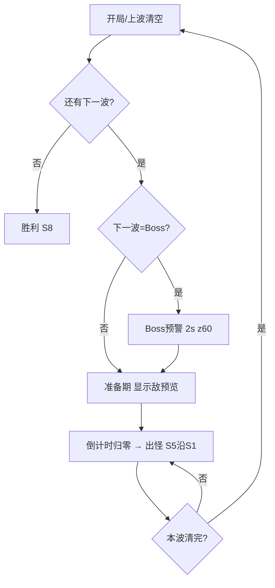
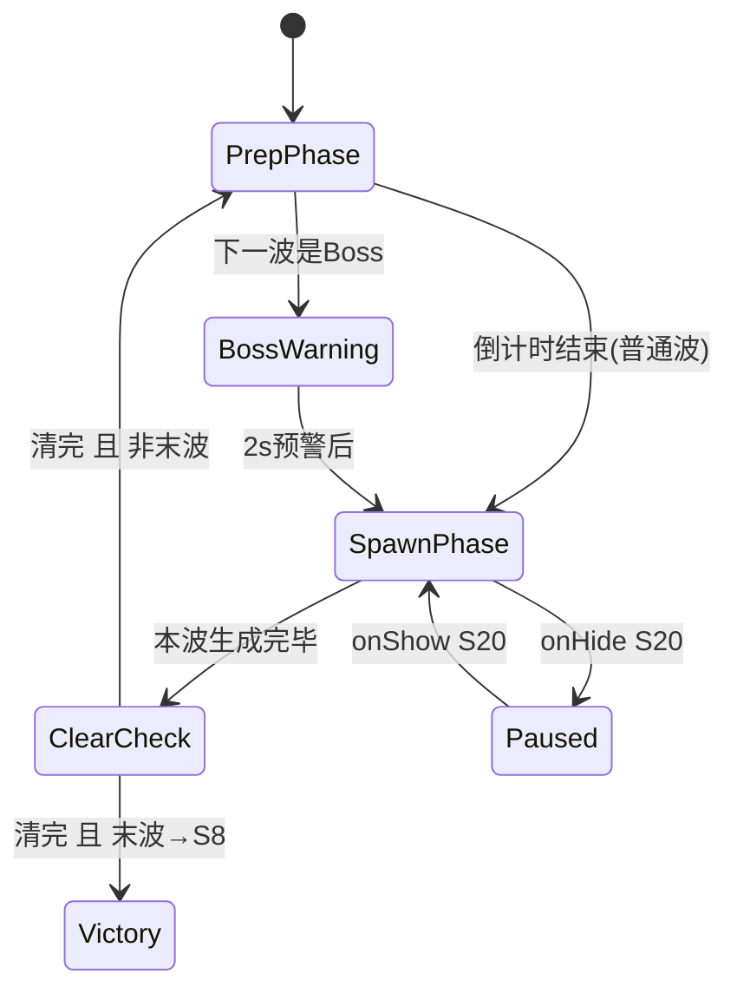
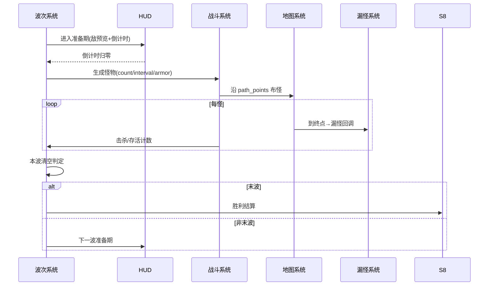

<!-- 编码: UTF-8 -->
# 系统策划案：S4 波次系统 (Wave System)

> 归属域：A 核心战斗域 · 层级/优先级：MVP / P0 · 关联 F 码：F6 · 关联：GDD §5.5；SYSTEM_BREAKDOWN §S4
> 状态：v0.2-detailed · 日期 2026-07-17
> 版本说明：在 v0.1-draft 基础上补全 像素级 UI 线框 / 状态机 / 时序图 / 异常边界用例 / 完整配置字段与多行示例 / 美术资源帧数·分辨率·格式·切片。
> **v0.2-rev（耦合重构）：** 按 DO 新规——**木 = session 货币，主源 = 怪物概率掉落**。新增 `wave_config.drop_wood_chance` / `drop_wood_amount`（每波配置，全 `[PLACEHOLDER]`），命中则在怪死亡时向 S03 累加 session 木（接 S28 木掉落实时指示）。木不再有木房产木/通关木奖励来源。
> 平衡数值（单局波数、Boss 频率、每波数量/间隔/准备期/奖励倍率/怪物血量、掉木率/掉木量等）保持 `[PLACEHOLDER]`，仅标注"调优杆"，禁止硬编码。

---

## 1. 系统 UI 布局

### 1.1 布局层级（z 轴，HUD 内）

| 层级 z | 名称 | 说明 |
|---|---|---|
| 45 | 波次指示 | 顶部中："第 X / Y 波" + 进度条 |
| 46 | 准备期倒计时 / 敌预览 | 出怪前显示 |
| 60 | Boss 预警 | 全屏闪，Boss 波前 2s |

### 1.2 像素级线框（750 × 1334）

```
  (0,0)┌─────────────────────────────────────────── 750 ──┐
       │ 顶栏 z45 [金] [第 X / Y 波 ▓▓▓░░] [木] [♥]       │ y=20..90
       │                                                │
       │ 准备期: [准备 8s ▓▓▓▓▓░░] (z46)                  │ y=120
       │ 敌预览: [🐉轻甲][🛡重甲][✨魔免] (z46)            │ y=160
       │        （战场：怪物沿路径出怪）                   │
       │                                                │
       │  ┌── BOSS 来袭!! ──┐  (z60 全屏红闪 2s)         │
       │  │      ⚠ BOSS ⚠    │                            │
       │  └─────────────────┘                            │
       └──────────────────────────────────────────── 1334 ┘
```

### 1.3 组件表（x,y 左上角；w×h；z）

| 组件 | 坐标(x,y) | 尺寸(w×h) | z | 响应行为 |
|---|---|---|---|---|
| 波次文本 | (375,40) 居中 | 文本 28px | 45 | 静态刷新 |
| 波次进度条 | (225,70) 居中 | 300×16 | 45 | 本波进度动画 |
| 准备倒计时 | (225,120) | 300×24 | 46 | 倒计时动画 |
| 敌预览条 | (75,160) | 600×64 | 46 | 展示本波怪图标+护甲色 |
| Boss 预警 | 全屏居中 (375,667) | 大字 64px + 屏闪 | 60 | 2s 后消失，不可点 |

### 1.4 交互流程图（mermaid flowchart）



---

## 2. 逻辑功能

### 2.1 功能模块表（触发 / 处理 / 输出）

| 模块 | 触发条件 | 处理流程（正常） | 输出 |
|---|---|---|---|
| 波次调度 | 上一波清空/超时 | 取 `wave_config[next]` → 进入准备期 → 倒计时 → 出怪 | 怪物生成指令(S5) |
| 怪物生成 | 出怪期 | 按 count/interval 沿 S1 路径产怪，赋 armor/type | 战场怪物流 |
| 护甲/克制 | 怪物生成 | 赋 `armor_type` → S5 按塔 type 算克制系数 | 伤害差异 |
| 类型波 | 特定 wave | 空军(上层z)/魔免(需物理)/重甲(需魔法) 标记 | 决策压力 |
| Boss 波 | 到 Boss 节点 | 生成 Boss（高血+特殊）→ 触发预警 | 高难威胁 |
| 掉木产出 | 怪死亡(S5 回调) | 按 `drop_wood_chance` 掷骰命中 → 向 S03 累加 `drop_wood_amount`(session 木) | 木主源（接 S03/S28 飘字） |
| 波间节奏 | 每波结束 | 切准备期，开放建/养窗口 | 决策窗口 |

### 2.2 状态机（mermaid stateDiagram-v2 — 波次状态）



### 2.3 时序流程图（mermaid sequenceDiagram — 一波生命周期）



### 2.4 异常与边界用例表

| 场景 | 触发条件 | 处理流程 | 输出 / 兜底 |
|---|---|---|---|
| 网络中断 | S21 远程波表拉取失败 | 用本地默认 10 波 | 不阻塞 |
| 切后台（S20） | `onHide` | 生成计时挂起；恢复续发 | 无重复/漏发 |
| 数据损坏（S18） | `wave_config` 损坏 | 用内置默认 10 波 + 记 S25 | 可玩 |
| 并发操作 | 加速(S7 2x) + 暂停 | 统一 `game_speed` 乘子，暂停优先 | 计时一致 |
| 数值极值 | `count` 极大 | 限制同屏上限（如 ≤60），分批生成 | 防卡顿 |
| 数值极值 | `spawn_interval`=0 | 整波同时出，受同屏上限钳制 | 不崩 |
| 数值极值 | `prep_time`=0 | 直接出怪（无准备期） | 仍可玩 |
| 数值极值 | 怪物 `hp` 异常(≤0) | 钳制最小 1 | 正常死亡 |
| 配置缺失 | 波表越界/缺失 | 内置默认 10 波 | 不阻塞 |
| 配置缺失 | Boss 配置缺失 | 跳过 Boss，普通波收尾 | 可结算 |
| 类型波重叠 | 空地同时来 / Boss+类型波 | 空军走上层 z、地面走路径；Boss 优先演出 | 分轨不混 |
| 加速致资源不及 | 2x 下玩家来不及布塔 | 纯表现倍速，不跳波，玩家自担 | 设计预期 |

---

## 3. 配置表设计

**表名：`wave_config`（波次配置，按关卡）**

| 字段 | 类型 | 取值范围 | 默认值 | 说明 |
|---|---|---|---|---|
| wave_id | string | 唯一 | — | 波主键 |
| level_id | string | 关联 S14 | "lv_01" | 所属关卡 |
| wave_index | int | 1–N | — | 第几波（N=单局波数） |
| enemy_type | enum | normal/air/boss/special | "normal" | 怪物类型 |
| count | int | 1–200 | `[PLACEHOLDER]` | 数量。**调优杆**：压力曲线 |
| spawn_interval | float | 0.1–10 | `[PLACEHOLDER]` | 出场间隔(s)。**调优杆**：节奏 |
| base_hp | int | 1–100000 | `[PLACEHOLDER]` | 本波怪物基础血量（随波缩放）。**调优杆**：难度 |
| armor_type | enum | none/light/heavy/magic_immune/poison | none | 护甲（决定克制） |
| is_boss | bool | true/false | false | 是否 Boss 波 |
| boss_mechanic | enum | null/speedup/heal_cut | null | Boss 特殊机制 |
| prep_time | float | 0–30 | `[PLACEHOLDER]` | 准备期(s)。**调优杆**：决策窗口 |
| reward_mult | float | 0.5–5 | `[PLACEHOLDER]` | 本波奖励倍率（金，非木）。**调优杆**：金产出 |
| drop_wood_chance | float | 0–1 | `[PLACEHOLDER]` | 本波每只怪掉木概率（session 木主源）。**调优杆**：养塔木供给节奏 |
| drop_wood_amount | int | 1–999 | `[PLACEHOLDER]` | 命中掉木量（session）。**调优杆**：单次掉木强度 |
| spawn_loops | int | 1–loop_count | `[PLACEHOLDER]` | 本波怪绕圈数（接 S1） |

**全局波数参数（单例，非逐波）**

| 字段 | 类型 | 取值范围 | 默认值 | 说明 |
|---|---|---|---|---|
| total_waves | int | 10–100 | `[PLACEHOLDER]` | 单局总波数（GDD：`[PLACEHOLDER]` 50）。**调优杆**：P5 时长硬约束 |
| boss_every | int | 5–20 | `[PLACEHOLDER]` | 每 N 波一个 Boss（GDD：每 `[PLACEHOLDER]` 10 波）。**调优杆**：情绪高点 |

**多行示例数据（CSV；数值列 `[PLACEHOLDER]` 为待调优占位）**

```csv
wave_id,level_id,wave_index,enemy_type,count,spawn_interval,base_hp,armor_type,is_boss,boss_mechanic,prep_time,reward_mult,drop_wood_chance,drop_wood_amount,spawn_loops
w_lv01_01,lv_01,1,normal,[PLACEHOLDER],[PLACEHOLDER],[PLACEHOLDER],none,false,null,[PLACEHOLDER],[PLACEHOLDER],[PLACEHOLDER],[PLACEHOLDER],[PLACEHOLDER]
w_lv01_03,lv_01,3,normal,[PLACEHOLDER],[PLACEHOLDER],[PLACEHOLDER],light,false,null,[PLACEHOLDER],[PLACEHOLDER],[PLACEHOLDER],[PLACEHOLDER],[PLACEHOLDER]
w_lv01_05,lv_01,5,air,[PLACEHOLDER],[PLACEHOLDER],[PLACEHOLDER],none,false,null,[PLACEHOLDER],[PLACEHOLDER],[PLACEHOLDER],[PLACEHOLDER],[PLACEHOLDER]
w_lv01_10,lv_01,10,boss,1,[PLACEHOLDER],[PLACEHOLDER],heavy,true,speedup,[PLACEHOLDER],[PLACEHOLDER],[PLACEHOLDER],[PLACEHOLDER],[PLACEHOLDER]
```

> 掉木说明：`drop_wood_chance`/`drop_wood_amount` 为 session 木主源（替代原木房产木/通关木奖励）；Boss 波可配更高掉率作为养塔关键木点。所有值 `[PLACEHOLDER]` 待调优。

---

## 4. 美术资源需求

| 资源 | 帧数 | 分辨率 | 格式 | 切片要求 |
|---|---|---|---|---|
| 怪物立绘（按 enemy_type） | 行走 4–6 帧 | 64×64 | Atlas | 单格切片，锚点中心 |
| 怪物护甲标识 | 1（静态，按 armor 着色环） | 24×24 | Atlas | 套怪物头顶 |
| Boss 立绘 / 模型 | idle 4 + 攻击 4 | 128×128+ | Atlas / Skeleton | 专属骨骼 |
| 波次进度条 | 1（静态，九宫） | 300×16 | PNG | 九宫 |
| Boss 预警字 | 红闪 2 帧 | 文本 64px | 引擎文本+特效 | 屏闪 2s |
| 敌预览图标 | 1（静态） | 64×64 | Atlas | 单格切片 |

> 怪物动作与受击特效见 S23；Boss 专属演出 F40 暂不做。
