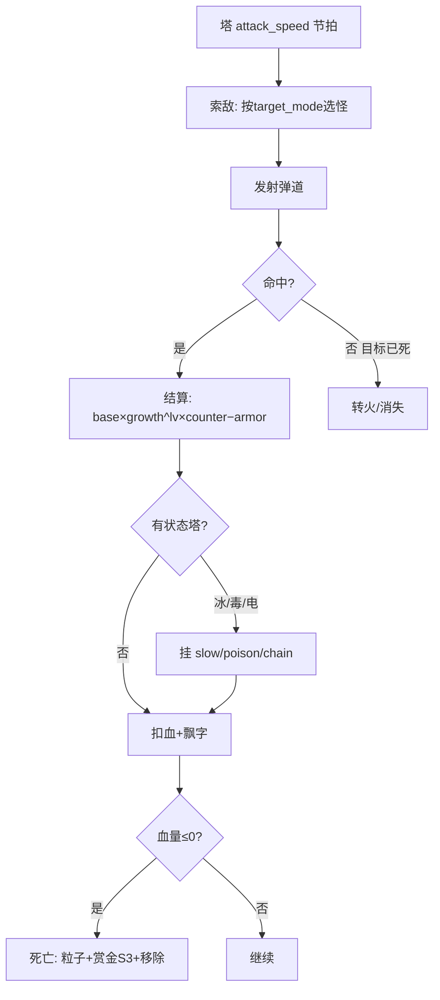
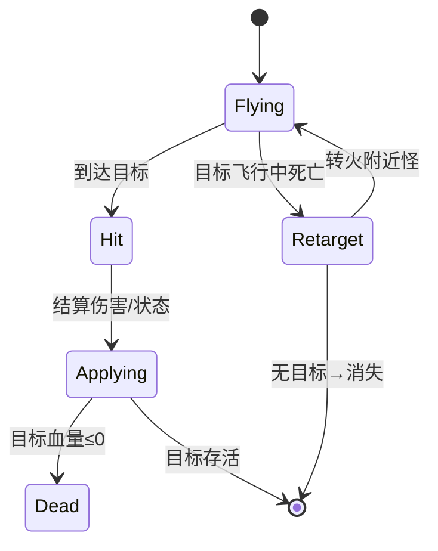
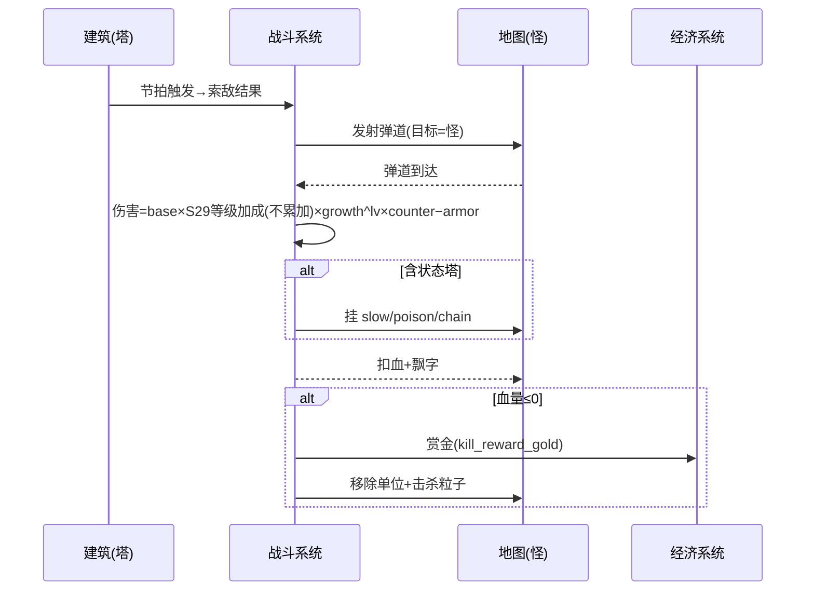

<!-- 编码: UTF-8 -->
# 系统策划案：S5 战斗系统 (Combat System)

## 0. 元数据头

> 归属域：A 核心战斗域 · 层级/优先级：MVP / P0 · 关联 F 码：F7 · 关联：GDD §5.7 + 状态机制（GDD 待补 §5.8，见末尾冲突说明）；SYSTEM_BREAKDOWN §S5；S29 玩家等级系统（等级加成由 S02 建塔时套用，S05 仅消费）
> 状态：v0.2-detailed · 日期 2026-07-17
> 版本说明：在 v0.1-draft 基础上补全 像素级 UI 线框 / 状态机 / 时序图 / 异常边界用例 / 完整配置字段与多行示例 / 美术资源帧数·分辨率·格式·切片。
> **v0.2-rev（耦合重构）：** 按 DO 新规接入 **S28 技能系统**——战斗系统新增「主动技激活(手动/自动)」「被动生效」「CD 管理」三类钩子：主动技由 S28 触发并经本系统 `applyActiveSkill` 结算控/伤/增益；被动在命中/击杀/状态事件上挂载（如冰封易伤、导电、腐蚀）；CD 计时由 S28 管理，本系统仅消费效果。木为 session 货币，技能 cost 默认 0 不消耗木。
> 平衡数值（弹速、溅射半径、减速/毒/连锁参数、克制系数、护甲减伤、技能数值等）保持 `[PLACEHOLDER]`，仅标注"调优杆"，禁止硬编码。
> **v0.2（S29 等级系统）**：命中结算的伤害/属性含 **S29 玩家等级加成（dmg/range/atk_speed 倍率，绝对值快照，不累加）**——由 S02 建塔时套用到塔有效属性，本系统消费该已修正属性。加成在开局/建塔时应用、玩家无需操作。详见 S29。
> **S29 加成消费约定（澄清）**：塔有效属性（dmg/range/atk_speed）在**建塔时已由 S02 套用 S29 玩家等级加成**——**不累加，取当前等级单行**（`player_level_config[level]` 单查，非 Σ/Π）——并作为已修正属性传入战斗循环；本系统（S05）直接消费该属性，**不重复计算**等级加成。
> **v0.3（战斗数值计算深化）**：新增 **§2.5「战斗数值计算 / 伤害管线」**——给出从"塔开火"到"目标 HP 减少"的**逐级可计算公式**（塔有效属性合成 S30 → 基础伤害 → skill_mod(S28) → buff_mod(S33) → 克制矩阵(S30) × 护甲减伤(S30) → 伤害特例 → 扣血钳制），含 **7 塔×5 护甲 = 35 组合演算示例表**、控制/击退结算、状态施加堆叠(S33)、死亡与击杀奖励触发(S03/S04/S08/S29)、边界异常表(E 编号接 S24/S30) 与跨系统公式冲突待裁定。数值初值取自 balance/S02/S30/S33，**零 [PLACEHOLDER]**（除标记为 NEEDS-DESIGN 的暴击项）。
> 注：GDD/SYSTEM_BREAKDOWN 引用了"§5.8 战斗/状态"，但当前 GDD 实际无 §5.8（§5.7 为胜负）。本系统按既有 §5.7 + F7 设计，并建议 GDD 补充 §5.8（见冲突报告）。

---

## 1. 系统 UI 布局

战斗系统以**世界空间反馈**为主，少量 HUD 元素。

### 1.1 布局层级（z 轴）

| 层级 z | 名称 | 说明 |
|---|---|---|
| 30 | 单位层 | 怪物 / 塔 / 被动光环（S28） |
| 35 | 伤害飘字 / 状态图标 / 技能命中 | 怪物头顶 / 身上 / 主动技特效（接 S28） |
| 36 | 击杀反馈 | 死亡粒子 + 赏金飘字 |

### 1.2 像素级线框（750 × 1334，战场局部放大）

```
        （怪物沿路径行进，z30）
              🐉(64×64)
              | -23 (伤害飘字 z35, 0.5s)
              | ❄ (减速图标 z35)  💀(毒图标)
              ↓ 弹道(箭/炮/冰/毒/电, z30→35)
            🏹塔(已占 z30)
              ✦ 击杀粒子 z36 (0.4s) + 🪙+5 飘字(S3)
```

### 1.3 组件表（x,y 动态；尺寸；z）

| 组件 | 坐标(x,y) | 尺寸(w×h) | z | 响应行为 |
|---|---|---|---|---|
| 伤害飘字 | 怪物头顶（动态） | 文本 18–32px | 35 | 命中即飘，字号随伤缩放 |
| 状态图标 | 怪物身上（动态） | 24×24 | 35 | 持续显示至状态结束 |
| 击杀粒子 | 死亡点（动态） | 粒子 0.4s | 36 | 自动播放 |
| 赏金飘字 | 死亡点（动态） | 文本 20px | 36 | 接 S3，+金 |

### 1.4 交互流程图（mermaid flowchart）



---

## 2. 逻辑功能

### 2.1 功能模块表（触发 / 处理 / 输出）

| 模块 | 触发条件 | 处理流程（正常） | 输出 |
|---|---|---|---|
| 索敌 | 塔 attack_speed 节拍 | 按 `target_mode` 选怪（最前/最强/范围）→ 发射 | 弹道生成 |
| 命中结算 | 弹道到达目标 | 伤害 = `base_dps×S29等级加成(不累加)×growth^养塔lv × counter − armor_reduce` | 血量−，飘字 |
| 状态施加 | 冰/毒/电塔命中 | 挂 slow/poison/chain 状态 | 怪物减速/DOT/连锁 |
| 死亡处理 | 血量≤0 | 播死亡→赏金(S3)→移除单位 | 单位销毁 |
| 克制计算 | 命中时 | 查 `armor_type` vs `tower_type` 表 | 系数(0.5–2.0) |
| 主动技结算 | S28 触发 `applyActiveSkill` | 按 `tower_id` 取效果（控/伤/增益）→ 结算到目标/范围 | 控场/爆发（木不消耗） |
| 被动生效 | 被动已解锁(S28) + 战斗事件 | 命中/击杀/状态钩子挂被动（如破甲/腐蚀/导电/冰封易伤） | 被动持续/触发 |
| 击杀掉木回调 | 怪死亡 | 通知 S4→S3 按 `drop_wood_chance` 掷骰累加 session 木 | 木主源（接 S03/S28） |

### 2.2 状态机（mermaid stateDiagram-v2 — 单发弹道）



### 2.3 时序流程图（mermaid sequenceDiagram — 一次命中到击杀）



### 2.4 异常与边界用例表

| 场景 | 触发条件 | 处理流程 | 输出 / 兜底 |
|---|---|---|---|
| 网络中断 | 纯本地战斗 | 无网络依赖 | 不受影响 |
| 切后台（S20） | `onHide` | 弹道/状态计时挂起；`onShow` 恢复 | 战斗零错乱 |
| 数据损坏（S18） | 本局战斗存档损坏 | 按 S8 以当前波进度结算或重开本局（取波首） | 记 S25，不崩 |
| 并发操作 | 多塔同帧打同怪 | 各弹道独立结算，血量串行扣减 | 最终血量一致 |
| 并发操作 | 同类型状态叠加 | 刷新时长不叠加层数（防无限） | 状态可控 |
| 数值极值 | 伤害溢出（负血） | `max(0)`，正常死亡 | 不崩 |
| 数值极值 | 弹速=0 / 极小 | 钳制最小弹速 | 弹道可达 |
| 数值极值 | `splash_radius`/`chain_count` 极大 | 钳制上限（呼应 S5×冰+电 emergent 警告） | 防 solo 全图 |
| 配置缺失 | `counter_matrix` 缺 | 系数默认 1.0 + 告警 | 可战 |
| 配置缺失 | `armor_reduce` 缺 | 默认 0 | 可战 |
| 配置缺失 | 状态配置缺 | 该塔无状态效果 | 降级不崩 |
| 目标飞行中死亡 | 弹道未到目标已死 | 转火附近怪或失效 | 无残留 |
| 性能极值 | 同屏大量弹道/粒子 | 对象池 + 粒子上限 + 状态图标合并 | 帧率保护 |
| 技能配置缺失 | `skill_config` 缺/损坏 | 主动技不触发、被动不挂载；塔仍可基础攻击 | 降级不崩（记 S25） |
| 主动技+暂停 | `onHide`(S20) 时主动技 CD 中 | CD 计时挂起，`onShow` 续计 | 零错乱 |
| 被动事件竞态 | 同帧多被动钩子(导电+冰封易伤) | 串行结算，叠加为乘法/加法(按配置) | 最终值一致 |
| 等级加成异常 | `player_level_config` 缺失/`bonus` 越界 | 缺则按 level=1 行(无加成)；bonus 钳制合法区间，对 S24 报可疑 | 塔可战 |

---

## 2.5 战斗数值计算 / 伤害管线（深化 · 落代码级公式）

> 适用范围：本小节是 S05 战斗结算的**权威可计算定义**，取代 §2.1「命中结算」与 §3 `damage_formula` 的高层草图（后者为结构占位，本小节为乘法管线终版）。所有数值初值取自 `balance/S02_building_tower.md` / `balance/S30_attribute.md` / `balance/S33_status_effect.md`，**零 [PLACEHOLDER]**（暴击项除外，标 NEEDS-DESIGN）。跨系统冲突见 §2.5.10。

### 2.5.1 管线总览（顺序）

```
塔开火(S2 节拍) → 索敌(S5) → 发射弹道 → 命中(S5)
  ├─ damage_type == control (冰/风)  → 走 §2.5.5 控制结算（slow/knockback，无 HP 损失）
  └─ damage_type ∈ {physical/magic/poison} → 走伤害管线 §2.5.2 Step1–7
        Step1 塔有效属性合成 (S30)        → tower_effective.dmg
        Step2 单次基础伤害                → base_dmg = tower_effective.dmg
        Step3 技能修正 skill_mod (S28)    → 已折入 Step1（命中时取当前值）
        Step4 状态修正 buff_mod (S33)     → 分解为 armor_mult / dmg_taken_mult / move_speed_mult
        Step5 护甲判定 counter × armor_mitig (S30)
        Step6 伤害类型特例 (magic×magic_immune=0)
        Step7 扣血与钳制 target.hp = max(0, target.hp − effective_dmg)
  → 飘字(S5) → 施加状态(S33 applyStatus, 堆叠规则)
  → target.hp ≤ 0 ? → 死亡：赏金(S3)+掉木(S4/S31→S3)+波计数(S4)+粒子(S5/S31)+移除
                       （XP 在 S8 结算时按 wave_reached 计算，非逐杀，见 §2.5.7）
```

### 2.5.2 逐级公式（变量定义 + 来源）

**Step 1 — 塔有效属性合成（S30 铁律公式，建塔/升级/技能/状态变化时重算）**

```
tower_effective.dmg
   = base_dmg(S02.tower_config.base_dps)
   × growth(S02.tower_config.growth) ^ (L − 1)        // L=养塔等级, 建塔 L=1 → ×1
   × player_level_mult(S29.player_level_config[session_player_level].dmg_mult)  // 单行不累加, Lv1=1.0
   × skill_mod(S28)                                  // Π 已解锁被动/主动的伤害乘子, 默认 1.0
   × buff_mod.dmg_mult(S33)                          // Π 对塔伤害的状态乘子, 默认 1.0
```
> 钳制：`tower_effective.dmg = clamp(…, attr_dmg_min=0, attr_dmg_max)`（S30 `attribute_def`）。

**Step 2 — 单次基础伤害**
```
base_dmg = tower_effective.dmg     // 已合成（含 S29/growth/skill/buff.dmg_mult），本局内消费一次
```

**Step 3 — 技能修正 skill_mod（S28）**
- 定义：`skill_mod = Π_{p∈已解锁且命中生效的被动/主动} p.dmg_mult`，默认 1.0（无技能）。
- 进伤害方式：**已在 Step 1 折入 `tower_effective.dmg`**（S30 合成公式第 4 乘子）。命中时若技能在 CD/未解锁则取 1.0。
- 例（数值见 S28 balance，当前 [PLACEHOLDER]）：炮塔被动②「重创」对重甲 +X% → 命中重甲时 skill_mod 临时 = 1+X%；魔法塔被动①「奥术穿透」= 护甲穿透，作用于 Step5 的 armor_mitig 而非 skill_mod。
- **本小节 Step1 已含 skill_mod，故命中公式不再重复乘 skill_mod**（避免双重计算，见 §2.5.10 C-公式一致性澄清）。

**Step 4 — 状态修正 buff_mod（S33）分解**
`buff_mod(S33)` 是单位级乘子集（S33 §2.7 契约），对**伤害管线**而言只有两项进入、一项不进：

| buff_mod 项 | 是否进伤害 | 作用位置 | 说明 |
|---|---|---|---|
| `dmg_mult` | 是（已折入 Step1） | 塔侧 | 塔受增益时 ×伤害；当前 scope 塔增益预留默认 1.0 |
| `armor_mult` | 是 | Step5 armor_mitig | 敌 `armor_break`/`corrosion` 削减敌 armor，降低护甲减伤 |
| `dmg_taken_mult` | 是 | Step5 incoming | 敌 `vulnerable`/`conductive` 放大受伤 |
| `move_speed_mult` | **否** | 控制结算 | `slow`/`headwind` 只改 move_speed，**不影响任何伤害数值** |

**Step 5 — 护甲判定（克制系数 × 护甲减伤，S30 全管线）**
```
counter     = damage_armor_matrix[ damage_type ][ target.armor_type ]   // S30 §3.2, 取值 {0,0.5,1,1.5}
base_reduce = armor_type_def[ target.armor_type ].reduce                // S30 §3.3, {0,0.1,0.3,0,0}
eff_reduce  = clamp( base_reduce × Π buff_mod.armor_mult , 0 , 0.9 )     // armor_break/corrosion 削减
armor_mitig = 1 − eff_reduce                                          // 实际承伤比例
```
> 注：任务 step(5) 简化式 `effective_dmg = base_dmg × skill_mod × buff_mod × counter` 仅含克制系数；本管线采用 **S30 权威全模型**（克制 × 护甲减伤），否则轻/重甲的实际减伤会丢失（见 §2.5.10 C-护甲双重模型）。

**Step 6 — 伤害类型特例**
- `magic × magic_immune`：`counter = damage_armor_matrix[magic][magic_immune] = 0.0` → `effective_dmg = 0`（魔免免疫魔法，铁律）。
- `damage_type ∈ {control}`（冰/风）：**本身无伤害**，强制 `effective_dmg ≡ 0`，直接转 §2.5.5 控制结算；其塔 `base_dmg`（冰18/风22）仅为名义属性，不转化为 HP 损失。

**Step 7 — 最终扣血与钳制**
```
// 伤害型(physical/magic/poison)：
effective_dmg = max( 0 , round( tower_effective.dmg × counter × armor_mitig × incoming_dmg_mult ) )
// 控制型(control)：effective_dmg = 0
target.hp    = max( 0 , target.hp − effective_dmg )      // 钳制 ≥0, 防负血
if target.hp == 0 → onEnemyDeath(target)                 // §2.5.7
```
其中 `incoming_dmg_mult = clamp( Π buff_mod.dmg_taken_mult , 1.0 , 3.0 )`（S33 §2.4 上限 3.0 防秒杀）；`round` 取整策略见 §2.5.10 / `combat_dmg_round`。

**完整可落代码伪码（伤害型一次命中）：**
```ts
function computeDamage(tower: EffectiveTowerAttr, target: EnemyAttr): number {
  if (tower.damage_type === 'control') return 0;            // Step6: 控制无伤
  const counter = MATRIX[tower.damage_type][target.armor_type] ?? 1.0;   // Step5, E04 缺键默认1
  const baseReduce = ARMOR_DEF[target.armor_type]?.reduce ?? 0.0;        // Step5, E05 降级none
  const effReduce = clamp(baseReduce * product(target.buffMod.armor_mult), 0, 0.9); // Step4/5
  const armorMitig = 1 - effReduce;
  const incoming = clamp(product(target.buffMod.dmg_taken_mult), 1.0, 3.0); // Step4
  return Math.max(0, round(tower.dmg * counter * armorMitig * incoming)); // Step7
}
```

### 2.5.3 演算示例表（7 塔 × 5 护甲 · 全组合 35 组）

**前提（Lv1 建塔、session_player_level=1、无技能/无状态、无养塔升级）**：
- `player_level_mult = 1.0`（S29 Lv1 行 dmg_mult=1.0，单行不累加）
- `skill_mod = 1.0`，`buff_mod` 全 1.0 ⇒ `tower_effective.dmg = base_dmg`（直接取 balance/S02 初值）
- 克制系数与减伤取 balance/S30：`physical{ none1.0/light1.5/heavy1.5/magic_immune1.5/air0.5 }`，`magic{ 1.0/1.0/1.0/0.0/0.5 }`，`poison{ 1.0/1.0/1.5/1.0/0.5 }`，`control{ 1.0/1.0/1.0/1.0/1.0 }`；`reduce{ none0/light0.10/heavy0.30/magic_immune0/air0 }`
- 电塔 damage_type 归 physical（S30 C3），但其对空用覆盖系数 `electric_vs_air_override = 1.5`（非通用 physical_air=0.5）
- `effective_dmg = round( base_dmg × counter × (1−reduce) )`，保留 1 位小数展示

| 塔种 | damage_type | base_dmg | vs none | vs light | vs heavy | vs magic_immune | vs air | 克制验证 |
|---|---|---|---|---|---|---|---|---|
| 箭塔 | physical | 30 | 30.0 | **40.5** | **31.5** | **45.0** | 15.0 | 轻/重/魔免×1.5，空×0.5✓ |
| 炮塔 | physical | 45 | 45.0 | **60.8** | **47.3** | **67.5** | 22.5 | 同物理，基数更高✓ |
| 电塔 | physical* | 35 | 35.0 | **47.3** | **36.8** | **52.5** | **52.5** | 空=1.5 覆盖(非0.5)✓ |
| 魔法塔 | magic | 60 | 60.0 | 54.0 | 42.0 | **0.0** | 30.0 | 魔免×0 免疫✓ |
| 毒塔 | poison | 25 | 25.0 | 22.5 | **26.3** | 25.0 | 12.5 | 重甲×1.5✓ |
| 冰塔 | control | 18 | 0 | 0 | 0 | 0 | 0 | 控制无伤→减速✓ |
| 风塔 | control | 22 | 0 | 0 | 0 | 0 | 0 | 控制无伤→击退✓ |

> 计算溯源（逐行验证，证明克制可计算）：
> - 箭 vs 轻甲：`30 × 1.5(physical_light) × (1−0.10) = 30 × 1.5 × 0.90 = 40.5` ✓
> - 箭 vs 重甲：`30 × 1.5 × (1−0.30) = 30 × 1.5 × 0.70 = 31.5` ✓
> - 箭 vs 魔免：`30 × 1.5 × (1−0) = 45.0`（物理克魔免，S30✓）
> - 箭 vs 空：`30 × 0.5 × 1 = 15.0`（物理对空弱✓）
> - 魔法 vs 魔免：`60 × 0.0 × 1 = 0.0`（魔免免疫魔法✓）
> - 电 vs 空：`35 × 1.5(override) × 1 = 52.5`（覆盖通用 physical_air=0.5✓）
> - 毒 vs 重甲：`25 × 1.5(poison_heavy) × (1−0.30) = 25 × 1.5 × 0.70 = 26.3` ✓
> - 冰/风：control 类型 → effective_dmg 强制 0（见 §2.5.5）

### 2.5.4 带状态 / 技能 演算示例（验证 buff_mod 进伤害项）

**场景**：炮塔（Lv1, raw=45, physical）打 重甲 怪（base_reduce=0.30），该怪已被「冰封易伤」挂 `vulnerable(×1.20)` 且被「破甲」挂 `armor_break(−20% 减免)`。
```
counter     = physical_heavy = 1.5
base_reduce = 0.30
eff_reduce  = clamp(0.30 × (1−0.20 armor_break), 0, 0.9) = clamp(0.30×0.80,0,0.9) = 0.24
armor_mitig = 1 − 0.24 = 0.76
incoming    = clamp(1.0 × 1.20 vuln, 1.0, 3.0) = 1.20
effective_dmg = 45 × 1.5 × 0.76 × 1.20 = 61.6
```
> 对比无状态基准：`45 × 1.5 × 0.70 = 47.25`。易伤+破甲组合将单发伤害从 47.25 → 61.6（约 +30%），验证 `vulnerable`(进 dmg_taken) 与 `armor_break`(进 armor_mult) 均正确进入伤害，且 `slow`(move_speed) 不进。

**导电叠加**：若同怪再被电塔命中挂 `conductive(×1.20)`，则 `incoming = 1.20 × 1.20 = 1.44`（异类乘算，S33 §2.6），`effective_dmg = 45 × 1.5 × 0.76 × 1.44 = 73.9`。

**腐蚀叠层**：毒塔 `corrosion` 每层 −15% 减免（stack_cap_5），重甲满 5 层：
`eff_reduce = clamp(0.30 × (1−0.15)^5, 0, 0.9) = clamp(0.30×0.4437,0,0.9)=0.133` → `armor_mitig=0.867`。

### 2.5.5 控制 / 击退结算（不造成 HP 损失）

控制型塔 `damage_type=control`（冰/风）命中时 **effective_dmg=0**，结算分支为施加状态而非扣血：
- **冰塔（slow）**：调用 `S33.applyStatus(target, 'slow', {slow_k:0.5, duration:2.0}, 'on_hit')` → `target.move_speed ×= 0.5`（S33 `st_slow_k=0.50`）持续 2.0s（S33 `st_slow_duration=2.0`）；**move_speed 变化不影响任何伤害数值**。冰塔被动②「冰封易伤」在目标被减速时对其挂 `vulnerable(×1.20)`（S33 `st_vuln_k=20%`），使**其他塔**后续命中的 `incoming_dmg_mult` 提升。
- **风塔（knockback）**：调用 `S33.applyStatus(target, 'knockback', {kb_dist:120, stun:1.0}, 'on_hit')` → 沿路径后退 `120px`（S33 `st_knockback_kb_dist=120`，位移钳至路径最近点防越界）+ `move_locked` 定身 `1.0s`（S33 `st_knockback_stun=1.0`）。风塔被动②「逆风惩罚」对反复被击退的怪叠 `headwind`（每层 −15% 移速，cap 3，S33 `st_headwind_slow=15%`、`st_headwind_max_stack=3`），间接放大全场 DPS（移速↓→在射程内更久）。
- **不进入 Step7 扣血**；控制塔的「名义 dmg」(冰18/风22) 不转化为伤害。

### 2.5.6 状态施加与堆叠（调用 S33）

战斗层每次命中后，按塔 `status_effect`(S02) 与 S28 被动钩子调用：
```ts
function onHit(tower, target):
  eff = (tower.damage_type === 'control') ? 0 : computeDamage(tower, target)
  if (eff > 0) { target.hp = max(0, target.hp - eff); spawnDamageFloat(eff, tower.damage_type) }
  // 施加状态（冰/毒/电由塔原生；破甲/冰封易伤/导电/腐蚀/逆风由 S28 被动触发）
  if (tower.status_effect has mapping) S33.applyStatus(target, statusId, strength, duration)
  if (S28 passive proc) S33.applyStatus(target, passiveStatusId, strength, duration)
  if (target.hp <= 0) onEnemyDeath(target)
```
**堆叠规则（S33 §2.6，战斗层必须照此调用）**：
- `refresh`（slow/poison_dot/burn/armor_break/vulnerable/conductive）：同类再施加 → 刷新 duration，强度取 `max`（不叠层防无限）。
- `unique`（knockback/chain/infect）：同类再施加 → 重定位移/刷新，不叠层。
- `stack_cap_N`（corrosion cap5 / headwind cap3）：每触发 +1 层（上限 N），满层后新触发刷新最旧层 duration。
- 异类状态**可共存**（分别结算实例），互不排斥。

### 2.5.7 死亡判定与击杀奖励触发

```ts
function onEnemyDeath(target):
  if (target.is_dropped) return                  // 幂等, 防同帧重复掉(S31 §2.4)
  target.is_dropped = true
  // ① 金 (S03) —— 引用既有字段, 不重定义
  gold = isBoss(target)
      ? round(boss_reward_gold(S03.economy_config.boss_reward_gold) × reward_mult(S04.wave_config.reward_mult))
      : round(kill_reward_gold(S03.economy_config.kill_reward_gold) × reward_mult(S04.wave_config.reward_mult) × enemy_gold_tier(target))
  Economy.addGold(gold)                          // S03 校验 gold_cap
  // ② 木 (S04 drop_wood_* 优先, 否则 S31 enemy_drop) —— session, 不持久化
  rollWoodDrop(target)  →  Economy.addWood(wood, session=true)   // 接 S03/S04/S31
  // ③ 波/杀计数 (S04)
  Wave.onKill(target)                            // 清波判定 / 进度
  // ④ XP —— 当前设计由 S08 局末结算产出, 非逐杀:
  //        xp_gain = xp_base + per_wave_xp × wave_reached × (1 − leak_penalty × leak_norm)  (S08/S29)
  //        （若需逐杀 XP, 见 §2.5.10 待裁定, 需新增 param, 当前不进管线）
  // ⑤ 表现
  spawnDeathFX(target); removeUnit(target)       // S05/S31 粒子+赏金飘字
```
**初值引用（既有，不重定义）**：`kill_reward_gold`/`boss_reward_gold` = S03 `economy_config`；`reward_mult` = S04 `wave_config.reward_mult`([P])；木 = S04 `drop_wood_chance`/`drop_wood_amount` 或 S31 `enemy_drop.*`；`enemy_gold_tier` 当前 S31 未定义 → 默认 1。XP 初值（S08）：`xp_base`/`per_wave_xp`([P])。

### 2.5.8 边界 / 异常表（E 编号，接 S24/S30/S33）

| E# | 场景 | 公式兜底 | 涉及 |
|---|---|---|---|
| E01 | 塔 dmg 为负 | `clamp(dmg,0,max)` 负值置 0 | S30-E01 |
| E02 | eff_dmg / HP 溢出 | 钳 `attr_dmg_max` / `attr_hp_max`；S24 报可疑 | S30-E02 |
| E03 | 除零 | 管线无分母（armor_mitig=1−reduce 恒安全）；`reduce` 缺→0 | S30-E03 |
| E04 | 矩阵缺键 `[dmg][armor]` | `counter` 默认 1.0 + S25 告警 | S30-E04 |
| E05 | armor_type 未知 | 降级 `none`（reduce 0，无减免） | S30-E05 |
| E06 | damage_type 未知 | 降级 `physical` | S30-E06 |
| E07 | 等级加成缺失 | 按 Lv1 行（mult 1.0，无加成） | S30-E07/S29-E03 |
| E08 | 等级加成越界 | 钳制合法区间；S24 报可疑 | S30-E08 |
| E09 | skill_mod 缺失 | `=1.0`（无修正） | S30-E09 |
| E10 | buff_mod 缺失 | `=1.0`（无修正） | S30-E10 |
| E11 | 敌派生 HP≤0 | 钳 `attr_hp_min=1` | S30-E11 |
| E12 | NaN/Inf | 钳 `[min,max]`；S24 报可疑 | S30-E12 |
| E13 | armor_break 把 armor 打负 | `eff_reduce=clamp(base_reduce×Πarmor_mult,0,0.9)≥0`；armor_mitig≤1.0 | S33-§2.4 |
| E14 | magic×magic_immune=0 | `effective_dmg=0`，正常免疫，无死循环 | S31-§2.4 |
| E15 | 易伤/导电叠满 | `incoming_dmg_mult=clamp(…,1.0,3.0)` | S33-§2.4 |
| E16 | 多塔同帧打同怪 | 各弹道独立串行扣血，最终一致 | S05-§2.4 |
| E17 | 目标飞行中死亡 | 弹道转火附近怪/失效 | S05-§2.4 |
| E18 | 减速 speed→0 | `slow_k` 钳 `min=0.1`，move_speed 永不为 0 | S33-§2.4 |
| E19 | 击退越界 | 位移钳至路径最近点，不脱离路径 | S33-§2.4 |
| E20 | eff_dmg 负数（vuln/armor 组合） | `max(0, …)` 钳 0 | 本管线 Step7 |

### 2.5.9 文字版时序（开火→命中→算伤→扣血→死亡→奖励）

```
[建塔/升级/技能/状态变更] → S30 合成 tower_effective.dmg（缓存）
        │
   S2 攻击节拍 → S5 索敌(最前/最强/范围) → S5 发射弹道
        │
   弹道命中目标 ──► S5 取 tower_effective.dmg
        │
        ├─ control(冰/风) ─► S33.applyStatus(slow/knockback) → 改 move_speed / 位移（无 HP 损失）
        │
        └─ 伤害型 ─► computeDamage():
               counter=S30矩阵 → armor_mitig=S30减伤×S33 armor_mult
               → incoming=S33 vuln/cond → effective_dmg=max(0, round(raw×counter×armor_mitig×incoming))
               → target.hp = max(0, hp − effective_dmg)  → 飘字(z35, 按 damage_type 着色 S30)
               → S33.applyStatus(塔原生/ S28被动状态, 按 stack_policy)
               │
               └─ target.hp ≤ 0 ?  ──否──► 继续
                        │ 是
                        ▼
                  onEnemyDeath(target):
                   S3.addGold( kill/boss_reward_gold × reward_mult )   // 金
                   S4/S31 → S3.addWood( drop_wood_* / enemy_drop )    // 木(session)
                   S4.onKill()                                        // 波/杀计数
                   S5/S31 死亡粒子 + 赏金飘字 → removeUnit
                   （XP 留待 S8 结算: xp_gain = xp_base + per_wave_xp×wave_reached×(1−leak_penalty×leak_norm)）
```

### 2.5.10 待裁定（跨系统公式冲突与推荐值 · 不擅自改他系统）

| # | 冲突点 | 现状 | 推荐值 / 处理 |
|---|---|---|---|
| C-1 | `magic × magic_immune` 系数 | **S30（设计+balance）= 0.0**（魔免免疫魔法，铁律）；但 **`balance/S05_combat.md` 现存 `combat_cm_magic_vs_magic_immune = 1.5`** 与之矛盾（S30 §5.2 C1 已要求改 0.0，尚未执行） | 本管线采用 S30 **0.0**。建议将 `balance/S05_combat.md` 该值改为 `0.0`（本任务仅追加不改动既有行，故在此提出）。 |
| C-2 | `armor_type` 枚举 | S30 权威 = none/light/heavy/**magic_immune**/**air**（无 poison）；S04 旧枚举含 poison；`balance/S05_combat.md` 仍有 `combat_armor_poison=0.2` | 本管线 5 护甲用 S30 的 air（弃 poison）。建议删 `balance/S05_combat.md` 的 `combat_armor_poison`，S04 枚举同步改 air。 |
| C-3 | electric 对空克制 | S30 仅 4 damage_type（无 electric），`physical_air=0.5`；但 S28/S05 约定 `electric_vs_air=1.5` | 本管线对电塔用覆盖系数 `combat_electric_vs_air_override=1.5`（已在 balance 新增）。建议 S30 或 S02 固化此逐塔覆盖。 |
| C-4 | 护甲双重模型 | 任务 step(5) 仅 `counter`；S30 另定义 `armor_type_def.reduce`（light0.10/heavy0.30）独立减伤 | 采用 **S30 全管线** `effective_dmg = raw × counter × (1−eff_reduce) × incoming`。若坚持只用矩阵，须把 reduce 折进矩阵 20 项重算，否则轻/重甲减伤丢失。 |
| C-5 | armor 连续值 vs 类型 | S33 把 armor 当连续值 `eff_armor` 被 armor_break/corrosion 削；S30 §3.3 是离散 `armor_type→reduce%` | 本管线折中：`eff_reduce = base_reduce × Π armor_mult`（armor_break=×(1−0.20)），保持离散类型可读。建议 S30/S33 统一为单一模型。 |
| C-6 | S05 §3 `damage_formula` 减法 | S05 §3 草图 `base×…×counter − armor_reduce`（减法）；S30/S33 用乘法 `×(1−reduce)` | 本管线用**乘法**（与 S30/S33 一致）。建议更新 S05 §3 `damage_formula` 文案为乘法管线。 |
| C-7 | `corrosion` 语义 | S28 原文「腐蚀=DoT 可叠 N 层」；S33/brief 实现为「护甲削减/层 cap5」 | 本管线按 S33（护甲削减）实现。待 DO 裁定统一 S28 文案或 S33 语义。 |
| C-8 | 公式一致性（双重计算陷阱） | 任务 step(2)(3)(4)(5) 把 skill_mod/buff_mod 作为命中时独立乘子，但 S30 合成已将其折入 `tower_effective.dmg` | 澄清：**Step1 已含 skill_mod 与 buff_mod.dmg_mult**，命中公式 `effective_dmg = raw × counter × armor_mitig × incoming`（raw 已是合成值），**不可再乘 skill_mod/buff_mod** 以免双重计算。 |

---

## 3. 配置表设计

**表名：`combat_config`（战斗全局）**

| 字段 | 类型 | 取值范围 | 默认值 | 说明 |
|---|---|---|---|---|
| counter_matrix | json | type×armor→系数 0.5–2.0 | `value_ref: config/combat_config.json#/counter_matrix` | 克制系数表（逐键初值见 balance/S05_combat.json#combat_cm_*）。**调优杆**：P4 决策有效性 |
| armor_reduce | json | armor→减伤% 0–0.9 | `value_ref: config/combat_config.json#/armor_reduce` | 护甲减伤（逐甲初值见 balance/S05_combat.json#combat_armor_*；N3 已弃 combat_armor_poison）。**调优杆**：克制深度 |
| projectile_speed | float | 100–2000 | `value_ref: balance/S05_combat.json#combat_projectile_speed` | 弹速(px/s)。**调优杆**：手感 |
| splash_radius | float | 0–200 | `value_ref: balance/S05_combat.json#combat_splash_radius` | 溅射半径(炮)。**调优杆**：AOE 效率 |
| slow_factor | float | 0.3–0.9 | `value_ref: balance/S05_combat.json#combat_slow_factor` | 冰减速比例。**调优杆**：保命强度 |
| slow_duration | float | 0.5–5 | `value_ref: balance/S05_combat.json#combat_slow_duration` | 减速时长。**调优杆**：控制链 |
| poison_dps | float | 1–100 | `value_ref: balance/S05_combat.json#combat_poison_dps` | 毒每秒伤害。**调优杆**：越肉越赚 |
| poison_duration | float | 1–10 | `value_ref: balance/S05_combat.json#combat_poison_duration` | 毒时长。**调优杆**：DOT 总量 |
| chain_count | int | 0–10 | `value_ref: balance/S05_combat.json#combat_chain_count` | 电连锁跳数（钳制上限防 solo）。**调优杆**：密集处理 |
| chain_range | float | 50–400 | `value_ref: balance/S05_combat.json#combat_chain_range` | 连锁半径。**调优杆**：弹射覆盖 |
| status_stack_rule | enum | refresh/stack | "refresh" | 同类型状态叠加规则（默认刷新） |
| damage_formula | string | 模板 | "base*level_bonus*growth^lv*counter-armor" | 伤害公式（`level_bonus` 取自 S29 等级加成，不累加；结构，不可热更逻辑） |

**counter_matrix 示例（JSON；系数值 `[PLACEHOLDER]` 为待调优占位）**

```json
{
  "arrow_vs_light": "value_ref: balance/S05_combat.json#combat_cm_arrow_vs_light",
  "cannon_vs_heavy": "value_ref: balance/S05_combat.json#combat_cm_cannon_vs_heavy",
  "ice_vs_none": 1.0,
  "magic_vs_magic_immune": "value_ref: balance/S05_combat.json#combat_cm_magic_vs_magic_immune",
  "poison_vs_heavy": "value_ref: balance/S05_combat.json#combat_cm_poison_vs_heavy",
  "electric_vs_air": "value_ref: balance/S05_combat.json#combat_cm_electric_vs_air"
}
```

---

## 4. 美术资源需求

| 资源 | 帧数 | 分辨率 | 格式 | 切片要求 |
|---|---|---|---|---|
| 弹道特效（按塔 type） | 箭4 / 炮6 / 冰4 / 毒4 / 电4 | 64×64 | Atlas | 朝目标定向 |
| 命中特效 | 4 帧（小爆点 0.2s） | 48×48 | Atlas | 中心爆炸 |
| 击杀粒子 | 6 帧（碎裂 0.4s） | 64×64 | Atlas | additive |
| 状态图标（减速/毒/电） | 循环 2–4 帧 | 24×24 | Atlas | 套怪物身上 |
| 伤害飘字 | 文本动画（字号随伤） | 文本 18–32px | 引擎文本 | 0.5s 上浮 |
| 溅射特效 | 6 帧（AOE 圈 0.3s） | 128×128 | Atlas | 中心扩散 |
| 连锁特效 | 4 帧（闪电链 0.2s） | 128×128 | Atlas | 多目标连线 |

> 所有战斗特效与打击感、音效合并见 S23；性能预算需评估同屏粒子数（见 §2.4 性能极值）。

---

## 5. 实现契约

### 5.1 输入数据结构

| 字段 | 类型 | 来源 config 字段 |
|---|---|---|
| tower_effective | object | S02 建塔/升级合成（含 S29 等级加成、growth、S28 skill_mod） |
| enemy_attr | object | S31 `enemy_config`（hp/speed/armor_type） |
| player_level_config | json | S29（建塔时消费，不累加） |
| status_config | json | S33 `status_effect_config`（buff_mod 分解） |
| skill_config | json | S28 `skill_config`（主动技/被动钩子） |
| combat_config | json | 本系统 §3（counter_matrix / armor_reduce / 弹速 / 溅射 / 减速 / 毒 / 连锁） |

### 5.2 输出数据结构

| 字段 | 类型 | 说明 |
|---|---|---|
| effective_dmg | number | 单次有效伤害（§2.5 Step7） |
| status_applied | event | 状态施加（→S33.applyStatus） |
| enemy_death | event | 死亡（→S3/S4/S8 奖励+计数） |
| damage_float | event | 伤害飘字（z35，按 damage_type 着色 S30） |

### 5.3 跨系统接口调用表

| caller | callee | function | 方向 | 用途 |
|---|---|---|---|---|
| S5 | S1 | `spawnProjectile()` / `onReachEnd(enemy)` | out/in | 弹道 / 漏怪回调 |
| S5 | S2 | `getTowerEffective(towerId)` / `onTowerSold(towerId)` | in | 取塔有效属性 / 卖塔通知 |
| S5 | S30 | `getCounter(dmgType, armorType)` / `getArmorReduce(armorType)` | in | 克制 / 减伤矩阵（权威） |
| S5 | S33 | `applyStatus(target, id, strength, dur)` / `getBuffMod(target)` | out/in | 状态施加 / 读取 buff_mod |
| S5 | S28 | `onActiveSkill(towerId)` / `onPassiveProc(event)` | in/out | 主动技结算 / 被动钩子 |
| S5 | S3 | `addGold(gold)` / `addWood(wood, session=true)` | in | 击杀金 / 掉木（session） |
| S5 | S4 | `onKill(target)` | in | 波 / 杀计数 |
| S5 | S8 | `onEnemyDeath(target)` | in | 结算触发（XP） |

### 5.4 错误码表（E01–E20，本系统既有，权威见 §2.5.8）

| E# | 场景 | 兜底 | 涉及 |
|---|---|---|---|
| E01 | 塔 dmg 为负 | `clamp(dmg,0,max)`，负值置 0 | S30-E01 |
| E02 | eff_dmg / HP 溢出 | 钳 `attr_dmg_max` / `attr_hp_max`；S24 报可疑 | S30-E02 |
| E03 | 除零 | 管线无分母（armor_mitig=1−reduce 恒安全）；reduce 缺→0 | S30-E03 |
| E04 | 矩阵缺键 `[dmg][armor]` | counter 默认 1.0 + S25 告警 | S30-E04 |
| E05 | armor_type 未知 | 降级 `none`（reduce 0，无减免） | S30-E05 |
| E06 | damage_type 未知 | 降级 `physical` | S30-E06 |
| E07 | 等级加成缺失 | 按 Lv1 行（mult 1.0，无加成） | S30-E07/S29-E03 |
| E08 | 等级加成越界 | 钳制合法区间；S24 报可疑 | S30-E08 |
| E09 | skill_mod 缺失 | =1.0（无修正） | S30-E09 |
| E10 | buff_mod 缺失 | =1.0（无修正） | S30-E10 |
| E11 | 敌派生 HP≤0 | 钳 `attr_hp_min=1` | S30-E11 |
| E12 | NaN/Inf | 钳 [min,max]；S24 报可疑 | S30-E12 |
| E13 | armor_break 把 armor 打负 | `eff_reduce=clamp(base_reduce×Πarmor_mult,0,0.9)≥0`；armor_mitig≤1.0 | S33-§2.4 |
| E14 | magic×magic_immune=0 | effective_dmg=0，正常免疫，无死循环 | S31-§2.4 |
| E15 | 易伤/导电叠满 | `incoming_dmg_mult=clamp(…,1.0,3.0)` | S33-§2.4 |
| E16 | 多塔同帧打同怪 | 各弹道独立串行扣血，最终一致 | S05-§2.4 |
| E17 | 目标飞行中死亡 | 弹道转火附近怪 / 失效 | S05-§2.4 |
| E18 | 减速 speed→0 | `slow_k` 钳 `min=0.1`，move_speed 永不为 0 | S33-§2.4 |
| E19 | 击退越界 | 位移钳至路径最近点，不脱离路径 | S33-§2.4 |
| E20 | eff_dmg 负数（vuln/armor 组合） | `max(0, …)` 钳 0 | 本管线 Step7 |

### 5.5 状态转换表（单发弹道，自 §2.2 stateDiagram-v2）

| state | event | transition | action |
|---|---|---|---|
| Flying | 到达目标 | → Hit | 结算伤害 / 状态 |
| Hit | damage_type=control(冰/风) | → Applying(control) | S33.applyStatus(slow/knockback)，无 HP 损失 |
| Hit | damage_type=伤害型 | → Applying | computeDamage() |
| Applying | 目标血量≤0 | → Dead | 死亡处理（S3/S4/S8 奖励） |
| Applying | 目标存活 | → [*] | 继续 |
| Flying | 目标飞行中死亡 | → Retarget | 转火附近怪 |
| Retarget | 转火附近怪 | → Flying | 继续弹道 |
| Retarget | 无目标 | → [*] | 消失 |

### 5.6 数值消费清单

| param_id | 来源 balance 文件 |
|---|---|
| combat_cm_arrow_vs_light / combat_cm_cannon_vs_heavy / combat_cm_ice_vs_none / combat_cm_magic_vs_magic_immune / combat_cm_poison_vs_heavy / combat_cm_electric_vs_air | balance/S05_combat.json |
| combat_armor_none / combat_armor_light / combat_armor_heavy / combat_armor_magic_immune（N3 已弃 combat_armor_poison） | balance/S05_combat.json |
| combat_projectile_speed / combat_splash_radius / combat_slow_factor / combat_slow_duration / combat_poison_dps / combat_poison_duration / combat_chain_count / combat_chain_range | balance/S05_combat.json |
| combat_dmg_round / combat_electric_vs_air_override | balance/S05_combat.json |
| combat_crit_rate / combat_crit_mult | balance/S05_combat.json（NEEDS-DESIGN，暴击机制未设计） |
| counter_matrix / armor_reduce（结构化） | config/combat_config.json（路由至 combat_cm_*/combat_armor_*） |

> 跨系统消费（非本系统 param，仅引用）：塔有效属性来自 S02 `tower_config`（base_dps/growth）；克制/减伤权威在 S30 `attr_cm_*`/`attr_armor_*`（本系统 combat_cm_*/combat_armor_* 为战斗侧镜像初值，单一事实源以 S30 为准）；buff_mod 来自 S33；击杀金/木来自 S03/S04/S31。

---

## 6. 冲突与待裁定

> 详细跨系统公式冲突分析见 §2.5.10（C-1～C-8）；下表为本系统冲突的**三要素裁定登记表**（current_implementation / pending_decision / owner）。

| 项 | current_implementation | pending_decision | owner |
|---|---|---|---|
| C-1 magic×magic_immune 系数 | 本管线采用 S30 **0.0**（魔免免疫魔法，铁律）；`balance/S05_combat.json#combat_cm_magic_vs_magic_immune = 0.0` 已与 S30 一致 | 维持 0.0（铁律），旧文档所述 1.5 已废弃 | S30（已裁定） |
| C-2 armor 枚举 / 毒甲 | `armor_type` 权威 = none/light/heavy/magic_immune/**air**（无 poison）；`combat_armor_poison` 已按 N3 删除；S04 枚举同步改 air | 维持 air 甲（弃 poison）；`e_poison_01` 重分类待 S04/S30 确认 | S30/S04（N3 已采纳） |
| C-3 electric 对空克制 | 电塔 `damage_type=physical`，用覆盖系数 `combat_electric_vs_air_override=1.5`（非通用 physical_air=0.5） | S30/S02 固化此逐塔覆盖系数 | S30/S02 |
| C-4 护甲双重模型 | 采用 S30 全管线 `eff_dmg = raw×counter×(1−eff_reduce)×incoming` | 维持全模型；若只用矩阵须重算 20 项 | S30（已裁定） |
| C-5 armor 连续值 vs 类型 | 折中：`eff_reduce = base_reduce × Π armor_mult`（离散类型可读） | S30/S33 统一单一模型 | S30/S33 |
| C-6 S05 §3 `damage_formula` 减法 | 命中公式用乘法 `×(1−reduce)`（与 S30/S33 一致） | 更新 S05 §3 `damage_formula` 文案为乘法（结构占位，不改逻辑） | S05 |
| C-7 `corrosion` 语义 | 按 S33「护甲削减 / 层 cap5」实现（corrosion_val=15%/层 cap5，接入 buff_mod.armor_mult）；S28 原文「腐蚀=DoT 可叠」待改 | 采纳 S33 语义，S28 §2.6 文案同步改（见 S28 改造 N2） | S28/S33（DO 已采纳，见 SPEC §9） |
| C-8 公式一致性（双重计算陷阱） | Step1 已含 skill_mod / buff_mod.dmg_mult；命中公式不再乘避免双重 | 维持；文档已澄清 | S30/S05 |
