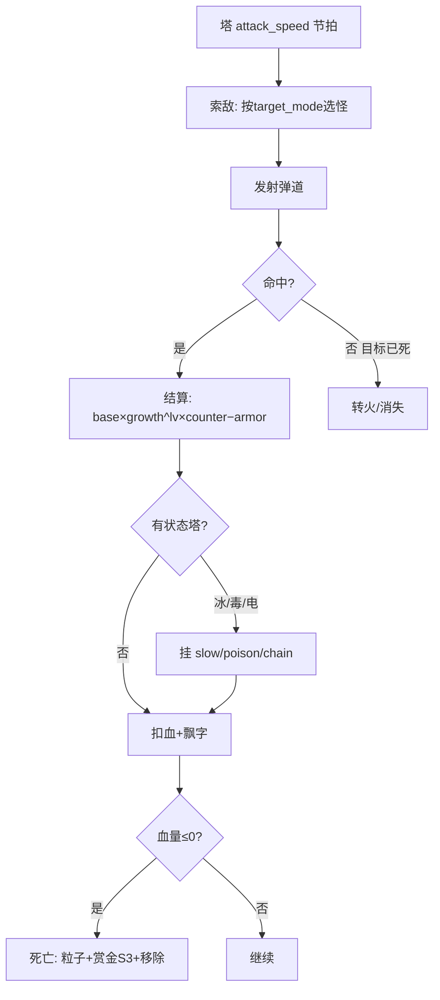
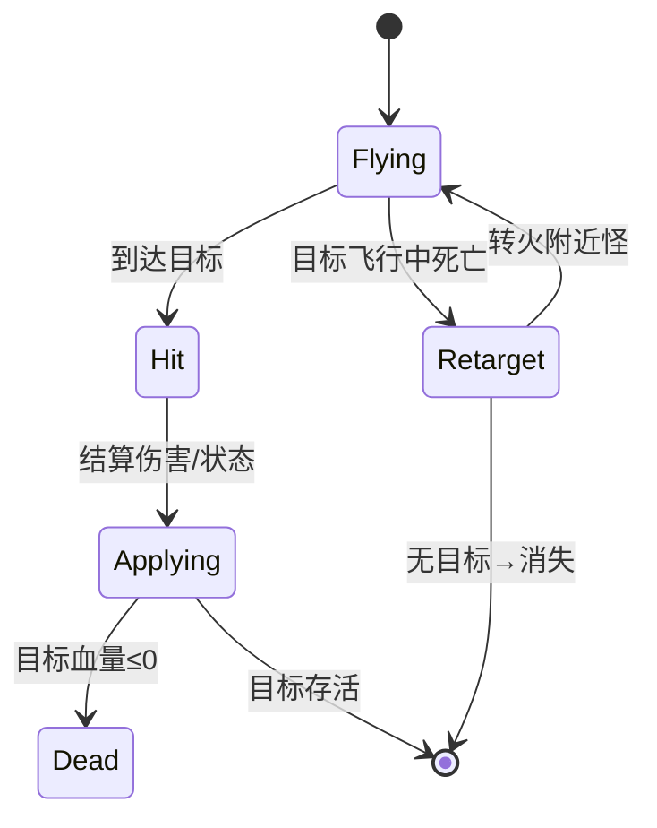
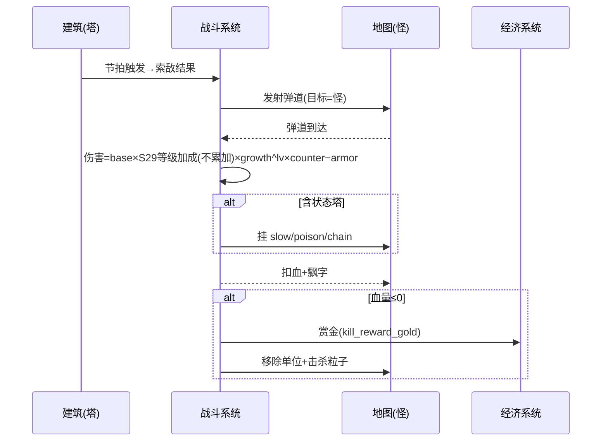

<!-- 编码: UTF-8 -->
# 系统策划案：S5 战斗系统 (Combat System)

> 归属域：A 核心战斗域 · 层级/优先级：MVP / P0 · 关联 F 码：F7 · 关联：GDD §5.7 + 状态机制（GDD 待补 §5.8，见末尾冲突说明）；SYSTEM_BREAKDOWN §S5；S29 玩家等级系统（等级加成由 S02 建塔时套用，S05 仅消费）
> 状态：v0.2-detailed · 日期 2026-07-17
> 版本说明：在 v0.1-draft 基础上补全 像素级 UI 线框 / 状态机 / 时序图 / 异常边界用例 / 完整配置字段与多行示例 / 美术资源帧数·分辨率·格式·切片。
> **v0.2-rev（耦合重构）：** 按 DO 新规接入 **S28 技能系统**——战斗系统新增「主动技激活(手动/自动)」「被动生效」「CD 管理」三类钩子：主动技由 S28 触发并经本系统 `applyActiveSkill` 结算控/伤/增益；被动在命中/击杀/状态事件上挂载（如冰封易伤、导电、腐蚀）；CD 计时由 S28 管理，本系统仅消费效果。木为 session 货币，技能 cost 默认 0 不消耗木。
> 平衡数值（弹速、溅射半径、减速/毒/连锁参数、克制系数、护甲减伤、技能数值等）保持 `[PLACEHOLDER]`，仅标注"调优杆"，禁止硬编码。
> **v0.2（S29 等级系统）**：命中结算的伤害/属性含 **S29 玩家等级加成（dmg/range/atk_speed 倍率，绝对值快照，不累加）**——由 S02 建塔时套用到塔有效属性，本系统消费该已修正属性。加成在开局/建塔时应用、玩家无需操作。详见 S29。
> **S29 加成消费约定（澄清）**：塔有效属性（dmg/range/atk_speed）在**建塔时已由 S02 套用 S29 玩家等级加成**——**不累加，取当前等级单行**（`player_level_config[level]` 单查，非 Σ/Π）——并作为已修正属性传入战斗循环；本系统（S05）直接消费该属性，**不重复计算**等级加成。
> 注：GDD/SYSTEM_BREAKDOWN 引用了"§5.8 战斗/状态"，但当前 GDD 实际无 §5.8（§5.7 为胜负）。本系统按既有 §5.7 + F7 设计，并建议 GDD 补充 §5.8（见冲突报告）。

---

## 1. 系统 UI 布局

战斗系统以**世界空间反馈**为主，少量 HUD 元素。

### 1.1 布局层级（z 轴）

| 层级 z | 名称 | 说明 |
|---|---|---|
| 30 | 单位层 | 怪物 / 塔 / 被动光环（S28） |
| 35 | 伤害飘字 / 状态图标 / 技能命中 | 怪物头顶 / 身上 / 主动技特效（接 S28） |
| 36 | 击杀反馈 | 死亡粒子 + 赏金飘字 |

### 1.2 像素级线框（750 × 1334，战场局部放大）

```
        （怪物沿路径行进，z30）
              🐉(64×64)
              | -23 (伤害飘字 z35, 0.5s)
              | ❄ (减速图标 z35)  💀(毒图标)
              ↓ 弹道(箭/炮/冰/毒/电, z30→35)
            🏹塔(已占 z30)
              ✦ 击杀粒子 z36 (0.4s) + 🪙+5 飘字(S3)
```

### 1.3 组件表（x,y 动态；尺寸；z）

| 组件 | 坐标(x,y) | 尺寸(w×h) | z | 响应行为 |
|---|---|---|---|---|
| 伤害飘字 | 怪物头顶（动态） | 文本 18–32px | 35 | 命中即飘，字号随伤缩放 |
| 状态图标 | 怪物身上（动态） | 24×24 | 35 | 持续显示至状态结束 |
| 击杀粒子 | 死亡点（动态） | 粒子 0.4s | 36 | 自动播放 |
| 赏金飘字 | 死亡点（动态） | 文本 20px | 36 | 接 S3，+金 |

### 1.4 交互流程图（mermaid flowchart）



---

## 2. 逻辑功能

### 2.1 功能模块表（触发 / 处理 / 输出）

| 模块 | 触发条件 | 处理流程（正常） | 输出 |
|---|---|---|---|
| 索敌 | 塔 attack_speed 节拍 | 按 `target_mode` 选怪（最前/最强/范围）→ 发射 | 弹道生成 |
| 命中结算 | 弹道到达目标 | 伤害 = `base_dps×S29等级加成(不累加)×growth^养塔lv × counter − armor_reduce` | 血量−，飘字 |
| 状态施加 | 冰/毒/电塔命中 | 挂 slow/poison/chain 状态 | 怪物减速/DOT/连锁 |
| 死亡处理 | 血量≤0 | 播死亡→赏金(S3)→移除单位 | 单位销毁 |
| 克制计算 | 命中时 | 查 `armor_type` vs `tower_type` 表 | 系数(0.5–2.0) |
| 主动技结算 | S28 触发 `applyActiveSkill` | 按 `tower_id` 取效果（控/伤/增益）→ 结算到目标/范围 | 控场/爆发（木不消耗） |
| 被动生效 | 被动已解锁(S28) + 战斗事件 | 命中/击杀/状态钩子挂被动（如破甲/腐蚀/导电/冰封易伤） | 被动持续/触发 |
| 击杀掉木回调 | 怪死亡 | 通知 S4→S3 按 `drop_wood_chance` 掷骰累加 session 木 | 木主源（接 S03/S28） |

### 2.2 状态机（mermaid stateDiagram-v2 — 单发弹道）



### 2.3 时序流程图（mermaid sequenceDiagram — 一次命中到击杀）



### 2.4 异常与边界用例表

| 场景 | 触发条件 | 处理流程 | 输出 / 兜底 |
|---|---|---|---|
| 网络中断 | 纯本地战斗 | 无网络依赖 | 不受影响 |
| 切后台（S20） | `onHide` | 弹道/状态计时挂起；`onShow` 恢复 | 战斗零错乱 |
| 数据损坏（S18） | 本局战斗存档损坏 | 按 S8 以当前波进度结算或重开本局（取波首） | 记 S25，不崩 |
| 并发操作 | 多塔同帧打同怪 | 各弹道独立结算，血量串行扣减 | 最终血量一致 |
| 并发操作 | 同类型状态叠加 | 刷新时长不叠加层数（防无限） | 状态可控 |
| 数值极值 | 伤害溢出（负血） | `max(0)`，正常死亡 | 不崩 |
| 数值极值 | 弹速=0 / 极小 | 钳制最小弹速 | 弹道可达 |
| 数值极值 | `splash_radius`/`chain_count` 极大 | 钳制上限（呼应 S5×冰+电 emergent 警告） | 防 solo 全图 |
| 配置缺失 | `counter_matrix` 缺 | 系数默认 1.0 + 告警 | 可战 |
| 配置缺失 | `armor_reduce` 缺 | 默认 0 | 可战 |
| 配置缺失 | 状态配置缺 | 该塔无状态效果 | 降级不崩 |
| 目标飞行中死亡 | 弹道未到目标已死 | 转火附近怪或失效 | 无残留 |
| 性能极值 | 同屏大量弹道/粒子 | 对象池 + 粒子上限 + 状态图标合并 | 帧率保护 |
| 技能配置缺失 | `skill_config` 缺/损坏 | 主动技不触发、被动不挂载；塔仍可基础攻击 | 降级不崩（记 S25） |
| 主动技+暂停 | `onHide`(S20) 时主动技 CD 中 | CD 计时挂起，`onShow` 续计 | 零错乱 |
| 被动事件竞态 | 同帧多被动钩子(导电+冰封易伤) | 串行结算，叠加为乘法/加法(按配置) | 最终值一致 |
| 等级加成异常 | `player_level_config` 缺失/`bonus` 越界 | 缺则按 level=1 行(无加成)；bonus 钳制合法区间，对 S24 报可疑 | 塔可战 |

---

## 3. 配置表设计

**表名：`combat_config`（战斗全局）**

| 字段 | 类型 | 取值范围 | 默认值 | 说明 |
|---|---|---|---|---|
| counter_matrix | json | type×armor→系数 0.5–2.0 | `[PLACEHOLDER]` | 克制系数表。**调优杆**：P4 决策有效性 |
| armor_reduce | json | armor→减伤% 0–0.9 | `[PLACEHOLDER]` | 护甲减伤。**调优杆**：克制深度 |
| projectile_speed | float | 100–2000 | `[PLACEHOLDER]` | 弹速(px/s)。**调优杆**：手感 |
| splash_radius | float | 0–200 | `[PLACEHOLDER]` | 溅射半径(炮)。**调优杆**：AOE 效率 |
| slow_factor | float | 0.3–0.9 | `[PLACEHOLDER]` | 冰减速比例。**调优杆**：保命强度 |
| slow_duration | float | 0.5–5 | `[PLACEHOLDER]` | 减速时长。**调优杆**：控制链 |
| poison_dps | float | 1–100 | `[PLACEHOLDER]` | 毒每秒伤害。**调优杆**：越肉越赚 |
| poison_duration | float | 1–10 | `[PLACEHOLDER]` | 毒时长。**调优杆**：DOT 总量 |
| chain_count | int | 0–10 | `[PLACEHOLDER]` | 电连锁跳数（钳制上限防 solo）。**调优杆**：密集处理 |
| chain_range | float | 50–400 | `[PLACEHOLDER]` | 连锁半径。**调优杆**：弹射覆盖 |
| status_stack_rule | enum | refresh/stack | "refresh" | 同类型状态叠加规则（默认刷新） |
| damage_formula | string | 模板 | "base*level_bonus*growth^lv*counter-armor" | 伤害公式（`level_bonus` 取自 S29 等级加成，不累加；结构，不可热更逻辑） |

**counter_matrix 示例（JSON；系数值 `[PLACEHOLDER]` 为待调优占位）**

```json
{
  "arrow_vs_light": "[PLACEHOLDER]",
  "cannon_vs_heavy": "[PLACEHOLDER]",
  "ice_vs_none": 1.0,
  "magic_vs_magic_immune": "[PLACEHOLDER]",
  "poison_vs_heavy": "[PLACEHOLDER]",
  "electric_vs_air": "[PLACEHOLDER]"
}
```

---

## 4. 美术资源需求

| 资源 | 帧数 | 分辨率 | 格式 | 切片要求 |
|---|---|---|---|---|
| 弹道特效（按塔 type） | 箭4 / 炮6 / 冰4 / 毒4 / 电4 | 64×64 | Atlas | 朝目标定向 |
| 命中特效 | 4 帧（小爆点 0.2s） | 48×48 | Atlas | 中心爆炸 |
| 击杀粒子 | 6 帧（碎裂 0.4s） | 64×64 | Atlas | additive |
| 状态图标（减速/毒/电） | 循环 2–4 帧 | 24×24 | Atlas | 套怪物身上 |
| 伤害飘字 | 文本动画（字号随伤） | 文本 18–32px | 引擎文本 | 0.5s 上浮 |
| 溅射特效 | 6 帧（AOE 圈 0.3s） | 128×128 | Atlas | 中心扩散 |
| 连锁特效 | 4 帧（闪电链 0.2s） | 128×128 | Atlas | 多目标连线 |

> 所有战斗特效与打击感、音效合并见 S23；性能预算需评估同屏粒子数（见 §2.4 性能极值）。
