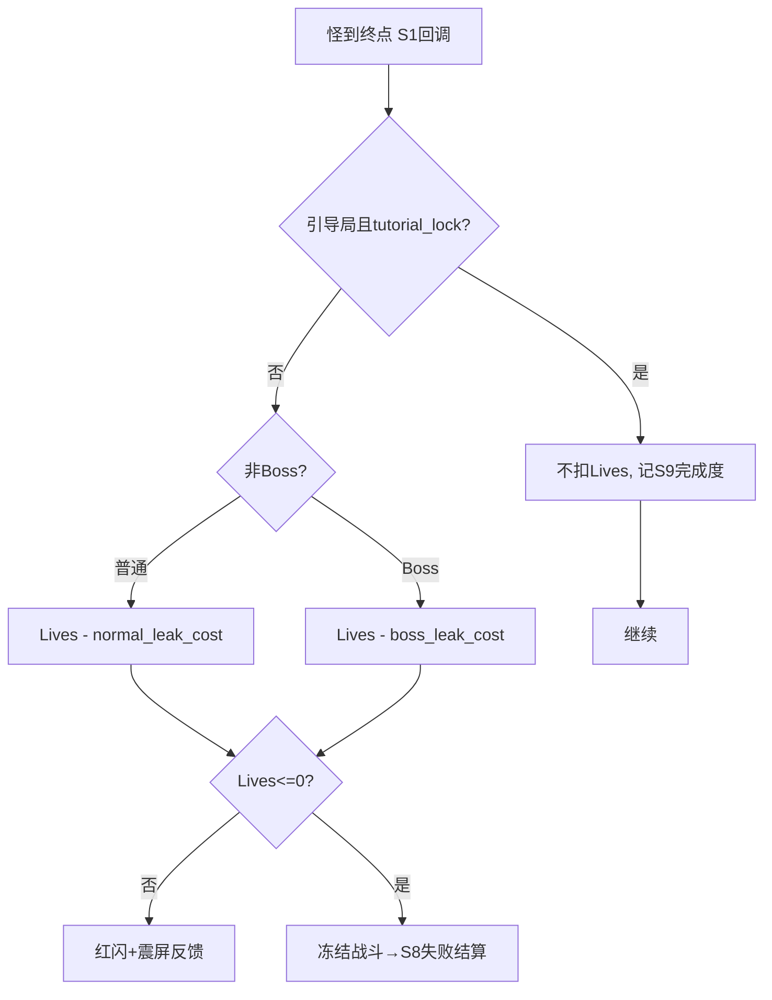
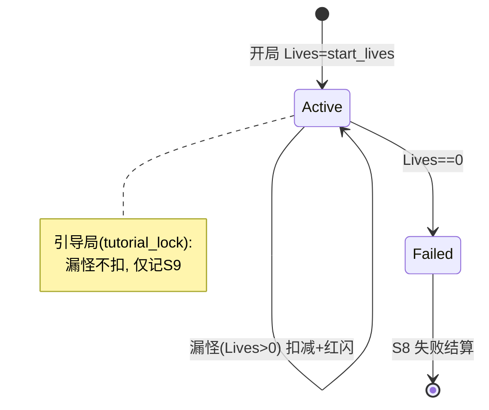
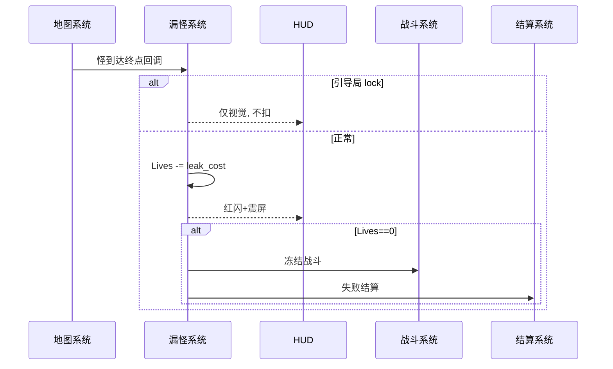

<!-- 编码: UTF-8 -->
# 系统策划案：S6 漏怪 / 生命系统 (Leak / Lives System)

## 0. 元数据头

> 归属域：A 核心战斗域 · 层级/优先级：MVP / P0 · 关联 F 码：F8 · 关联：GDD §5.4；SYSTEM_BREAKDOWN §S6
> 状态：v0.2-detailed · 日期 2026-07-17
> 版本说明：在 v0.1-draft 基础上补全 像素级 UI 线框 / 状态机 / 时序图 / 异常边界用例 / 完整配置字段与多行示例 / 美术资源帧数·分辨率·格式·切片。
> 平衡数值（初始 Lives、普通/Boss 漏怪扣减、容错等）保持 `[PLACEHOLDER]`，仅标注"调优杆"，禁止硬编码。

---

## 1. 系统 UI 布局

### 1.1 布局层级（z 轴，HUD 内）

| 层级 z | 名称 | 说明 |
|---|---|---|
| 45 | Lives 显示 | 顶栏金木之间或独立 |
| 60 | 漏怪反馈 | 全屏左侧红闪 + 震屏(S23) |
| 70 | 失败遮罩 | Lives=0 → 半透明黑 + "失败" + 进 S8 |

### 1.2 像素级线框（750 × 1334）

```
  (0,0)┌─────────────────────────────────────────── 750 ──┐
       │ 顶栏 z45 [金] [波次] [木] [♥♥♥♥… ×N]            │ y=20..90
       │                                                │
       │         （战场：怪到终点→漏）                    │
       │  │█ 红闪 z60 (左→右扫 0.3s)  + 震屏            │ 终点侧
       │                                                │
       │  ┌────────── 失败遮罩 z70 ──────────┐          │
       │  │          失  败                    │          │ 全屏
       │  │     [再来一局]  [回大厅]           │          │ (接 S8)
       │  └──────────────────────────────────┘          │
       └──────────────────────────────────────────── 1334 ┘
```

### 1.3 组件表（x,y 左上角；w×h；z）

| 组件 | 坐标(x,y) | 尺寸(w×h) | z | 响应行为 |
|---|---|---|---|---|
| Lives 图标 | (300,40) 居中偏左 | 心 32×32 ×N | 45 | 漏一个灭一盏 |
| 漏怪红闪 | (0,0) 全屏左 | 宽 40 × 高 1334 | 60 | 0.3s 左→右扫，不可点 |
| 失败遮罩 | (0,0) | 750×1334 | 70 | 点→S8 失败结算 |
| 失败大字 | (375,500) 居中 | 文本 64px | 70 | "失败" |

### 1.4 交互流程图（mermaid flowchart）



---

## 2. 逻辑功能

### 2.1 功能模块表（触发 / 处理 / 输出）

| 模块 | 触发条件 | 处理流程（正常） | 输出 |
|---|---|---|---|
| Lives 容器 | 开局 | 初始化 = `start_lives` | 可读 |
| 漏怪判定 | 怪到终点(S1) | non-boss→扣 `normal_leak_cost`；boss→扣 `boss_leak_cost` | Lives−，红闪 |
| 失败触发 | Lives=0 | 冻结战斗(S5)→广播→S8 失败结算 | 进入结算 |
| 引导保护 | S9 引导局 | 锁 Lives（不扣） | 首波保送 |

### 2.2 状态机（mermaid stateDiagram-v2 — 单局 Lives 状态）



### 2.3 时序流程图（mermaid sequenceDiagram — 漏怪到失败）



### 2.4 异常与边界用例表

| 场景 | 触发条件 | 处理流程 | 输出 / 兜底 |
|---|---|---|---|
| 网络中断 | 纯本地 | 无网络依赖 | 不受影响 |
| 切后台（S20） | `onHide` | 漏怪判定计时挂起；暂停帧到达的漏怪事件→丢弃 | `onShow` 零错乱 |
| 数据损坏（S18） | Lives 存档损坏 | 重置 `start_lives` + 记 S25 | 不崩 |
| 并发操作 | 同帧多怪到终点 | 累加扣减（循环）；首次 Lives==0 触发失败，加锁防重入 | 仅一次失败结算 |
| 数值极值 | `boss_leak_cost` > 剩余 Lives | 直接失败，不出现负 Lives | 无负数 |
| 数值极值 | `start_lives`=0 | 开局即失败（或钳制最小 1） | 不出现负 |
| 数值极值 | `normal_leak_cost`=0 | 告警 S25（漏不扣异常） | 仍运行 |
| 配置缺失 | `lives_config` 缺 | 用默认(start=`[PLACEHOLDER]`, normal=1, boss=`[PLACEHOLDER]`) | 可玩 |
| 配置缺失 | `fail_on_zero` 缺 | 默认 true | Lives=0 即败 |
| 引导局 | tutorial_lock | 漏怪不扣，记 S9 完成度 | 首波保送 |
| 胜负同帧竞态 | 漏怪与全波清空同帧 | 胜利判定(全清)优先；漏怪事件作废 | 判胜利不失败 |

---

## 3. 配置表设计

**表名：`lives_config`（生命配置）**

| 字段 | 类型 | 取值范围 | 默认值 | 说明 |
|---|---|---|---|---|
| start_lives | int | 1–50 | `value_ref: balance/S06_leak_lives.json#sys_start_lives` | 初始命数（GDD 初值 20）。**调优杆**：容错与压力 |
| normal_leak_cost | int | 1–10 | `value_ref: balance/S06_leak_lives.json#sys_normal_leak_cost` | 普通怪漏扣。**调优杆**：漏怪代价 |
| boss_leak_cost | int | 1–20 | `value_ref: balance/S06_leak_lives.json#sys_boss_leak_cost` | Boss 漏扣（GDD 初值 5）。**调优杆**：Boss 风险 |
| tutorial_lock | bool | true/false | true | 引导局锁 Lives（首波保送） |
| fail_on_zero | bool | true/false | true | Lives=0 即败 |
| meta_lives_bonus | int | 0–20 | `value_ref: balance/S06_leak_lives.json#sys_meta_lives_bonus` | 元进度永久 +Lives（S11/S29，可空） |

**多行示例数据（CSV；数值列 `[PLACEHOLDER]` 为待调优占位）**

```csv
start_lives,normal_leak_cost,boss_leak_cost,tutorial_lock,fail_on_zero,meta_lives_bonus
value_ref:balance/S06_leak_lives.json#sys_start_lives,value_ref:balance/S06_leak_lives.json#sys_normal_leak_cost,value_ref:balance/S06_leak_lives.json#sys_boss_leak_cost,true,true,value_ref:balance/S06_leak_lives.json#sys_meta_lives_bonus
```

> 说明：单例全局配置（一行）；所有 `[PLACEHOLDER]` 须经试玩调优，禁止硬编码。

---

## 4. 美术资源需求

| 资源 | 帧数 | 分辨率 | 格式 | 切片要求 |
|---|---|---|---|---|
| Lives 心形图标 | 满/空 各1 | 32×32 | Atlas | 单格切片，灭盏用半透明 |
| 漏怪红闪 | 左扫 3 帧（0.3s） | 40×1334 | Atlas | 横向切片循环 |
| 失败遮罩 | 1（静态，半透明黑） | 750×1334 | PNG | 九宫 |
| 失败大字 | 1（静态） | 文本 64px | 引擎文本 | 无切片 |
| 震屏（内部） | — | — | — | 由 S23 统一，无独立资源 |

> 红闪/震屏与打击感合并见 S23；失败演出 F40 暂不做。

---

## 5. 实现契约

### 5.1 输入数据结构

| 字段 | 类型 | 来源 config 字段 |
|---|---|---|
| start_lives | int | `lives_config.start_lives`（本系统 §3） |
| normal_leak_cost / boss_leak_cost | int | `lives_config.*`（本系统 §3） |
| meta_lives_bonus | int | `lives_config.meta_lives_bonus`（S11/S29 元进度） |
| enemy_reach_end | event | S1 终点回调 |

### 5.2 输出数据结构

| 字段 | 类型 | 说明 |
|---|---|---|
| lives_remaining | int | 当前命数（≥0） |
| leak_event | event | 红闪 + 震屏（→S7/S23） |
| fail_settle | event | Lives=0 → S8 失败结算 |

### 5.3 跨系统接口调用表

| caller | callee | function | 方向 | 用途 |
|---|---|---|---|---|
| S1 | S6 | `onEnemyReachEnd(enemy)` | in | 漏怪回调 |
| S6 | S7 | `showLeakFlash()` | out | 红闪 + 震屏 |
| S6 | S5 | `freezeBattle()` | out | 冻结战斗 |
| S6 | S8 | `onFailSettle()` | out | 失败结算 |
| S6 | S9 | `onTutorialLeak()` | out | 引导局不扣，记完成度 |
| S9 | S6 | `isTutorialLock()` | in | 引导局判定 |

### 5.4 错误码表

| E# | 场景 | 兜底 | 涉及 |
|---|---|---|---|
| E01 | 切后台 onHide(S20) | 暂停帧到达的漏怪事件丢弃 | S20 |
| E02 | Lives 存档损坏(S18) | 重置 start_lives + 记 S25 | S18/S25 |
| E03 | 同帧多怪到终点 | 累加扣减；首次 Lives==0 触发失败，加锁防重入 | S6 |
| E04 | `boss_leak_cost` > 剩余 Lives | 直接失败，不出现负 Lives | S6 |
| E05 | `start_lives`=0 | 钳制最小 1 或开局即败 | S24 |
| E06 | `normal_leak_cost`=0 | 告警 S25，仍运行 | S24/S25 |
| E07 | `lives_config` 缺 | 默认(start=20, normal=1, boss=5) | S6 |
| E08 | `fail_on_zero` 缺 | 默认 true | S6 |
| E09 | 胜负同帧竞态 | 胜利(全清)优先；漏怪事件作废 | S8 |

### 5.5 状态转换表（自 §2.2 stateDiagram-v2）

| state | event | transition | action |
|---|---|---|---|
| Active | 开局 Lives=start_lives | → Active | 初始化 |
| Active | 漏怪(Lives>0) | → Active | 扣减 + 红闪 |
| Active | 引导局漏怪(tutorial_lock) | → Active | 不扣，记 S9 |
| Active | Lives==0 | → Failed | 冻结战斗 → S8 失败结算 |
| Failed | S8 失败结算 | → [*] | 退出本局 |

### 5.6 数值消费清单

| param_id | 来源 balance 文件 |
|---|---|
| sys_start_lives / sys_normal_leak_cost / sys_boss_leak_cost / sys_meta_lives_bonus | balance/S06_leak_lives.json |

---

## 6. 冲突与待裁定

| 项 | current_implementation | pending_decision | owner |
|---|---|---|---|
| 元进度 +Lives 联动 | `sys_meta_lives_bonus` 初值 0，现**未接** S29 `unlock_lives` 永久加成（effect_value 未定） | 是否启用 S29 永久 +Lives 及其 effect_value | S29（B 域，本 A 域改造不动） |

> 其余字段无跨系统冲突；`tutorial_lock=true`/`fail_on_zero=true` 为已定布尔默认；数值初值全部锁定于 `balance/S06_leak_lives.json`（4 个 param_id），无 `NEEDS-DESIGN`（本 A 域范围）。
