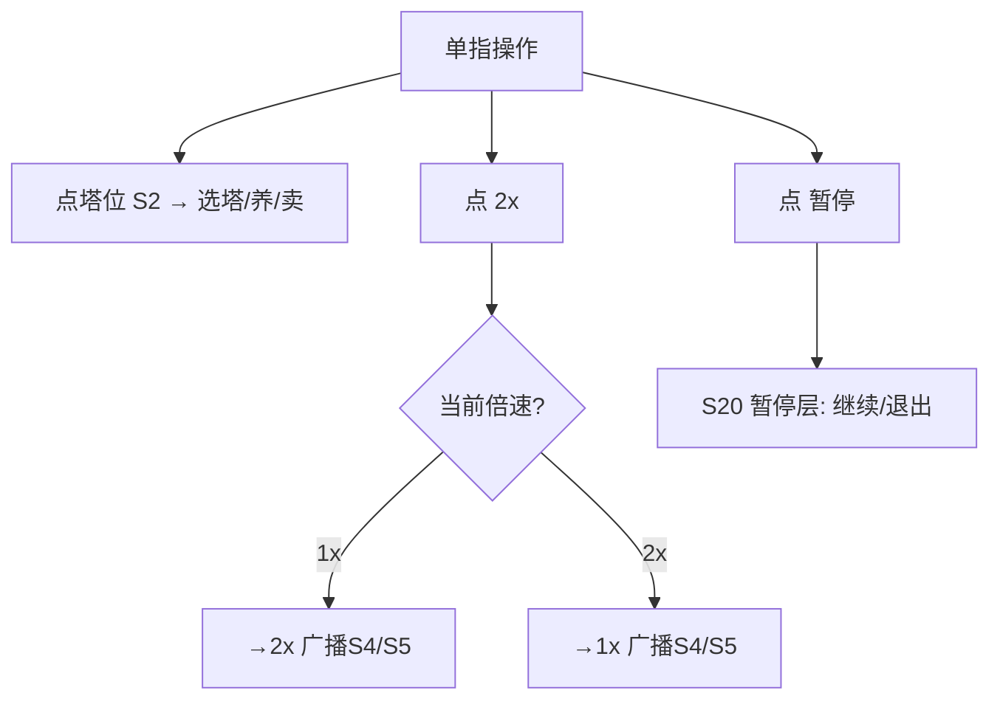
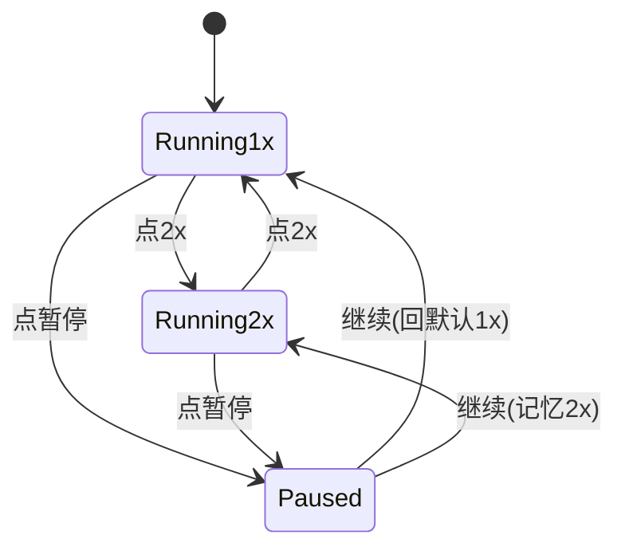
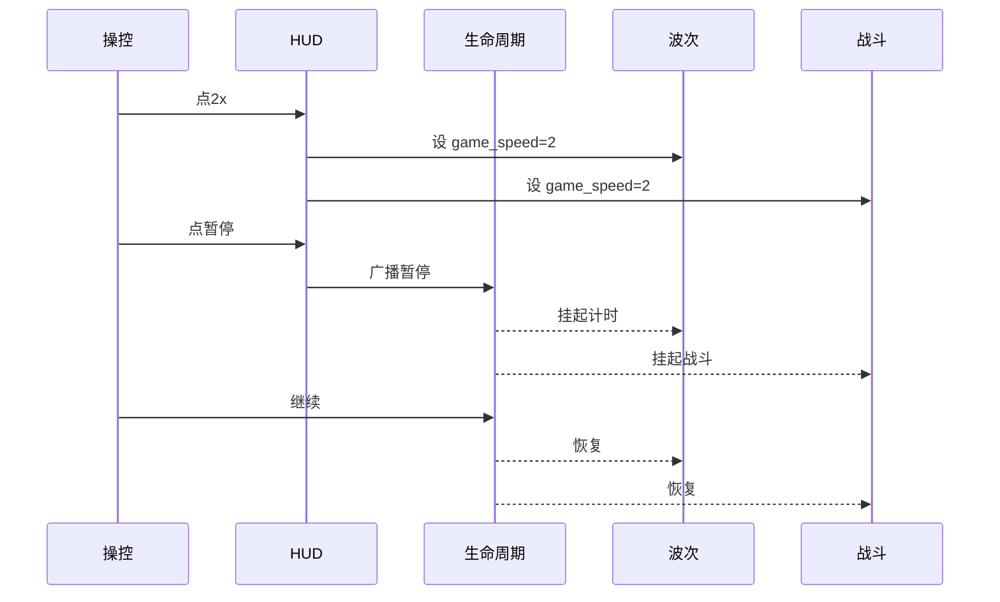

<!-- 编码: UTF-8 -->
# 系统策划案：S7 HUD / 操控系统 (HUD / Control System)

> 归属域：A 核心战斗域 · 层级/优先级：MVP / P1 · 关联 F 码：F9 · 关联：GDD §9（系统交互矩阵；"适配"详见 GDD §8）；SYSTEM_BREAKDOWN §S7
> 状态：v0.2-detailed · 日期 2026-07-17
> 版本说明：在 v0.1-draft 基础上补全 像素级 UI 线框 / 状态机 / 时序图 / 异常边界用例 / 完整配置字段与多行示例 / 美术资源帧数·分辨率·格式·切片。
> 本系统为 UX/布局层，无核心平衡数值；点击区/安全边距等以合理默认 + 调优杆标注，运行时按安全区与异形屏适配。

---

## 1. 系统 UI 布局

### 1.1 布局层级（z 轴，覆盖战场）

| 层级 z | 名称 | 说明 |
|---|---|---|
| 45 | 顶部信息条 | 左金(S3)/中波次(S4)/右木(S3)+Lives(S6) |
| 50 | 底部操作条 | 2x 加速（左）/ 暂停（右）；塔选择条由 S2 接管 |
| — | 安全区 | 所有可点组件落 iOS 安全区（距边≥safe_margin，底部≥home indicator 34） |

### 1.2 像素级线框（750 × 1334）

```
  (0,0)┌─────────────────────────────────────────── 750 ──┐
       │ 顶栏 z45 (0,20)-(750,90) 高70                    │ y=20
       │ [🪙金] [第X/Y波 ▓▓▓] [🪵木] [♥×N]                 │
       │                                                │
       │           （战场：路径+塔位+怪物）                │
       │                                                │
       │ 底部操作条 z50                                 │ y=1230
       │  [⏩2x] (40,1230) 96×96      [⏸] (660,1230) 96×96│
       │  (塔种选择条/S2 接管 y=1150)                    │
       └──────────────────────────────────────────── 1334 ┘
        ↑ safe_margin 顶部下移避刘海；底部≥34 避 home indicator
```

### 1.3 组件表（x,y 左上角；w×h；z）

| 组件 | 坐标(x,y) | 尺寸(w×h) | z | 响应行为 |
|---|---|---|---|---|
| 顶部信息条 | (0,20) | 750×70 | 45 | 被动展示，每帧聚合 |
| 金余额(引用 S3) | (20,40) | 文本 28px | 45 | 实时 |
| 波次文本(引用 S4) | (375,40) 居中 | 文本 28px | 45 | 实时 |
| 木余额(引用 S3) | (730,40) 右对齐 | 文本 28px | 45 | 实时 |
| Lives(引用 S6) | (300,40) | 32×32×N | 45 | 实时 |
| 2x 加速键 | (40,1230) | 96×96 | 50 | 点→切 1x/2x；免费 |
| 暂停键 | (660,1230) | 96×96 | 50 | 点→S20 暂停弹窗 |
| 大点击区 | 全局主操 | ≥min_touch | 50 | 误触防护 + 单指可达 |

### 1.4 交互流程图（mermaid flowchart）



---

## 2. 逻辑功能

### 2.1 功能模块表（触发 / 处理 / 输出）

| 模块 | 触发条件 | 处理流程（正常） | 输出 |
|---|---|---|---|
| 信息聚合 | 每帧 | 读 S3/S4/S6 状态刷新顶条 | 显示同步 |
| 加速切换 | 点 2x | toggle `speed×2` → 广播 S4/S5 | 战斗倍速 |
| 暂停触发 | 点暂停 | 广播 S20 暂停 | 全局挂起 |
| 单指适配 | 布局期 | 组件尺寸/位置按安全区约束 | 可触达 |

### 2.2 状态机（mermaid stateDiagram-v2 — 速度/暂停）



### 2.3 时序流程图（mermaid sequenceDiagram — 加速/暂停广播）



### 2.4 异常与边界用例表

| 场景 | 触发条件 | 处理流程 | 输出 / 兜底 |
|---|---|---|---|
| 网络中断 | 纯本地 HUD | 无网络依赖 | 不受影响 |
| 切后台（S20） | `onHide` | 弹暂停层；HUD 冻结；加速中暂停→先停加速再暂停 | `onShow` 恢复（回 1x 或记忆） |
| 数据损坏（S18） | `hud_config` 损坏 | 用默认布局 | 不崩 |
| 并发操作 | 狂点 2x/暂停 | 防抖 + 状态机去重；2x 与暂停同帧→暂停优先 | 状态一致 |
| 数值极值 | `min_touch`<64 | 钳制最小 64 | 可触达 |
| 数值极值 | `safe_margin` 为负 | 钳制 0 | 不溢出 |
| 数值极值 | `top_bar_h` 越界 | 钳制 [50,120] | 布局正常 |
| 配置缺失 | `hud_config` 缺 | 用默认全集 | 不阻塞 |
| 数据 null | 聚合源返回 null | 显示"—" | 不崩 |
| 刘海/异形屏 | 运行时 | 读 `wx.getWindowInfo` 安全区，顶条下移 | 不遮挡 |
| 低帧率 | 设备卡顿 | HUD 降频刷新（每 0.1s） | 保流畅 |
| 多分辨率 | 非 750×1334 屏 | 以 750×1334 为设计基准，运行时 scale 适配 | 比例一致 |

---

## 3. 配置表设计

**表名：`hud_config`（HUD 配置）**

| 字段 | 类型 | 取值范围 | 默认值 | 说明 |
|---|---|---|---|---|
| top_bar_h | int | 50–120 | 70 | 顶条高（px，设计基准） |
| speed_2x_free | bool | true/false | true | 加速是否免费（建议免费，防刷经济） |
| min_touch | int | 64–120 | 96 | 最小点击区边长。**调优杆**：误触/无障碍（接 S22） |
| safe_margin | int | 0–40 | 20 | 安全边距（距屏幕边） |
| show_lives_in_top | bool | true/false | true | Lives 是否进顶条 |
| speed_levels | json | 倍速数组 | [1,2] | 可选加速档（增强可 [1,2,3]） |
| pause_confirm | bool | true/false | false | 暂停是否需确认（防误触） |
| vibrate_on_leak | bool | true/false | true | 漏怪震动（接 S22/S23） |
| design_width | int | — | 750 | 设计基准宽（适配用） |
| design_height | int | — | 1334 | 设计基准高（适配用） |

**多行示例数据（CSV；UX 结构值，可直接作为默认）**

```csv
top_bar_h,speed_2x_free,min_touch,safe_margin,show_lives_in_top,speed_levels,pause_confirm,vibrate_on_leak,design_width,design_height
70,true,96,20,true,"[1,2]",false,true,750,1334
```

---

## 4. 美术资源需求

| 资源 | 帧数 | 分辨率 | 格式 | 切片要求 |
|---|---|---|---|---|
| 顶部信息条底 | 1（静态，半透明） | 750×90 | PNG | 九宫 |
| 2x 加速图标 | 1x/2x 两态各1 | 96×96 | Atlas | 单格切片 |
| 暂停图标 | normal+press 各1 | 96×96 | Atlas | 单格切片 |
| HUD 通用图标集 | 多分辨率各1 | 48–96 | Atlas | 单格切片 |
| 暂停弹层底 | 1（静态） | 750×1334 | PNG | 九宫 |

> 图标分包见 S19；震动反馈接 S22/S23。
