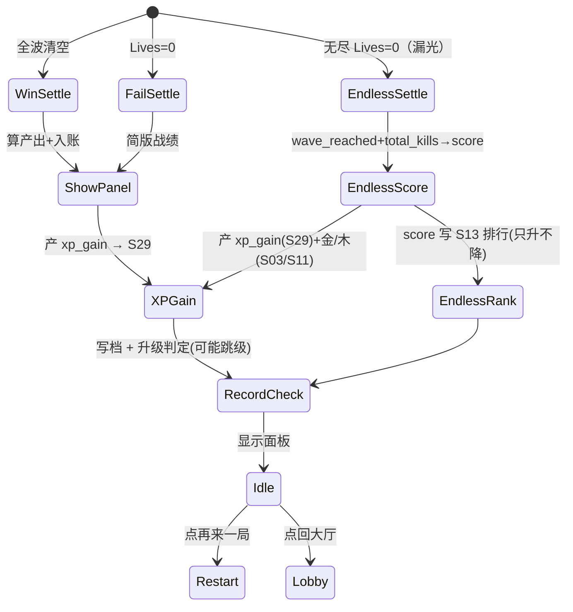

<!-- 编码: UTF-8 -->
# 系统策划案：S8 结算系统 (Settlement System)

> 归属域：A 核心战斗域 · 层级/优先级：MVP / P1 · 关联 F 码：F12 · 关联：GDD §5.7（胜负）；SYSTEM_BREAKDOWN §S8
> 状态：v0.2-detailed · 日期 2026-07-17
> 版本说明：在 v0.1-draft 基础上补全 像素级 UI 线框 / 状态机 / 时序图 / 异常边界用例 / 完整配置字段与多行示例 / 美术资源帧数·分辨率·格式·切片。
> 平衡数值（胜利基础金/木、每波奖励、漏怪系数、新纪录奖励等产出公式）保持 `[PLACEHOLDER]`，仅标注"调优杆"，禁止硬编码。
> **v0.2（S29 等级系统）**：结算新增 **XP 产出**（`xp_gain`，[PLACEHOLDER]）→ 累加 S29 `current_xp` → 跨 `xp_required` 阈值升级；结算面板与配置表同步加 XP 字段，状态机/时序/异常补 XP 分支。详见 S29。

---

## 1. 系统 UI 布局

### 1.1 布局层级（z 轴，全屏弹层）

| 层级 z | 名称 | 说明 |
|---|---|---|
| 70 | 结算面板 | 居中：胜负标题 + 战绩 + 产出 |
| 70 | 按钮区 | "再来一局"（主）/ "回大厅"（次） |
| 71 | 新纪录提示 | 破最佳时金边"新纪录！" |

### 1.2 像素级线框（750 × 1334）

```
  (0,0)┌─────────────────────────────────────────── 750 ──┐
       │              （战斗冻结背景）                      │
       │  ┌── 结算面板 z70 (75,400)-(675,900) ──┐          │ y=400
       │  │  胜 利!  [新纪录!] z71              │          │
       │  │  撑过 X 波 · 漏 Y 只 · 最高塔 Lv.Z  │          │
       │  │  产出: 🪙 +A   🪵 +B               │          │
       │  │  ✨ 等级 XP +C   Lv.P→Lv.Q ▰▱▱▱   │          │  ← S29 新增
       │  └──────────────────────────────────┘          │ y=900
       │  [再来一局] (40,1050) 330×96      [回大厅] 330×96 │ y=1050
       └──────────────────────────────────────────── 1334 ┘
        （失败：同面板，简版战绩，不罚资源）

**视图：无尽模式结算面板（result_type=endless，仅"结束"口径，无胜利）**

```
  (0,0)┌─────────────────────────────────────────── 750 ──┐
       │              （战斗冻结背景）                      │
       │  ┌── 结算面板 z70 (75,400)-(675,900) ──┐          │ y=400
       │  │  本局结束 ENDLESS_RESULT  [新纪录!] z71    │     │
       │  │  ENDLESS_NO_WIN（无尽模式无胜利）         │     │
       │  │  到达第 X 波 · 击杀 Y · 分数 Z          │     │
       │  │  产出: 🪙 +A   🪵 +B   ✨ XP +C        │     │
       │  │  （分数 Z 上榜 S13）                    │     │
       │  └──────────────────────────────────┘          │ y=900
       │  [再来一局] (40,1050) 330×96      [回大厅] 330×96 │ y=1050
       └──────────────────────────────────────────── 1334 ┘
```
```

### 1.3 组件表（x,y 左上角；w×h；z）

| 组件 | 坐标(x,y) | 尺寸(w×h) | z | 响应行为 |
|---|---|---|---|---|
| 结算面板 | (75,400) | 600×500 | 70 | 展示战绩+产出 |
| 再来一局 | (40,1050) | 330×96 | 70 | 点→重置单局→S1 开局 |
| 回大厅 | (380,1050) | 330×96 | 70 | 点→S10 |
| 新纪录标 | (555,410) | 120×48 | 71 | 破纪录显示，金边闪光 |
| 胜利/失败标题 | (375,440) 居中 | 文本 48px | 70 | 静态 |
| 等级 XP 显示 | (375,820) 居中 | 文本 24px | 70 | 静态(接 S29) |

### 1.4 交互流程图（mermaid flowchart）

```mermaid
flowchart TD
    A[胜: 全波清空 / 败: Lives=0] --> A0{result_type?}
    A0 -->|standard| B[算产出公式(胜/负)]
    A0 -->|endless| B0[算 wave_reached+total_kills→score]
    B0 --> F0[入账: XP(S29)+金/木(S03/S11); score→S13排行]
    F0 --> G[比对历史最佳→新纪录?]
    B --> C{胜利?}
    C -->|是| D[产出=base+per_wave×wave×leak_coef]
    C -->|否| E[简版战绩, 无惩罚产出]
    D --> F[入账 S3/S11 + 写档 S18]
    E --> F
    F --> G[比对历史最佳→新纪录?]
    G --> H[显示面板]
    H --> I{点按钮}
    I -->|再来一局| J[重置→S1]
    I -->|回大厅| K[S10]
```

---

## 2. 逻辑功能

### 2.1 功能模块表（触发 / 处理 / 输出）

| 模块 | 触发条件 | 处理流程（正常） | 输出 |
|---|---|---|---|
| 胜利结算 | 全波清空 | 产出 = base + per_wave×wave_reached×leak_coef → 写 S3/S11 → 写档 | 战绩+产出 |
| XP 产出 | 胜/负结算 | `xp_gain` = xp_base + per_wave_xp×wave_reached×(1−leak_penalty×leak_normalized) → 累加 S29 `current_xp` → 可能升级（S29） | 等级 XP |
| 失败结算 | Lives=0 | 简版战绩（无惩罚产出）→ 写最佳波数 | 战绩 |
| 无尽结算 | 无尽模式 Lives=0（漏光） | `wave_reached`+`total_kills`→`score = wave×w_wave + kills×w_kill`；产 XP(S29)+金/木(S03/S11)；`score`→S13 排行；无胜利态 | 战绩+分数 |
| 新纪录判定 | 写档时 | 比对历史最佳 → 标记 | 新纪录标 |
| 再来一局 | 点按钮 | 重置单局状态 → 回 S1 开局 | 新局 |
| 回大厅 | 点按钮 | 存档 → S10 | 大厅 |

### 2.2 状态机（mermaid stateDiagram-v2 — 结算状态）



### 2.3 时序流程图（mermaid sequenceDiagram — 胜利结算入账）

```mermaid
sequenceDiagram
    participant S4 as 波次
    participant S8 as 结算系统
    participant S3 as 经济系统
    participant S11 as 元进度
    participant S29 as 等级系统
    participant S18 as 存档
    S4->>S8: 全波清空→胜利
    S8->>S8: 产出=base+per_wave×wave×leak_coef
    S8->>S3: 入账金/木
    S8->>S11: 元进度入账
    S8->>S29: xp_gain = xp_base+per_wave×wave×(1−leak_penalty×leak_norm)
    S29->>S29: current_xp += xp_gain; 重算 level
    S29->>S18: 写 player_level/current_xp
    S8->>S18: 写档(战绩+最佳)
    S8-->>UI: 显示面板(新纪录?)
    UI->>S8: 点再来一局
    S8->>S1: 重置单局
```

> **无尽模式时序（result_type=endless）**：S4→S8 通知 `Lives=0` + `wave_reached` + `total_kills`；S8 算 `score = wave×w_wave + kills×w_kill` → 入账 XP(S29) + 金/木(S03/S11) → `score` 写 S13 排行（只升不降）→ 显示无尽结算面板（无胜利标题，显 wave/kills/score/新纪录）。

### 2.4 异常与边界用例表

| 场景 | 触发条件 | 处理流程 | 输出 / 兜底 |
|---|---|---|---|
| 网络中断 | 结算写本地(S18)；云(S42 暂不做)忽略 | 先落本地；若接 S21 远程结算参数失败→用本地默认 | 不阻塞 |
| 切后台（S20） | 结算过程中 `onHide` | 结算流程加锁，本地写同步完成后再响应暂停 | 不丢产出 |
| 数据损坏（S18） | 写档失败/坏档 | 重试 3 次→失败则缓存内存，下次启动补写 | 产出不丢 |
| 并发操作 | 重复触发结算（竞态） | 加锁，仅首触发有效 | 不重复结算 |
| 并发操作 | 再来一局时资源未到账 | 等入账完成再重置 | 防丢资源 |
| 数值极值 | 产出计算溢出 | 钳制至 cap(S3) | 不溢出 |
| 数值极值 | `wave_reached` > total | 钳制至 total | 合理 |
| 数值极值 | `leak_penalty` > 1 | 钳制 [0,1] | 系数合法 |
| 配置缺失 | `settlement_config` 缺 | 用保底公式 + 告警 S25 | 可结算 |
| 配置缺失 | 产出计算异常 | 保底公式兜底 | 不崩 |
| 新纪录判定异常 | 历史最佳读取失败 | 视为无记录→按新纪录处理（false positive 安全） | 不漏记 |
| XP 产出异常 | `xp_gain` 计算为负/溢出 | 钳制至 [0, cap]；异常则不升级、不崩 | 安全 |
| 升级并发 | 结算与升级回写竞态 | S29 `isLeveling` 锁，仅首触发有效；S8 侧不重复产 XP | 不重复 |
| 升级持久化失败 | 写 `player_level`/`current_xp` 失败 | 同数据损坏处理（重试 3 次→内存缓存，下次补写） | 不丢 |
| 无尽分数溢出 | `score` 超 int 上限 | 钳制至 S13 `max`（同 wave 钳制） | 不溢出 |
| 无尽波数越界 | `wave_reached` > max_wave_cap(>0) | 钳制至 cap | 合理 |
| 无尽 score 缺失 | 权重/击杀为 0 | score=0 仍上榜(最低) | 不崩 |

---

## 3. 配置表设计

**表名：`settlement_config`（结算配置）**

| 字段 | 类型 | 取值范围 | 默认值 | 说明 |
|---|---|---|---|---|
| win_base_gold | int | 10–500 | `value_ref: balance/S08_settlement.json#settle_win_base_gold` | 胜利基础金。**调优杆**：通关激励 |
| win_base_wood | int | 10–500 | `value_ref: balance/S08_settlement.json#settle_win_base_wood` | 胜利基础木。**调优杆**：养塔来源 |
| per_wave_gold | int | 1–50 | `value_ref: balance/S08_settlement.json#settle_per_wave_gold` | 每撑过波奖励金。**调优杆**：进度价值 |
| leak_penalty | float | 0–1 | `value_ref: balance/S08_settlement.json#settle_leak_penalty` | 漏怪产出系数（少漏多奖）。**调优杆**：取舍 |
| fail_penalty | bool | true/false | false | 失败是否扣资源（默认否，降挫败） |
| new_record_bonus | int | 0–100 | `value_ref: balance/S08_settlement.json#settle_new_record_bonus` | 新纪录额外奖励。**调优杆**：冲榜动力 |
| best_metric | enum | wave/tower_level | "wave" | 最佳记录维度（接 S13） |
| result_type | enum | standard/endless | standard | 结算类型：**standard**=预置关（胜/负双态）；**endless**=无尽生存（仅"结束"态，无胜利；输出 `wave_reached`+`total_kills`+`score`，见 §2） |
| xp_base | int | 0–500 | `value_ref: balance/S08_settlement.json#settle_xp_base` | 胜利基础 XP（S29）。**调优杆**：升级节奏 |
| per_wave_xp | int | 1–50 | `value_ref: balance/S08_settlement.json#settle_per_wave_xp` | 每撑过波奖励 XP（S29）。**调优杆**：进度价值 |

**多行示例数据（CSV；数值列映射至 balance JSON）**

```csv
win_base_gold,win_base_wood,per_wave_gold,leak_penalty,fail_penalty,new_record_bonus,best_metric,xp_base,per_wave_xp
value_ref:balance/S08_settlement.json#settle_win_base_gold,value_ref:balance/S08_settlement.json#settle_win_base_wood,value_ref:balance/S08_settlement.json#settle_per_wave_gold,value_ref:balance/S08_settlement.json#settle_leak_penalty,false,value_ref:balance/S08_settlement.json#settle_new_record_bonus,wave,value_ref:balance/S08_settlement.json#settle_xp_base,value_ref:balance/S08_settlement.json#settle_per_wave_xp
```

> 说明：单例全局配置（一行）；所有数值已映射至 `balance/S08_settlement.json`，禁止硬编码。产出公式：`gold = win_base_gold + per_wave_gold × wave_reached × (1 − leak_penalty × leak_count_normalized)`；XP 公式（S29）：`xp_gain = xp_base + per_wave_xp × wave_reached × (1 − leak_penalty × leak_count_normalized)`。

> **无尽模式（result_type=endless）产出口径**：`score = wave_reached × w_wave + total_kills × w_kill`（`w_wave`/`w_kill` 来自 `S32.endless_config.score_weights`，初值见 balance）。无尽仍产 `xp_gain`（S29，公式同上，以 `wave_reached` 代入）与 session 木/金（S03/S11，以 `reward_per_wave × wave_reached`，见 S32 `endless_config`）；`score` 写入 S13 排行（`best_wave` 维度记 `wave_reached`，另可扩展 `endless_score` 维度，见 NEEDS-DESIGN）。无尽**无胜利态**，结算面板不显"胜利"，仅显到达波数/击杀/分数/新纪录。

---

## 4. 美术资源需求

| 资源 | 帧数 | 分辨率 | 格式 | 切片要求 |
|---|---|---|---|---|
| 结算面板底 | 1（静态，九宫） | 600×500 | PNG | 九宫 |
| 胜利/失败标题字 | 各1（静态） | 文本 48px | 引擎文本 | 金/灰 |
| 再来一局 / 回大厅按钮 | 主/次态各 normal+press | 330×96 | Atlas | 单格切片 |
| 新纪录标 | 金边闪光 4 帧 | 120×48 | Atlas | 单格切片 |
| 战绩图标 | 金/木/波 小图标各1 | 32×32 | Atlas | 单格切片 |
| 分享按钮（预留） | normal+press 各1 | 120×64 | Atlas | 暂隐藏（F40 接口） |

> 结算演出 F40 暂不做；面板资源分包见 S19。

---

## 5. 实现契约

### 5.1 输入数据结构

| 字段 | 类型 | 来源 config 字段 |
|---|---|---|
| wave_reached | int | S4 波次系统（到达波数） |
| leak_count_normalized | float | S6 漏怪系统（漏怪归一化系数） |
| total_kills | int | S5 战斗系统（击杀数） |
| player_level | int | S29 等级系统 |
| current_xp | int | S29 等级系统当前 XP |
| best_wave_history | int | S18 存档（历史最佳波数） |
| result_type | enum | 关卡类型 standard/endless |

### 5.2 输出数据结构

| 字段 | 类型 | 说明 |
|---|---|---|
| gold_reward | int | 本次结算金产出 → S3 |
| wood_reward | int | 本次结算木产出 → S3/S11 |
| xp_gain | int | 本次结算 XP → S29 |
| score | int | 无尽模式分数 → S13 |
| settlement_panel | engine Node | 结算面板 UI |
| is_new_record | bool | 是否新纪录 |
| unlock_next | event | 通关解锁下一关 → S14/S32 |

### 5.3 跨系统接口调用表

| caller | callee | function | 方向 | 用途 |
|---|---|---|---|---|
| S4 | S8 | `onVictory()` / `onFail()` | in | 波次通知结算触发 |
| S8 | S3 | `addGold(amount)` / `addWood(amount)` | out | 入账金/木 |
| S8 | S11 | `addMetaReward(amount)` | out | 元进度入账 |
| S8 | S29 | `addXP(xp_gain)` | out | 累加 XP |
| S29 | S8 | `getLevel()` / `getXP()` | in | 查询等级/XP |
| S8 | S18 | `saveSettleData(record)` | out | 写档 |
| S8 | S13 | `submitScore(score)` | out | 无尽模式上榜 |
| S8 | S14 | `unlockNextStage()` | out | 解锁下一关 |

### 5.4 错误码表

| E# | 场景 | 兜底 | 涉及 |
|---|---|---|---|
| E01 | 产出计算溢出 | 钳制至 S3 cap + 记 S25 | S3/S25 |
| E02 | `wave_reached` > total | 钳制至 total | S4 |
| E03 | `leak_penalty` > 1 | 钳制 [0,1] | S24 |
| E04 | `settlement_config` 缺失 | 用保底公式 + 告警 S25 | S25 |
| E05 | xp_gain 计算为负 | 钳制至 [0, cap] | S24 |
| E06 | 历史最佳读取失败 | 按新纪录处理（false positive 安全） | S18 |
| E07 | 升级回写竞态 | `isLeveling` 锁，仅首触发有效 | S29 |
| E08 | 重复触发结算（竞态） | 加锁，仅首触发有效 | S8 |

### 5.5 状态转换表（自 §2.2 stateDiagram-v2）

| state | event | transition | action |
|---|---|---|---|
| [*] | 全波清空 | → WinSettle | 初始化胜结算 |
| [*] | Lives=0 | → FailSettle | 初始化败结算 |
| [*] | 无尽 Lives=0（漏光） | → EndlessSettle | 初始化无尽结算 |
| WinSettle | 产出计算 | → ShowPanel | 算 gold/wood/xp → 入账 S3/S11/S29 |
| FailSettle | 简版战绩 | → ShowPanel | 无惩罚产出 |
| EndlessSettle | 分数计算 | → EndlessScore | wave_reached+total_kills→score |
| EndlessScore | 入账 | → XPGain | 产 xp_gain(S29)+金/木(S03/S11) |
| EndlessScore | 上榜 | → EndlessRank | score 写 S13（只升不降） |
| XPGain | 写档 | → RecordCheck | current_xp+=xp_gain; 升级判定 |
| RecordCheck | 判定完成 | → Idle | 显示面板 |
| Idle | 点再来一局 | → Restart | 重置单局→S1 |
| Idle | 点回大厅 | → Lobby | 存档→S10 |

### 5.6 数值消费清单

| param_id | 来源 balance 文件 |
|---|---|
| settle_win_base_gold / settle_win_base_wood / settle_per_wave_gold / settle_leak_penalty / settle_new_record_bonus / settle_xp_base / settle_per_wave_xp | balance/S08_settlement.json |

---

## 6. 冲突与待裁定

| 项 | current_implementation | pending_decision | owner |
|---|---|---|---|
| 无尽模式奖励木头 | 无尽 `reward_per_wave.wood` 在结算时发放 session 木到下一局起始池（仍非持久化） | 是否允许"结算后持久化发木"——若允许则与 S03 铁律冲突，须回 DO 确认 | DO |
| XP 产出与 S29 等级曲线耦合 | `settle_xp_base=50` / `settle_per_wave_xp=2` 为初值，S29 `xp_required` 仍为 `[PLACEHOLDER]`（B 域） | S29 定稿后须回填校验产出曲线是否合理 | S29（B 域） |

> 其余字段无跨系统冲突；`fail_penalty=false`/`best_metric=wave` 为已定布尔默认；数值初值全部锁定于 `balance/S08_settlement.json`（7 个 param_id），无 NEEDS-DESIGN（本 A 域范围）。
