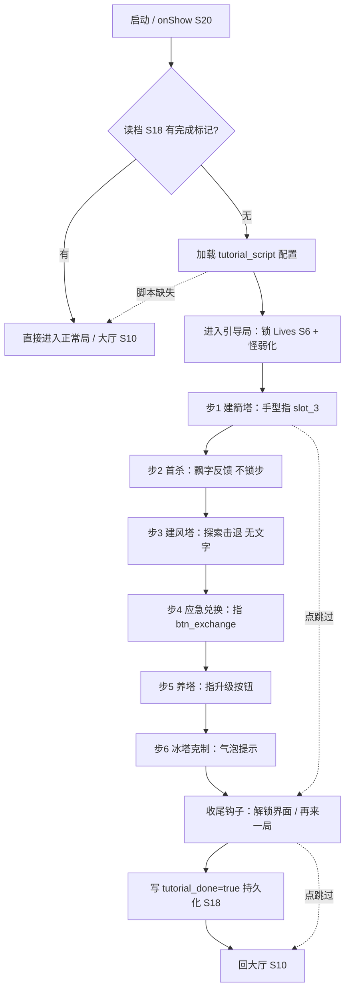
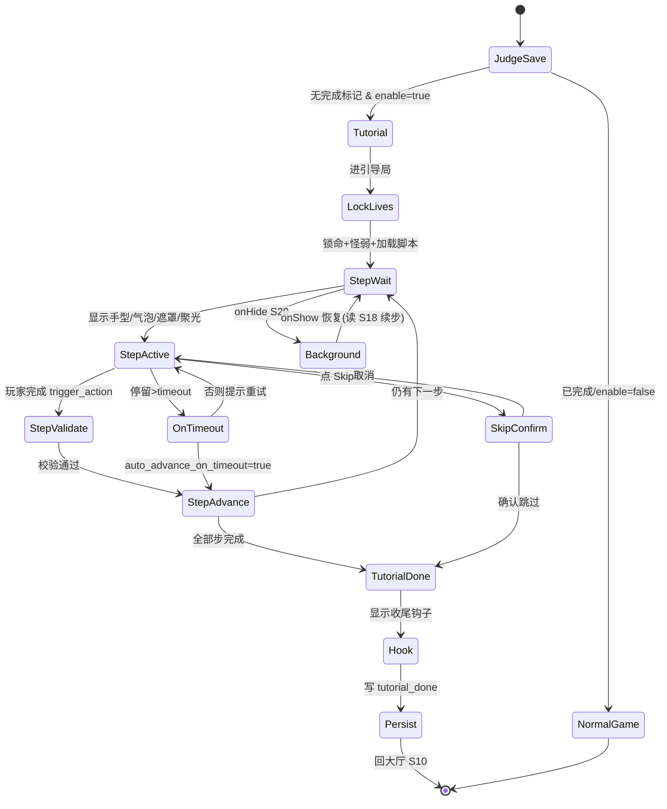
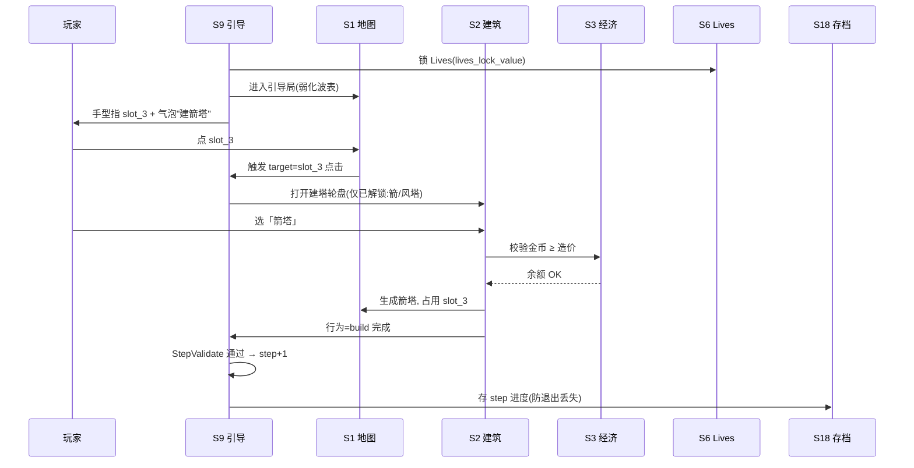

# 系统策划案：S9 新手引导系统 (Onboarding System)

> 归属域：B 元进度社交域 · 层级/优先级：MVP / P1 · 关联 F 码：F10 · 关联：GDD §7；SYSTEM_BREAKDOWN §S9
> 状态：v0.2-detailed · 日期 2026-07-17
> 设计基准：UI 750×1334（Cocos Creator 3.8.8 · 微信小游戏）· 安全区：顶部 y<88、底部 y>1290 不放置可点组件
> 数值约定：凡涉及成本/时长/奖励的调优量为 `[PLACEHOLDER]`，标注「调优杆」，禁止硬编码魔法数字。

---

## 1. 系统 UI 布局（层级 + 像素线框 + 组件表 + 交互流程图）

### 1.1 布局层级（覆盖战场场景 S1，引导层 z=59–62）

| 层级 z | 层名 | 说明 |
|---|---|---|
| 59 | 遮罩层 MaskLayer | 全屏半透明黑，非聚焦区压暗；聚焦区用「挖空聚光」透出 |
| 60 | 聚光挖空 Spotlight | 跟随当前步 `target` 的矩形/圆形挖空（代码 Mask 实现） |
| 60 | 保送提示 SafeTip | 顶部「本局不会失败」安心文案（Label，非图片） |
| 61 | 引导手型 HandGuide | 指向目标，脉冲动画，可叠加点击波纹 |
| 62 | 引导气泡 Bubble | 一句文案 +（可选）「知道了」 |
| 62 | 跳过按钮 SkipBtn | 右上角，常驻可跳过 |

> 引导层为 **Overlay（全屏节点）**，挂载在战斗场景 S1 之上；引导结束即 `destroy` 该节点，不残留。
> 微信小游戏无「强制视频广告式引导」「不可逆引导锁」——玩家任意时刻可点 SkipBtn 退出（SYSTEM_BREAKDOWN §S9 边界）。

### 1.2 像素级线框（750×1334，ASCII 原型，单位 px）

```
  0       150      300      450      600      750
  ┌──────────────────────────────────────────────┐ y=0
  │ [状态栏区 y<88 不遮挡：金/木/Lives/波次透出]      │
  │                                                │
  │                           (686,40)┌──┐          │ y=40   SkipBtn 64×64
  │                                  │⊘ │          │
  │        ┌────────────────────────────────┐      │ y=120
  │        │  Bubble 引导气泡 360×120         │      │
  │        │  "点这里建一座箭塔 →"           │      │
  │        └────────────────────────────────┘      │
  │                                                │
  │   ┌────────┐                                    │
  │   │ slot_3 │ ← Spotlight 挖空 120×120           │ y≈400 聚焦塔位
  │   │  (手型)│   HandGuide 80×80 脉冲             │
  │   └────────┘                                    │
  │         ↘ 手型位于 (slot_x-40, slot_y-100)       │
  │                                                │
  │   [战场 S1 渲染：环线/怪/塔，被 MaskLayer 压暗]   │
  │   [底部操作条 y≈1150：建塔轮盘/应急兑换/养塔 透出]    │
  │                                                │
  │   ┌──────────────────────────────────────┐     │ y=1250
  │   │  SafeTip "本局不会失败" 居中 Label      │     │ (y>1290 安全线之上)
  │   └──────────────────────────────────────┘     │
  └──────────────────────────────────────────────┘ y=1334
```

> 说明：聚焦挖空（`Spotlight`）坐标为 `target` 运行时计算；手型偏移 `-40,-100` 保证不挡住目标且可见；气泡优先置于目标**上方**，若上方空间不足（y<160）则置于**下方**。

### 1.3 组件表（精确坐标 / 尺寸 / 层级 / 响应）

| 组件 ID | 位置(x,y) | 尺寸(w×h) | z | 响应行为 | 备注 |
|---|---|---|---|---|---|
| MaskLayer | (0,0) | 750×1334 | 59 | 拦截非聚焦区点击；聚焦挖空区透传点击 | Graphics+Mask，alpha `[PLACEHOLDER]`0.6 |
| Spotlight | 跟随 target | 按 target | 60 | 无交互，纯视觉聚焦 | 圆/矩形由 `highlight_shape` 决定 |
| SafeTip | 居中 (225,1250) | 300×40 | 60 | 无交互 | Label，文案「本局不会失败」 |
| HandGuide | (target.x-40, target.y-100) | 80×80 | 61 | 脉冲动画；首次出现播落位 tween | 序列帧 `hand_pulse` |
| Bubble | 自适应(目标上方/下方) | 360×120 | 62 | 点「知道了」关闭当前文案（不跳步） | 九宫 `bubble_9` |
| SkipBtn | (686,40) | 64×64 | 62 | 点击 → 确认弹窗 → 终止引导 | 仅 `allow_skip=true` 显示 |

### 1.4 交互流程图（进入 → 引导步 → 收尾）



---

## 2. 逻辑功能（模块表 + 状态机 + 时序流程图 + 异常边界用例表）

### 2.1 模块表（触发条件 / 处理流程 / 输出）

| 模块 | 触发条件 | 处理流程 | 输出 |
|---|---|---|---|
| 引导启动判断 | 启动 / onShow | 读 `tutorial_done`(S18) → 未完且 `enable_tutorial` → 进引导局 | 进入引导 / 跳过 |
| 加载剧本 | 进入引导 | 读 `onboarding_config` + `tutorial_script` → 初始化 step 指针=1 | 剧本就绪 |
| 锁命保护 | 进入引导即生效 | 调 S6 锁定 Lives（值=`lives_lock_value`），怪物 HP/数量弱化到不可能漏 | 首波无失败 |
| 步骤推进 | 当前步 `trigger_action` 行为发生 | 校验玩家行为（build/upgrade/exchange/kill_first/place_tower）→ 通过 → step+1 | 进度++ |
| 探索发现 | 风塔建成（步3） | 不弹文字，靠击退飘字（S5）让玩家自悟「它在击退控制」 | 自发现标记 |
| 超时跳步 | 当前步停留 > `timeout` | 自动 `step+1` 或弹气泡提示重试（按 `auto_advance_on_timeout`） | 防卡死 |
| 收尾钩子 | 全部步完成 | 显示「解锁/再来一局」→ 写完成标记 → 路由 S10 | 引导完成 |
| 跳过 | 点 SkipBtn | 弹确认 → 终止引导 → 写 `tutorial_done`（或仅本次跳过可重看） | 退出引导 |

### 2.2 引导流程状态机（FSM · stateDiagram-v2）



### 2.3 时序流程图（核心步：建箭塔，跨系统协作）



### 2.4 异常与边界用例表（程序员可实现级）

| 用例ID | 异常类型 | 触发条件 | 预期处理流程 | 输出 / 兜底 | 涉及系统 |
|---|---|---|---|---|---|
| E01 | 切后台 S20 | 引导中 `onHide` | 暂停手型脉冲/遮罩动画与所有引导计时；触发 S18 存当前 step；`onShow` 回到 `StepWait` 原态 | 无计时推进、状态一致 | S20/S18 |
| E02 | 数据损坏 S18 | 读档 `tutorial` 字段损坏/解析失败 | 捕获异常 → 重置 `tutorial_done=false` 且 `step=1` → 重新进入引导 | 不崩，重引导；上报 S25 | S18/S25 |
| E03 | 配置缺失 | `tutorial_script` 文件缺失/某 step 必填字段非法 | 跳过非法 step；若整体脚本不可用 → 直接 `NormalGame`（跳过引导） | 用本地默认/跳引导；告警 S25 | S25 |
| E04 | 并发操作 | 连点 SkipBtn 或同帧多次点目标 | 防抖锁 `0.3s`（UI 层 `Button` 禁用 + 状态机 `isTransitioning`） | 仅首次生效，防重复跳步 | — |
| E05 | 数值极值 | `timeout` 配置为 0 / 负数 / 极大；`step` 索引越界 | `timeout` 钳制到 `[5,60]`；`step` 越界钳制到 `[1,max]` | 不卡死、不越界 | — |
| E06 | 微信登录失败 S42 | `wx.login` 失败 / 无 openid | 本期纯本地兜底：引导**不依赖**登录态，无 openid 也照常引导 | 引导零阻塞；登录态仅用于 S13 可选好友榜 | S42(暂不做) |
| E07 | 网络中断 | 引导收尾需拉远端配置(可选) | 引导本体纯本地；远端配置拉取失败用本地默认 `onboarding_config` | 不阻塞引导；降级本地 | S21 |
| E08 | 排行榜拉取超时 | 收尾钩子含「排行榜入口」(S13 增强) | 引导不强制拉榜；入口红点由 S10 异步处理，超时不影响引导结束 | 不适用/N/A，记录 | S13/S10 |
| E09 | 步骤卡死 | 玩家未按预期行为（如未点目标格） | `timeout` 到 → 按 `auto_advance_on_timeout` 自动跳步或气泡提示重试 | 防长时卡引导 | — |
| E10 | 强制退出/杀进程 | 引导中杀进程 | `onHide`/`beforeUnload` 已触发 S18 存 step；重进 `JudgeSave` 读 `step` 续引导 | 进度不丢 | S18 |

> 设计红线检查：无「主导策略」（引导为线性教学，不提供可刷资源路径）；无「认知过载」（每步仅 1 个决策，符合 P3 一指可玩）；无「支柱漂移」（引导服务 P2 养塔爽点前置）。

---

## 3. 配置表设计（完整字段 + 多行示例）

### 3.1 表 `onboarding_config`（引导全局开关）

| 字段 | 类型 | 取值/范围 | 默认值 | 说明 |
|---|---|---|---|---|
| enable_tutorial | bool | true/false | true | 总开关 |
| force_tutorial | bool | false | false | 测试用：每次强制重引导 |
| tutorial_level_id | string | 关联 S14/S1 | "lv_tutorial" | 引导专用弱化关卡 |
| lives_lock_value | int | 1–999 | `[PLACEHOLDER]` 99 | 引导局锁定 Lives 值 |
| tutorial_wave_count | int | 1–20 | `[PLACEHOLDER]` 8 | 引导局波数（保送） |
| show_skip_button | bool | true | true | 是否显示跳过 |
| auto_advance_on_timeout | bool | true | true | 超时自动跳步 |
| default_timeout | float | 5–60 | 30 | 单步默认超时(s) |
| complete_reddot_target | string | 入口 id | "signin" | 收尾钩子高亮入口(S10) |
| mask_alpha | float | 0.3–0.85 | 0.6 | 遮罩透明度 |

**示例（JSON）**
```json
{
  "enable_tutorial": true,
  "force_tutorial": false,
  "tutorial_level_id": "lv_tutorial",
  "lives_lock_value": 99,
  "tutorial_wave_count": 8,
  "show_skip_button": true,
  "auto_advance_on_timeout": true,
  "default_timeout": 30,
  "complete_reddot_target": "signin",
  "mask_alpha": 0.6
}
```

### 3.2 表 `tutorial_script`（分步剧本，逐行一条）

| 字段 | 类型 | 取值/范围 | 默认值 | 说明 |
|---|---|---|---|---|
| step_id | int | 1–N | — | 步序（唯一、递增） |
| target_type | enum | slot/button/tower_build/area/none | slot | 聚焦目标类型 |
| target_id | string | 塔位/按钮 id | "slot_3" | 聚焦对象（none=全屏气泡） |
| text | string | ≤30 字 | — | 气泡文案（探索步可为空） |
| trigger_action | enum | build/upgrade/exchange/kill_first/place_tower/tap/none | build | 完成触发行为 |
| lock_lives | bool | true | true | 本步是否保持锁命 |
| timeout | float | 5–60 | 30 | 卡死超时(s)，超用 `default_timeout` |
| highlight_shape | enum | circle/rect | rect | 聚光形状 |
| focus_w | int | 40–400 | 120 | 聚光宽 |
| focus_h | int | 40–400 | 120 | 聚光高 |
| allow_skip | bool | true | true | 本步可跳过 |
| is_explore | bool | false | false | 探索步（不弹文字，靠视觉） |
| hand_prefab | string | 手型动画 id | "hand_pulse" | 手型资源 |
| sfx_id | string | 音效 id/null | null | 步进入音效 |
| reward_on_complete | json | {type,amount}/null | null | 步完成奖励（一般 null） |
| next_step | int | step_id/null | null | 下一步（null=结束） |

**示例（CSV，含 6 步 + 探索步）**
```csv
step_id,target_type,target_id,text,trigger_action,lock_lives,timeout,highlight_shape,focus_w,focus_h,allow_skip,is_explore,hand_prefab,sfx_id,reward_on_complete,next_step
1,slot,slot_3,点这里建一座箭塔,build,true,30,rect,120,120,true,false,hand_pulse,sfx_build,null,2
2,none,,看到怪倒下，飘起木头啦,kill_first,true,30,none,0,0,true,false,hand_pulse,sfx_kill,null,3
3,slot,slot_wind,（不说话，看它击退）,place_tower,true,30,rect,120,120,true,true,hand_pulse,null,null,4
4,button,btn_exchange,点应急兑换，把金换成木（受限）,exchange,true,30,rect,160,80,true,false,hand_pulse,sfx_exchange,null,5
5,button,btn_upgrade,喂木养塔，看它变强,upgrade,true,30,rect,160,80,true,false,hand_pulse,sfx_upgrade,null,6
6,none,,冰塔能减速，记住它,top,tap,true,30,none,0,0,true,false,hand_pulse,sfx_tip,null,null
```

---

## 4. 美术资源需求（帧数 / 分辨率 / 格式 / 切片）

| 资源 | 用途 | 帧数 | 分辨率 | 格式 | 切片要求 |
|---|---|---|---|---|---|
| `hand_pulse` 引导手型 | 指示 + 脉冲 | 4 帧循环 | 单帧 80×80（图集 80×320 竖排） | PNG（含透明）/ 建议 plist 图集 | 4 等分竖排（80×80/帧），帧率 8fps；或代码 tween 缩放替代 |
| `bubble_9` 引导气泡 | 文案载体 | 静态 | 360×120 | PNG 九宫（3×3） | 九宫 3×3 切片，四角不动、中区拉伸 |
| `mask_alpha` 遮罩 | 聚焦压暗 | 静态 | 750×1334 | 推荐代码 Graphics+Mask（省包）；兜底 PNG 单图 | 单图，alpha 由 `mask_alpha` 控制；挖空用 Mask 组件 |
| `skip_icon` 跳过按钮 | 退出引导 | 静态(可选按下态 2 帧) | 64×64 | PNG | 单图；按下态叠 `skip_icon_p` 64×64 |
| `safe_tip` 保送提示 | 安心文案 | 文本(Label) | 300×40 | 不用图，用 Cocos Label | — |
| `spotlight` 聚光挖空 | 聚焦透出 | 代码 Mask | 按 target | 不用图，用 Mask 模板 | 圆/矩形由 `highlight_shape` |
| `reward_fly` 奖励飞入(可选) | 步完成反馈 | 6 帧 | 120×120 | PNG 图集 | 6 等分，飞入 0.4s |
| `confetti` 收尾礼花(可选) | 引导完成 | 8 帧 | 200×200 | PNG 图集 | 8 等分，0.6s 循环 1 次 |

> 引导资源轻量，优先主包（S19）；动画/音效详见 S23。未解锁态/剪影复用 S16 规范。
> 资源体积提示：遮罩与聚光强烈建议**代码实现**（Graphics + Mask），避免占用主包位图预算（微信主包 ≤4MB，见 S19）。
