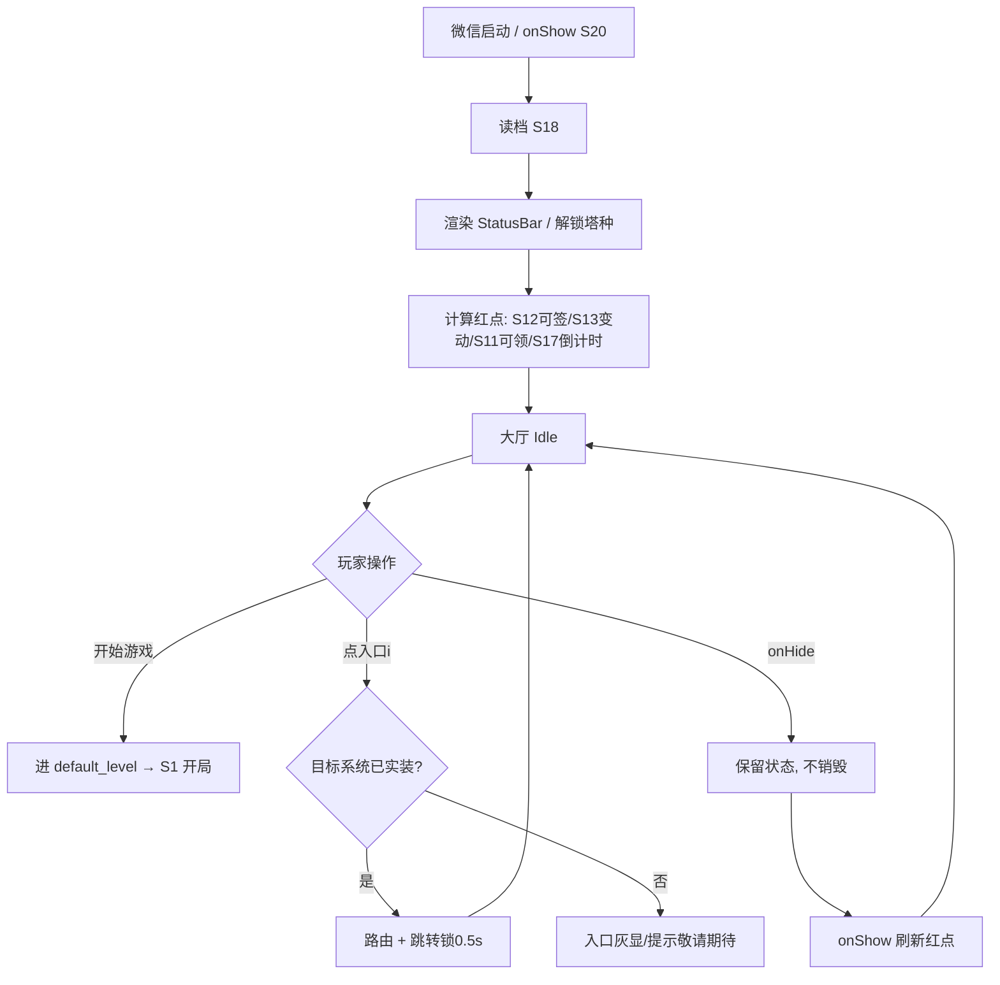
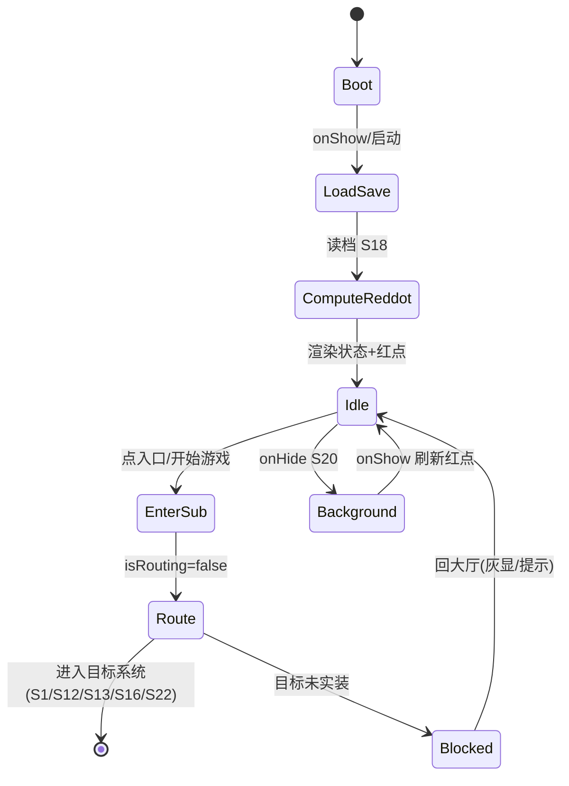
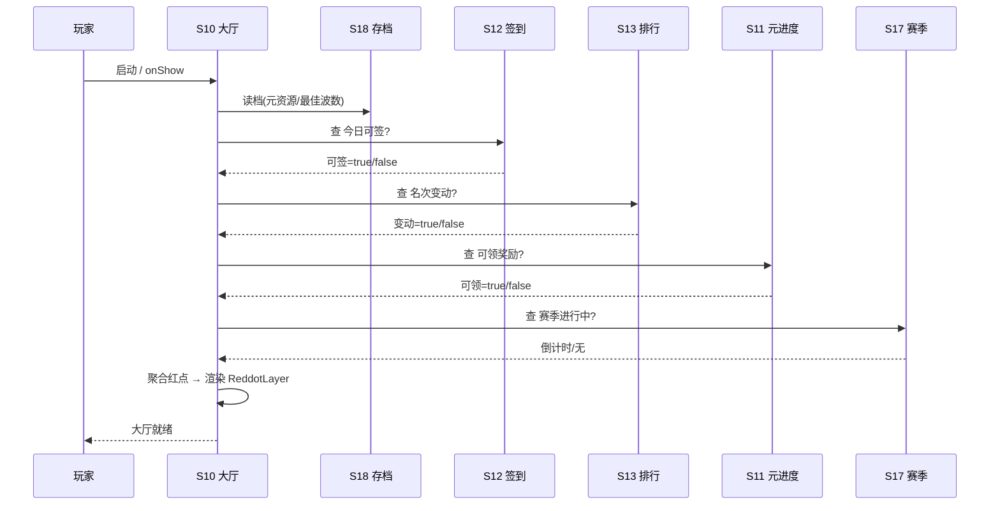

# 系统策划案：S10 大厅系统 (Hub / Lobby System)

> 归属域：B 元进度社交域 · 层级/优先级：MVP / P1 · 关联 F 码：（导航中枢）· 关联：SYSTEM_BREAKDOWN §S10
> 状态：v0.2-detailed · 日期 2026-07-17
> 设计基准：UI 750×1334（Cocos Creator 3.8.8 · 微信小游戏）· 安全区：顶部 y<88、底部 y>1290 不放置可点组件
> 数值约定：凡涉及成本/奖励/时长的调优量为 `[PLACEHOLDER]`，标注「调优杆」，禁止硬编码魔法数字。

---

## 1. 系统 UI 布局（层级 + 像素线框 + 组件表 + 交互流程图）

### 1.1 布局层级（菜单场景，z=0–50）

| 层级 z | 层名 | 说明 |
|---|---|---|
| 0 | 背景层 BgLayer | 大厅主题背景图 |
| 40 | 主按钮区 MainBtn | 「开始游戏」大按钮（主视觉，中部） |
| 40 | 功能入口栅格 EntryGrid | 底部横排图标：图鉴(S16)/排行(S13)/签到(S12)/设置(S22) |
| 45 | 状态条 StatusBar | 顶部：元进度资源、最佳波数、赛季倒计时 |
| 46 | 红点层 ReddotLayer | 各入口右上角红点（有可领/变动时显示） |

> 大厅是「下一局循环」启动器 + 所有留存系统集散地。从启动到「开始一局」≤3 点击（SYSTEM_BREAKDOWN §S10 验收）。
> 边界：不做大厅小游戏/装饰、不做社交广场（纯功能导向）。

### 1.2 像素级线框（750×1334，ASCII 原型，单位 px）

```
  0       150      300      450      600      750
  ┌──────────────────────────────────────────────┐ y=0
  │ [状态条 StatusBar 750×70  y=20]                │
  │  元资源:[PLACEHOLDER]  最佳波数:[N]  赛季▷[dd天] │
  │                                                │
  │            ┌─────────────────────┐             │ y=420
  │            │   开始游戏 300×120    │  MainBtn    │
  │            │   (375,480) 中心      │             │
  │            └─────────────────────┘             │ y=540
  │                                                │
  │         （中部留白：展示当前解锁塔种缩略/标语）   │ y≈700
  │                                                │
  │  ┌────┐   ┌────┐   ┌────┐   ┌────┐             │ y=1050
  │  │图鉴│   │排行│   │签到│   │设置│  EntryGrid    │
  │  │ ● │   │ ● │   │ ● │   │    │  96×96 ×4      │
  │  └────┘   └────┘   └────┘   └────┘ 红点●在右上  │ y=1146
  │  S16       S13      S12      S22                │
  └──────────────────────────────────────────────┘ y=1334
```

> 入口图标间距：4 图标 ×96 + 3 间距 ≈95，左侧距 40，右侧余 41，居中对称。红点位于图标右上角 (icon_x+84, icon_y-12)，24×24。

### 1.3 组件表（精确坐标 / 尺寸 / 层级 / 响应）

| 组件 ID | 位置(x,y) | 尺寸(w×h) | z | 响应行为 | 备注 |
|---|---|---|---|---|---|
| BgLayer | (0,0) | 750×1334 | 0 | 无交互 | `bg_theme` 指定 |
| StatusBar | (0,20) | 750×70 | 45 | 无交互，展示文本 | 元资源/最佳波数/赛季倒计时 |
| SeasonCD | (560,30) | 170×50 | 45 | 无交互；仅 S17 进行中显示 | 文案「赛季▷[dd天]」 |
| MainBtn | (225,420) | 300×120 | 40 | 点 → 进 `default_level`(S14) → S1 | 主视觉，呼吸态 |
| EntryGrid | (40,1050) 起横排 | 96×96 ×4 | 40 | 点 → 路由对应系统 | 间距 95 |
| EntryIcon(i) | (40+ i×191, 1050) | 96×96 | 40 | 路由 | i=0..3 |
| EntryLabel(i) | (40+ i×191, 1152) | 96×24 | 40 | 无交互，名称 | 图鉴/排行/签到/设置 |
| Reddot(i) | (icon_x+84, 1038) | 24×24 | 46 | 无交互；有可领/变动显示 | 依赖 S12/S13/S11 |
| SettingsIcon | (655,30) | 48×48 | 46 | 点 → S22（便捷入口，可选） | 与栅格设置重复时二选一 |

### 1.4 交互流程图（启动 → 大厅 → 跳转）



---

## 2. 逻辑功能（模块表 + 状态机 + 时序流程图 + 异常边界用例表）

### 2.1 模块表（触发条件 / 处理流程 / 输出）

| 模块 | 触发条件 | 处理流程 | 输出 |
|---|---|---|---|
| 大厅装载 | onShow/启动 | 读档(S18) → 取元资源/最佳波数/解锁态 → 渲染 | 大厅就绪 |
| 入口导航 | 点入口 | 查 `hub_config.entry_list` → 路由到目标系统(S12/S13/S16/S22/S1) | 跳转 |
| 红点计算 | 每次进入/onShow | 查 S12 可签 / S13 名次变动 / S11 可领 / S17 倒计时 | 红点态 |
| 开始游戏 | 点 MainBtn | 取 `default_level`(S14) → 载 map_id+wave → S1 | 开局 |
| 每日钩子 | 进入 | 显示签到红点 / 赛季倒计时(S17) | 回归提示 |
| 路由锁 | 跳转瞬间 | 置 `isRouting=true` 0.5s，防连点重复跳 | 防重复 |

### 2.2 大厅状态机（FSM · stateDiagram-v2）



### 2.3 时序流程图（红点刷新，跨系统）



### 2.4 异常与边界用例表（程序员可实现级）

| 用例ID | 异常类型 | 触发条件 | 预期处理流程 | 输出 / 兜底 | 涉及系统 |
|---|---|---|---|---|---|
| E01 | 切后台 S20 | 大厅 `onHide` | 不销毁场景，保留状态；`onShow` 重新 `ComputeReddot` 刷新红点 | 无状态丢失 | S20 |
| E02 | 数据损坏 S18 | 读档失败/解析异常 | 捕获 → 用默认空档（元资源=0、无解锁）进大厅 → 触发 S18 修复流程 | 不崩；资源显默认 | S18 |
| E03 | 目标系统未实装 | 增强系统(S12/S13/S16)未上 | 入口灰显或隐藏；点击提示「敬请期待」 | 不报错 | S12/S13/S16 |
| E04 | 路由失败 | 目标系统加载异常 | 回大厅 + 告警 S25 | 不卡死 | S25 |
| E05 | 快速连点入口 | 同帧多点 MainBtn/入口 | `isRouting` 锁 0.5s，仅首次跳转 | 防重复跳转 | — |
| E06 | 微信登录失败 S42 | `wx.login` 失败 | 大厅纯本地，不依赖登录；好友榜(S13)本地兜底 | 零阻塞 | S42(暂不做) |
| E07 | 网络中断 | 远端红点(可选)拉取失败 | 红点基于本地缓存/默认，不主动联网 | 不影响大厅 | S21 |
| E08 | 排行榜拉取超时 | S13 拉榜慢 | 大厅仅显红点，不主动拉榜；超时不影响本系统 | 不适用/N/A | S13 |
| E09 | 数值极值 | 元资源/最佳波数溢出显示 | 显示截断（如 `9999+`）；内部值不截断 | 显示安全 | — |
| E10 | 配置缺失 | `hub_config` 缺失/字段非法 | 用默认 `entry_list` + `default_level="lv_01"` | 可进大厅 | — |

> 设计红线检查：无主导策略（大厅为导航，无资源产出）；无认知过载（入口 ≤5，主按钮唯一）；无支柱漂移（服务 P5 短局长线留存）。

---

## 3. 配置表设计（完整字段 + 多行示例）

### 3.1 表 `hub_config`（大厅配置）

| 字段 | 类型 | 取值/范围 | 默认值 | 说明 |
|---|---|---|---|---|
| default_level | string | 关联 S14 | "lv_01" | 开始游戏默认关 |
| entry_list | json | 入口数组 | ["codex","rank","signin","setting"] | 入口顺序/可见（不含开始游戏） |
| show_reddot | bool | true | true | 是否显示红点 |
| bg_theme | string | 主题枚举 | "lobby_1" | 大厅背景 |
| max_click_interval | float | 0.2–1.0 | 0.5 | 路由锁时长(s) |
| show_season_cd | bool | true | true | 是否显赛季倒计时(S17) |
| status_fields | json | 展示字段 | ["meta_res","best_wave"] | 状态条字段 |
| entry_label_map | json | 入口→名 | {"codex":"图鉴",...} | 入口名称映射 |

**示例（JSON）**
```json
{
  "default_level": "lv_01",
  "entry_list": ["codex","rank","signin","setting"],
  "show_reddot": true,
  "bg_theme": "lobby_1",
  "max_click_interval": 0.5,
  "show_season_cd": true,
  "status_fields": ["meta_res","best_wave"],
  "entry_label_map": {"codex":"图鉴","rank":"排行","signin":"签到","setting":"设置"}
}
```

### 3.2 表 `reddot_config`（红点规则，驱动 ReddotLayer）

| 字段 | 类型 | 取值/范围 | 默认值 | 说明 |
|---|---|---|---|---|
| rule_id | string | 唯一 | "signin" | 规则主键 |
| source_system | enum | S11/S12/S13/S17 | S12 | 来源系统 |
| condition | string | 表达式 | "signin.today_claimable==true" | 红点条件 |
| target_entry | string | 入口 id | "signin" | 绑定入口 |
| priority | int | 1–9 | 1 | 多红点优先级 |

**示例（CSV）**
```csv
rule_id,source_system,condition,target_entry,priority
rd_signin,S12,signin.today_claimable==true,signin,1
rd_rank,S13,rank.overtaken==true,rank,2
rd_meta,S11,meta.claimable_reward>0,codex,3
rd_season,S17,season.countdown<=3d,signin,4
```

---

## 4. 美术资源需求（帧数 / 分辨率 / 格式 / 切片）

| 资源 | 用途 | 帧数 | 分辨率 | 格式 | 切片要求 |
|---|---|---|---|---|---|
| `lobby_bg` 大厅背景 | 场景底 | 静态 | 750×1334（≤300KB） | JPG/PNG（压缩） | 单图，不切片；建议 JPG 省包 |
| `btn_start` 开始游戏 | 主操作 | 静态(呼吸 2 帧可选) | 300×120 | PNG（含透明） | 九宫 3×3；呼吸用代码 scale tween |
| `entry_icon_*` 入口图标×4 | 导航 | 静态(按下态 2 帧) | 96×96 | PNG | 单图；按下态 `entry_icon_*_p` 96×96 |
| `reddot` 红点 | 提示 | 静态 | 24×24 | PNG | 单图（红圆） |
| `status_bar` 状态条底 | 顶条 | 静态 | 750×70 | PNG 九宫 | 3×3 切片，横向拉伸 |
| `season_cd` 赛季倒计时底 | 提示 | 静态 | 170×50 | PNG 九宫 | 3×3 切片 |
| `hub_title` 标题(可选) | 品牌 | 静态 | 400×80 | PNG（含透明） | 单图 |
| `unlock_tower_thumb` 解锁塔缩略 | 中部展示 | 静态 | 80×80 ×N | PNG 图集 | 按塔数切片，复用 S16 图标 |

> 大厅资源主包或首分包（S19）；按钮动效/音效见 S23。多语言/字号适配由 S22 设置驱动。
