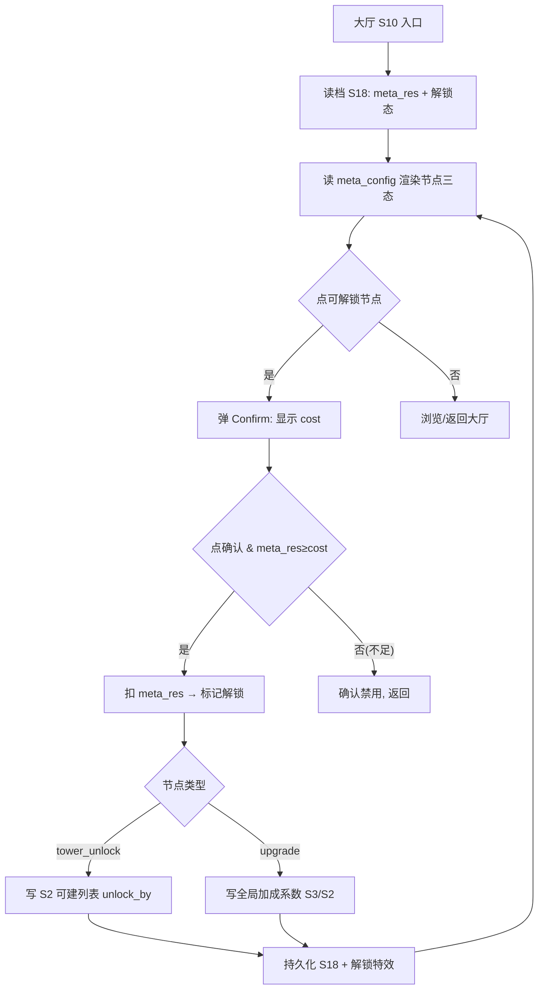
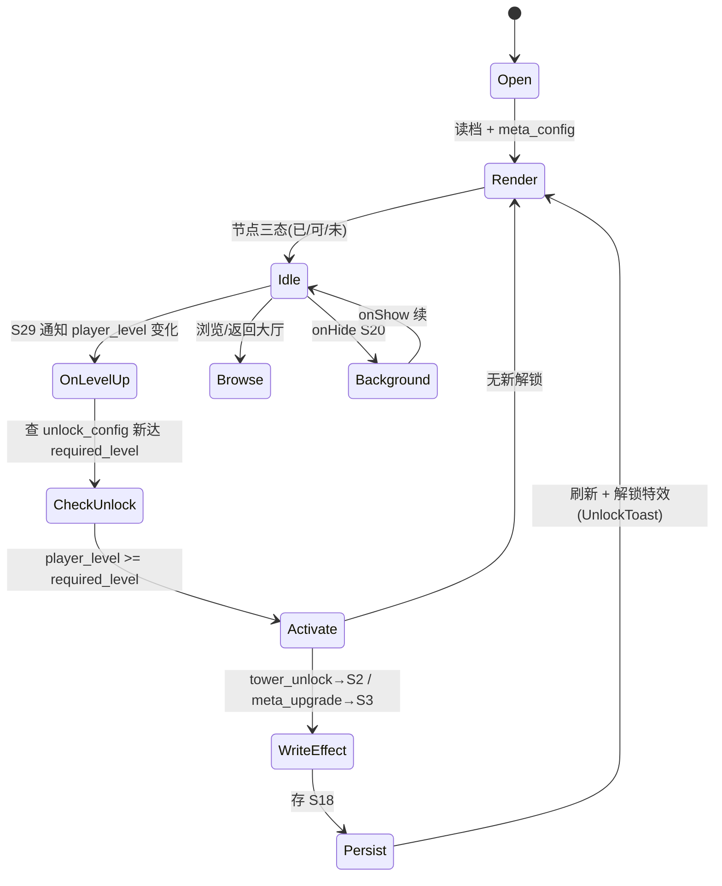
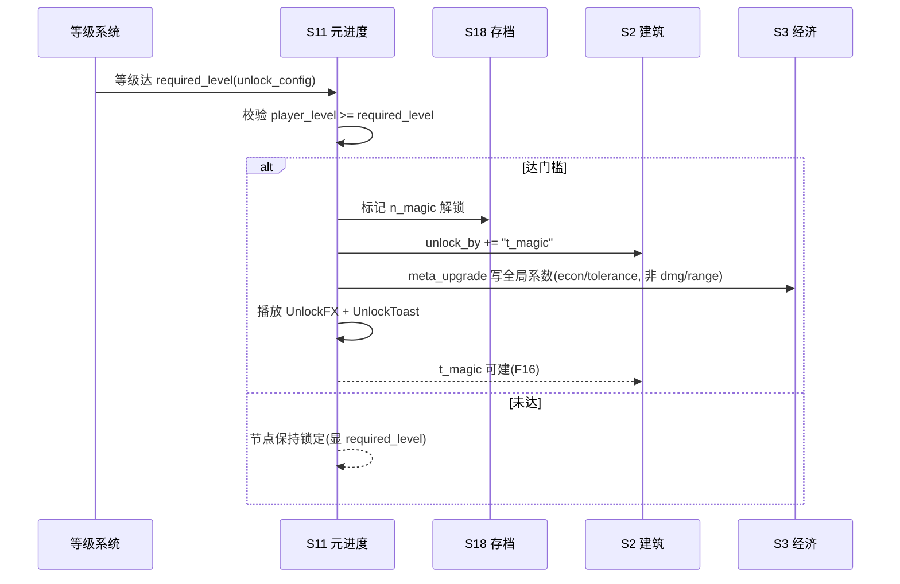

# 系统策划案：S11 解锁 / 元进度系统 (Unlock / Meta Progression)

> 归属域：B 元进度社交域 · 层级/优先级：增强 / P2 · 关联 F 码：F13 F16 · 关联：SYSTEM_BREAKDOWN §S11
> 状态：v0.2-detailed · 日期 2026-07-17
> 设计基准：UI 750×1334（Cocos Creator 3.8.8 · 微信小游戏）· 安全区：顶部 y<88、底部 y>1290 不放置可点组件
> 数值约定：凡涉及成本/产出/加成数值的调优量为 `[PLACEHOLDER]`，标注「调优杆」，禁止硬编码魔法数字。
> 合规边界：不做付费直购数值（S26 带开关，default off）；不做随机抽卡（确定性解锁，见 SYSTEM_BREAKDOWN §S11）。
> **v0.2（S29 等级驱动解锁）**：本系统解锁门槛改为由 **S29 玩家等级**驱动——达到 `unlock_config.required_level`（S29）即解锁对应功能（塔种/永久升级/系统入口），**原资源花费解锁改为等级门槛，meta_res 解锁语义 TBD**（见 S29 §5.3）。`meta_upgrade` 节点主题改为经济/容错类（start_gold / leak_tolerance / wood_gain），避免与 S29 等级加成(dmg/range/atk_speed)在战斗基础属性上双重计算。

---

## 1. 系统 UI 布局（层级 + 像素线框 + 组件表 + 交互流程图）

### 1.1 布局层级（元进度场景，z=0–55）

| 层级 z | 层名 | 说明 |
|---|---|---|
| 0 | 背景层 BgLayer | 元进度主题背景 |
| 40 | 分类标签 TabBar | 顶部：解锁树 / 塔解锁 / 升级树 切换 |
| 40 | 树视图 TreeView | 中部可滚：节点图，三态（已/可/未） |
| 45 | 元货币条 MetaBar | 顶部：当前元资源数值 |
| 46 | 返回按钮 BackBtn | 左上返回大厅 |
| 55 | 确认弹窗 Confirm | 花元资源解锁 → 确认 [OBSOLETE-待定: 解锁已改由 S29 等级门槛驱动，meta_res 旧花费语义 TBD] |
| 56 | 解锁成功特效 | 节点激活金光 |

> 元货币与局内金/木**分离**（独立容器 `meta_res`）。解锁为确定性（非抽卡）。

### 1.2 像素级线框（750×1334，ASCII 原型，单位 px）

```
  0       150      300      450      600      750
  ┌──────────────────────────────────────────────┐ y=0
  │ (20,40)⟲返回   元资源:[PLACEHOLDER]  MetaBar    │ y=40   BackBtn 64×64
  │ ┌──────┐┌──────┐┌──────┐  TabBar 750×60       │ y=120
  │ │解锁树││塔解锁││升级树│                            │
  │ └──────┘└──────┘└──────┘                          │ y=180
  │   ┌────┐      ┌────┐                             │ y=240
  │   │n_魔 │─────│n_毒 │                            │ TreeView 节点120×120
  │   └────┘      └────┘                             │
  │        │             │                          │
  │   ┌────┐      ┌────┐ ┌────┐                     │ y=420
  │   │n_电 │      │dmg │ │rng │                     │
  │   └────┘      └────┘ └────┘                     │
  │   （可滚，连接线矢量）                            │
  │                                                │
  │        ┌────────────────────┐                  │ y=547 Confirm 360×240
  │        │ 确认解锁 n_魔？      │                  │
  │        │ 消耗 元资源 [C]      │                  │
  │        │ [取消]      [确认]   │                  │
  │        └────────────────────┘                  │
  └──────────────────────────────────────────────┘ y=1334
```

> [OBSOLETE-待定] 上方线框中的"确认解锁 n_魔？ 消耗 元资源 [C]"为旧资源花费解锁路径(a) UI；新路径(b)由 S29 等级门槛驱动，解锁确认弹窗不再显示"消耗元资源"，meta_res 旧花费语义 TBD。

### 1.3 组件表（精确坐标 / 尺寸 / 层级 / 响应）

| 组件 ID | 位置(x,y) | 尺寸(w×h) | z | 响应行为 | 备注 |
|---|---|---|---|---|---|
| BgLayer | (0,0) | 750×1334 | 0 | 无交互 | — |
| BackBtn | (20,40) | 64×64 | 46 | 点 → 回 S10 | — |
| MetaBar | (100,40) | 630×60 | 45 | 无交互，实时 | 显示 `meta_res` |
| TabBar | (0,120) | 750×60 | 40 | 切分类(解锁树/塔解锁/升级树) | 3 标签等分 |
| TreeView | (0,200) | 750×950 | 40 | 可滚，点节点 | ScrollView |
| Node(i) | 网格(间距 [PLACEHOLDER]140) | 120×120 | 40 | 点可解锁→Confirm | 三态色 |
| TowerCard(j) | 子页网格 | 200×260 | 40 | 显条件/进度 | 塔解锁子页 |
| Confirm | (195,547) | 360×240 | 55 | 取消/确认扣费 [OBSOLETE-待定: 旧扣费语义 TBD，新路径不扣费] | 居中 |
| UnlockFX | 节点中心 | 240×240 | 56 | 播放 0.5s 金光 | 一次性 |

### 1.4 交互流程图（大厅 → 元进度 → 解锁）



---

## 2. 逻辑功能（模块表 + 状态机 + 时序流程图 + 异常边界用例表）

### 2.1 模块表（触发条件 / 处理流程 / 输出）

| 模块 | 触发条件 | 处理流程 | 输出 |
|---|---|---|---|
| 元货币容器 | 读档(S18) | 初始化 `meta_res`（与局内金木分离） | 可读 |
| 入账 | S8 结算 / S12 签到 / S15 成就 | `meta_res += amount` → 持久化(S18) | 元资源↑ |
| 解锁判定 | S29 等级达 `required_level` | 校验 `player_level ≥ required_level` → 标记解锁（不扣资源；资源货币 TBD） | 节点激活 |
| 塔种解锁 | S29 等级达 `required_level`(tower) | 写 S2 可建列表(`unlock_by`) | 新塔可建(F16) |
| 永久升级 | S29 等级达 `required_level`(meta_upgrade) | 写全局加成系数(起始金币/漏怪容错/木头产出，非 dmg/range/atk_speed 以免与 S29 双重计算) | 局内生效(S2/S3) |
| 树渲染 | 进元进度页 | 读 `meta_config` + `unlock_config`(S29) + 解锁态 → 节点三态(由 player_level 决定) | 列表态 |

### 2.2 解锁流程状态机（FSM · stateDiagram-v2）



### 2.3 时序流程图（解锁塔种，跨系统）



### 2.4 异常与边界用例表（程序员可实现级）

| 用例ID | 异常类型 | 触发条件 | 预期处理流程 | 输出 / 兜底 | 涉及系统 |
|---|---|---|---|---|---|
| E01 | 切后台 S20 | 元进度页 `onHide` | 存解锁态(S18)；`onShow` 续原树位置 | 无丢失 | S20/S18 |
| E02 | 数据损坏 S18 | `meta_res`/解锁态字段损坏 | 重置为初始（仅首发 4 塔解锁，`meta_res=0`）→ 重渲染 | 不崩，可重玩 | S18 |
| E03 | 元资源不足 [OBSOLETE-待定: 旧路径(a)语义；解锁已改由 S29 等级门槛驱动，meta_res 旧花费语义 TBD] | `meta_res < cost` | 节点灰显，Confirm 确认按钮禁用 | 不可误扣 | — |
| E04 | 重复解锁 | 点已解锁节点 | 节点锁定态，不接受二次点击 | 不重复扣费 | — |
| E05 | 升级节点冲突 | 同层多支 / `pre_req` 未满足 | 树结构保证：未满足 `pre_req` 节点不可点；同层多支独立 | 结构正确 | — |
| E06 | 持久化失败 [OBSOLETE-待定: 旧路径(a)回滚"扣减 meta_res"语义；新路径(b)不扣 meta_res，仅标记解锁态，回滚语义 TBD] | 写 S18 异常 | 回滚扣减（`meta_res` 复原、解锁标记撤销）→ 告警 S25 | 可重试 | S25 |
| E07 | 微信登录失败 S42 | `wx.login` 失败 | 元进度纯本地，不依赖登录态 | 零阻塞 | S42(暂不做) |
| E08 | 网络中断 | — | 元进度纯本地，无网络依赖；入账来源(S8/S12/S15)均本地 | 不适用/N/A | — |
| E09 | 数值极值 | `cost≤0` / `meta_res` 溢出 | `cost≤0` 视为免费解锁；`meta_res` 上限 `[PLACEHOLDER]` 钳制 | 不卡死 | — |
| E10 | 配置缺失 | `meta_config` 缺节点/字段非法 | 该节点不显示；默认仅首发 4 塔可用 | 可进页 | S25 |
| E11 | 并发解锁 | 连点 Confirm | `isUnlocking` 锁 0.3s，防双扣 | 仅一次扣费 | — |

> 设计红线检查：无主导策略（解锁树为长线目标，无单点最优刷资源）；无认知过载（节点三态清晰、单一确认）；无支柱漂移（服务 P5 跨局变强留存）。

---

## 3. 配置表设计（完整字段 + 多行示例）

### 3.1 表 `meta_config`（元进度节点）

| 字段 | 类型 | 取值/范围 | 默认值 | 说明 |
|---|---|---|---|---|
| node_id | string | 唯一 | — | 节点主键 |
| type | enum | tower_unlock/upgrade | tower_unlock | 节点类型 |
| required_level | int | 1–[PLACEHOLDER] | [PLACEHOLDER] | **解锁所需玩家等级（S29 门槛，调优杆）**；达此级即解锁 |
| cost | int | 0–9999 | `[PLACEHOLDER]` | 解锁花费元资源（**TBD：原资源解锁已改为等级门槛，meta_res 解锁语义待定**） |
| unlock_target | string | tower_id/加成键 | "t_magic" | 解锁对象（t_magic/t_poison/t_thunder/start_gold_mult/leak_tolerance/wood_gain_mult） |
| effect_value | float | 按类型 | 0.1 | 升级数值（如 +10% 伤害，调优杆） |
| pre_req | string | 节点 id/null | null | 前置节点（未满足不可点） |
| tree_layer | int | 1–10 | 1 | 树层 |
| grid_x | int | 0–N | 0 | 树视图列坐标 |
| grid_y | int | 0–N | 0 | 树视图行坐标 |
| icon_id | string | 图标资源 id | "node_magic" | 节点图标 |
| desc | string | ≤20 字 | — | 节点说明 |

**示例（CSV，含 3 塔解锁 + 3 升级节点）**
```csv
node_id,type,required_level,cost,unlock_target,effect_value,pre_req,tree_layer,grid_x,grid_y,icon_id,desc
n_magic,tower_unlock,[PLACEHOLDER],[PLACEHOLDER]500,t_magic,0,null,1,0,0,node_magic,解锁魔法塔
n_poison,tower_unlock,[PLACEHOLDER],[PLACEHOLDER]800,t_poison,0,null,1,2,0,node_poison,解锁毒塔
n_thunder,tower_unlock,[PLACEHOLDER],[PLACEHOLDER]1200,t_thunder,0,null,1,4,0,node_thunder,解锁电塔
n_gold1,upgrade,[PLACEHOLDER],[PLACEHOLDER]300,start_gold_mult,[PLACEHOLDER],n_magic,2,1,2,node_gold,起始金币+%
n_lives1,upgrade,[PLACEHOLDER],[PLACEHOLDER]300,leak_tolerance,[PLACEHOLDER],n_poison,2,3,2,node_lives,漏怪容错+Lives
n_wood1,upgrade,[PLACEHOLDER],[PLACEHOLDER]400,wood_gain_mult,[PLACEHOLDER],n_thunder,2,5,2,node_wood,木头产出+%
```

### 3.2 表 `meta_source_config`（入账来源映射）

| 字段 | 类型 | 取值/范围 | 默认值 | 说明 |
|---|---|---|---|---|
| source_id | string | 唯一 | "settle_win" | 来源主键 |
| source_type | enum | settlement/signin/achievement | settlement | 来源系统 |
| target_system | string | S8/S12/S15 | S8 | 产出系统 |
| amount_formula | string | 表达式 | "win_wave*2" | 元资源公式（调优杆） |
| enabled | bool | true | true | 是否启用 |

**示例（CSV）**
```csv
source_id,source_type,target_system,amount_formula,enabled
settle_win,settlement,S8,win_wave*2,true
settle_lose,settlement,S8,floor(win_wave*0.5),true
signin_daily,signin,S12,day_reward_meta,true
ach_firstkill,achievement,S15,10,true
```

---

## 4. 美术资源需求（帧数 / 分辨率 / 格式 / 切片）

| 资源 | 用途 | 帧数 | 分辨率 | 格式 | 切片要求 |
|---|---|---|---|---|---|
| `meta_bg` 元进度背景 | 场景底 | 静态 | 750×1334 | JPG/PNG(压缩) | 单图 |
| `node_icon_*` 节点图标 | 节点 | 静态(三态各 1 帧) | 120×120 | PNG（含透明） | 三态：`_locked`(灰)/`_available`(描金)/`_done`(彩)；单图 |
| `tower_card` 塔解锁卡 | 展示 | 静态 | 200×260 | PNG 九宫 | 3×3 切片 |
| `confirm_dialog` 确认弹窗 | 操作 | 静态 | 360×240 | PNG 九宫 | 3×3 切片 |
| `unlock_fx` 解锁成功特效 | 反馈 | 12 帧 | 240×240 | PNG 图集 | 12 等分，0.5s 一次 |
| `tree_line` 连接线 | 树结构 | 静态 | 矢量(代码绘制) | — | 用 Graphics/Line 绘制，免切片 |
| `tab_bar` 分类标签底 | 导航 | 静态 | 750×60 | PNG 九宫 | 3×3 切片，横向拉伸 |
| `meta_bar` 元货币条底 | 顶条 | 静态 | 630×60 | PNG 九宫 | 3×3 切片 |

> 节点图标三态可复用 S16 塔图标着色；特效见 S23。资源走主包或首分包（S19）。
