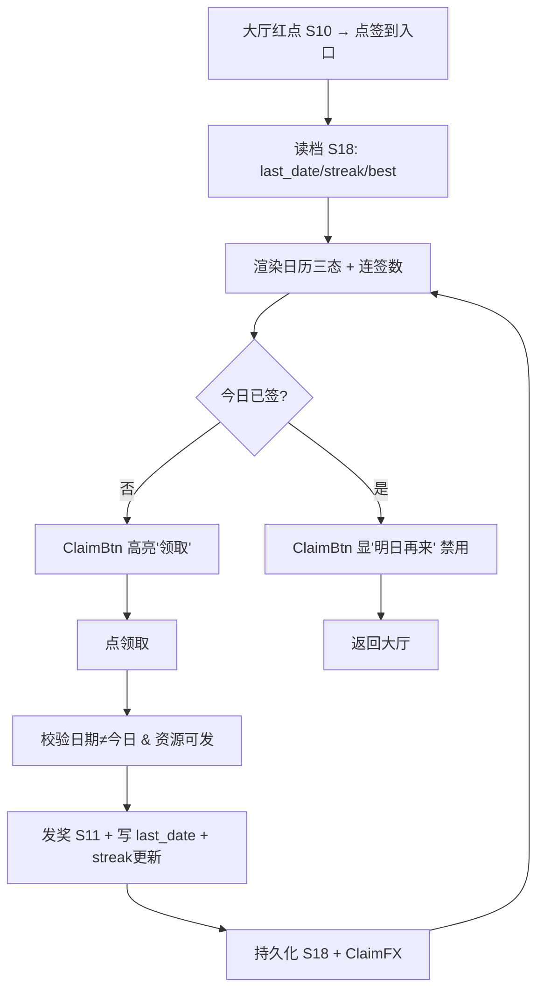
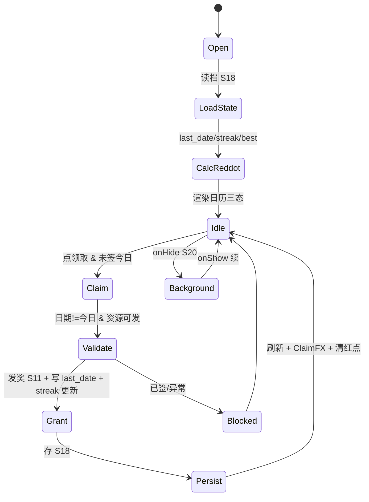

# 系统策划案：S12 签到系统 (Check-in System)

> 归属域：B 元进度社交域 · 层级/优先级：增强 / P2 · 关联 F 码：F14 · 关联：SYSTEM_BREAKDOWN §S12
> 状态：v0.3-ai-readable · 日期 2026-07-17
> 设计基准：UI 750×1334（Cocos Creator 3.8.8 · 微信小游戏）· 安全区：顶部 y<88、底部 y>1290 不放置可点组件
> 数值约定：凡涉及奖励内容/大奖/补签规则的调优量为 `[PLACEHOLDER]`，标注「调优杆」，禁止硬编码魔法数字。
> 合规边界：不做强制看广告才能签（合规风险）；不做签到排行榜（见 SYSTEM_BREAKDOWN §S12）。

---

## 0. 元数据头

- 归属域：B 元进度社交域
- 层级 / 优先级：增强 / P2
- 关联 F 码：F14
- 关联文档：SYSTEM_BREAKDOWN §S12
- 依赖系统：S11（元进度入账）、S18（存档）、S10（大厅红点）、S20（生命周期）、S25（告警）、S42（登录，暂不做）
- 设计基准：UI 750×1334（Cocos Creator 3.8.8 · 微信小游戏）· 安全区：顶部 y<88、底部 y>1290 不放置可点组件
- NEEDS-DESIGN 索引：无（本系统所有 `[PLACEHOLDER]` 已在 balance/S12_checkin.json 给初值）

---

## 1. 系统 UI 布局（层级 + 像素线框 + 组件表 + 交互流程图）

### 1.1 布局层级（签到页，z=0–55）

| 层级 z | 层名 | 说明 |
|---|---|---|
| 0 | 背景层 BgLayer | 签到主题背景 |
| 40 | 标题 Title | 「每日签到」 |
| 40 | 连签计数 StreakBar | 「连续签到 [N] 天 / 最高 [M]」 |
| 40 | 签到日历 Calendar | 7 格横排，已签勾/今日高亮/未签灰；第 7 格大奖金边 |
| 40 | 领取按钮 ClaimBtn | 今日可领时高亮，已领显「明日再来」 |
| 46 | 返回 BackBtn | 左上回大厅 |
| 55 | 领取特效 ClaimFX | 奖励飞入 |

> 入口来自大厅红点（S10）→ 本页 → 领取 → 入账 S11。

### 1.2 像素级线框（750×1334，ASCII 原型，单位 px）

```
  0       150      300      450      600      750
  ┌──────────────────────────────────────┐ y=0
  │ (20,40)⟲返回        每日签到         │ y=40  BackBtn 64×64
  │           连续签到 [N] 天 / 最高 [M]   │ y=140 StreakBar
  │  ┌──┐┌──┐┌──┐┌──┐┌──┐┌──┐┌══┐       │ y=450 Calendar 90×90
  │  │✓ ││✓ ││  ││  ││  ││  ││★ │       │       ★=第7日大奖金边
  │  │D1││D2││D3││D4││D5││D6││D7│       │
  │  └──┘└──┘└──┘└──┘└──┘└──┘└══┘       │ y=540
  │                                                │
  │        ┌────────────────────┐                  │ y=900 ClaimBtn 300×96
  │        │   领取 (今日可领)    │                  │
  │        │   或 明日再来        │                  │
  │        └────────────────────┘                  │
  └──────────────────────────────────────┘ y=1334
```

### 1.3 组件表（精确坐标 / 尺寸 / 层级 / 响应）

| 组件 ID | 位置(x,y) | 尺寸(w×h) | z | 响应行为 | 备注 |
|---|---|---|---|---|---|
| BgLayer | (0,0) | 750×1334 | 0 | 无交互 | — |
| BackBtn | (20,40) | 64×64 | 46 | 点 → 回 S10 | — |
| Title | (225,40) | 300×60 | 40 | 无交互 | 文本 |
| StreakBar | (40,140) | 670×50 | 40 | 无交互 | 连签/最高 |
| Cell(i) | (40+i×97, 450) | 90×90 | 40 | 无交互，显状态 | i=0..6（第 6 为大奖） |
| CellDay7 | (40+6×97, 450) | 90×90 | 40 | 金边特殊态 | `day7_bonus` |
| ClaimBtn | (225,900) | 300×96 | 40 | 点 → 领 → 入账(S11) | 可领/已领态 |
| ClaimFX | (375,750) | 200×200 | 55 | 奖励飞入 0.5s | 一次性 |

### 1.4 交互流程图（大厅红点 → 签到 → 领取）



---

## 2. 逻辑功能（模块表 + 状态机 + 时序流程图 + 异常边界用例表）

### 2.1 模块表（触发条件 / 处理流程 / 输出）

| 模块 | 触发条件 | 处理流程 | 输出 |
|---|---|---|---|
| 签到状态 | 读档(S18) | 取 `last_signin_date` / `streak` / `best` → 红点态 | 日历三态 |
| 每日领取 | 点领取且未签 | 校验日期≠今日 → 发奖(S11) → 写今日/`streak+1` | 奖励↑ |
| 连签机制 | 领取时 | 昨日签→`streak+1`；否则 `streak=1`（或 `keep_best` 保留最高） | 连续数 |
| 断签处理 | 今日非连续 | `streak` 重置（保留 `best` 降挫败） | 连续数更新 |
| 补签 | （可选 `allow_makeup`） | 消耗资源补签 → 补发当日奖励 | 补发 |

### 2.2 签到流程状态机（FSM · stateDiagram-v2）



### 2.3 时序流程图（领取发奖，跨系统）

```mermaid
sequenceDiagram
    participant P as 玩家
    participant S12 as S12 签到
    participant S18 as S18 存档
    participant S11 as S11 元进度
    participant S10 as S10 大厅
    P->>S12: 点领取
    S12->>S18: 读 last_signin_date
    S18-->>S12: last_date
    alt 今日未签 & 日期合法
        S12->>S11: 入账 day_reward[今日序号]
        S11-->>S12: 入账成功
        S12->>S18: last_date=今日; streak 更新; best=max
        S12->>S10: 清除签到红点
        S12-->>P: ClaimFX + 日历刷新
    else 已签/非法
        S12-->>P: 禁用领取, 提示
    end
```

### 2.4 异常与边界用例表（程序员可实现级）

| 用例ID | 异常类型 | 触发条件 | 预期处理流程 | 输出 / 兜底 | 涉及系统 |
|---|---|---|---|---|---|
| E01 | 切后台 S20 | 签到页 `onHide` | 存签到态(S18)；`onShow` 续原日历 | 无丢失 | S20/S18 |
| E02 | 数据损坏 S18 | 无签到字段/损坏 | 初始化默认(`last_date=null`,`streak=0`,`best=0`) | 不崩，可重新签 | S18 |
| E03 | 已签今日 | 点领取且 `last_date==今日` | ClaimBtn 禁用，不重复发 | 防双发 | — |
| E04 | 日期跨日/时区 | 跨 0 点 / 时区差异 | 以**本地 0 点**切日，日期用 `yyyy-mm-dd` 本地串；防重复 | 切日正确 | — |
| E05 | 奖励发放失败 | S11 入账异常 | 回滚 `last_date`/标记 → 告警 S25 → 可重试 | 不丢奖励 | S25 |
| E06 | 微信登录失败 S42 | `wx.login` 失败 | 签到纯本地，不依赖登录态 | 零阻塞 | S42(暂不做) |
| E07 | 网络中断 | — | 签到纯本地，无网络依赖 | 不适用/N/A | — |
| E08 | 排行榜拉取超时 | — | 签到无榜，不相关 | 不适用/N/A | — |
| E09 | 数值极值 | `streak` 溢出 / `cycle_days` 变更 | `streak` 上限钳制 value_ref: balance/S12_checkin.json#chk_streak_cap；`day_reward` 索引越界取末日/循环 | 不卡死 | — |
| E10 | 配置缺失 | `checkin_config` 缺失 | 用默认 7 日循环 + 默认奖励 | 可进页 | S25 |
| E11 | 并发领取 | 连点 ClaimBtn | `isClaiming` 锁 0.3s，防双发 | 仅一次发奖 | — |
| E12 | 跨周期重置 | 月度/周期切换 | 按 `keep_best`：保留 `best`，`streak` 按规则重置或延续 | 降挫败 | — |

> 设计红线检查：无主导策略（签到为日常习惯锚定，无刷资源循环）；无认知过载（单按钮领取）；无支柱漂移（服务 P5 留存）。

---

## 3. 配置表设计（完整字段 + 多行示例）

### 3.1 表 `checkin_config`（签到配置）

| 字段 | 类型 | 取值/范围 | 默认值 | 说明 |
|---|---|---|---|---|
| cycle_days | int | 7 / 30 | 7 | 循环天数 |
| day_reward | json | 每日奖励数组 | [value_ref: balance/S12_checkin.json#chk_day1_reward, value_ref: balance/S12_checkin.json#chk_day2_reward, value_ref: balance/S12_checkin.json#chk_day3_reward, value_ref: balance/S12_checkin.json#chk_day4_reward, value_ref: balance/S12_checkin.json#chk_day5_reward, value_ref: balance/S12_checkin.json#chk_day6_reward, value_ref: balance/S12_checkin.json#chk_day7_reward] | 第 n 日奖励（元资源/木，调优杆） |
| day7_bonus | int | >日常 | value_ref: balance/S12_checkin.json#chk_day7_bonus | 第 7 日大奖（调优杆） |
| keep_best | bool | true | true | 断签保留最高连 |
| allow_makeup | bool | false | false | 是否补签 |
| makeup_cost | json | 补签消耗 | null | 补签资源（enable 时） |
| reset_rule | enum | daily/weekly/cycle | cycle | streak 重置节奏 |
| reddot_on_newday | bool | true | true | 新一天亮红点 |
| reward_type | enum | meta_res/wood | meta_res | 奖励币种（接 S11/S3） |

**示例（JSON，终值以 balance/S12_checkin.json 为准）**
```json
{
  "cycle_days": 7,
  "day_reward": [10,15,20,25,30,40,100],
  "day7_bonus": 100,
  "keep_best": true,
  "allow_makeup": false,
  "makeup_cost": null,
  "reset_rule": "cycle",
  "reddot_on_newday": true,
  "reward_type": "meta_res"
}
```

### 3.2 表 `checkin_reward_detail`（奖励明细，关联 day_reward 展开）

| 字段 | 类型 | 取值/范围 | 默认值 | 说明 |
|---|---|---|---|---|
| day_index | int | 1–cycle_days | — | 第几日 |
| meta_res | int | 0–9999 | value_ref: balance/S12_checkin.json#chk_day1_reward | 元资源奖励（D1）；D2–D7 依次 value_ref chk_day2_reward…chk_day7_reward |
| wood | int | 0–9999 | 0 | 木头奖励（接 S3） |
| is_bonus | bool | false | false | 是否大奖日 |

**示例（CSV）**
```csv
day_index,meta_res,wood,is_bonus
1,value_ref: balance/S12_checkin.json#chk_day1_reward,0,false
2,value_ref: balance/S12_checkin.json#chk_day2_reward,0,false
3,value_ref: balance/S12_checkin.json#chk_day3_reward,0,false
4,value_ref: balance/S12_checkin.json#chk_day4_reward,0,false
5,value_ref: balance/S12_checkin.json#chk_day5_reward,0,false
6,value_ref: balance/S12_checkin.json#chk_day6_reward,0,false
7,value_ref: balance/S12_checkin.json#chk_day7_reward,0,true
```

---

## 4. 美术资源需求（帧数 / 分辨率 / 格式 / 切片）

| 资源 | 用途 | 帧数 | 分辨率 | 格式 | 切片要求 |
|---|---|---|---|---|---|
| `checkin_bg` 签到背景 | 场景底 | 静态 | 750×1334 | JPG/PNG(压缩) | 单图 |
| `cell_day` 签到格 | 日历 | 静态(三态各 1) | 90×90 | PNG（含透明） | 三态：`_done`(勾)/`_today`(高亮)/`_todo`(灰)；单图 |
| `cell_day7_gold` 大奖格金边 | 第7日 | 静态(金边动画 2 帧可选) | 90×90 | PNG | 单图；金边用代码 tween 或 2 帧 |
| `btn_claim` 领取按钮 | 操作 | 静态(可领/已领态) | 300×96 | PNG 九宫 | 3×3 切片；双态 `_claim`/`_done` |
| `claim_fx` 领取成功特效 | 反馈 | 8 帧 | 200×200 | PNG 图集 | 8 等分，0.5s 奖励飞入 |
| `streak_bar` 连签底 | 顶条 | 静态 | 670×50 | PNG 九宫 | 3×3 切片 |
| `reward_icon` 奖励图标 | 展示 | 静态 | 48×48 | PNG | 复用 S11/S3 图标 |

> 奖励图标复用 S3/S11；特效见 S23。资源走主包或首分包（S19）。

---

## 5. 实现契约（AI 可消费结构化索引）

### 5.1 输入数据结构（字段 / 类型 / 来源 config 字段）

| 字段 | 类型 | 来源 config 字段 |
|---|---|---|
| checkin_config | json | §3.1 checkin_config（cycle_days / day_reward / day7_bonus / keep_best / allow_makeup / makeup_cost / reset_rule / reddot_on_newday / reward_type） |
| checkin_reward_detail[] | json | §3.2 checkin_reward_detail（day_index / meta_res / wood / is_bonus） |
| save.last_signin_date | string | S18 存档字段（本地 0 点 `yyyy-mm-dd`） |
| save.streak | int | S18 存档字段 |
| save.best | int | S18 存档字段 |

### 5.2 输出数据结构

| 字段 | 类型 | 说明 |
|---|---|---|
| claim_result | bool | 领取成功/失败 |
| streak_update | int | 更新后连续天数 |
| reddot_clear | bool | 通知 S10 清除签到红点 |
| grant_amount | int | 实际入账 meta_res（来自 day_reward） |

### 5.3 跨系统接口调用表（caller / callee / function / 方向 / 用途）

| caller | callee | function | 方向 | 用途 |
|---|---|---|---|---|
| S12 | S18 | querySigninState() | in | 读 last_date/streak/best |
| S12 | S18 | saveSigninState(date,streak,best) | out | 持久化签到态 |
| S12 | S11 | addMetaRes(day_reward[seq]) | out | 发奖入账（reward_type=meta_res） |
| S12 | S10 | clearSigninReddot() | out | 领后清红点 |
| S12 | S25 | reportGrantFail() | out | E05 回滚告警 |

### 5.4 错误码表（E# / 场景 / 兜底 / 涉及系统）

| E# | 场景 | 兜底 | 涉及系统 |
|---|---|---|---|
| E01 | 切后台 S20 | 存签到态，onShow 续 | S20/S18 |
| E02 | 数据损坏 S18 | 默认空档进页 | S18 |
| E03 | 已签今日 | ClaimBtn 禁用防双发 | — |
| E04 | 日期跨日/时区 | 本地 0 点切日 | — |
| E05 | 奖励发放失败 | 回滚 last_date + 告警 S25 | S25 |
| E06 | 微信登录失败 S42 | 纯本地零阻塞 | S42 |
| E07 | 网络中断 | 纯本地 N/A | — |
| E08 | 排行榜拉取超时 | 无榜 N/A | — |
| E09 | 数值极值 | streak 钳 value_ref chk_streak_cap；day_reward 越界取末日 | — |
| E10 | 配置缺失 | 默认 7 日循环 | S25 |
| E11 | 并发领取 | isClaiming 锁 0.3s | — |
| E12 | 跨周期重置 | keep_best 保留最高 | — |

### 5.5 状态转换表（state / event / transition / action）

| state | event | transition | action |
|---|---|---|---|
| Open | 进入 | → LoadState | 读档 S18 |
| LoadState | 读档完成 | → CalcReddot | 取 last_date/streak/best |
| CalcReddot | 渲染 | → Idle | 日历三态 |
| Idle | 点领取 & 未签今日 | → Claim | — |
| Claim | 日期≠今日 & 资源可发 | → Validate | — |
| Validate | 通过 | → Grant | 发奖 S11 + 写 last_date + streak |
| Grant | 入账成功 | → Persist | 存 S18 |
| Persist | 完成 | → Idle | 刷新 + ClaimFX + 清红点 |
| Validate | 已签/异常 | → Blocked | — |
| Blocked | 回大厅 | → Idle | — |
| Idle | onHide S20 | → Background | — |
| Background | onShow S20 | → Idle | 续 |

### 5.6 数值消费清单（本系统消费的所有 balance param_id + 来源文件）

| param_id | 来源 balance 文件 | 用途 |
|---|---|---|
| chk_day1_reward | balance/S12_checkin.json | 第 1 日元资源（§3.1/§3.2 D1） |
| chk_day2_reward | balance/S12_checkin.json | 第 2 日元资源（D2） |
| chk_day3_reward | balance/S12_checkin.json | 第 3 日元资源（D3） |
| chk_day4_reward | balance/S12_checkin.json | 第 4 日元资源（D4） |
| chk_day5_reward | balance/S12_checkin.json | 第 5 日元资源（D5） |
| chk_day6_reward | balance/S12_checkin.json | 第 6 日元资源（D6） |
| chk_day7_reward | balance/S12_checkin.json | 第 7 日元资源（D7，is_bonus） |
| chk_day7_bonus | balance/S12_checkin.json | 第 7 日大奖额（§3.1 day7_bonus） |
| chk_streak_cap | balance/S12_checkin.json | 连续签到上限钳制（§2.4 E09） |

---

## 6. 冲突与待裁定（三要素格式）

| 项 | current_implementation | pending_decision | owner |
|---|---|---|---|
| C-S12-1 | `reward_type=meta_res`（§3.1 默认值），奖励仅入 S11 元资源，与签到/成就同源 | 是否开放 `wood` 双币种（接 S3）——目前默认单币种 meta_res，避免经济失衡；若未来接 wood 需重核掉落曲线 | S12 |
| C-S12-2 | `allow_makeup=false`（默认关闭），补签逻辑已实现但默认不开放 | 是否在合规允许范围内开放补签（消耗 meta_res 补签）——待合规与 DO 裁定 | S12 / DO |
