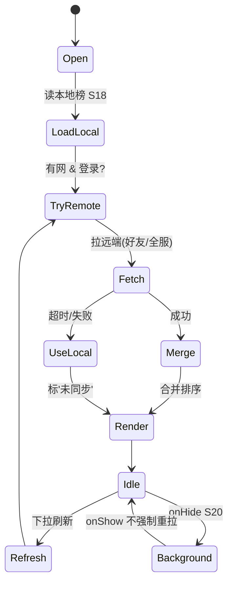
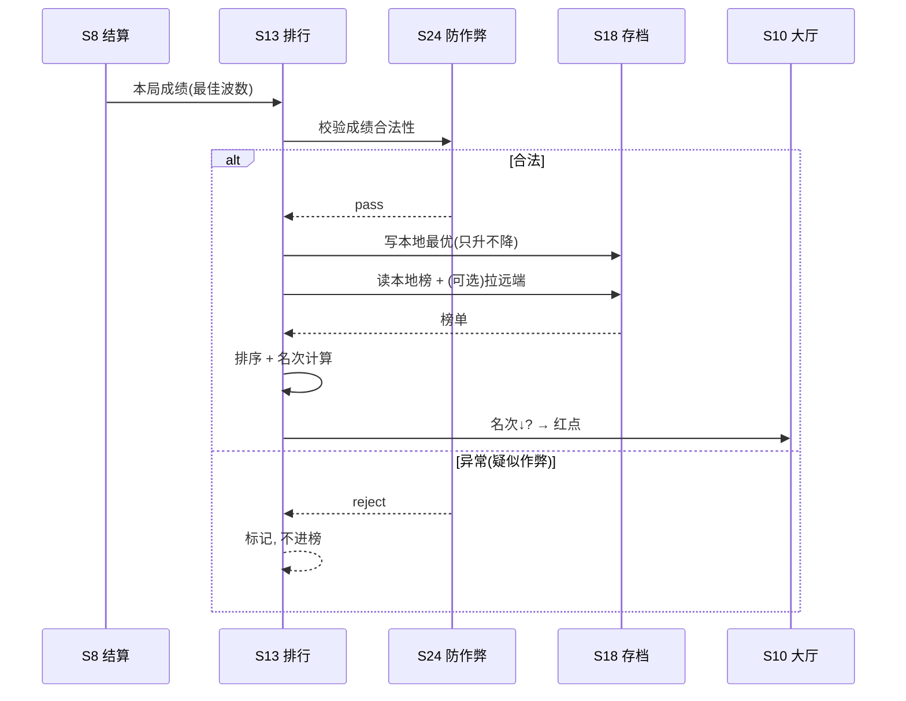

# 系统策划案：S13 排行榜系统 (Leaderboard System)

> 归属域：B 元进度社交域 · 层级/优先级：增强 / P2 · 关联 F 码：F15 · 关联：SYSTEM_BREAKDOWN §S13
> 状态：v0.3-ai-readable · 日期 2026-07-17
> 设计基准：UI 750×1334（Cocos Creator 3.8.8 · 微信小游戏）· 安全区：顶部 y<88、底部 y>1290 不放置可点组件
> 数值约定：凡涉及权重/门槛/刷新频率的调优量为 `[PLACEHOLDER]`，标注「调优杆」，禁止硬编码魔法数字。
> 合规边界：不做实时榜（异步为主）；不做付费冲榜（见 SYSTEM_BREAKDOWN §S13）。
> **本地兜底铁律**：S42 云存档本期「暂不做」，故排行榜**必须本地优先**——无网络/无登录/拉取超时均降级为本地榜，绝不阻塞玩家。

---

## 0. 元数据头

- 归属域：B 元进度社交域
- 层级 / 优先级：增强 / P2
- 关联 F 码：F15
- 关联文档：SYSTEM_BREAKDOWN §S13
- 依赖系统：S8（结算成绩）、S18（本地榜存档）、S24（防作弊校验）、S10（被超红点）、S20（生命周期）、S25（告警）、S42（云存档，暂不做）
- 设计基准：UI 750×1334（Cocos Creator 3.8.8 · 微信小游戏）· 安全区：顶部 y<88、底部 y>1290 不放置可点组件
- NEEDS-DESIGN 索引：无（本系统所有 `[PLACEHOLDER]` 已在 balance/S13_leaderboard.json 给初值）

---

## 1. 系统 UI 布局（层级 + 像素线框 + 组件表 + 交互流程图）

### 1.1 布局层级（排行榜页，z=0–55）

| 层级 z | 层名 | 说明 |
|---|---|---|
| 0 | 背景层 BgLayer | 排行主题背景 |
| 40 | 维度切换 DimensionBar | 顶部：最佳波数榜（首版单维，预留多维特） |
| 40 | 榜单列表 ListView | 中部可滚：排名/头像/名/成绩，前 3 高亮 |
| 45 | 我的名次 MyRank | 底部固定：当前排名 + 成绩 + 距上一名差 |
| 46 | 返回/刷新 BackBtn/RefreshBtn | 左上返回、右上刷新 |
| 47 | 未同步标 UnsyncedTag | 拉取失败/超时显示「未同步」 |

> 被超提示通过 S10 红点呈现（不在本页常驻）。

### 1.2 像素级线框（750×1334，ASCII 原型，单位 px）

```
  0       150      300      450      600      750
  ┌──────────────────────────────────────┐ y=0
  │ (20,40)⟲返回     最佳波数榜      (655,40)↻刷新  │ y=40  Back/Refresh 64×64
  │ ┌──────────────────────────────────────┐      │ y=120 DimensionBar 750×60
  │ │ [最佳波数]  (预留:最高塔)              │      │
  │ └──────────────────────────────────────┘      │
  │  ┌──┬─────────────────────────────┬──────┐    │ y=200 ListView 行高100
  │  │👑│ 好友A        最佳 50 波         │+120  │
  │  ├──┼─────────────────────────────┼──────┤
  │  │🥈│ 好友B        最佳 47 波         │ +90  │
  │  ├──┼─────────────────────────────┼──────┤
  │  │🥉│ 好友C        最佳 45 波         │ +70  │
  │  ├──┼─────────────────────────────┼──────┤
  │  │ 4│ 我(本地)      最佳 42 波         │ 自己 │
  │  │ 5│ 好友D        最佳 40 波         │      │
  │  └──┴─────────────────────────────┴──────┘    │ y=1100
  │  ┌──────────────────────────────────────┐     │ y=1180 MyRank 750×80
  │  │ 我的名次: 4  | 42波 | 距上一名 +3波    │     │
  │  └──────────────────────────────────────┘     │ y=1260
  └──────────────────────────────────────┘ y=1334
```

### 1.3 组件表（精确坐标 / 尺寸 / 层级 / 响应）

| 组件 ID | 位置(x,y) | 尺寸(w×h) | z | 响应行为 | 备注 |
|---|---|---|---|---|---|
| BgLayer | (0,0) | 750×1334 | 0 | 无交互 | — |
| BackBtn | (20,40) | 64×64 | 46 | 点 → 回 S10 | — |
| RefreshBtn | (655,40) | 64×64 | 46 | 点 → 下拉刷新榜 | 旋转动画 |
| DimensionBar | (0,120) | 750×60 | 40 | 切榜（首版仅 1 维） | 多维特预留 |
| ListView | (0,200) | 750×900 | 40 | 可滚，行点击无操作 | ScrollView |
| Row(i) | (0,200+i×100) | 750×100 | 40 | 无交互 | 前 3 皇冠高亮 |
| Crown(i) | 行内 (20,行内) | 48×48 | 41 | 无交互 | i<3 |
| MyRank | (0,1180) | 750×80 | 45 | 无交互，固定 | 距上一名差 |
| UnsyncedTag | (300,1050) | 150×36 | 47 | 无交互 | 拉取失败/超时显示 |

### 1.4 交互流程图（成绩上报 → 拉榜 → 渲染）

```mermaid
flowchart TD
    A[S8 结算 产出成绩] --> B[本地存最优成绩 S18]
    B --> C[S24 校验 成绩合法?]
    C -- 否 --> Z[拒上报, 标记]
    C -- 是 --> D[写本地榜(只升不降)]
    D --> E[进排行页 / 手动刷新]
    E --> F{有网 & 已登录?}
    F -- 是 --> G[拉远端好友/全服榜]
    G --> H{超时/失败?}
    H -- 是 --> I[降级本地榜 + 标'未同步']
    H -- 否 --> J[合并排序渲染]
    F -- 否 --> I
    I --> K[渲染(本地)]
    J --> K
    K --> L[名次计算 + 被超检测 → 红点S10]
```

---

## 2. 逻辑功能（模块表 + 状态机 + 时序流程图 + 异常边界用例表）

### 2.1 模块表（触发条件 / 处理流程 / 输出）

| 模块 | 触发条件 | 处理流程 | 输出 |
|---|---|---|---|
| 成绩上报 | S8 结算 | 取最佳波数 → S24 校验 → 写本地榜（只升不降） | 本地成绩更新 |
| 榜单拉取 | 进排行页/刷新 | 本地优先；有网且登录 → 拉远端 → 合并排序 | 列表 |
| 名次计算 | 拉取后 | 算排名 + 与上一名差 | 我的名次 |
| 被超检测 | 拉取时 | 比对上次名次↓ → 红点(S10) | 提醒 |
| 周期切换 | （周/日，增强） | 按 `cycle` 拉不同榜 | 切换 |
| 刷新 | 点 RefreshBtn | 重新拉取（受超时约束） | 刷新 |

### 2.2 排行榜状态机（FSM · stateDiagram-v2）



### 2.3 时序流程图（上报 + 拉取，跨系统）



### 2.4 异常与边界用例表（程序员可实现级）

| 用例ID | 异常类型 | 触发条件 | 预期处理流程 | 输出 / 兜底 | 涉及系统 |
|---|---|---|---|---|---|
| E01 | 切后台 S20 | 排行页 `onHide` | 不强制重拉；保留已渲染榜；`onShow` 不重拉（防跳变） | 状态一致 | S20 |
| E02 | 数据损坏 S18 | 本地榜数据损坏 | 重置本地榜（仅保留自己最优成绩）→ 重建 | 不崩，可重拉 | S18 |
| E03 | 网络中断 | 无网拉榜 | 用本地缓存榜，标「未同步」 | 可看本地榜 | — |
| E04 | **排行榜拉取超时** | 远端响应 > value_ref: balance/S13_leaderboard.json#ldb_fetch_timeout | 超时回落本地榜，标「未同步」，不阻塞 UI | 降级本地 | — |
| E05 | **微信登录失败 S42** | `wx.login` 失败 / 无 openid | 本期不做云存；好友榜降级本地榜；不阻塞 | 纯本地兜底 | S42(暂不做) |
| E06 | 成绩异常(作弊 S24) | 成绩跳变/超阈值 | 拒上报，标记；不进榜 | 护榜公平 | S24 |
| E07 | 同名次 | 多玩家同分 | 先到先排（时间戳）；同分同戳按 openid 字典序 | 稳定排序 | — |
| E08 | 玩家未上榜 | 成绩 < 门槛 | 显示「未上榜」+ 距门槛差 | 仍可看榜 | — |
| E09 | 数值极值 | 成绩 0/负/极大值 | 钳制到 `[0, max_wave]`；排名溢出显「未上榜」 | 不卡死 | — |
| E10 | 配置缺失 | `leaderboard_config` 缺失 | 用默认 `best_wave` 好友榜，`top_n=50` | 可进页 | S25 |
| E11 | 并发上报 | 多局结算并发/连点刷新 | 上报队列串行；本地成绩取「只升不降」最优 | 防脏写 | — |
| E12 | 远端/本地冲突 | 远端成绩 < 本地 | 以更高者为准（只升不降）；S24 校验远端 | 防回退 | S24 |

> 设计红线检查：无主导策略（榜为社交比较，无资源产出）；无认知过载（单维首版）；无支柱漂移（服务 P5 留存，本地兜底不破坏 P3 一指可玩）。

---

## 3. 配置表设计（完整字段 + 多行示例）

### 3.1 表 `leaderboard_config`（排行榜配置）

| 字段 | 类型 | 取值/范围 | 默认值 | 说明 |
|---|---|---|---|---|
| board_id | string | 唯一 | "best_wave" | 榜主键 |
| dimension | enum | best_wave/max_tower | best_wave | 维度（首版单维，调优杆） |
| scope | enum | friend/global | friend | 好友榜（合规轻，优先） |
| cycle | enum | daily/weekly/none | none | 周期（首版无，增强） |
| top_n | int | 10–100 | 50 | 展示前 N |
| min_score | int | 0 | 1 | 上榜门槛 |
| fetch_timeout | float | 1–10 | value_ref: balance/S13_leaderboard.json#ldb_fetch_timeout | 拉取超时(s)，调优杆 |
| sort_order | enum | desc/asc | desc | 排序方向 |
| tie_breaker | enum | timestamp/openid | timestamp | 同名次裁决 |
| only_increase | bool | true | true | 只升不降（防回退） |

**示例（CSV）**
```csv
board_id,dimension,scope,cycle,top_n,min_score,fetch_timeout,sort_order,tie_breaker,only_increase
best_wave,best_wave,friend,none,50,1,value_ref: balance/S13_leaderboard.json#ldb_fetch_timeout,desc,timestamp,true
```

### 3.2 表 `leaderboard_local_entry`（本地榜条目，持久化 S18）

| 字段 | 类型 | 取值/范围 | 默认值 | 说明 |
|---|---|---|---|---|
| openid | string | 本地伪 id/微信 id | "local_me" | 玩家标识 |
| nickname | string | ≤12 字 | "我" | 显示名 |
| score | int | 0–max | 0 | 成绩（只升不降） |
| score_at | datetime | — | — | 成绩时间戳（裁决用） |
| avatar_local | bool | true | true | 是否本地头像 |

**示例（CSV）**
```csv
openid,nickname,score,score_at,avatar_local
local_me,我,42,2026-07-17T12:00:00,true
```

---

## 4. 美术资源需求（帧数 / 分辨率 / 格式 / 切片）

| 资源 | 用途 | 帧数 | 分辨率 | 格式 | 切片要求 |
|---|---|---|---|---|---|
| `rank_bg` 排行背景 | 场景底 | 静态 | 750×1334 | JPG/PNG(压缩) | 单图 |
| `rank_row` 榜单行底 | 列表 | 静态 | 750×100 | PNG 九宫 | 3×3 切片，横向拉伸 |
| `crown_*` 前三皇冠/奖牌 | 高亮 | 静态(金光 2 帧可选) | 48×48 | PNG | 单图；金光用代码 tween |
| `my_rank_bar` 我的名次条 | 固定底 | 静态 | 750×80 | PNG 九宫 | 3×3 切片 |
| `reddot` 被超红点 | 提示 | 静态 | 24×24 | PNG | 复用 S10 红点 |
| `refresh_icon` 刷新图标 | 操作 | 静态(旋转代码) | 64×64 | PNG | 单图；旋转用代码 tween |
| `unsynced_tag` 未同步标 | 提示 | 静态 | 150×36 | PNG 九宫 | 3×3 切片 |
| `avatar_default` 默认头像 | 头像 | 静态 | 96×96 | PNG（含透明） | 单图；微信头像走 `wx` API（合规） |

> 头像优先用微信头像（合规，S42 暂不做时本地默认头像兜底）；特效见 S23。资源走首分包（S19）。

---

## 5. 实现契约（AI 可消费结构化索引）

### 5.1 输入数据结构（字段 / 类型 / 来源 config 字段）

| 字段 | 类型 | 来源 config 字段 |
|---|---|---|
| leaderboard_config | json | §3.1 leaderboard_config（board_id / dimension / scope / cycle / top_n / min_score / fetch_timeout / sort_order / tie_breaker / only_increase） |
| leaderboard_local_entry[] | json | §3.2 leaderboard_local_entry（openid / nickname / score / score_at / avatar_local） |
| save.best_score | int | S18 存档（本地最优成绩） |
| report_score | int | S8 结算产出（最佳波数） |

### 5.2 输出数据结构

| 字段 | 类型 | 说明 |
|---|---|---|
| ranked_list[] | json | 排序后榜单（本地/合并远端） |
| my_rank | int | 我的名次 |
| my_score | int | 我的成绩 |
| overtaken_reddot | bool | 名次下降通知 S10 红点 |

### 5.3 跨系统接口调用表（caller / callee / function / 方向 / 用途）

| caller | callee | function | 方向 | 用途 |
|---|---|---|---|---|
| S8 | S13 | reportScore(best_wave) | in | 结算产出成绩 |
| S13 | S24 | validateScore(score) | out | 校验合法性（防作弊） |
| S13 | S18 | loadLocalBoard() | in | 读本地榜 |
| S13 | S18 | saveLocalBest(score) | out | 写本地最优（只升不降） |
| S13 | S10 | notifyOvertakenReddot() | out | 名次下降红点 |
| S13 | S25 | reportCheat(score) | out | E06 疑似作弊上报 |

### 5.4 错误码表（E# / 场景 / 兜底 / 涉及系统）

| E# | 场景 | 兜底 | 涉及系统 |
|---|---|---|---|
| E01 | 切后台 S20 | 不强制重拉，onShow 不跳变 | S20 |
| E02 | 数据损坏 S18 | 重置本地榜保留自己最优 | S18 |
| E03 | 网络中断 | 本地缓存榜 + 标未同步 | — |
| E04 | 拉取超时 | 回落本地榜 value_ref ldb_fetch_timeout | — |
| E05 | 微信登录失败 S42 | 纯本地兜底（云存暂不做） | S42 |
| E06 | 成绩异常 S24 | 拒上报标记，不进榜 | S24 |
| E07 | 同名次 | 时间戳/ openid 稳定排序 | — |
| E08 | 未上榜 | 显未上榜 + 距门槛差 | — |
| E09 | 数值极值 | 成绩钳 [0,max_wave]；溢出显未上榜 | — |
| E10 | 配置缺失 | 默认 best_wave 好友榜 top_n=50 | S25 |
| E11 | 并发上报 | 队列串行 + 只升不降 | — |
| E12 | 远端/本地冲突 | 取更高者（只升不降）+ S24 校验 | S24 |

### 5.5 状态转换表（state / event / transition / action）

| state | event | transition | action |
|---|---|---|---|
| Open | 进入 | → LoadLocal | 读本地榜 S18 |
| LoadLocal | 读档完成 | → TryRemote | 有网 & 登录? |
| TryRemote | 是 | → Fetch | 拉远端 |
| Fetch | 成功 | → Merge | — |
| Fetch | 超时/失败 | → UseLocal | 标未同步 |
| Merge | 合并完成 | → Render | 合并排序 |
| UseLocal | 本地读取 | → Render | 标未同步 |
| Render | 渲染完成 | → Idle | — |
| Idle | 下拉刷新 | → Refresh | — |
| Refresh | 触发 | → TryRemote | — |
| Idle | onHide S20 | → Background | — |
| Background | onShow S20 | → Idle | 不强制重拉 |

### 5.6 数值消费清单（本系统消费的所有 balance param_id + 来源文件）

| param_id | 来源 balance 文件 | 用途 |
|---|---|---|
| ldb_fetch_timeout | balance/S13_leaderboard.json | 远端榜单拉取超时（§2.4 E04 / §3.1 fetch_timeout） |

> 本系统 §3 其余字段（top_n=50 / min_score=1 / sort_order=desc / tie_breaker=timestamp / only_increase=true / scope=friend / cycle=none）均为固定设计常量，无 `[PLACEHOLDER]` 调优量，故 §5.6 仅列上表 1 项。

---

## 6. 冲突与待裁定（三要素格式）

| 项 | current_implementation | pending_decision | owner |
|---|---|---|---|
| C-S13-1 | **本地兜底铁律**：S42 云存档本期暂不做，排行榜纯本地优先；无网/无登录/拉取超时（>value_ref ldb_fetch_timeout）均降级本地榜，绝不阻塞 | 待 S42 云存档实装后，是否接入云端好友/全服榜（合并排序、远端优先 + 本地兜底）；建议保留「本地优先 + 超时降级」铁律不变 | S13 |
| C-S13-2 | `only_increase=true` 防远端成绩回退；远端 < 本地以更高者为准 | 是否对「赛季榜(S17)」复用同一条只升不降规则（S17 §2.1 积分贡献 → S13 赛季榜）——建议复用，避免跨系统规则漂移 | S13 / S17 |
