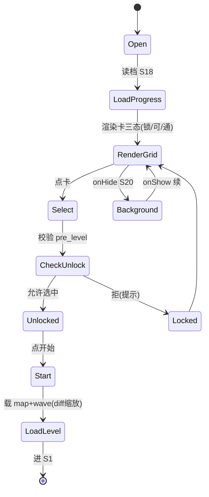
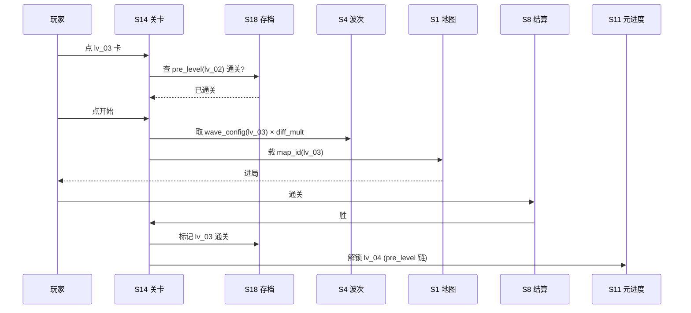

# 系统策划案：S14 关卡系统 (Level System)

> 归属域：B 元进度社交域 · 层级/优先级：增强 / P2 · 关联 F 码：F17 · 关联：SYSTEM_BREAKDOWN §S14
> 状态：v0.2-detailed · 日期 2026-07-17
> 设计基准：UI 750×1334（Cocos Creator 3.8.8 · 微信小游戏）· 安全区：顶部 y<88、底部 y>1290 不放置可点组件
> 数值约定：凡涉及难度系数/奖励/解锁条件的调优量为 `[PLACEHOLDER]`，标注「调优杆」，禁止硬编码魔法数字。
> 边界：不做 UGC 关卡（见 FEATURE_SCOPE §6）；不做关卡内随机种子（首版固定，见 SYSTEM_BREAKDOWN §S14）。

---

## 1. 系统 UI 布局（层级 + 像素线框 + 组件表 + 交互流程图）

### 1.1 布局层级（选关页，z=0–55）

| 层级 z | 层名 | 说明 |
|---|---|---|
| 0 | 背景层 BgLayer | 选关主题背景 |
| 40 | 关卡网格 LevelGrid | 中部可滚：每关卡片，显示地图缩略/难度星/锁定态 |
| 40 | 难度标识 StarBar | 卡内：1–3 星 |
| 40 | 解锁提示 LockTag | 锁卡：「通关前一关解锁」 |
| 40 | 进入按钮 StartBtn | 底部「开始」（选中已解锁卡可点） |
| 46 | 返回 BackBtn | 左上回大厅 |

### 1.2 像素级线框（750×1334，ASCII 原型，单位 px）

```
  0       150      300      450      600      750
  ┌──────────────────────────────────────────────┐ y=0
  │ (20,40)⟲返回        选择关卡                  │ y=40  BackBtn 64×64
  │  ┌──────────┐  ┌──────────┐                  │ y=200 卡 320×200
  │  │ lv_01     │  │ lv_02     │  2列            │
  │  │ [地图缩略]│  │ [地图缩略]│  x=40 / x=390   │
  │  │ ★☆☆      │  │ 🔒 锁     │                  │
  │  └──────────┘  └──────────┘                  │ y=400
  │  ┌──────────┐  ┌──────────┐                  │ y=460
  │  │ lv_03     │  │ lv_04     │                  │
  │  │ [缩略]   │  │ [缩略]   │                  │
  │  │ ★★☆      │  │ ★★★      │                  │
  │  └──────────┘  └──────────┘                  │ y=660
  │  （可滚）                                     │
  │        ┌────────────────────┐                 │ y=1150 StartBtn 300×96
  │        │   开始 (选中 lv_03)  │                 │
  │        └────────────────────┘                 │
  └──────────────────────────────────────────────┘ y=1334
```

### 1.3 组件表（精确坐标 / 尺寸 / 层级 / 响应）

| 组件 ID | 位置(x,y) | 尺寸(w×h) | z | 响应行为 | 备注 |
|---|---|---|---|---|---|
| BgLayer | (0,0) | 750×1334 | 0 | 无交互 | — |
| BackBtn | (20,40) | 64×64 | 46 | 点 → 回 S10 | — |
| Title | (225,40) | 300×60 | 40 | 无交互 | 文本 |
| LevelGrid | (0,160) | 750×950 | 40 | 可滚，点卡选中 | ScrollView |
| Card(i) | (40 + (i%2)×350, 200 + floor(i/2)×260) | 320×200 | 40 | 点 → 选中/解锁检查 | 2 列 |
| MiniMap(i) | 卡内 (20,20) | 160×120 | 41 | 无交互 | 地图缩略 |
| StarBar(i) | 卡内 (20,150) | 90×24 | 41 | 无交互 | 难度星 |
| LockTag(i) | 卡内居中 | 48×48 | 42 | 无交互（锁卡） | 🔒 |
| StartBtn | (225,1150) | 300×96 | 40 | 选中已解锁→S1 | 未选/锁时禁用 |

### 1.4 交互流程图（大厅 → 选关 → 进关）

```mermaid
flowchart TD
    A[大厅 S10 → 选关入口] --> B[读档 S18: 解锁进度]
    B --> C[渲染卡三态: 锁/可/通]
    C --> D{点卡}
    D --> E[校验 pre_level 通关?]
    E -- 是 --> F[选中高亮 + StartBtn 可点]
    E -- 否 --> G[显 LockTag + 提示]
    F --> H[点开始]
    H --> I[载 map_id + wave_config(S4)]
    I --> J[按 diff_mult 缩放波表]
    J --> K[进 S1 开局]
    K --> L[S8 胜 → 标记通关 → 解锁下一关 S11]
    L --> C
```

---

## 2. 逻辑功能（模块表 + 状态机 + 时序流程图 + 异常边界用例表）

### 2.1 模块表（触发条件 / 处理流程 / 输出）

| 模块 | 触发条件 | 处理流程 | 输出 |
|---|---|---|---|
| 关卡列表 | 读档(S18) | 取解锁进度 → 渲染卡三态 | 网格态 |
| 解锁检查 | 点卡 | 校验 `pre_level` 通关 → 允许/拒 | 可否进 |
| 进关 | 点开始(已解锁) | 载 `map_id`+`wave_config` → S1 | 开局 |
| 通关解锁 | S8 胜 | 标记本关通关 → 解锁下一关(S11) | 进度+ |
| 难度参数 | 进关时 | 按 `level.difficulty` × `diff_mult` 缩放波表 | 难度 |

### 2.2 选关流程状态机（FSM · stateDiagram-v2）



### 2.3 时序流程图（进关 + 通关解锁，跨系统）



### 2.4 异常与边界用例表（程序员可实现级）

| 用例ID | 异常类型 | 触发条件 | 预期处理流程 | 输出 / 兜底 | 涉及系统 |
|---|---|---|---|---|---|
| E01 | 切后台 S20 | 选关页 `onHide` | 存选中态(S18)；`onShow` 续原网格位置 | 无丢失 | S20/S18 |
| E02 | 数据损坏 S18 | 解锁进度损坏 | 重置仅 `lv_01` 解锁；其余锁 | 不崩，可重玩 | S18 |
| E03 | 关配置缺失 | `level_config` 缺某关/字段非法 | 该卡禁用 + 灰显，告警 S25 | 不崩 | S25 |
| E04 | 越级进关(改内存) | 未通关 `pre_level` 强进 | S24 校验 `pre_level` 状态 → 拒绝进关 | 防跳关 | S24 |
| E05 | 通关但下一关锁(数据错) | 解锁链断裂 | 强制解锁下一关 + 告警 S25 | 防卡死 | S25 |
| E06 | 选关中途退出 | 杀进程/回大厅 | `onHide` 已存进度；重进续 | 进度不丢 | S18 |
| E07 | 微信登录失败 S42 | `wx.login` 失败 | 关卡纯本地，不依赖登录 | 零阻塞 | S42(暂不做) |
| E08 | 网络中断 | — | 关卡纯本地（地图/波表本地资源 S19） | 不适用/N/A | S19 |
| E09 | 数值极值 | `diff_mult`/`reward_mult` 极值 | 钳制到 `[0.5, 3]` | 难度不崩 | — |
| E10 | 配置缺失(整体) | `level_config` 全缺 | 仅显 `lv_01`（默认通关前置 null） | 可进页 | S25 |
| E11 | 并发进关 | 连点 StartBtn | `isEntering` 锁 0.3s，防双进 | 仅一次进关 | — |
| E12 | 分包未加载 S19 | 进关时 map 资源未就绪 | 进关前预载 map 资源；未就绪显 loading 提示，就绪再进 | 防白屏 | S19 |

> 设计红线检查：无主导策略（关卡为内容消耗，无资源刷取循环）；无认知过载（每关单一决策）；无支柱漂移（服务 P5 长线内容）。

---

## 3. 配置表设计（完整字段 + 多行示例）

### 3.1 表 `level_config`（关卡配置）

| 字段 | 类型 | 取值/范围 | 默认值 | 说明 |
|---|---|---|---|---|
| level_id | string | 唯一 | "lv_01" | 关主键 |
| map_id | string | 关联 S1 | "map_01" | 地图 |
| difficulty | int | 1–3 | 1 | 难度星 |
| pre_level | string | 关 id/null | null | 解锁前置（null=首关） |
| wave_set | string | 关联 S4 | "ws_lv01" | 波表集 |
| diff_mult | float | 0.5–3 | 1.0 | 难度缩放（调优杆） |
| reward_mult | float | 0.5–3 | 1.0 | 奖励缩放（调优杆） |
| ring_count | int | 1–N | `[PLACEHOLDER]` | 圈数（地图变体） |
| tower_slots | int | 1–N | `[PLACEHOLDER]` | 塔位数 |
| path_shape | enum | circle/oval/figure8 | circle | 路径形态 |
| thumbnail | string | 缩略图 id | "mini_lv01" | 卡内缩略 |

**示例（CSV，5 关递进）**
```csv
level_id,map_id,difficulty,pre_level,wave_set,diff_mult,reward_mult,ring_count,tower_slots,path_shape,thumbnail
lv_01,map_01,1,null,ws_lv01,1.0,1.0,[PLACEHOLDER]3,[PLACEHOLDER]12,circle,mini_lv01
lv_02,map_02,2,lv_01,ws_lv02,1.3,1.2,[PLACEHOLDER]3,[PLACEHOLDER]14,oval,mini_lv02
lv_03,map_03,2,lv_02,ws_lv03,1.5,1.3,[PLACEHOLDER]4,[PLACEHOLDER]16,circle,mini_lv03
lv_04,map_04,3,lv_03,ws_lv04,1.8,1.5,[PLACEHOLDER]4,[PLACEHOLDER]18,figure8,mini_lv04
lv_05,map_05,3,lv_04,ws_lv05,2.2,1.8,[PLACEHOLDER]5,[PLACEHOLDER]20,oval,mini_lv05
```

### 3.2 表 `level_reward`（通关奖励，关联 S8/S11）

| 字段 | 类型 | 取值/范围 | 默认值 | 说明 |
|---|---|---|---|---|
| level_id | string | 关联 | "lv_01" | 关主键 |
| first_clear_meta | int | 0–9999 | `[PLACEHOLDER]` | 首通元资源 |
| repeat_meta | int | 0–9999 | `[PLACEHOLDER]` | 重复通关元资源 |
| unlock_next | bool | true | true | 是否解锁下一关 |

**示例（CSV）**
```csv
level_id,first_clear_meta,repeat_meta,unlock_next
lv_01,100,20,true
lv_02,150,30,true
lv_03,200,40,true
```

---

## 4. 美术资源需求（帧数 / 分辨率 / 格式 / 切片）

| 资源 | 用途 | 帧数 | 分辨率 | 格式 | 切片要求 |
|---|---|---|---|---|---|
| `level_bg` 选关背景 | 场景底 | 静态 | 750×1334 | JPG/PNG(压缩) | 单图 |
| `level_card` 关卡卡底 | 卡片 | 静态(三态各 1) | 320×200 | PNG 九宫 | 三态：`_locked`/`_available`/`_cleared`；3×3 切片 |
| `mini_map_*` 地图缩略 | 预览 | 静态 | 160×120 | PNG/JPG | 单图（按 map 数切片，分包 S19） |
| `star_*` 难度星 | 难度 | 静态(亮/暗态) | 24×24 ×3 | PNG | 单图；亮/暗 `_on`/`_off` |
| `lock_tag` 锁标 | 未解锁 | 静态 | 48×48 | PNG（含透明） | 单图 |
| `btn_start` 开始按钮 | 操作 | 静态(可点/禁用态) | 300×96 | PNG 九宫 | 3×3 切片；双态 `_on`/`_off` |
| `level_title` 标题(可选) | 品牌 | 静态 | 300×60 | PNG | 单图 |

> 地图缩略复用 S1 主题；多关地图资源分包见 S19。资源走首分包。
