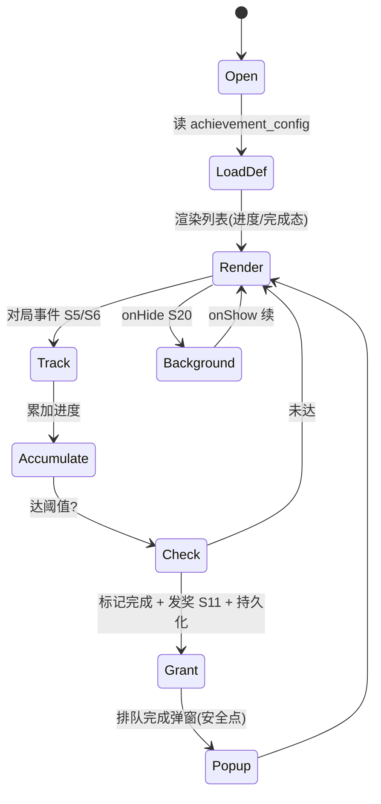
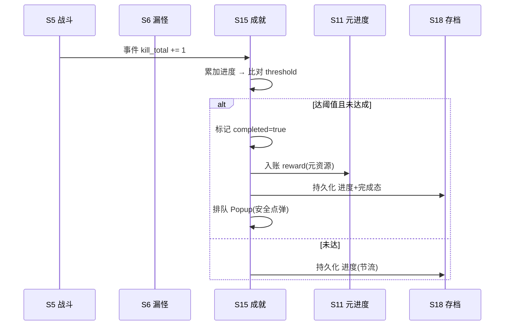

# 系统策划案：S15 成就系统 (Achievement System)

> 归属域：B 元进度社交域 · 层级/优先级：增强 / P2 · 关联 F 码：F37 · 关联：SYSTEM_BREAKDOWN §S15
> 状态：v0.3-ai-readable · 日期 2026-07-17
> 设计基准：UI 750×1334（Cocos Creator 3.8.8 · 微信小游戏）· 安全区：顶部 y<88、底部 y>1290 不放置可点组件
> 数值约定：凡涉及阈值/奖励量的调优量为 `[PLACEHOLDER]`，标注「调优杆」，禁止硬编码魔法数字。
> 边界：不做成就排行榜（避免压力叠加）；不做付费成就（见 SYSTEM_BREAKDOWN §S15）。

---

## 0. 元数据头

- 归属域：B 元进度社交域
- 层级 / 优先级：增强 / P2
- 关联 F 码：F37
- 关联文档：SYSTEM_BREAKDOWN §S15
- 依赖系统：S5（战斗行为：击杀/连杀）、S6（漏怪行为：零漏）、S11（元进度入账）、S18（存档）、S8（结算安全点弹窗）、S20（生命周期）、S25（告警）、S42（登录，暂不做）
- 设计基准：UI 750×1334（Cocos Creator 3.8.8 · 微信小游戏）· 安全区：顶部 y<88、底部 y>1290 不放置可点组件
- NEEDS-DESIGN 索引：无（本系统所有 `[PLACEHOLDER]` 已在 balance/S15_achievement.json 给初值）

---

## 1. 系统 UI 布局（层级 + 像素线框 + 组件表 + 交互流程图）

### 1.1 布局层级（成就页，z=0–60）

| 层级 z | 层名 | 说明 |
|---|---|---|
| 0 | 背景层 BgLayer | 成就主题背景 |
| 40 | 分类标签 TabBar | 顶部：战斗 / 养成 / 挑战 |
| 40 | 成就列表 ListView | 中部可滚：图标 + 名 + 进度条/完成标 |
| 46 | 返回 BackBtn | 左上回大厅 |
| 60 | 完成弹窗 Popup | 达成时浮窗「成就达成！」+ 奖励 |

> 进度数据源：S5（战斗行为：击杀/连杀）/ S6（漏怪行为：零漏）。

### 1.2 像素级线框（750×1334，ASCII 原型，单位 px）

```
  0       150      300      450      600      750
  ┌──────────────────────────────────────┐ y=0
  │ (20,40)⟲返回    成就           │ y=40  BackBtn 64×64
  │ ┌────┐┌────┐┌────┐  TabBar 750×60          │ y=120
  │ │战斗││养成││挑战│                            │
  │ └────┘└────┘└────┘                          │ y=180
  │  ┌────┬─────────────────────┬─────────┐     │ y=200 行高110
  │  │ 🏅 │ 初次击杀               │ 完成 ✓  │     │
  │  ├────┼─────────────────────┼─────────┤
  │  │ 🔧 │ 养成大师 Lv10         │ ▓▓▓░ 6/10│     │
  │  ├────┼─────────────────────┼─────────┤
  │  │ 🛡 │ 零漏通关               │ 进行中  │     │
  │  └────┴─────────────────────┴─────────┘     │ y=1100
  │     ┌────────────────────┐                  │ y=567 Popup 360×200
  │     │  🎉 成就达成！        │                  │
  │     │  养成大师 +[R] 元资源  │                  │
  │     └────────────────────┘                  │
  └──────────────────────────────────────┘ y=1334
```

### 1.3 组件表（精确坐标 / 尺寸 / 层级 / 响应）

| 组件 ID | 位置(x,y) | 尺寸(w×h) | z | 响应行为 | 备注 |
|---|---|---|---|---|---|
| BgLayer | (0,0) | 750×1334 | 0 | 无交互 | — |
| BackBtn | (20,40) | 64×64 | 46 | 点 → 回 S10 | — |
| TabBar | (0,120) | 750×60 | 40 | 切分类(战斗/养成/挑战) | 3 标签 |
| ListView | (0,200) | 750×950 | 40 | 可滚，点行无操作 | ScrollView |
| Row(i) | (0,200+i×110) | 750×110 | 40 | 无交互 | 图标+名+进度 |
| Icon(i) | (20,行内) | 80×80 | 41 | 无交互 | 完成/未完成态 |
| ProgressBar(i) | (120,行内) | 200×16 | 41 | 无交互 | 多步成就 |
| Popup | (195,567) | 360×200 | 60 | 点关闭/自动消失 | 达成提示 |

### 1.4 交互流程图（大厅 → 成就 → 对局触发）

```mermaid
flowchart TD
    A[大厅 S10 → 成就入口] --> B[读 achievement_config + 进度 S18]
    B --> C[渲染列表: 进度/完成态]
    C --> D[对局中 S5/S6 事件]
    D --> E[累加进度 → 比对阈值]
    E --> F{达阈值?}
    F -- 是 --> G[标记完成 + 发奖 S11 + 持久化]
    G --> H[排队完成弹窗(安全点弹)]
    F -- 否 --> C
    H --> C
```

---

## 2. 逻辑功能（模块表 + 状态机 + 时序流程图 + 异常边界用例表）

### 2.1 模块表（触发条件 / 处理流程 / 输出）

| 模块 | 触发条件 | 处理流程 | 输出 |
|---|---|---|---|
| 成就定义 | 读 `achievement_config` | 加载全部成就 + 条件 | 列表 |
| 进度追踪 | 对局事件(S5/S6) | 累加进度 → 比对阈值 | 进度更新 |
| 达成判定 | 进度达阈值 | 标记完成 → 发奖(S11) → 持久化 | 成就+ |
| 多步成就 | 进度中 | 显示当前/目标 | 进度条 |
| 展示 | 进成就页 | 读档渲染 | 列表态 |

### 2.2 成就流程状态机（FSM · stateDiagram-v2）



### 2.3 时序流程图（对局触发达成，跨系统）



### 2.4 异常与边界用例表（程序员可实现级）

| 用例ID | 异常类型 | 触发条件 | 预期处理流程 | 输出 / 兜底 | 涉及系统 |
|---|---|---|---|---|---|
| E01 | 切后台 S20 | 成就页 `onHide` | 暂停战斗事件采集；`onShow` 续原列表 | 无丢失 | S20 |
| E02 | 数据损坏 S18 | 成就进度损坏 | 已达成标记保留；进行中进度重置为 0（重累计） | 不崩，不丢已完成 | S18 |
| E03 | 成就条件配置缺失 | `achievement_config` 缺某成就/字段非法 | 该成就不显示，告警 S25 | 不崩 | S25 |
| E04 | 重复达成 | 已 `completed` 再触发 | 已达成不重复发奖（幂等） | 防双发 | — |
| E05 | 进度溢出 | 进度 > target | 截断至 `target`（进度条 ≤100%） | 显示安全 | — |
| E06 | 奖励发放失败 | S11 入账异常 | 回滚完成标记 → 告警 S25 → 可重试 | 不丢奖 | S25 |
| E07 | 微信登录失败 S42 | `wx.login` 失败 | 成就纯本地，不依赖登录 | 零阻塞 | S42(暂不做) |
| E08 | 网络中断 | — | 成就纯本地（事件源 S5/S6 本地） | 不适用/N/A | — |
| E09 | 数值极值 | `target≤0` / `progress` 极大值 | `target≤0` 视为即时达成；`progress` 钳制 | 不卡死 | — |
| E10 | 配置缺失(整体) | `achievement_config` 全缺 | 空列表（无成就可显示） | 可进页 | S25 |
| E11 | 并发达成 | 同帧多事件达同一成就 | `isGranting` 锁，仅一次发奖（幂等） | 防双发 | — |
| E12 | 弹窗打断战斗 | 战斗中达成弹窗 | 标记完成即时；Popup 延后至 S8 结算/安全点弹 | 不卡战斗 | S8 |

> 设计红线检查：无主导策略（成就为自我挑战，无资源刷取循环）；无认知过载（进度条直观）；无支柱漂移（服务 P5 长线目标感）。

---

## 3. 配置表设计（完整字段 + 多行示例）

### 3.1 表 `achievement_config`（成就配置）

| 字段 | 类型 | 取值/范围 | 默认值 | 说明 |
|---|---|---|---|---|
| ach_id | string | 唯一 | — | 成就主键 |
| name | string | ≤10 字 | — | 显示名 |
| category | enum | battle/build/challenge | battle | 分类 |
| condition | enum | kill_total/upgrade_lv/zero_leak/combo_kill/specific_tower_clear/... | kill_total | 触发条件 |
| target | int | 1–9999 | value_ref: balance/S15_achievement.json#ach_firstkill_target（按 condition 取对应行：combo→ach_combo_target / upgrade_lv→ach_lv10_target / zero_leak→ach_zeroleak_target / specific_tower_clear→ach_towerclear_target） | 目标值（调优杆） |
| reward | int | 0–9999 | value_ref: balance/S15_achievement.json#ach_firstkill_reward（按 ach_id 取对应行：a_combo→ach_combo_reward / a_lv10→ach_lv10_reward / a_zeroleak→ach_zeroleak_reward / a_towerclear→ach_towerclear_reward） | 元资源奖励（调优杆） |
| multi_step | bool | false | false | 是否多步 |
| icon_id | string | 图标 id | "ach_01" | 图标 |
| desc | string | ≤20 字 | — | 说明 |
| track_event | string | 事件源 | "S5.kill" | 关联 S5/S6 事件 |

**示例（CSV，覆盖三分类）**
```csv
ach_id,name,category,condition,target,reward,multi_step,icon_id,desc,track_event
a_firstkill,初次击杀,battle,kill_total,value_ref: balance/S15_achievement.json#ach_firstkill_target,value_ref: balance/S15_achievement.json#ach_firstkill_reward,false,ach_01,首次击杀怪物,S5.kill
a_combo,连杀大师,battle,combo_kill,value_ref: balance/S15_achievement.json#ach_combo_target,value_ref: balance/S15_achievement.json#ach_combo_reward,false,ach_02,单局连杀20,S5.combo
a_lv10,养成大师,build,upgrade_lv,value_ref: balance/S15_achievement.json#ach_lv10_target,value_ref: balance/S15_achievement.json#ach_lv10_reward,false,ach_03,养到10级塔,S2.upgrade
a_zeroleak,零漏通关,challenge,zero_leak,value_ref: balance/S15_achievement.json#ach_zeroleak_target,value_ref: balance/S15_achievement.json#ach_zeroleak_reward,false,ach_04,零漏通关,S6.leak
a_towerclear,全塔通关,challenge,specific_tower_clear,value_ref: balance/S15_achievement.json#ach_towerclear_target,value_ref: balance/S15_achievement.json#ach_towerclear_reward,false,ach_05,7塔各通关,S8.clear
```

### 3.2 表 `achievement_progress`（进度持久化，S18）

| 字段 | 类型 | 取值/范围 | 默认值 | 说明 |
|---|---|---|---|---|
| ach_id | string | 关联 | — | 成就主键 |
| progress | int | 0–target | 0 | 当前进度（运行期累加值，非调优量） |
| completed | bool | false | false | 是否达成 |
| completed_at | datetime | — | null | 达成时间 |

**示例（CSV）**
```csv
ach_id,progress,completed,completed_at
a_firstkill,1,true,2026-07-17T12:01:00
a_lv10,6,false,null
a_zeroleak,0,false,null
```

---

## 4. 美术资源需求（帧数 / 分辨率 / 格式 / 切片）

| 资源 | 用途 | 帧数 | 分辨率 | 格式 | 切片要求 |
|---|---|---|---|---|---|
| `ach_bg` 成就背景 | 场景底 | 静态 | 750×1334 | JPG/PNG(压缩) | 单图 |
| `ach_icon_*` 成就图标 | 成就 | 静态(完成/未完成态) | 80×80 | PNG（含透明） | 双态：`_done`(彩)/`_todo`(灰)；单图 |
| `progress_bar` 进度条 | 进度 | 静态 | 200×16 | PNG 九宫 | 3×3 切片，中区拉伸 |
| `ach_popup` 完成弹窗 | 提示 | 静态 | 360×200 | PNG 九宫 | 3×3 切片 |
| `ach_fx` 达成特效 | 反馈 | 10 帧 | 240×240 | PNG 图集 | 10 等分，0.5s 金光 |
| `tab_bar` 分类标签底 | 导航 | 静态 | 750×60 | PNG 九宫 | 3×3 切片，横向拉伸 |

> 图标风格统一；特效见 S23。资源走主包或首分包（S19）。

---

## 5. 实现契约（AI 可消费结构化索引）

### 5.1 输入数据结构（字段 / 类型 / 来源 config 字段）

| 字段 | 类型 | 来源 config 字段 |
|---|---|---|
| achievement_config[] | json | §3.1 achievement_config（ach_id / name / category / condition / target / reward / multi_step / icon_id / desc / track_event） |
| achievement_progress[] | json | §3.2 achievement_progress（ach_id / progress / completed / completed_at） |
| track_event | string | S5.kill / S5.combo / S2.upgrade / S6.leak / S8.clear（事件源订阅） |
| save.completed_set | json | S18 存档（已达成 ach_id 集） |

### 5.2 输出数据结构

| 字段 | 类型 | 说明 |
|---|---|---|
| achievement_done | bool | 本次达成标记（幂等，已 completed 不重发） |
| grant_amount | int | 实际入账 meta_res（来自 reward） |
| popup_queue[] | json | 安全点弹窗队列（延后至 S8 结算弹） |

### 5.3 跨系统接口调用表（caller / callee / function / 方向 / 用途）

| caller | callee | function | 方向 | 用途 |
|---|---|---|---|---|
| S15 | S18 | loadAchConfig() | in | 读成就定义 + 进度 |
| S15 | S18 | saveProgress(ach_id, progress, completed) | out | 持久化进度（节流） |
| S15 | S5 | subscribeEvent("kill"/"combo") | in | 战斗行为进度源 |
| S15 | S6 | subscribeEvent("leak") | in | 漏怪行为进度源 |
| S15 | S11 | addMetaRes(reward) | out | 达成发奖入账 |
| S15 | S25 | reportGrantFail() | out | E06 回滚告警 |

### 5.4 错误码表（E# / 场景 / 兜底 / 涉及系统）

| E# | 场景 | 兜底 | 涉及系统 |
|---|---|---|---|
| E01 | 切后台 S20 | 暂停事件采集，onShow 续 | S20 |
| E02 | 数据损坏 S18 | 保留已完成，进行中重置 0 | S18 |
| E03 | 成就配置缺失 | 该成就不显 + 告警 S25 | S25 |
| E04 | 重复达成 | completed 幂等防双发 | — |
| E05 | 进度溢出 | 截断至 target | — |
| E06 | 奖励发放失败 | 回滚 completed + 告警 S25 | S25 |
| E07 | 微信登录失败 S42 | 纯本地零阻塞 | S42 |
| E08 | 网络中断 | 纯本地 N/A | — |
| E09 | 数值极值 | target≤0 即时达成；progress 钳制 | — |
| E10 | 配置缺失(整体) | 空列表可进页 | S25 |
| E11 | 并发达成 | isGranting 锁幂等 | — |
| E12 | 弹窗打断战斗 | 完成即时，Popup 延后安全点 | S8 |

### 5.5 状态转换表（state / event / transition / action）

| state | event | transition | action |
|---|---|---|---|
| Open | 进入 | → LoadDef | 读 achievement_config |
| LoadDef | 读档完成 | → Render | 渲染列表(进度/完成态) |
| Render | 对局事件 S5/S6 | → Track | — |
| Track | 事件到达 | → Accumulate | 累加进度 |
| Accumulate | 累加完成 | → Check | 达阈值? |
| Check | 达阈值 & 未达成 | → Grant | 标记完成 + 发奖 S11 + 持久化 |
| Grant | 入账成功 | → Popup | 排队完成弹窗(安全点) |
| Check | 未达 | → Render | — |
| Popup | 弹窗结束 | → Render | — |
| Render | onHide S20 | → Background | 暂停采集 |
| Background | onShow S20 | → Render | 续 |

### 5.6 数值消费清单（本系统消费的所有 balance param_id + 来源文件）

| param_id | 来源 balance 文件 | 用途 |
|---|---|---|
| ach_firstkill_target | balance/S15_achievement.json | 初次击杀目标值（§3.1 a_firstkill） |
| ach_combo_target | balance/S15_achievement.json | 连杀大师目标值（§3.1 a_combo） |
| ach_lv10_target | balance/S15_achievement.json | 养成大师目标值（§3.1 a_lv10） |
| ach_zeroleak_target | balance/S15_achievement.json | 零漏通关目标值（§3.1 a_zeroleak） |
| ach_towerclear_target | balance/S15_achievement.json | 全塔通关目标值（§3.1 a_towerclear） |
| ach_firstkill_reward | balance/S15_achievement.json | 初次击杀奖励（§3.1 a_firstkill） |
| ach_combo_reward | balance/S15_achievement.json | 连杀大师奖励（§3.1 a_combo） |
| ach_lv10_reward | balance/S15_achievement.json | 养成大师奖励（§3.1 a_lv10） |
| ach_zeroleak_reward | balance/S15_achievement.json | 零漏通关奖励（§3.1 a_zeroleak） |
| ach_towerclear_reward | balance/S15_achievement.json | 全塔通关奖励（§3.1 a_towerclear） |

---

## 6. 冲突与待裁定（三要素格式）

| 项 | current_implementation | pending_decision | owner |
|---|---|---|---|
| C-S15-1 | 进度源为 S5/S6 本地战斗事件（kill/combo/leak）；奖励接 S11 元资源 | 是否接入 **S29 玩家等级** 维度成就（如「养到 Lv.N 总等级」）——S29 明确「不做等级排行榜」，但等级维度成就可独立存在；建议仅在 S29 稳定后新增，不影响现有 5 项 | S15 / S29 |
| C-S15-2 | `multi_step=false`（默认单步达成）；现有 5 项成就均为单达成 | 是否实装多步成就（进度条 `ProgressBar` 已预留）——需先定义多步递增规则与防刷；建议 P3 增强期再做 | S15 |
