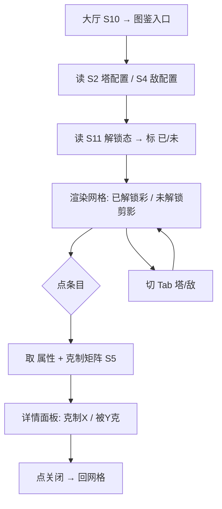
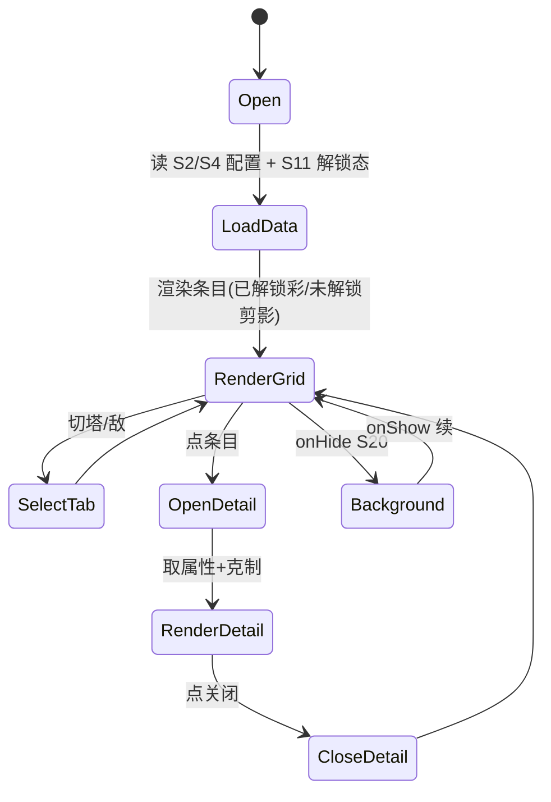
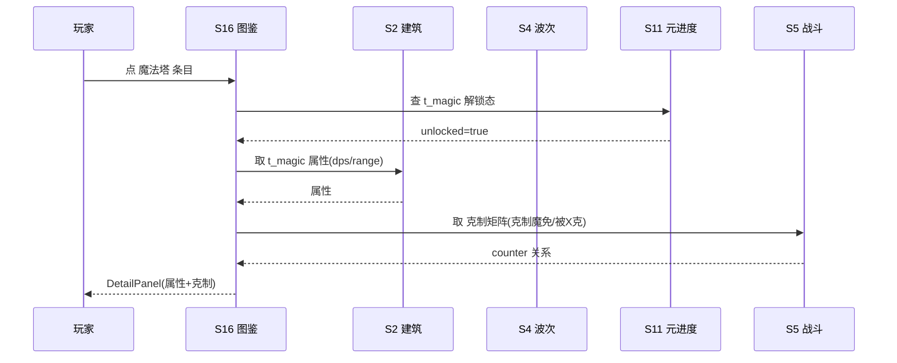

# 系统策划案：S16 图鉴系统 (Codex / Tower Index)

> 归属域：B 元进度社交域 · 层级/优先级：增强 / P2 · 关联 F 码：F38 · 关联：SYSTEM_BREAKDOWN §S16
> 状态：v0.2-detailed · 日期 2026-07-17
> 设计基准：UI 750×1334（Cocos Creator 3.8.8 · 微信小游戏）· 安全区：顶部 y<88、底部 y>1290 不放置可点组件
> 边界：不做实时配装推荐（v1.0）；不做图鉴社交（见 SYSTEM_BREAKDOWN §S16）。
> 数据来源：本系统**无独立写配置**，只读 `tower_config`(S2) 与 `enemy_config`(S4 衍生)；下方「消费 schema」为对接契约。

---

## 1. 系统 UI 布局（层级 + 像素线框 + 组件表 + 交互流程图）

### 1.1 布局层级（图鉴页，z=0–55）

| 层级 z | 层名 | 说明 |
|---|---|---|
| 0 | 背景层 BgLayer | 图鉴主题背景 |
| 40 | 标签切换 TabBar | 顶部：塔图鉴 / 敌图鉴 |
| 40 | 塔网格 TowerGrid | 主：网格展示 7 塔，已解锁彩色、未解锁剪影 |
| 40 | 敌网格 EnemyGrid | 子页：网格展示怪物，显示护甲类型 |
| 55 | 详情面板 DetailPanel | 点条目 → 属性 / 克制 / 弱点 |
| 46 | 返回 BackBtn | 左上回大厅 |

### 1.2 像素级线框（750×1334，ASCII 原型，单位 px）

```
  0       150      300      450      600      750
  ┌──────────────────────────────────────────────┐ y=0
  │ (20,40)⟲返回    ┌────┐┌────┐  TabBar 750×60    │ y=40/120
  │                │ 塔 ││ 敌 │                     │
  │  ┌──┐ ┌──┐ ┌──┐ ┌──┐ ┌──┐                    │ y=200 塔 96×96 ×5
  │  │箭│ │炮│ │冰│ │风│ │魔│  (已解锁彩)          │
  │  └──┘ └──┘ └──┘ └──┘ └──┘                    │
  │  ┌──┐ ┌──┐                                │ y=360
  │  │毒│ │电│  (未解锁: 剪影)                  │
  │  └──┘ └──┘                                │
  │        ┌──────────────────────┐           │ y=487 DetailPanel 420×360
  │        │ 魔法塔                 │           │
  │        │ DPS:[PLACEHOLDER]  范围:[PLACEHOLDER]      │           │
  │        │ 克制: 魔免怪           │           │
  │        │ 被克: —                │           │
  │        └──────────────────────┘           │
  └──────────────────────────────────────────────┘ y=1334
```

### 1.3 组件表（精确坐标 / 尺寸 / 层级 / 响应）

| 组件 ID | 位置(x,y) | 尺寸(w×h) | z | 响应行为 | 备注 |
|---|---|---|---|---|---|
| BgLayer | (0,0) | 750×1334 | 0 | 无交互 | — |
| BackBtn | (20,40) | 64×64 | 46 | 点 → 回 S10 | — |
| TabBar | (0,120) | 750×60 | 40 | 切 塔/敌 | 2 标签 |
| TowerGrid | (0,200) | 750×950 | 40 | 可滚，点条目 | 5 列，96×96 |
| TowerIcon(i) | (40 + (i%5)×143.5, 200 + floor(i/5)×160) | 96×96 | 40 | 点 → 详情 | 剪影=未解锁 |
| EnemyGrid | (0,200) | 750×950 | 40 | 可滚，点条目 | 子页，80×80 |
| EnemyIcon(j) | (40 + (j%5)×143.5, 200 + floor(j/5)×160) | 80×80 | 40 | 点 → 详情 | — |
| DetailPanel | (165,487) | 420×360 | 55 | 点关闭 → 关 | 属性/克制 |

### 1.4 交互流程图（大厅 → 图鉴 → 详情）



---

## 2. 逻辑功能（模块表 + 状态机 + 时序流程图 + 异常边界用例表）

### 2.1 模块表（触发条件 / 处理流程 / 输出）

| 模块 | 触发条件 | 处理流程 | 输出 |
|---|---|---|---|
| 数据加载 | 进图鉴 | 读 S2 塔配置 / S4 敌配置 | 列表 |
| 解锁态 | 读档(S11) | 标已/未解锁 | 显示态 |
| 详情查询 | 点条目 | 取属性 + 克制矩阵(S5) | 详情面板 |
| 克制提示 | 详情内 | 显「克制 X / 被 Y 克」 | 决策辅助 |

### 2.2 图鉴流程状态机（FSM · stateDiagram-v2）



### 2.3 时序流程图（详情查询，跨系统）



### 2.4 异常与边界用例表（程序员可实现级）

| 用例ID | 异常类型 | 触发条件 | 预期处理流程 | 输出 / 兜底 | 涉及系统 |
|---|---|---|---|---|---|
| E01 | 切后台 S20 | 图鉴页 `onHide` | 不丢失；`onShow` 续原 Tab/滚动位置 | 无丢失 | S20 |
| E02 | 数据损坏 S18 | 解锁态损坏 | 重置仅首发 4 塔已解锁；查看仍可用（剪影） | 不崩 | S18 |
| E03 | 配置缺失 | `tower_config`/`enemy_config` 缺条目/字段 | 该条目显「数据缺失」；缺字段显默认 + 告警 S25 | 不崩 | S25 |
| E04 | 未解锁塔详情 | 点未解锁塔 | 显剪影 + 解锁条件(S11)，**不显数值** | 防剧透 | S11 |
| E05 | 详情面板数据错 | 属性/克制矩阵非法 | 显默认值 + 告警 S25 | 不崩 | S25 |
| E06 | 微信登录失败 S42 | `wx.login` 失败 | 图鉴纯本地，不依赖登录 | 零阻塞 | S42(暂不做) |
| E07 | 网络中断 | — | 图鉴纯本地（数据来自 S2/S4 本地配置） | 不适用/N/A | — |
| E08 | 排行榜拉取超时 | — | 图鉴无关榜 | 不适用/N/A | — |
| E09 | 数值极值 | 属性极大值 | 显示截断（如 `9999+`） | 显示安全 | — |
| E10 | 配置缺失(整体) | `tower_config` 全缺 | 空图鉴 + 告警 S25 | 可进页 | S25 |
| E11 | 并发点击条目 | 连点条目 | `isOpening` 锁，防重复开面板 | 仅一次开 | — |
| E12 | 大清单滚动性能 | 条目多（塔+敌） | 虚拟列表/分页渲染，防卡顿 | 流畅 | — |

> 设计红线检查：无主导策略（图鉴为信息平权，无资源产出）；无认知过载（网格+详情两级）；无支柱漂移（服务 P5 降低新手焦虑）。

---

## 3. 配置表设计（完整字段 + 多行示例）

> 本系统仅定义**展示映射**，数据来自 S2/S4。下方 `codex_view_config` 为本系统写表；`tower_config` / `enemy_config` 为**消费契约**（由 S2/S4 提供，示例供程序对齐）。

### 3.1 表 `codex_view_config`（展示配置，本系统写表）

| 字段 | 类型 | 取值/范围 | 默认值 | 说明 |
|---|---|---|---|---|
| show_locked_as_silhouette | bool | true | true | 未解锁显剪影 |
| detail_fields | json | 字段列表 | ["dps","range","counter"] | 详情展示字段 |
| enemy_armor_hint | bool | true | true | 显护甲提示 |
| grid_cols | int | 4–6 | 5 | 网格列数 |
| icon_size | int | 64–120 | 96 | 图标尺寸 |
| show_unlock_cond | bool | true | true | 未解锁显解锁条件 |

**示例（JSON）**
```json
{
  "show_locked_as_silhouette": true,
  "detail_fields": ["dps","range","counter","weakness","growth"],
  "enemy_armor_hint": true,
  "grid_cols": 5,
  "icon_size": 96,
  "show_unlock_cond": true
}
```

### 3.2 消费契约 `tower_config`（来自 S2，只读，示例行）

| 字段 | 类型 | 说明 |
|---|---|---|
| tower_id | string | 塔主键（t_arrow/t_cannon/...） |
| name | string | 显示名 |
| dmg_type | enum | physical/magic/dot/control/eco |
| counter | string | 克制对象（敌 armor 类型） |
| weakness | string | 被克（null 多数） |
| base_dps | float | 基础 DPS（调优杆） |
| base_range | float | 基础射程 |
| growth | float | 每级成长系数 |

**示例（CSV）**
```csv
tower_id,name,dmg_type,counter,weakness,base_dps,base_range,growth
t_arrow,箭塔,physical,light_armor,null,[PLACEHOLDER]10,[PLACEHOLDER]120,1.25
t_magic,魔法塔,magic,immune_magic,null,[PLACEHOLDER]12,[PLACEHOLDER]110,1.30
t_wind,风塔,control,null,null,[PLACEHOLDER],[PLACEHOLDER],[PLACEHOLDER]
```

### 3.3 消费契约 `enemy_config`（来自 S4，只读，示例行）

| 字段 | 类型 | 说明 |
|---|---|---|
| enemy_id | string | 敌主键 |
| name | string | 显示名 |
| armor_type | enum | light_armor/heavy_armor/immune_magic/air/... |
| weak_tower | string | 弱点塔种 |
| base_hp | float | 基础 HP（调优杆） |

**示例（CSV）**
```csv
enemy_id,name,armor_type,weak_tower,base_hp
e_slime,史莱姆,light_armor,t_arrow,[PLACEHOLDER]30
e_golem,石巨人,heavy_armor,t_cannon,[PLACEHOLDER]120
e_wraith,幽灵,immune_magic,t_arrow,[PLACEHOLDER]80
```

---

## 4. 美术资源需求（帧数 / 分辨率 / 格式 / 切片）

| 资源 | 用途 | 帧数 | 分辨率 | 格式 | 切片要求 |
|---|---|---|---|---|---|
| `codex_bg` 图鉴背景 | 场景底 | 静态 | 750×1334 | JPG/PNG(压缩) | 单图 |
| `tower_icon_*` 塔图标(图鉴版) | 展示 | 静态(彩/剪影态) | 96×96 | PNG（含透明） | 双态：`_color`(已解锁)/`_silhouette`(去色暗化)；单图 |
| `enemy_icon_*` 敌图标 | 展示 | 静态 | 80×80 | PNG（含透明） | 单图 |
| `detail_panel` 详情面板底 | 弹层 | 静态 | 420×360 | PNG 九宫 | 3×3 切片 |
| `counter_arrow` 克制箭头 | 关系 | 静态(脉冲 2 帧可选) | 48×48 | PNG | 单图；脉冲用代码 tween |
| `tab_bar` 标签底 | 导航 | 静态 | 750×60 | PNG 九宫 | 3×3 切片 |

> 复用 S2/S4 美术；剪影=去色/暗化（代码处理，省资源）。资源走主包或首分包（S19）。
