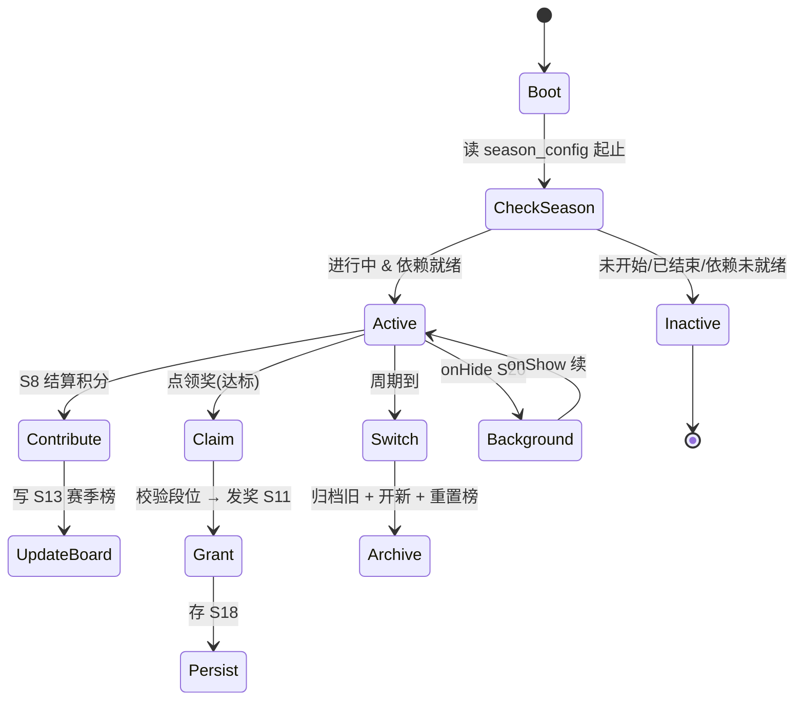
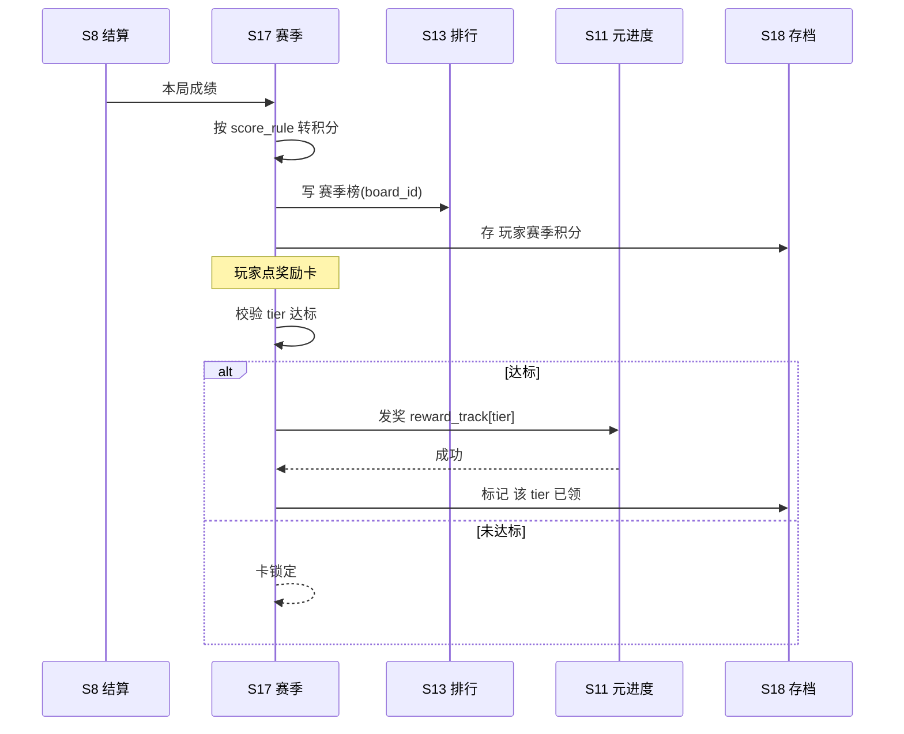

# 系统策划案：S17 赛季系统 (Season System)

## 0. 元数据头

- **归属域**：B 元进度社交域
- **层级/优先级**：探索 / P3
- **关联 F 码**：F21
- **关联文档**：SYSTEM_BREAKDOWN §S17；GDD：—（未列）
- **版本/状态**：v0.2-detailed · 2026-07-17
- **设计基准**：UI 750×1334（Cocos Creator 3.8.8 · 微信小游戏）· 安全区：顶部 y<88、底部 y>1290 不放置可点组件
- **依赖系统**：S08（结算积分源）/ S11（奖励发放 · meta_res）/ S13（赛季榜复用）/ S15（成就入账源）/ S18（存档）/ S10（倒计时红点）
- **门控 / 边界**：依赖 F13–F15（S11/S13/S15）稳定后才实装；本期 `enabled=false`，若依赖未达则入口隐藏（see §6 C-S17-1）。不做付费赛季通行证（合规后议）。
- **数值约定**：凡涉及周期长度 / 主题奖励 / 积分规则 / 上榜门槛的调优量已全部指针化（`value_ref`，见 §3.1 JSON 与 §5.6）；终值见 `balance/S17_season.json`。禁裸 `[PLACEHOLDER]`。
- **NEEDS-DESIGN 索引**：无（本系统所有 `[PLACEHOLDER]` 已在 `balance/S17_season.json` 给初值；见 §5.6）。

---

## 1. 系统 UI 布局（层级 + 像素线框 + 组件表 + 交互流程图）

### 1.1 布局层级（赛季页，z=0–55）

| 层级 z | 层名 | 说明 |
|---|---|---|
| 0 | 背景层 BgLayer | 赛季主题背景 |
| 40 | 赛季横幅 SeasonBanner | 顶部：主题名 + 倒计时 |
| 40 | 赛季榜 SeasonBoard | 中部：复用 S13 机制，独立周期榜 |
| 40 | 奖励轨道 RewardTrack | 下部：按段位/积分发奖，可领高亮 |
| 46 | 返回 BackBtn | 左上回大厅 |
| 47 | 倒计时红点 CDot | 赛季末 3 天提醒（接 S10） |

> 赛季榜复用 S13 状态机/渲染；奖励发放走 S11；主题关走 S14。

### 1.2 像素级线框（750×1334，ASCII 原型，单位 px）

```
  0       150      300      450      600      750
  ┌──────────────────────────────────────────────┐ y=0
  │ (20,40)⟲返回                                 │ y=40  BackBtn 64×64
  │ ┌──────────────────────────────────────┐     │ y=120 SeasonBanner 750×120
  │ │ 春日环防卫 🔥  倒计时 [dd]天[hh]时     │     │
  │ └──────────────────────────────────────┘     │ y=240
  │  ┌──┬─────────────────────────────┬─────┐    │ y=260 赛季榜 行高100(复用S13)
  │  │👑│ 我(赛季)    积分 1200          │ #1  │    │
  │  ├──┼─────────────────────────────┼─────┤
  │  │ 2│ 好友A        积分 1100          │     │    │
  │  └──┴─────────────────────────────┴─────┘    │ y=860
  │  ┌────┐┌────┐┌────┐┌────┐  RewardTrack      │ y=880 卡 160×200 横滚
  │  │T1  ││T2  ││T5  ││T8  │  段位奖励          │
  │  │✓领 ││ 领 ││锁  ││锁  │                    │
  │  └────┘└────┘└────┘└────┘                    │ y=1080
  └──────────────────────────────────────────────┘ y=1334
```

### 1.3 组件表（精确坐标 / 尺寸 / 层级 / 响应）

| 组件 ID | 位置(x,y) | 尺寸(w×h) | z | 响应行为 | 备注 |
|---|---|---|---|---|---|
| BgLayer | (0,0) | 750×1334 | 0 | 无交互 | 主题图 |
| BackBtn | (20,40) | 64×64 | 46 | 点 → 回 S10 | — |
| SeasonBanner | (0,120) | 750×120 | 40 | 无交互 | 主题名+倒计时 |
| Countdown | (400,200) | 300×40 | 41 | 无交互 | 实时倒计时 |
| SeasonBoard | (0,260) | 750×600 | 40 | 可滚，复用 S13 行 | 独立周期榜 |
| RewardTrack | (0,880) | 750×200 | 40 | 横滚，点卡领奖 | 段位卡 160×200 |
| RewardCard(k) | (20 + k×170, 880) | 160×200 | 40 | 点 → 领(达标) | 锁定/可领/已领态 |
| CDot | (690,130) | 24×24 | 47 | 无交互 | 末 3 天显示 |

### 1.4 交互流程图（大厅 → 赛季 → 贡献/领奖）

```mermaid
flowchart TD
    A[大厅 S10 → 赛季入口] --> B{赛季进行中 & S13/S11 实装?}
    B -- 否 --> Z[入口隐藏 / 显示预告]
    B -- 是 --> C[读 season_config + 积分 S18]
    C --> D[渲染横幅/榜/奖励轨道]
    D --> E[S8 结算 → 积分贡献 → S13 赛季榜]
    D --> F{点奖励卡(达标)}
    F -- 是 --> G[校验段位 → 发奖 S11]
    G --> H[持久化 + 标记已领]
    F -- 否(锁) --> D
    D --> I[周期到 → 归档 + 开新 + 重置榜]
```

---

## 2. 逻辑功能（模块表 + 状态机 + 时序流程图 + 异常边界用例表）

### 2.1 模块表（触发条件 / 处理流程 / 输出）

| 模块 | 触发条件 | 处理流程 | 输出 |
|---|---|---|---|
| 赛季周期 | 启动/定时 | 读赛季起止 → 判断是否进行中 | 赛季态 |
| 积分贡献 | S8 结算 | 按成绩转赛季积分 → S13 赛季榜 | 积分+ |
| 奖励发放 | 领奖(达标) | 校验段位 → 发奖(S11) | 奖励↑ |
| 赛季切换 | 周期到 | 归档旧赛季 → 开新赛季 → 重置榜 | 轮换 |
| 倒计时提醒 | 末 3 天 | 红点(S10) | 回归提示 |

### 2.2 赛季流程状态机（FSM · stateDiagram-v2）



### 2.3 时序流程图（积分贡献 + 领奖，跨系统）



### 2.4 异常与边界用例表（程序员可实现级）

| 用例ID | 异常类型 | 触发条件 | 预期处理流程 | 输出 / 兜底 | 涉及系统 |
|---|---|---|---|---|---|
| E01 | 切后台 S20 | 赛季页 `onHide` | 存查看态(S18)；`onShow` 续 | 无丢失 | S20/S18 |
| E02 | 数据损坏 S18 | 赛季积分/已领标记损坏 | 重置当前赛季积分（保留已领标记防重领） | 不崩 | S18 |
| E03 | 赛季配置缺失 | `season_config` 缺失 | 隐藏入口，不报错（探索系统门控） | 优雅降级 | — |
| E04 | 积分异常(S24) | 积分跳变/超阈值 | 拒计，标记；不进榜 | 护榜公平 | S24 |
| E05 | 领奖失败 | S11 入账异常 | 回滚已领标记 → 告警 S25 → 可重试 | 不丢奖 | S25 |
| E06 | 切换竞态 | 周期临界多触发切换 | 切换加锁，单切换（原子） | 防双归档 | — |
| E07 | 微信登录失败 S42 | `wx.login` 失败 | 赛季纯本地（积分本地），好友榜降级本地 | 零阻塞 | S42(暂不做) |
| E08 | 网络中断 | — | 赛季积分纯本地；榜复用 S13 本地兜底 | 不适用/N/A | S13 |
| E09 | 数值极值 | 积分极大值 / 段位溢出 | 积分上限 `value_ref: balance/S17_season.json#season_score_cap` 钳制；段位越界取末档 | 不卡死 | — |
| E10 | 赛季未开始/已结束 | 当前无活跃赛季 | 入口隐藏 或 显「下赛季预告」 | 不报错 | — |
| E11 | 并发领奖 | 连点奖励卡 | `isClaiming` 锁 0.3s，幂等防双领 | 仅一次发奖 | — |
| E12 | 倒计时边界 | 跨年/时区 | 用本地时间计算；末 3 天红点(S10) | 提醒正确 | S10 |

> 设计红线检查：无主导策略（赛季为限时活跃峰值，无资源刷取循环）；无认知过载（榜+轨道两级）；无支柱漂移（服务 P5 留存，门控于依赖稳定）。
> ⚠ 门控风险：若 S13/S11 在 v1.0 未实装，本系统应**整体隐藏入口**，不暴露半成品（SYSTEM_BREAKDOWN §S17）。

---

## 3. 配置表设计（完整字段 + 多行示例）

> 数值全部指针化：JSON 示例内 `[PLACEHOLDER]` 改为 `value_ref: balance/S17_season.json#<param_id>`；字段表 `默认值` 列同步指向。终值见 `balance/S17_season.json`。

### 3.1 表 `season_config`（赛季配置）

| 字段 | 类型 | 取值/范围 | 默认值 | 说明 |
|---|---|---|---|---|
| season_id | string | 唯一 | "s01" | 赛季主键 |
| name | string | ≤10 字 | — | 主题名 |
| start_time | datetime | — | — | 开始（本地时间） |
| end_time | datetime | — | — | 结束 |
| score_rule | json | 积分规则 | value_ref: balance/S17_season.json#season_score_per_wave / _win / _max_per_day | 成绩→积分（指针化，见 JSON 示例） |
| reward_track | json | 段位奖励 | value_ref: balance/S17_season.json#season_tier1/5/8_score_need / _reward | 奖励表（指针化，见 JSON 示例） |
| board_id | string | 关联 S13 | "season_best" | 赛季榜 |
| theme_asset | string | 主题资源 id | "season_s01" | 横幅/专属资源 |
| remind_days | int | 1–7 | 3 | 末 N 天红点 |
| enabled | bool | false | false | 总开关（依门控，见 §6 C-S17-1） |

**示例（JSON）**
```json
{
  "season_id": "s01",
  "name": "春日环防卫",
  "start_time": "2026-08-01T00:00:00",
  "end_time": "2026-08-28T23:59:59",
  "score_rule": {
    "per_wave": "value_ref: balance/S17_season.json#season_score_per_wave",
    "win": "value_ref: balance/S17_season.json#season_score_win",
    "max_per_day": "value_ref: balance/S17_season.json#season_score_max_per_day"
  },
  "reward_track": [
    {"tier": 1, "score_need": "value_ref: balance/S17_season.json#season_tier1_score_need", "reward": "value_ref: balance/S17_season.json#season_tier1_reward"},
    {"tier": 5, "score_need": "value_ref: balance/S17_season.json#season_tier5_score_need", "reward": "value_ref: balance/S17_season.json#season_tier5_reward"},
    {"tier": 8, "score_need": "value_ref: balance/S17_season.json#season_tier8_score_need", "reward": "value_ref: balance/S17_season.json#season_tier8_reward"}
  ],
  "board_id": "season_best",
  "theme_asset": "season_s01",
  "remind_days": 3,
  "enabled": false
}
```

### 3.2 表 `season_progress`（赛季进度持久化，S18）

| 字段 | 类型 | 取值/范围 | 默认值 | 说明 |
|---|---|---|---|---|
| season_id | string | 关联 | "s01" | 赛季主键 |
| score | int | 0–max | 0 | 当前赛季积分（上限钳制见 `value_ref: balance/S17_season.json#season_score_cap`） |
| claimed_tiers | json | 已领段位数组 | [] | 防重领 |
| archived | bool | false | false | 是否已归档 |

**示例（CSV）**
```csv
season_id,score,claimed_tiers,archived
s01,1200,[1,5],false
```

---

## 4. 美术资源需求（帧数 / 分辨率 / 格式 / 切片）

| 资源 | 用途 | 帧数 | 分辨率 | 格式 | 切片要求 |
|---|---|---|---|---|---|
| `season_banner` 赛季横幅 | 主题 | 静态(流光 2 帧可选) | 750×120 | JPG/PNG(压缩) | 单图；流光用代码 tween |
| `season_bg` 赛季背景 | 场景底 | 静态 | 750×1334 | JPG/PNG(压缩) | 单图 |
| `season_board` 赛季榜(复用) | 列表 | 静态 | 复用 S13 行底 | — | 复用 S13 |
| `reward_card` 奖励轨道卡 | 展示 | 静态(三态:锁/可领/已领) | 160×200 | PNG 九宫 | 三态单图；3×3 切片 |
| `season_tower` 赛季专属塔(可选) | 内容 | 按 S2 | 复用 S2 塔美术 | — | 接 S2 |
| `season_stage` 赛季专属关(可选) | 内容 | 按 S14 | 复用 S14 | — | 接 S14 |
| `countdown_dot` 倒计时红点 | 提示 | 静态 | 24×24 | PNG | 复用 S10 红点 |

> 赛季依赖 S13/S11/S14 稳定后做；主题资源分包 S19。特效见 S23。

---

## 5. 实现契约（AI 可消费结构化索引）

### 5.1 输入数据结构

| 字段 | 类型 | 来源 | 说明 |
|---|---|---|---|
| run_result | struct | S08 结算 | 本局成绩 `{wave_count:int, is_win:bool}`，用于转积分 |
| season_config | json | config/season_config.json | 赛季配置（score_rule / reward_track / board_id / enabled） |
| player_season_progress | struct | S18 存档 | `{season_id, score, claimed_tiers[], archived}` |
| redeem_request | struct | UI 点击 | `{tier:int}`，玩家点奖励卡 |
| red_dot_cfg | int | season_config.remind_days | 末 N 天红点阈值（接 S10） |

### 5.2 输出数据结构

| 字段 | 类型 | 去向 | 说明 |
|---|---|---|---|
| score_delta | int | S13 赛季榜 | 本局贡献积分增量 |
| grant_request | struct | S11 元进度 | `{tier, reward:meta_res}`，段位奖励发放 |
| season_progress_snapshot | struct | S18 存档 | 持久化积分 / 已领标记 |
| ui_render_state | struct | UI | `{is_active, season_state, board_rows[], track_cards[].state, cdot_visible}` |

### 5.3 跨系统接口调用表

| caller | callee | function | 方向 | 用途 |
|---|---|---|---|---|
| S08 | S17 | `addSeasonScore(runResult)` | in | 结算成绩转赛季积分并贡献 |
| S17 | S13 | `submitSeasonBoard(boardId, score)` | out | 写赛季榜（复用 S13 状态机） |
| S17 | S11 | `grantMetaReward(tier, reward)` | out | 段位奖励发放（meta_res，与签到/成就同源） |
| S17 | S18 | `loadSeasonProgress(seasonId)` | in | 读积分 / 已领标记 |
| S17 | S18 | `saveSeasonProgress(snapshot)` | out | 持久化积分 / 已领标记 |
| S17 | S10 | `setRedDot(visible)` | out | 末 3 天倒计时红点提醒 |

### 5.4 错误码表

| E# | 场景 | 兜底 | 涉及系统 |
|---|---|---|---|
| E01 | 切后台 onHide | 存查看态，onShow 续 | S20/S18 |
| E02 | 存档损坏 | 重置积分（保留已领防重领） | S18 |
| E03 | 配置缺失 | 隐藏入口，不报错 | — |
| E04 | 积分异常(S24) | 拒计标记，不进榜 | S24 |
| E05 | 领奖失败 | 回滚已领 → 告警 → 可重试 | S25 |
| E06 | 切换竞态 | 切换加锁，单切换原子 | — |
| E07 | 微信登录失败 | 纯本地，好友榜降级 | S42 |
| E08 | 网络中断 | 纯本地 + S13 本地兜底 | S13 |
| E09 | 数值极值 | `season_score_cap` 钳制；段位越界取末档 | — |
| E10 | 无活跃赛季 | 入口隐藏 / 预告 | — |
| E11 | 并发领奖 | `isClaiming` 锁 0.3s 幂等 | — |
| E12 | 倒计时边界 | 本地时间；S10 红点 | S10 |

### 5.5 状态转换表（从 §2.2 FSM 提取，AI 可消费）

| state | event | transition | action |
|---|---|---|---|
| Boot | onBoot | CheckSeason | 读 season_config 起止 |
| CheckSeason | 进行中 & 依赖就绪 | Active | 渲染横幅/榜/奖励轨 |
| CheckSeason | 未开始\|已结束\|依赖未就绪 | Inactive | 隐藏入口 |
| Active | S8 结算积分 | Contribute | 写 S13 赛季榜 |
| Contribute | 写榜完成 | UpdateBoard | 更新榜 |
| Active | 点领奖(达标) | Claim | 校验段位 |
| Claim | 达标 | Grant | 发奖 S11 |
| Grant | 成功 | Persist | 存 S18 + 标记已领 |
| Active | 周期到 | Switch | 归档旧 + 开新 + 重置榜 |
| Active | onHide | Background | 存查看态 |
| Background | onShow | Active | 续 |
| Inactive | — | [*] | 不报错 |

### 5.6 数值消费清单（param_id + 来源文件）

| param_id | module | unit | 来源文件 | 说明 |
|---|---|---|---|---|
| season_score_cap | (clamp) | 分 | balance/S17_season.json | 积分上限钳制（§2.4 E09） |
| season_score_per_wave | season_config.score_rule | 分/波 | balance/S17_season.json | 每波得分 |
| season_score_win | season_config.score_rule | 分/胜 | balance/S17_season.json | 通关额外分 |
| season_score_max_per_day | season_config.score_rule | 分/天 | balance/S17_season.json | 每日获取上限 |
| season_tier1_score_need | season_config.reward_track.T1 | 分 | balance/S17_season.json | T1 段位门槛 |
| season_tier1_reward | season_config.reward_track.T1 | meta_res | balance/S17_season.json | T1 奖励 |
| season_tier5_score_need | season_config.reward_track.T5 | 分 | balance/S17_season.json | T5 段位门槛 |
| season_tier5_reward | season_config.reward_track.T5 | meta_res | balance/S17_season.json | T5 奖励 |
| season_tier8_score_need | season_config.reward_track.T8 | 分 | balance/S17_season.json | T8 段位门槛 |
| season_tier8_reward | season_config.reward_track.T8 | meta_res | balance/S17_season.json | T8 奖励 |

> 共 10 个 param_id，全部已在 `balance/S17_season.json` 给初值，无 NEEDS-DESIGN。奖励币种接 S11 `meta_res`（与 S12/S15 同源，避免经济失衡）。

---

## 6. 冲突与待裁定（三要素格式）

### C-S17-1 · 入口门控与 enabled 开关
- **current_implementation**：依赖 S11/S13/S15 稳定；未达则入口隐藏，`season_config.enabled=false`（本期不暴露半成品）。
- **pending_decision**：是否在 v1.0 解除门控启用本系统（需 DO 裁定依赖就绪判定标准与启用里程碑）。
- **owner**：S17（待 DO 终审）

### C-S17-2 · 奖励币种（meta_res 接入）
- **current_implementation**：段位奖励走 S11 `meta_res`（与 S12 签到 / S15 成就同源，避免经济失衡）。
- **pending_decision**：若 S11 `meta_res` 旧语义改用途（见 §6 C-S11-1），本系统奖励发放目标是否同步切换。
- **owner**：S17 + S11（待 DO 终审）
