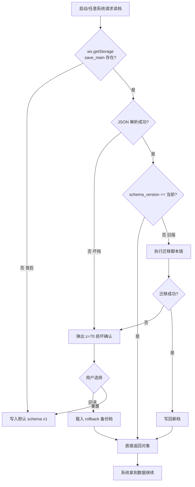
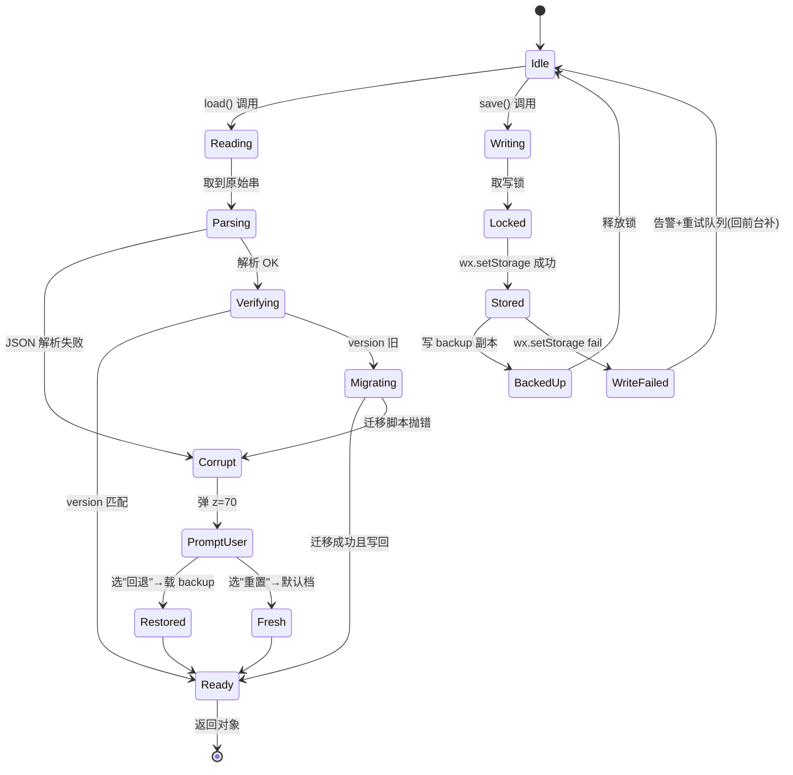
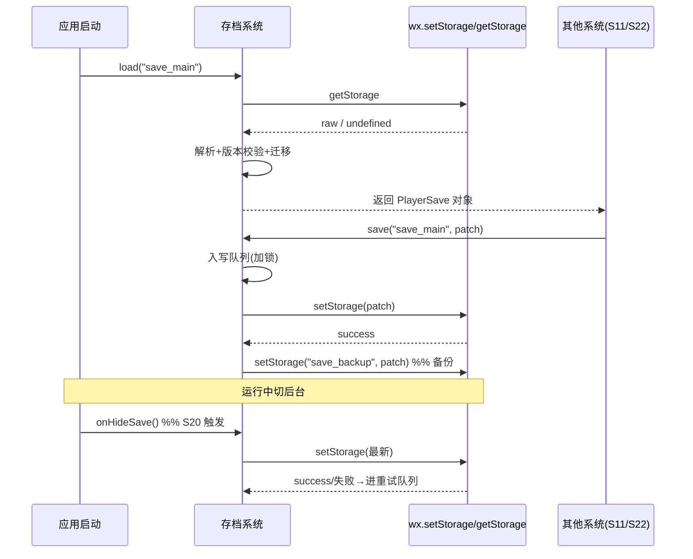

<!-- 编码: UTF-8 -->
# 系统策划案：S18 存档系统 (Save System)

> 归属域：C 平台工程运营域 · 层级/优先级：MVP / P1 · 关联 F 码：F11 F32 · 关联：SYSTEM_BREAKDOWN §S18 · GDD §8（适配）
> 状态：v0.2-detailed · 日期：2026-07-17
> 上一版：v0.1-draft（仅骨架：模块表 + 单表 + 极简异常）
> **v0.2-rev（耦合重构）：** 按 DO 新规明确——**木(wood) 为 session 货币，绝不写入本存档**。存档仅含：元进度(meta_res/unlocked/best_*)、设置(settings，含新增 `auto_cast_active` 见 S22)、签到、成就、引导标记等。木在每局开始恒为 0、局内仅由怪掉(S04)+应急兑换(S03)产生、局结束即弃，不进入 `save_schema`。

---

## 0. 修订说明（v0.1 → v0.2 加深点）

| 章节 | v0.1 | v0.2 加深内容 |
|------|------|---------------|
| §1 UI 布局 | 仅 1 张组件表 | 加 z 层级定义、损坏提示像素线框（750×1334 坐标）、交互流程图 |
| §2 逻辑功能 | 模块表 5 行 + 4 条异常 | 加读写/迁移**状态机**、读档**时序图**、**异常与边界用例表（12 类）** |
| §3 配置表 | 单表 7 字段 | 拆 `save_schema`（完整字段含迁移元信息）+ `save_migration`（迁移脚本表），**多行示例** + 迁移示例 |
| §4 美术资源 | 1 行占位 | 加组件规格：分辨率/格式/九宫切片要求 |

---

## 1. 系统 UI 布局

### 1.1 层级定义（z-order）
| 层级 z | 内容 | 说明 |
|--------|------|------|
| 0–50 | 玩法/HUD（S7） | 与存档无关 |
| 60 | 通用弹窗底（复用 S10/S08） | 损坏提示挂载层 |
| 70 | **存档损坏确认弹层** | 仅异常时显示，z 高于玩法，低于 loading(80) |

> 正常态：存档系统**无任何可见 UI**，读写静默（后台）。仅当读档检测到坏档/不可恢复时，弹 z=70 确认框。

### 1.2 像素级线框（750×1334 设计基准）

**场景：存档损坏确认弹层（z=70）** — 居中，遮罩半透黑 0.5α

```
┌─────────────────────────────────────────────── 750px ─┐ y=0
│   (半透遮罩 z=60，全屏 750×1334，rgba(0,0,0,0.5))        │
│                                                         │
│              ┌──────── 360px ────────┐  (x=195, y=547) │ y=547
│              │  存档损坏 / 版本不兼容  │                  │
│              │  ───────────────────  │                  │
│              │  检测到本地存档异常。   │  (标题 32px, 行)│
│              │  可重置为新档，或尝试  │                  │
│              │  回退到上一次正常存档。 │                  │
│              │                        │                  │
│              │ [ 回退上一档 ] [ 重置 ]│  (两按钮 150×72) │
│              └────────────────────────┘  (h=240)        │ y=787
└─────────────────────────────────────────────────────────┘ y=1334
   按钮行：回退 (x=215,y=700,150×72) / 重置 (x=385,y=700,150×72)
```

### 1.3 组件表
| 组件 | 坐标(x,y) | 尺寸(w×h) | z | 响应行为 |
|------|-----------|-----------|---|----------|
| 遮罩层 | (0,0) | 750×1334 | 60 | 半透黑，点击不穿透（无操作） |
| 弹窗面板 | (195,547) | 360×240 | 70 | 容器，圆角 16，九宫底 |
| 标题文本 | (215,575) | 320×40 | 71 | 静态 |
| 说明文本 | (215,625) | 320×60 | 71 | 静态，自动换行 |
| 回退按钮 | (215,700) | 150×72 | 72 | 点→回退上次好档→重读→进大厅 |
| 重置按钮 | (385,700) | 150×72 | 72 | 点→清空 save_main→新建默认档→进大厅 |
| （正常态） | — | — | — | 无组件，静默读写 |

### 1.4 交互流程图（正常 vs 损坏）


---

## 2. 逻辑功能

### 2.1 模块表
| 模块 | 触发条件 | 处理流程 | 输出 |
|------|----------|----------|------|
| 统一写接口 `save(key,val)` | 任一系统需落档（含 S20 onHide） | 入写队列 → 序列化 → `wx.setStorage` → 写成功后更新 rollback 备份 | 持久化 + 备份 |
| 统一读接口 `load(key)` | 启动/系统初始化 | `wx.getStorage` → 解析 → 版本校验 →（必要时迁移） | 结构化对象 |
| Schema 定义 | 初始化 | 定 `save_schema` 结构（版号 + 各域字段） | 数据结构契约 |
| 版本迁移 | 读档 `schema_version < CURRENT` | 按 `save_migration` 脚本链逐版迁移 | 兼容新档 |
| 容错 | 读档失败/损坏/迁移失败 | 检测 → 尝试 rollback → 否弹 z=70 提示 → 重置 | 不崩溃 |
| 防并发写 | 多系统同帧写 | 单写锁（Promise 队列）+ 写中标记 | 一致，无竞态覆盖 |
| 备份机制 | 每次成功写后 | 复制当前档到 `save_backup`（最近 1 份） | 可回退 |

### 2.2 状态机（读写 + 迁移生命周期）


### 2.3 时序图（启动读档 + onHide 存档）


### 2.4 异常与边界用例表
| 编号 | 场景 | 触发条件 | 预期处理 | 输出/兜底 |
|------|------|----------|----------|-----------|
| E1 | 首启无档 | `getStorage` 返回 undefined | 写默认 `save_schema` v1 | 新档，进入引导 |
| E2 | 坏档（JSON 错） | 文件被截断/篡改 | 解析失败→尝试 backup→仍败弹 z=70 | 用户回退/重置 |
| E3 | 存储满（≈10MB） | 微信本地配额耗尽，`setStorage` fail | 清理非关键缓存（日志/临时）+ 压缩后重试；仍败告警 | 提示"存储空间不足"，关键档保活 |
| E4 | 写中途强杀 | onHide 写未完成即被杀 | 下次启动读档：校验完整性字段（checksum），不完整→用 backup | 不丢关键进度 |
| E5 | 迁移脚本失败 | 旧版→新版脚本抛异常 | 停迁移，载 backup；无 backup 则弹 z=70 | 不丢旧档，可手动重置 |
| E6 | 并发写 | S20 onHide + S8 结算同帧写 | 写锁/Promise 队列串行化；后者等前者完成 | 无相互覆盖 |
| E7 | 写中读 | 写锁持有期间 load | load 读锁（或返回上次完整对象），不读半截 | 读到一致态 |
| E8 | 版本号异常 | `schema_version` ≤0 或非整数 | 视为损坏/未知版→走 Corrupt→backup/重置 | 安全兜底 |
| E9 | 字段类型不符 | 某字段类型与 schema 不符（如 `best_wave` 为字符串） | 逐字段校验+默认值兜底（schema 驱动） | 缺字段用默认，不崩 |
| E10 | 单值超容 | 某数组（成就）超大 | 截断到上限 + 告警 S25 | 保核心字段 |
| E11 | wx API 失败 | 微信接口 fail 回调（权限/异常） | 捕获 fail→重试 1 次→仍败入补存队列（onShow 补） | 不阻塞玩法 |
| E12 | 数据损坏但可局部修复 | 部分字段坏、部分好 | 保留好字段、坏字段重置默认 | 最大保留进度 |

---

## 3. 配置表设计

### 3.1 表：`save_schema`（主存档结构，key = `save_main`，类型：本地 JSON）
| 字段 | 类型 | 取值范围 | 默认值 | 说明 |
|------|------|----------|--------|------|
| schema_version | int | ≥1 | 1 | 结构版本号（迁移依据） |
| checksum | string | 非空 | "" | 完整性校验和（防离线篡改，交 S24） |
| meta_res | int | ≥0 | 0 | 元资源（S11） |
| best_wave | int | ≥0 | 0 | 最佳波数（S13 数据源） |
| best_tower_level | int | ≥0 | 0 | 最高塔等级（S13 备选维度） |
| signin | object | 见子结构 | {last:"",streak:0,claimed:[]} | 签到态（S12） |
| unlocked | string[] | S11 节点 id | [] | 已解锁节点 |
| settings | object | 见 S22 `settings_config` | 默认设置 | 玩家偏好 |
| achievements | object | {id:bool} | {} | 成就态（S15） |
| tutorial_done | bool | true/false | false | 引导完成（S9） |
| created_at | string | ISO8601 | "" | 建档时间 |
| updated_at | string | ISO8601 | "" | 末次写时间 |
| player_level | int | ≥1 | 1 | 玩家等级（S29 玩家等级系统，跨局持久化） |
| current_xp | int | ≥0 | 0 | 当前等级累计经验（S29，跨局持久化） |
| unlocked_features | json array of feature_id | feature_id 列表 | [] | 已解锁功能集（由 S29 `unlock_config` 等级门槛驱动；区别于 `unlocked`(S11 节点 id)） |

> **非持久化声明（v0.2-rev）：** `wood`（木）**不在** `save_schema` 中——它是 session 货币（每局开始 0、局内怪掉+应急兑换、局终即弃）。若未来误将木写入存档，迁移/校验脚本须拒绝并回退到 0。`settings` 现含 `auto_cast_active`（见 S22）。

> **S29 持久化补字段（v0.2 S29 新增）：** 以上三字段为 S29 玩家等级系统跨局持久化所需；木头(wood) 为 session 货币，不写入存档（见 S03/S04）。

**`signin` 子结构**
| 子字段 | 类型 | 说明 |
|--------|------|------|
| last | string | 末次签到日期 YYYY-MM-DD |
| streak | int | 连续天数 |
| claimed | int[] | 已领日序号（防重复领） |

### 3.2 表：`save_migration`（迁移脚本注册，代码内表 + 本配置描述）
| 字段 | 类型 | 说明 |
|------|------|------|
| from_version | int | 源版本 |
| to_version | int | 目标版本（=from+1，链式） |
| transform | string | 迁移函数 id（代码实现） |
| note | string | 变更说明（审计） |

### 3.3 示例数据（多行）
**主档示例（v1 新玩家）**
```json
{
  "schema_version": 1,
  "checksum": "a1b2c3d4",
  "meta_res": 0,
  "best_wave": 0,
  "best_tower_level": 0,
  "signin": {"last":"","streak":0,"claimed":[]},
  "unlocked": [],
  "player_level": 1,
  "current_xp": 0,
  "unlocked_features": [],
  "settings": {"bgm":true,"sfx":true,"shake":true,"font_size":"medium","language":"zh-CN"},
  "achievements": {},
  "tutorial_done": false,
  "created_at": "2026-07-17T10:00:00+08:00",
  "updated_at": "2026-07-17T10:00:00+08:00"
}
```
**主档示例（v1 老玩家，已玩）**
```json
{
  "schema_version": 1,
  "checksum": "e5f6...",
  "meta_res": 120,
  "best_wave": 18,
  "best_tower_level": 7,
  "signin": {"last":"2026-07-17","streak":3,"claimed":[1,2,3]},
  "unlocked": ["n_magic","n_poison"],
  "player_level": 1,
  "current_xp": 0,
  "unlocked_features": [],
  "settings": {"bgm":false,"sfx":true,"shake":true,"font_size":"large","language":"zh-CN"},
  "achievements": {"a_firstkill":true,"a_zeroleak":false},
  "tutorial_done": true,
  "created_at": "2026-07-01T09:00:00+08:00",
  "updated_at": "2026-07-17T21:30:00+08:00"
}
```
**迁移脚本链示例（v1→v2 规划，待裁定时启用）**
| from_version | to_version | transform | note |
|--------------|-----------|-----------|------|
| 1 | 2 | `add_best_tower_level` | 新增最高塔等级字段，默认 0 |
| 2 | 3 | `split_signin_claimed` | signin.claimed 由 bool 改 int[] |

> 调优杆：`[PLACEHOLDER]` 存储上限（微信约 10MB 本地，以平台当前规范为准）；`[PLACEHOLDER]` 备份保留份数（默认 1 份）；`[PLACEHOLDER]` 完整性校验算法（本地基础校验，深防作弊见 S24）。

---

## 4. 美术资源需求

| 资源 | 类型 | 帧数 | 分辨率 | 格式 | 切片要求 | 用途 |
|------|------|------|--------|------|----------|------|
| 存档损坏弹窗底 | UI 九宫 | 1（静态） | 360×240（九宫源 64×64） | PNG-8/ETC2 | 九宫 16px 边，圆角 16 | z=70 容器 |
| 弹窗遮罩 | UI | 1 | 750×1334 | PNG（半透） | 全屏拉伸 | z=60 遮罩 |
| 回退/重置按钮 | UI 状态图 | 2（常态/按下） | 150×72×2 | PNG-8 | 各态独立切片 | 操作按钮 |
| 通用图标（警告） | UI | 1 | 48×48 | PNG-8 | 单帧 | 弹窗标题前 |
| （正常态） | — | — | — | — | — | 无美术，静默读写 |

> 纯逻辑系统；弹窗样式、按钮、遮罩均复用通用 UI 组件库（S10/S08），本系统不新增美术规范，仅声明挂载层级与坐标。图标切片遵循微信小游戏单图 ≤ 128KB、合图用图集（见 S19 F34）。
