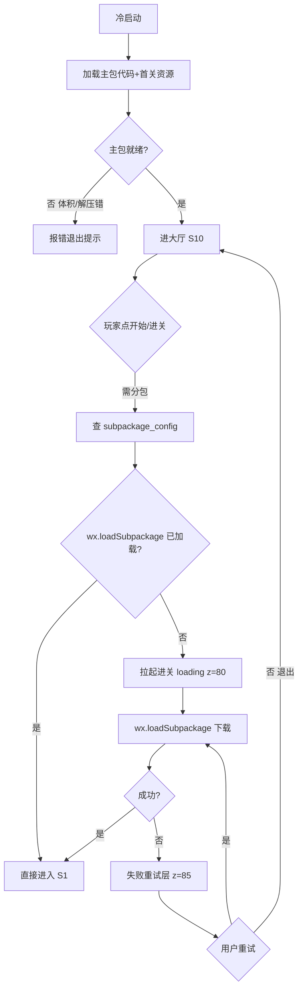
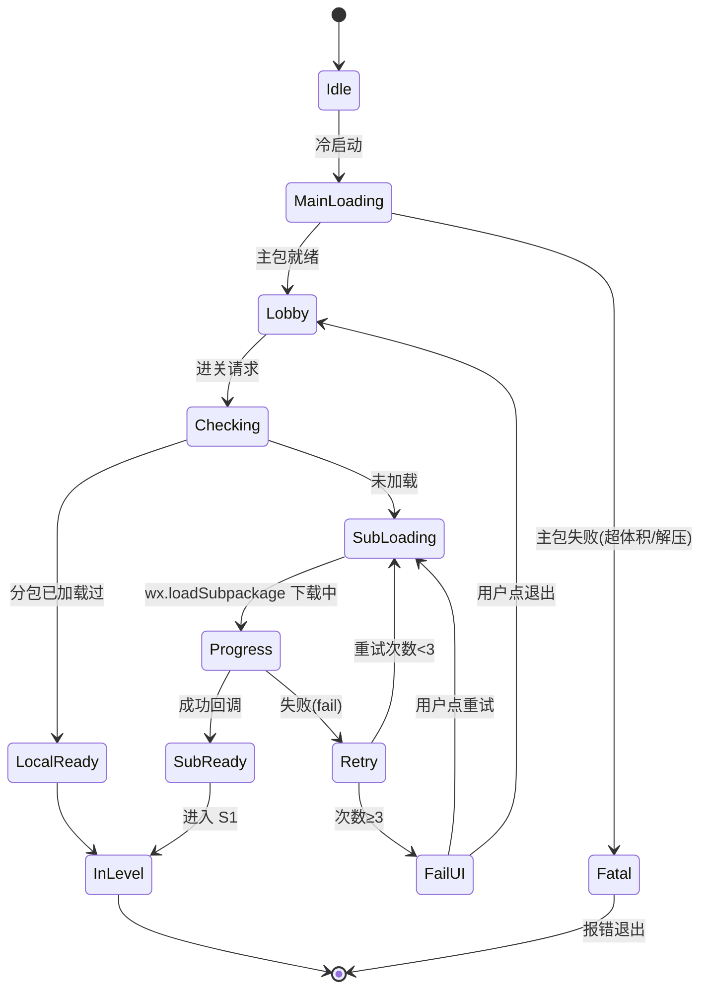
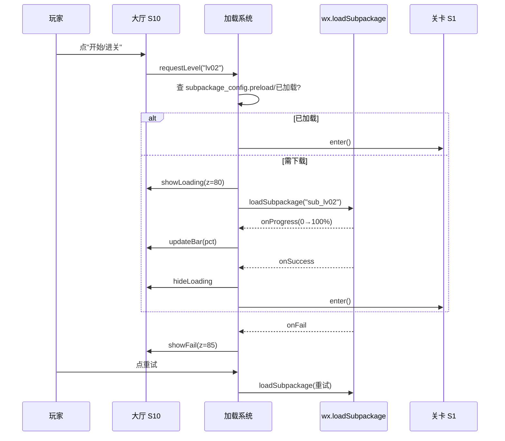

<!-- 编码: UTF-8 -->
# 系统策划案：S19 分包 / 资源加载系统 (Asset / Subpackage System)

## 0. 元数据头

- 归属域：C 平台工程运营域
- 层级 / 优先级：MVP / P1
- 关联 F 码：F30 F34 F35
- 关联系统：S10（大厅进关）、S1（进关）、S23（音频资产挂载 F35）、F23（构建期生成配置）、S20（切后台暂停下载）、S25（告警）
- 版本：v0.2-detailed（2026-07-17）
- 依赖：`wx.loadSubpackage`；F23 构建管线；S23 资源管线(F34/F35)
- NEEDS-DESIGN 索引：S19-ND1（分包下载超时 s，NEEDS-DESIGN owner:S19 due:P4-tuning）｜S19-ND2（微信分包/总包体积上限，NEEDS-DESIGN owner:S19 due:P3-platform）

---

### 0.1 修订说明（v0.1 → v0.2 加深点）

| 章节 | v0.1 | v0.2 加深内容 |
|------|------|---------------|
| §1 UI 布局 | 3 行组件表 | 加 z 层级、启动/进关/失败三态像素线框（坐标+进度条）、交互流程图 |
| §2 逻辑功能 | 模块表 5 行 + 4 异常 | 加**分包加载状态机**、**加载时序图**、**异常边界用例表（12 类，含下载中断重试）** |
| §3 配置表 | 单表 5 字段 | `subpackage_config` 扩字段（含 md5/优先级/依赖）+ **多行示例（关卡包/音频包/图集包）** |
| §4 美术资源 | 4 行占位 | 加帧数/分辨率/格式/切片（Logo/进度条/重试/骨架） |

---

## 1. 系统 UI 布局

### 1.1 层级定义（z-order）
| 层级 z | 内容 | 说明 |
|--------|------|------|
| 70 | 暂停/弹窗 | 低于 loading |
| 80 | **加载层（本系统）** | 全屏遮罩 + 进度，覆盖玩法 |
| 85 | **加载失败重试层** | z 高于普通 loading，弹重试按钮 |

### 1.2 像素级线框（750×1334 设计基准）

**A. 启动 loading（首屏，z=80）**
```
┌──────────── 750px ────────────┐ y=0
│   (背景图 z=80 全屏 750×1334)  │
│                                 │
│        ┌── 200px ──┐            │
│        │  Logo     │ (x=275,y=420)│ y=420
│        │  200×200  │            │ y=620
│        └───────────┘            │
│   ┌──── 300px 进度条底 ────┐    │ y=760
│   │████████░░░░░░░░░░░░░│(x=225,300×16)│ y=760
│   └────────────────────────┘    │ y=776
│   资源加载中 62%        (x=225,y=800,300×40)│
└─────────────────────────────────┘ y=1334
```

**B. 进关加载（轻量，z=80，半透）**
```
│  (玩法场景已可见，半透遮罩 rgba(0,0,0,0.35))   │
│         ⠿ 转圈 (x=355,y=620,40×40)             │
│       "关卡资源加载中…" (x=225,y=680,300×40)   │
```

**C. 加载失败重试（z=85）**
```
│  ┌──── 360px 提示框 ────┐ (x=195,y=547,360×240)│
│  │ 资源加载失败           │                      │
│  │ 网络不稳定，可重试。   │                      │
│  │ [ 重试 ]  [ 退出 ]     │ (各 150×72)          │
│  └────────────────────────┘                      │
│  重试 (x=215,y=700,150×72) 退出 (x=385,y=700,150×72)│
```

### 1.3 组件表
| 组件 | 坐标(x,y) | 尺寸(w×h) | z | 响应行为 |
|------|-----------|-----------|---|----------|
| 启动背景 | (0,0) | 750×1334 | 80 | 静态 |
| Logo | (275,420) | 200×200 | 81 | 静态/轻微旋转 |
| 进度条底 | (225,760) | 300×16 | 81 | 静态槽 |
| 进度条填充 | (225,760) | 0–300×16 | 82 | 宽度随进度 0→300 |
| 进度文字 | (225,800) | 300×40 | 82 | "资源加载中 NN%" |
| 进关骨架遮罩 | (0,0) | 750×1334 | 80 | 半透 0.35α |
| 进关转圈 | (355,620) | 40×40 | 81 | 旋转动画 |
| 失败提示框 | (195,547) | 360×240 | 85 | 容器 |
| 重试按钮 | (215,700) | 150×72 | 86 | 点→重触发加载流程 |
| 退出按钮 | (385,700) | 150×72 | 86 | 点→回大厅(S10) |

### 1.4 交互流程图


---

## 2. 逻辑功能

### 2.1 模块表
| 模块 | 触发条件 | 处理流程 | 输出 |
|------|----------|----------|------|
| 分包规划 | 构建(F23) | 主包(代码+首关)/分包(其余关·音频·图集)划分，校验体积 | 分包清单 |
| 资源管线(F34) | 美术入包 | 图集/骨骼压缩（微信规范：PNG8/ETC2/图集） | 合规资源 |
| 音频资产(F35) | 音频入包 | mp3/ogg 转码 + 分包挂载 | 合规音频 |
| 加载管理 | 进关/用资源 | 预载关键 + 按需 `wx.loadSubpackage` → 进度回调 | 资源就绪 |
| 预载策略 | 大厅空闲 | 按 `preload` 标记后台预拉（仅 WiFi，防耗流） | 进关更快 |
| 容错 | 加载失败 | 重试计数器 → 超次弹 z=85 | 不卡死 |
| 占位兜底 | 资源缺失 | 用占位图/静音，告警 S25 | 不崩 |

### 2.2 状态机（分包加载）


### 2.3 时序图（进关分包下载 + 进度反馈）


### 2.4 异常与边界用例表
| 编号 | 场景 | 触发条件 | 预期处理 | 输出/兜底 |
|------|------|----------|----------|-----------|
| E1 | 主包超体积 | 主包 > 平台上限（约 4MB） | 构建(F23)报错，拒过审；需拆包/压资源 | 不让上架 |
| E2 | 分包下载中断（弱网） | `wx.loadSubpackage` fail | 重试计数 +1，重试 <3 自动重；≥3 弹 z=85 | 不无限转圈 |
| E3 | 下载超时 | 单包下载 > `S19-ND1`s 无进度 | 判超时→走 E2 重试逻辑 | 防卡死 |
| E4 | 资源缺失（解包缺文件） | 分包内某资源路径错 | 用占位图/静音 + 告警 S25 | 不崩，能玩 |
| E5 | 分包 md5 校验不符 | 下载资源 checksum ≠ 配置 | 丢弃重下；超次弹失败层 | 防损坏资源 |
| E6 | 进关时切后台(S20) | onHide 时正在下载 | 暂停下载计时；onShow 续下或重连 | 不重复计费/错乱 |
| E7 | 重复进关请求 | 玩家连点开始 | 去重/锁，仅一次加载流程 | 防叠加 loading |
| E8 | 预载在流量下 | 非 WiFi 触发预载 | 预载仅 WiFi（配置 `preload_wifi_only`） | 防耗流 |
| E9 | 存储不足无法落包 | 微信本地空间满 | 清理非关键缓存后重试；仍败提示 | 保关键 |
| E10 | 分包配置缺失 | `subpackage_config` 无该关条目 | 走主包兜底/报错提示 | 不静默失败 |
| E11 | 微信 API 调用失败 | `loadSubpackage` 接口异常 | catch→走 E2 重试 | 不崩 |
| E12 | 进度回退（假进度） | onProgress 数值异常下降 | 取 max(已见进度)，不回退 UI | 进度单调 |

---

## 3. 配置表设计

### 3.1 表：`subpackage_config`（分包配置，构建期生成 / 远程可覆盖部分）
| 字段 | 类型 | 取值范围 | 默认值 | 说明 |
|------|------|----------|--------|------|
| pkg_name | string | 唯一 | "sub_lv02" | 分包名（对应 game.json subpackages） |
| root | string | 路径 | "subpackages/lv02" | 分包根目录 |
| size_limit | int | ≤平台档(KB) | 4096 | 体积上限(KB)，主包约 4MB，总包分档 |
| assets | string[] | 资源 id 列表 | — | 包含资源（map/tower/audio…） |
| format | enum | png/atlas/skeleton/mp3/ogg | "atlas" | 主体格式 |
| preload | bool | false | false | 大厅空闲是否预载 |
| preload_wifi_only | bool | true | true | 预载仅 WiFi |
| priority | int | 0–9 | 5 | 加载优先级（同屏多包排序） |
| md5 | string | 非空 | "" | 资源校验和（防损坏） |
| depend_on | string[] | 其他 pkg | [] | 依赖包（先加载） |

### 3.2 示例数据（多行）
| pkg_name | root | size_limit | assets | format | preload | priority | md5 | depend_on |
|----------|------|-----------|--------|--------|---------|----------|-----|-----------|
| sub_lv02 | subpackages/lv02 | 4096 | ["map_02","t_arrow","t_magic"] | atlas | false | 5 | "a1b2" | [] |
| sub_audio_boss | subpackages/audio_boss | 2048 | ["bgm_boss","sfx_boss"] | mp3 | true | 3 | "c3d4" | [] |
| sub_lv03 | subpackages/lv03 | 4096 | ["map_03","t_poison","t_elec"] | atlas | false | 5 | "e5f6" | ["sub_audio_boss"] |
| sub_ui_common | subpackages/ui_common | 1024 | ["ui_setting","ui_feedback"] | atlas | true | 2 | "7788" | [] |

> 注：微信主包约 4MB、总包分档以平台当前规范为准（`S19-ND2` 具体上限随平台更新）；`priority` 与 `md5` 为 v0.2 新增字段，支持优先级调度与完整性兜底。

---

## 4. 美术资源需求

| 资源 | 类型 | 帧数 | 分辨率 | 格式 | 切片要求 | 用途 |
|------|------|------|--------|------|----------|------|
| 启动背景 | UI | 1 | 750×1334 | JPG(压缩)/PNG | 全屏拉伸，≤100KB | 首屏底 |
| Logo | UI | 1（可加 1 帧微旋） | 200×200 | PNG-8(透明) | 单帧/合图集 | 启动标识 |
| 进度条底 | UI 九宫 | 1 | 源 16×16 | PNG-8 | 九宫 4px 边，拉伸至 300×16 | 进度槽 |
| 进度条填充 | UI | 1 | 源 16×16 | PNG-8 | 九宫，左对齐填充 | 进度 |
| 转圈(进关) | UI 序列 | 12（0.8s 循环） | 40×40 | PNG 序列/合图 | 12 帧等距旋转切片 | 加载指示 |
| 失败提示框 | UI 九宫 | 1 | 源 64×64 | PNG-8 | 九宫 16px 圆角，拉伸 360×240 | 失败容器 |
| 重试/退出按钮 | UI 状态 | 2（常态/按下） | 150×72×2 | PNG-8 | 各态独立 | 操作 |
| 骨架占位图 | UI | 1 | 由关卡定 | PNG | 低精度占位 | 资源缺失兜底 |
| （美术/音频资产） | — | 见各玩法系统 | 经本系统管线压缩分包 | — | 切片见 F34/F35 | — |

> 美术管线(F34)与音频(F35)具体资源由各玩法系统列出，本系统负责格式/分包/校验规范；所有图遵循微信单图 ≤128KB、合图集（atlas）原则。

---

## 5. 实现契约

### 5.1 输入数据结构
| 字段 | 类型 | 来源 config 字段 / 说明 |
|------|------|------------------------|
| pkg_name | string | `subpackage_config.pkg_name` |
| preload | bool | `subpackage_config.preload` |
| priority | int | `subpackage_config.priority` |
| depend_on | string[] | `subpackage_config.depend_on` |

### 5.2 输出数据结构
| 字段 | 类型 | 说明 |
|------|------|------|
| load_progress | float(0–1) | 下载进度（onProgress） |
| load_result | enum | success / fail |
| ready_pkg | string | 已就绪分包名 |

### 5.3 跨系统接口调用表
| caller | callee | function | 方向 | 用途 |
|--------|--------|----------|------|------|
| S10 / S1 | S19 | `requestLevel(pkg)` | in | 进关请求分包 |
| S19 | wx | `loadSubpackage` | out | 平台分包下载 |
| S19 | S23 | 资源就绪回调 | out | 音频资产挂载（F35） |
| S19 | S25 | `report(缺失/超时)` | out | 告警 |
| F23（构建） | S19 | 生成 `subpackage_config` | in | 构建期配置 |
| S20 | S19 | onHide / onShow | in | 切后台暂停/续下下载 |

### 5.4 错误码表
| E# | 场景 | 兜底 | 涉及系统 |
|----|------|------|----------|
| E1 | 主包超体积 | 构建报错拒过审 | F23 |
| E2 | 分包下载中断 | 重试<3 自动；≥3 弹 z=85 | — |
| E3 | 下载超时 | 判超时走 E2 重试（阈值 `S19-ND1`） | — |
| E4 | 资源缺失 | 占位图/静音+告警 S25 | S25 |
| E5 | md5 校验不符 | 丢弃重下；超次弹失败层 | — |
| E6 | 进关切后台(S20) | 暂停计时；onShow 续下 | S20 |
| E7 | 重复进关 | 去重/锁 | — |
| E8 | 预载在流量下 | 仅 WiFi（`preload_wifi_only`） | — |
| E9 | 存储不足 | 清缓存重试 | — |
| E10 | 分包配置缺失 | 主包兜底/报错 | — |
| E11 | 微信 API 失败 | catch→E2 重试 | — |
| E12 | 进度回退 | 取 max(已见进度) | — |

### 5.5 状态转换表
| state | event | transition | action |
|-------|-------|-----------|--------|
| Idle | 冷启动 | → MainLoading | 加载主包 |
| MainLoading | 主包就绪 | → Lobby | 进大厅 |
| MainLoading | 主包失败 | → Fatal | 报错退出 |
| Fatal | — | → [*] | — |
| Lobby | 进关请求 | → Checking | 查配置 |
| Checking | 已加载 | → LocalReady | 直接进入 |
| Checking | 未加载 | → SubLoading | 拉起 loading |
| SubLoading | 下载中 | → Progress | — |
| Progress | 成功 | → SubReady | — |
| Progress | 失败 | → Retry | — |
| Retry | 重试<3 | → SubLoading | 重试 |
| Retry | 次数≥3 | → FailUI | 弹 z=85 |
| FailUI | 用户重试 | → SubLoading | — |
| FailUI | 用户退出 | → Lobby | 回大厅 |
| SubReady / LocalReady | — | → InLevel | 进入 S1 |
| InLevel | — | → [*] | — |

### 5.6 数值消费清单
本系统**无 balance 层数值参数**，纯配置/逻辑：`subpackage_config` 体积/优先级等为 config 层（非 balance），运行时由 `config/subpackage_config.json` 持有。开放调优项见 §0 索引：
- `S19-ND1` 分包下载超时(s) — NEEDS-DESIGN (owner: S19, due: P4-tuning)
- `S19-ND2` 微信分包/总包体积上限 — NEEDS-DESIGN (owner: S19, due: P3-platform)

## 6. 冲突与待裁定

### 6.1 冲突汇总
本系统无 DO 待裁定冲突项；开放调优项见 §0 索引 / §5.6。分包体积上限（`S19-ND2`）依赖微信平台当前规范，待平台口径确定后由工程落地 `config/subpackage_config.json`。
