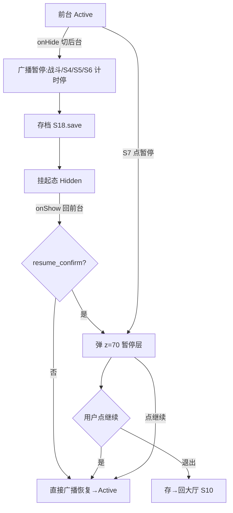
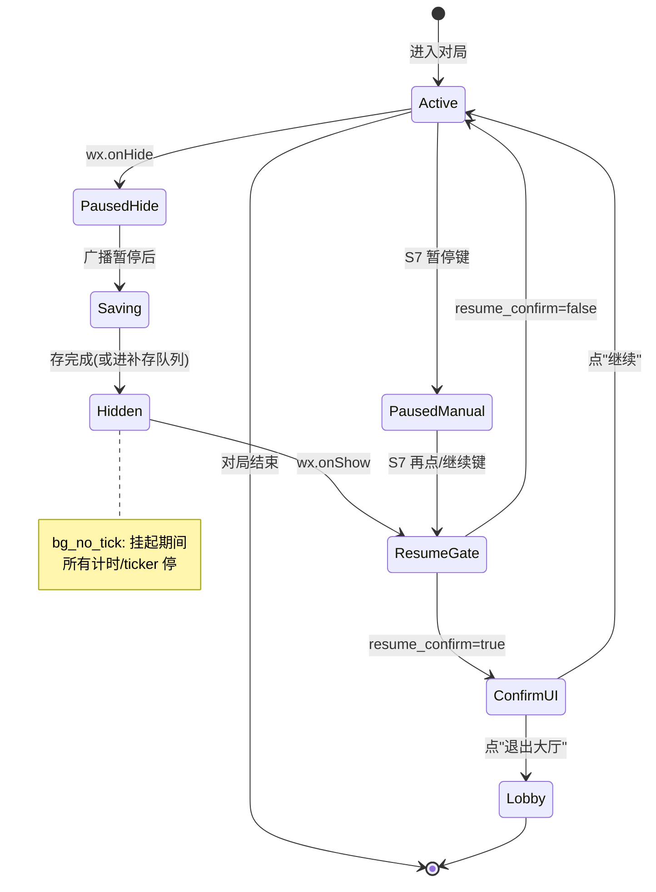
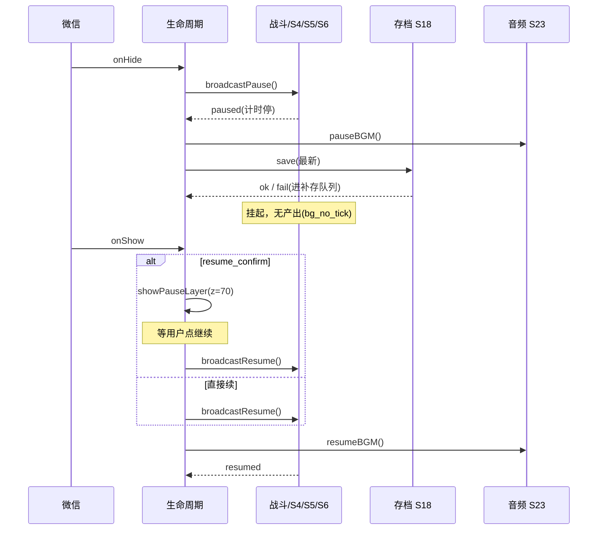

<!-- 编码: UTF-8 -->
# 系统策划案：S20 生命周期系统 (Lifecycle System)

> 归属域：C 平台工程运营域 · 层级/优先级：MVP / P1 · 关联 F 码：F31 · 关联：SYSTEM_BREAKDOWN §S20 · GDD §8（适配）
> 状态：v0.2-detailed · 日期：2026-07-17
> 上一版：v0.1-draft（仅骨架：3 组件 + 模块表 4 行 + 4 异常）

---

## 0. 修订说明（v0.1 → v0.2 加深点）

| 章节 | v0.1 | v0.2 加深内容 |
|------|------|---------------|
| §1 UI 布局 | 3 行组件表 | 加 z 层级、**暂停层像素线框（坐标+尺寸）**、交互流程图 |
| §2 逻辑功能 | 模块表 4 行 + 4 异常 | 加 **onHide/onShow 状态机**、**暂停/恢复时序图**、**异常边界用例表（12 类，含恢复竞态/存失败）** |
| §3 配置表 | 4 字段 | `lifecycle_config` 扩字段 + 多行示例（含不同场景预设） |
| §4 美术资源 | 3 行占位 | 加帧数/分辨率/格式/切片 |

---

## 1. 系统 UI 布局

### 1.1 层级定义（z-order）
| 层级 z | 内容 | 说明 |
|--------|------|------|
| 60 | 通用弹窗底 | 低于暂停 |
| 70 | **暂停层（本系统）** | onHide 自动/手动暂停时显示（回前台确认态） |
| 80 | 加载层(S19) | 高于暂停（加载时不叠暂停） |

> 说明：onHide 自动暂停**无 UI**（直接挂起）；仅 onShow 回前台时弹 z=70 确认层（由 `resume_confirm` 控制）。手动暂停（S7 按钮）直接显示该层。

### 1.2 像素级线框（750×1334 设计基准）

**暂停确认层（z=70，onShow 自动暂停 / 手动暂停共用）**
```
┌──────────── 750px ────────────┐ y=0
│  (半透遮罩 rgba(0,0,0,0.55) 全屏)│
│                                 │
│       已 暂 停       (x=225,y=380,300×60,48px)│ y=380
│                                 │
│  ┌──── 300px ────┐              │ y=600
│  │   继 续       │ (x=225,y=600,300×96)│ y=600
│  └────────────────┘              │ y=696
│  ┌──── 300px ────┐              │ y=720
│  │   退出大厅     │ (x=225,y=720,300×96)│ y=720
│  └────────────────┘              │ y=816
└─────────────────────────────────┘ y=1334
```

### 1.3 组件表
| 组件 | 坐标(x,y) | 尺寸(w×h) | z | 响应行为 |
|------|-----------|-----------|---|----------|
| 遮罩层 | (0,0) | 750×1334 | 70 | 半透 0.55α，点击不穿透 |
| 暂停标题 | (225,380) | 300×60 | 71 | 静态"已暂停" |
| 继续按钮 | (225,600) | 300×96 | 72 | 点→广播恢复→回前台态 |
| 退出按钮 | (225,720) | 300×96 | 72 | 点→存(S18)→回大厅 S10 |
| （onHide 挂起） | — | — | — | 无 UI，直接挂起战斗/计时 |

### 1.4 交互流程图


---

## 2. 逻辑功能

### 2.1 模块表
| 模块 | 触发条件 | 处理流程 | 输出 |
|------|----------|----------|------|
| onHide 暂停 | 切后台（`wx.onHide`） | 广播全局暂停→战斗/S4 波次/S5/S6 计时全停→触发 S18 存 | 全局挂起 |
| onShow 恢复 | 回前台（`wx.onShow`） | 若 `resume_confirm`→弹 z=70；否则直接广播恢复 | 续跑 |
| 手动暂停 | S7 暂停键 | 同广播暂停 + 显示 z=70 层 | 挂起 |
| 继续 | 点继续 | 广播恢复（战斗/S4/S5/S6 计时续） | 原态恢复 |
| 退出 | 点退出 | S18 存 → 回大厅 S10 | 退出对局 |
| 后台禁产出 | 挂起期间 | `bg_no_tick` 生效，停止一切 ticker/产出（防作弊/合规） | 无后台收益 |

### 2.2 状态机（onHide / onShow 生命周期）


### 2.3 时序图（切后台 → 回前台）


### 2.4 异常与边界用例表
| 编号 | 场景 | 触发条件 | 预期处理 | 输出/兜底 |
|------|------|----------|----------|-----------|
| E1 | onShow 正在结算(S8) | 切后台瞬间恰入结算 | 不弹暂停层，直接续结算流程 | 结算正常完成 |
| E2 | 暂停中再来 onHide | 暂停态下又切后台 | 保持暂停，不重复存/不重复广播 | 幂等 |
| E3 | 恢复竞态（快速切） | onHide→onShow→onHide 极快 | 加锁，仅一次恢复/一次挂起生效 | 无状态错乱 |
| E4 | 存失败(onHide) | S18.setStorage fail | 不阻切后台；进补存队列，onShow 补存 | 切后台不卡 |
| E5 | onHide 期间广告(S26) | 暂停时广告回调到达 | 广告态优先；恢复后补处理 | 不冲突 |
| E6 | onShow 时资源未就绪 | 分包仍在加载(S19) | 等加载完成再恢复战斗 | 不空跑 |
| E7 | 多次 onShow 无 onHide | 微信异常重复回调 | 仅首次有效，后续忽略 | 幂等 |
| E8 | 暂停时长极值 | 挂起数小时 | 恢复时校准时间（不补偿挂起期产出） | 不刷资源 |
| E9 | 网络变化(onShow) | 回前台网络变 | 不影响本地暂停逻辑；远程配置(S21)按需重拉 | 平滑 |
| E10 | 音频焦点丢失(S23) | 来电/其他音频占用 | S23 处理静音；本系统仅管游戏暂停 | 不崩 |
| E11 | 退出中再 onHide | 点退出动画中切后台 | 退出流程带锁，onHide 视为已退出 | 不回退对局 |
| E12 | 存档键冲突 | onHide 存与 S8 结算存同帧 | 复用 S18 写锁，串行化 | 一致 |

---

## 3. 配置表设计

### 3.1 表：`lifecycle_config`（生命周期行为，存于远端/本地默认）
| 字段 | 类型 | 取值范围 | 默认值 | 说明 |
|------|------|----------|--------|------|
| auto_pause_on_hide | bool | true | true | 切后台自动暂停 |
| save_on_hide | bool | true | true | 切后台存档 |
| resume_confirm | bool | true | true | 回前台确认再续（防误触） |
| bg_no_tick | bool | true | true | 后台无产出（防作弊/合规） |
| pause_bgm_on_hide | bool | true | true | 切后台停 BGM（交 S23） |
| max_resume_lock_ms | int | 100–2000 | 300 | 恢复竞态锁时长(ms) |
| save_retry_queue | bool | true | true | 存失败进补存队列 |

### 3.2 示例数据（多行场景预设）
| 场景 | auto_pause_on_hide | save_on_hide | resume_confirm | bg_no_tick | pause_bgm_on_hide |
|------|--------------------|--------------|----------------|------------|-------------------|
| 默认对局 | true | true | true | true | true |
| 弱网容错 | true | true | false | true | true |
| 调试模式 | false | false | false | false | false |

> 行为型系统，无平衡数值；`max_resume_lock_ms` 为 v0.2 新增的竞态防护调优杆，防止快速切前台导致恢复 broadcast 重入。

---

## 4. 美术资源需求

| 资源 | 类型 | 帧数 | 分辨率 | 格式 | 切片要求 | 用途 |
|------|------|------|--------|------|----------|------|
| 暂停遮罩 | UI | 1 | 750×1334 | PNG（半透 0.55α） | 全屏拉伸 | z=70 遮罩 |
| 暂停标题字 | 文本/位图 | 1 | 300×60（48px） | FNT/BMF | 单帧位图字 | "已暂停" |
| 继续按钮 | UI 状态 | 2（常态/按下） | 300×96×2 | PNG-8 | 各态独立 | 继续 |
| 退出按钮 | UI 状态 | 2（常态/按下） | 300×96×2 | PNG-8 | 各态独立 | 退出大厅 |
| （图标可选） | UI | 1 | 48×48 | PNG-8 | 单帧 | 暂停图标(可选) |

> 复用通用弹窗风格；无音频（暂停时静音由 S23 处理）。按钮/遮罩切片遵循微信单图 ≤128KB、合图集原则（见 S19 F34）。
