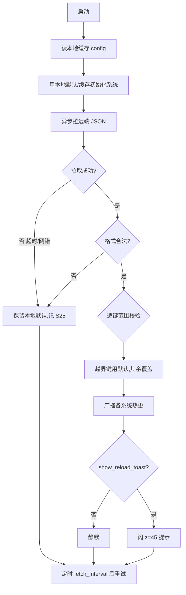
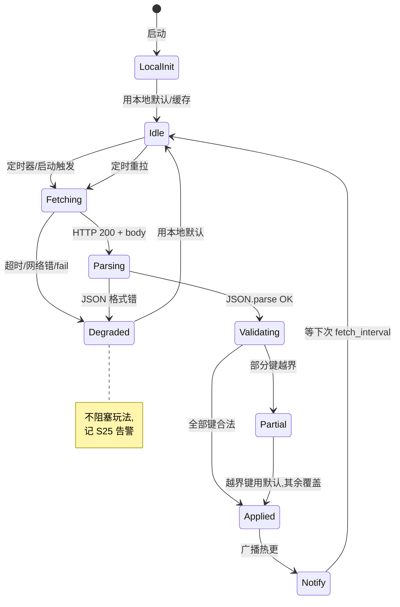
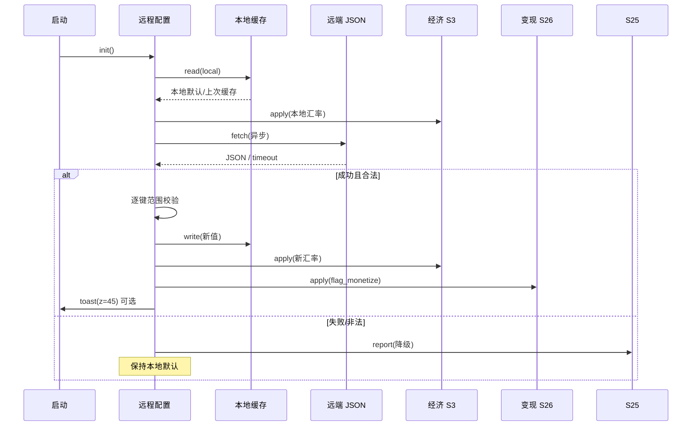

<!-- 编码: UTF-8 -->
# 系统策划案：S21 远程配置系统 (Remote Config System)

> 归属域：C 平台工程运营域 · 层级/优先级：增强 / P2 · 关联 F 码：F33 · 关联：SYSTEM_BREAKDOWN §S21 · GDD §6（通胀检测）
> 状态：v0.2-detailed · 日期：2026-07-17
> 上一版：v0.1-draft（仅骨架：模块表 4 行 + 4 异常 + 单表 6 字段）

---

## 0. 修订说明（v0.1 → v0.2 加深点）

| 章节 | v0.1 | v0.2 加深内容 |
|------|------|---------------|
| §1 UI 布局 | 仅文字 | 加 z 层级、**"配置已更新"轻提示像素线框**、交互流程图 |
| §2 逻辑功能 | 模块表 4 行 + 4 异常 | 加**拉取/降级状态机**、**拉取时序图**、**异常边界用例表（12 类，含拉取失败兜底/数值越界/限频）** |
| §3 配置表 | 单表 6 字段 | `remote_config` 扩字段（含校验范围/来源）+ **多行示例（含 F19 开关 default off）**，值标 `[PLACEHOLDER]` |
| §4 美术资源 | 2 行占位 | 加重载 toast 规格（帧数/分辨率/格式/切片） |

---

## 1. 系统 UI 布局

### 1.1 层级定义（z-order）
| 层级 z | 内容 | 说明 |
|--------|------|------|
| 0–40 | 玩法/HUD | 与配置无关 |
| 45 | **配置更新轻提示（本系统，可选）** | 瞬隐 toast，不挡操作 |
| 70+ | 弹窗/暂停 | 高于本提示 |

> 纯后台系统：玩家**无任何常驻 UI**。仅当热更生效且 `show_reload_toast=true` 时，闪一条 z=45 瞬隐提示（如"配置已更新"），1.5s 自动消失。

### 1.2 像素级线框（750×1334 设计基准）

**配置更新轻提示（z=45，可选，瞬隐）**
```
┌──────────── 750px ────────────┐ y=0
│                                 │
│              ┌── 280px ──┐      │ y=120
│              │ 配置已更新 │ (x=235,y=120,280×56,圆角)│ y=120
│              └───────────┘      │ y=176
│   (1.5s 后自动淡出，不挡点击)    │
└─────────────────────────────────┘ y=1334
```

### 1.3 组件表
| 组件 | 坐标(x,y) | 尺寸(w×h) | z | 响应行为 |
|------|-----------|-----------|---|----------|
| 更新提示条 | (235,120) | 280×56 | 45 | 显示 1.5s→淡出，点击穿透 |
| （远端拉取） | — | — | — | 无 UI，启动/定时静默拉 |
| （开关下发） | — | — | — | `feature_flags` 经本系统下发各系统 |

### 1.4 交互流程图


---

## 2. 逻辑功能

### 2.1 模块表
| 模块 | 触发条件 | 处理流程 | 输出 |
|------|----------|----------|------|
| 配置拉取 | 启动 / `fetch_interval` 定时 | 拉远端 JSON → 覆盖本地缓存默认 | 热配置 |
| 热更新项 | 拉取到且校验过 | 汇率(S3)/波表参数(S4)/掉落率/功能开关(S26/S17) | 即时生效 |
| 范围校验 | 每键写入前 | 比对 `min/max`/`enum`，越界用本地默认 | 安全值 |
| 降级 | 拉取失败/格式错 | 用本地默认/上次好缓存，不阻塞 | 平滑降级 |
| 开关控制 | 拉取/本地 | 维护 `feature_flags`（含 F19 default off） | 系统读开关 |
| 限频 | 每次拉取 | 距上次 < `fetch_interval` 则跳过 | 防耗流 |

### 2.2 状态机（配置拉取 + 降级）


### 2.3 时序图（启动拉取 + 热更广播）


### 2.4 异常与边界用例表
| 编号 | 场景 | 触发条件 | 预期处理 | 输出/兜底 |
|------|------|----------|----------|-----------|
| E1 | 拉取超时/失败 | 弱网/服务端 5xx | 用本地默认/上次好缓存，记 S25，定时重拉 | 平滑降级 |
| E2 | 配置格式错 | 返回非 JSON / 缺根 | 忽略整体，用本地默认，告警 | 不崩 |
| E3 | 单键缺失 | 远端缺某字段 | 该键用本地默认，其余覆盖 | 局部降级 |
| E4 | 热更致数值异常 | 汇率返回 0 / 负数 | 范围校验拦截→用默认（防经济崩） | 安全值 |
| E5 | 类型不符 | 数字字段返回字符串 | 解析失败→用默认 | 不崩 |
| E6 | 频繁拉取 | 短时间内多次触发 | 限频（距上次 < `fetch_interval` 跳过） | 防耗流 |
| E7 | 微信 API/网络权限失败 | 请求被拒 | catch→本地默认 + S25 | 不阻塞 |
| E8 | 缓存损坏 | 本地缓存 JSON 坏 | 视为无缓存→用代码默认 | 不崩 |
| E9 | 热更与对局冲突 | 对局中汇率突变 | 对局内锁值，下局生效（防中途跳变） | 平滑 |
| E10 | 远端返回超大 | 响应体异常大 | 截断/拒收 + 告警 | 防内存 |
| E11 | 开关值非法 | `flag_monetize` 非 bool | 用默认 false（关） | 安全关 |
| E12 | 多系统订阅竞态 | 多个系统同帧读新值 | 广播串行 + 版本号，订阅者取一致快照 | 一致 |

---

## 3. 配置表设计

### 3.1 表：`remote_config`（远端键值 JSON，含本地默认值与校验范围）
| key | 类型 | 取值范围 | 默认值 | 说明 / 调优杆 |
|-----|------|----------|--------|---------------|
| exchange_rate | float | 0.1–10 | `[PLACEHOLDER]` | 金→木汇率(S3) **调优杆** |
| wave_diff_mult | float | 0.5–3 | `[PLACEHOLDER]` | 波表难度(S4) **调优杆** |
| drop_mult | float | 0.5–3 | `[PLACEHOLDER]` | 掉落倍率 **调优杆** |
| gold_per_wave_base | int | >0 | `[PLACEHOLDER]` | 单波基础金(S3) **调优杆** |
| flag_monetize | bool | false | false | F19 变现开关（**default off**） |
| flag_season | bool | false | false | 赛季开关(S17) |
| fetch_interval | int | 60–3600 | `[PLACEHOLDER]` | 拉取间隔(s) **调优杆** |
| show_reload_toast | bool | false | false | 热更轻提示 |
| inflation_threshold | float | >0 | `[PLACEHOLDER]` | 复用 S3/GDD §6 通胀线 **调优杆** |

### 3.2 示例数据（多行，值均 `[PLACEHOLDER]`，结构示意）
**示例 A：默认/首发（变现关、赛季关、保守值）**
```json
{
  "exchange_rate": "[PLACEHOLDER]",
  "wave_diff_mult": "[PLACEHOLDER]",
  "drop_mult": "[PLACEHOLDER]",
  "gold_per_wave_base": "[PLACEHOLDER]",
  "flag_monetize": false,
  "flag_season": false,
  "fetch_interval": "[PLACEHOLDER]",
  "show_reload_toast": false,
  "inflation_threshold": "[PLACEHOLDER]"
}
```
**示例 B：平衡 pass（调高兑换率、开赛季预告、开提示）**
```json
{
  "exchange_rate": "[PLACEHOLDER]",
  "wave_diff_mult": "[PLACEHOLDER]",
  "drop_mult": "[PLACEHOLDER]",
  "gold_per_wave_base": "[PLACEHOLDER]",
  "flag_monetize": false,
  "flag_season": true,
  "fetch_interval": "[PLACEHOLDER]",
  "show_reload_toast": true,
  "inflation_threshold": "[PLACEHOLDER]"
}
```
> 所有 `[PLACEHOLDER]` 为试玩/数据调优确定，禁止在代码中硬编码；取值范围为设计约束，实际值经 S25 观测 + GDD §6 通胀检测后裁定。

---

## 4. 美术资源需求

| 资源 | 类型 | 帧数 | 分辨率 | 格式 | 切片要求 | 用途 |
|------|------|------|--------|------|----------|------|
| 配置更新提示条 | UI 九宫 | 1 | 源 64×64（拉伸 280×56） | PNG-8 | 九宫 16px 圆角 | z=45 轻提示 |
| 提示文字 | 文本 | 1 | 280×56（28px） | FNT | 单帧 | "配置已更新" |
| （本身逻辑） | — | — | — | — | — | 纯数据，无美术 |

> 开关状态（`flag_monetize`/`flag_season`）影响 S26/S17 可见性；本系统纯后台，仅可选轻提示有美术，复用通用 toast 组件。
