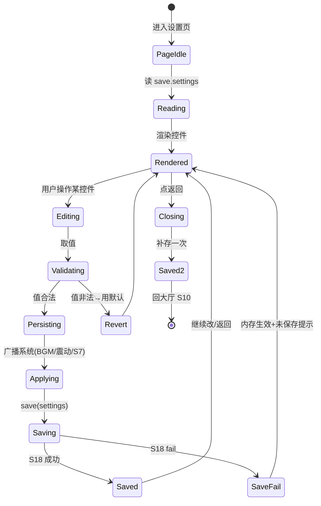
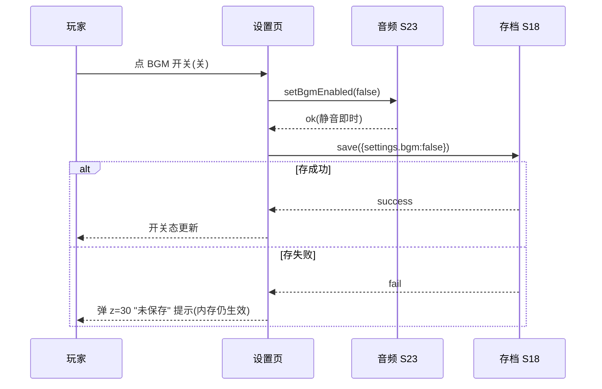

<!-- 编码: UTF-8 -->
# 系统策划案：S22 设置系统 (Settings System)

> 归属域：C 平台工程运营域 · 层级/优先级：MVP / P1 · 关联 F 码：F39 · 关联：SYSTEM_BREAKDOWN §S22 · GDD §7（无障碍）
> 状态：v0.2-detailed · 日期：2026-07-17
> 上一版：v0.1-draft（仅骨架：5 行组件 + 模块表 5 行 + 3 异常 + 单表 5 字段）
> **v0.2-rev（耦合重构）：** 按 DO 新规新增 **`auto_cast_active`（主动技自动释放开关）**——开启后战斗中塔主动技在 CD 好且有目标时自动释放（手动点击仍可用，见 S28）。已在设置页线框/组件表/配置表/示例数据中补齐。

---

## 0. 修订说明（v0.1 → v0.2 加深点）

| 章节 | v0.1 | v0.2 加深内容 |
|------|------|---------------|
| §1 UI 布局 | 5 行组件（坐标粗略） | 加 z 层级、**设置页精确像素线框（750×1334 坐标网格）**、交互流程图 |
| §2 逻辑功能 | 模块表 5 行 + 3 异常 | 加**设置状态机**、**改项时序图**、**异常边界用例表（12 类，含写存失败/震动不支持）** |
| §3 配置表 | 单表 5 字段 | `settings_config` 扩字段（加 tap_scale 无障碍）+ **多行示例** |
| §4 美术资源 | 5 行占位 | 加帧数/分辨率/格式/切片（背景/行底/toggle/字号/返回） |

---

## 1. 系统 UI 布局

### 1.1 层级定义（z-order）
| 层级 z | 内容 | 说明 |
|--------|------|------|
| 0 | 设置页背景 | 场景底 |
| 10 | 导航栏（返回+标题） | 顶部 |
| 20 | 设置列表（行+控件） | 中部 |
| 30 | 提示 toast（未保存） | 底部瞬显 |

### 1.2 像素级线框（750×1334 设计基准）

**设置页（z=0–30，单屏，内容少无需滚动）**
```
┌──────────── 750px ────────────┐ y=0
│ [←](40,40,64×64)   设 置(295,40,160×56)│ y=40 (导航 z=10)
│ ───────────────────────────── 分隔(y=120,750)│
│ ┌── 行底 670×100 ──────┐ (40,180)│ y=180 (z=20)
│ │ BGM 音乐   [▢开/关](630,206,96×48)│ y=180
│ └───────────────────────┘              │ y=280
│ ┌── 行底 670×100 ──────┐ (40,290)│ y=290
│ │ 音效       [▢开/关](630,316,96×48)│ y=290
│ └───────────────────────┘              │ y=390
│ ┌── 行底 670×100 ──────┐ (40,400)│ y=400
│ │ 震动       [▢开/关](630,426,96×48)│ y=400
│ └───────────────────────┘              │ y=500
│ ┌── 行底 670×100 ──────┐ (40,510)│ y=510
│ │ 字号   [小][中][大](460,540,240×60)│ y=510 (分段控件)
│ └───────────────────────┘              │ y=610
│ ┌── 行底 670×100 ──────┐ (40,620)│ y=620
│ │ 点击区  [标准][放大](460,650,240×60)│ y=620 (无障碍)
│ └───────────────────────┘              │ y=720
│ ┌── 行底 670×100 ──────┐ (40,730)│ y=730
│ │ 主动技自动释放 [▢开/关](630,756,96×48)│ y=730 (S28)
│ └───────────────────────┘              │ y=830
│ ┌── 行底 670×100 ──────┐ (40,840)│ y=840
│ │ 语言      中文(560,866,150×48)│ y=840
│ └───────────────────────┘              │ y=940
│ (未保存提示 toast: 居中底 y=1100,300×56 z=30 瞬显)│
└─────────────────────────────────────────┘ y=1334
```

### 1.3 组件表
| 组件 | 坐标(x,y) | 尺寸(w×h) | z | 响应行为 |
|------|-----------|-----------|---|----------|
| 设置背景 | (0,0) | 750×1334 | 0 | 静态场景底 |
| 返回图标 | (40,40) | 64×64 | 10 | 点→存→回大厅 S10 |
| 标题文本 | (295,40) | 160×56 | 10 | "设置"，静态 |
| 分隔线 | (0,120) | 750×2 | 11 | 静态 |
| BGM 行底 | (40,180) | 670×100 | 20 | 容器 |
| BGM 标签 | (64,180) | 400×100 | 21 | 静态 |
| BGM 开关 | (630,206) | 96×48 | 22 | 点→切 S23 BGM 开关 |
| 音效行底/标签/开关 | (40,290)/(64,290)/(630,316) | 670×100 / 400×100 / 96×48 | 20/21/22 | 同 BGM，控 S23 音效 |
| 震动行底/标签/开关 | (40,400)/(64,400)/(630,426) | 670×100 / 400×100 / 96×48 | 20/21/22 | 切 wx.vibrateShort 偏好 |
| 字号行底 | (40,510) | 670×100 | 20 | 容器 |
| 字号分段控件 | (460,540) | 240×60（三档各 80×60） | 22 | 点→改 S7 字号/点击区 |
| 点击区行底 | (40,620) | 670×100 | 20 | 容器（无障碍） |
| 点击区分段 | (460,650) | 240×60（两档） | 22 | 点→改 S7 点击区缩放 |
| 主动技自动释放行底 | (40,730) | 670×100 | 20 | 容器（交 S28） |
| 主动技自动释放开关 | (630,756) | 96×48 | 22 | 点→切 `auto_cast_active`(S28 读取) |
| 语言行底 | (40,840) | 670×100 | 20 | 容器 |
| 语言值文本 | (560,866) | 150×48 | 21 | 显示当前语言（首发仅中文） |
| 未保存提示 | (225,1100) | 300×56 | 30 | "设置未保存，点重试"瞬显 |

### 1.4 交互流程图
```mermaid
flowchart TD
    A[大厅 S10 → 设置] --> B[读 save.settings 渲染各控件]
    B --> C{用户改项}
    C -- BGM/音效 --> D[写 S23 开关+内存即时]
    C -- 震动 --> E[写偏好+内存即时]
    C -- 字号/点击区 --> F[写 S7 字号/点击区+即时重排]
    C -- 语言 --> G[写偏好(预留多语)]
    D --> H[触发 save(settings)]
    E --> H
    F --> H
    G --> H
    H --> I{存成功?}
    I -- 是 --> J[返回大厅]
    I -- 否 S18 fail --> K[内存生效+弹 z=30 未保存提示]
    K --> L[用户可重设/重试存]
```

---

## 2. 逻辑功能

### 2.1 模块表
| 模块 | 触发条件 | 处理流程 | 输出 |
|------|----------|----------|------|
| 音频设置 | 切 BGM/音效开关 | 写 S23 开关状态 + 内存即时生效 + 存 S18 | 静音/音量 |
| 震动设置 | 切震动开关 | 写偏好 + 存；触发时试 `wx.vibrateShort` | 震屏开/关 |
| 字号设置 | 选 small/medium/large | 写 S7 字号 + 点击区基准 + 存 | UI 缩放 |
| 点击区设置 | 选 标准/放大 | 写 S7 点击区缩放系数 + 存 | 易点性 |
| 主动技自动释放 | 切 `auto_cast_active` | 写 S28 读取标志 + 存 | 战斗中主动技自动释放 |
| 语言 | 选（首发仅 zh-CN） | 写偏好（预留多语钩子） + 存 | 语言 |
| 即时生效 | 改任一项 | 广播对应系统 + 持久化 S18 | 生效且落档 |

### 2.2 状态机（设置页 + 单项修改）


### 2.3 时序图（改 BGM 开关）


### 2.4 异常与边界用例表
| 编号 | 场景 | 触发条件 | 预期处理 | 输出/兜底 |
|------|------|----------|----------|-----------|
| E1 | 写存失败(S18) | `setStorage` fail（满/权限） | 内存生效 + 弹 z=30 未保存提示，可重设重试 | 不丢改动（内存） |
| E2 | 非法值 | 字号/点击区收到枚举外值 | 用默认 medium/标准，告警 | 安全值 |
| E3 | 震动不支持 | 部分机型无振动 API | `wx.vibrateShort` 静默忽略，不报错 | 开关仍可存 |
| E4 | 字号极值致布局溢出 | large + 长文本 | UI 用安全区+自动缩放，不超安全区 | 不遮挡 |
| E5 | 语言未支持 | 收到非 zh-CN | 回落 zh-CN，记录待支持 | 中文首发 |
| E6 | 多系统监听竞态 | BGM 关时 S23 正在播 | S23 立即静音，无残留音 | 即时 |
| E7 | 连点开关 | 快速反复切 | 防抖，取最终态 | 不抖 |
| E8 | 设置读档缺字段 | save.settings 缺某键 | 用 `settings_config` 默认值补 | 不崩 |
| E9 | 返回时存进行中 | 点返回恰在存 | 等存完成或入补存队列再退 | 不丢 |
| E10 | 点击区放大与 HUD 冲突 | 放大后 HUD 元素重叠 | S7 重排算法保证最小间距 | 不重叠 |
| E11 | 弱网无关 | 纯本地设置 | 无网络依赖，离线可用 | 正常 |
| E12 | 配置默认值缺失 | `settings_config` 未初始化 | 用代码内建默认（与 S18 schema 对齐） | 不崩 |

---

## 3. 配置表设计

### 3.1 表：`settings_config`（设置项默认与范围，存于 `save_main.settings`）
| 字段 | 类型 | 取值范围 | 默认值 | 说明 |
|------|------|----------|--------|------|
| bgm | bool | true/false | true | BGM 开关（交 S23） |
| sfx | bool | true/false | true | 音效开关（交 S23） |
| shake | bool | true/false | true | 震动（wx.vibrateShort） |
| font_size | enum | small/medium/large | medium | 字号（影响 S7） |
| tap_scale | enum | normal/large | normal | 点击区缩放（无障碍，影响 S7） |
| auto_cast_active | bool | true/false | false | 主动技自动释放（交 S28；默认关，手动优先） |
| language | enum | zh-CN | zh-CN | 语言（预留多语钩子） |

### 3.2 示例数据（多行）
**示例 A：默认（首发多数玩家）**
```json
{ "bgm": true, "sfx": true, "shake": true, "font_size": "medium", "tap_scale": "normal", "auto_cast_active": false, "language": "zh-CN" }
```
**示例 B：无障碍偏好（震动关、字号大、点击区放大）**
```json
{ "bgm": false, "sfx": true, "shake": false, "font_size": "large", "tap_scale": "large", "auto_cast_active": false, "language": "zh-CN" }
```
**示例 C：静音党（全关）**
```json
{ "bgm": false, "sfx": false, "shake": true, "font_size": "small", "tap_scale": "normal", "auto_cast_active": true, "language": "zh-CN" }
```
> `bgm`/`sfx` 为开关，具体音量（bgm_volume/sfx_volume）由 S23 `audio_config` 持有；本表只管开关与偏好。`tap_scale=large` 为 v0.2 新增无障碍项，对齐 GDD §7"手小就放大点击区"。`auto_cast_active` 为 v0.2-rev 新增（交 S28）；默认 false（手动优先，玩家主动开启自动释放）。

---

## 4. 美术资源需求

| 资源 | 类型 | 帧数 | 分辨率 | 格式 | 切片要求 | 用途 |
|------|------|------|--------|------|----------|------|
| 设置背景 | UI | 1 | 750×1334 | JPG/PNG(压缩) | 全屏 ≤150KB | 场景底 |
| 导航返回图标 | UI 状态 | 2（常态/按下） | 64×64×2 | PNG-8(透明) | 各态独立 | 返回 |
| 标题文本 | 文本 | 1 | 160×56（36px） | FNT | 单帧 | "设置" |
| 行底 | UI 九宫 | 1 | 源 64×64（拉伸 670×100） | PNG-8 | 九宫 16px，圆角 12 | 列表行 |
| 分隔线 | UI | 1 | 750×2 | PNG-8 | 单帧 | 顶部分隔 |
| toggle 开关 | UI 状态 | 3（开/关/按下） | 96×48（各态） | PNG-8 | 开/关/按压态切片 | 开关 |
| 字号分段控件 | UI 状态 | 3（小/中/大选中态） | 240×60（三档各 80×60） | PNG-8 | 分段切片+选中高亮 | 字号选择 |
| 点击区分段控件 | UI 状态 | 2（标准/放大选中态） | 240×60（两档） | PNG-8 | 同分段样式 | 无障碍选择 |
| 语言值文本 | 文本 | 1 | 150×48（28px） | FNT | 单帧 | "中文" |
| 未保存提示 toast | UI 九宫 | 1 | 源 64×64（拉伸 300×56） | PNG-8 | 九宫圆角 | z=30 提示 |

> 复用通用 UI 组件库；震动无美术；所有切片遵循微信单图 ≤128KB、合图集原则（见 S19 F34）。
