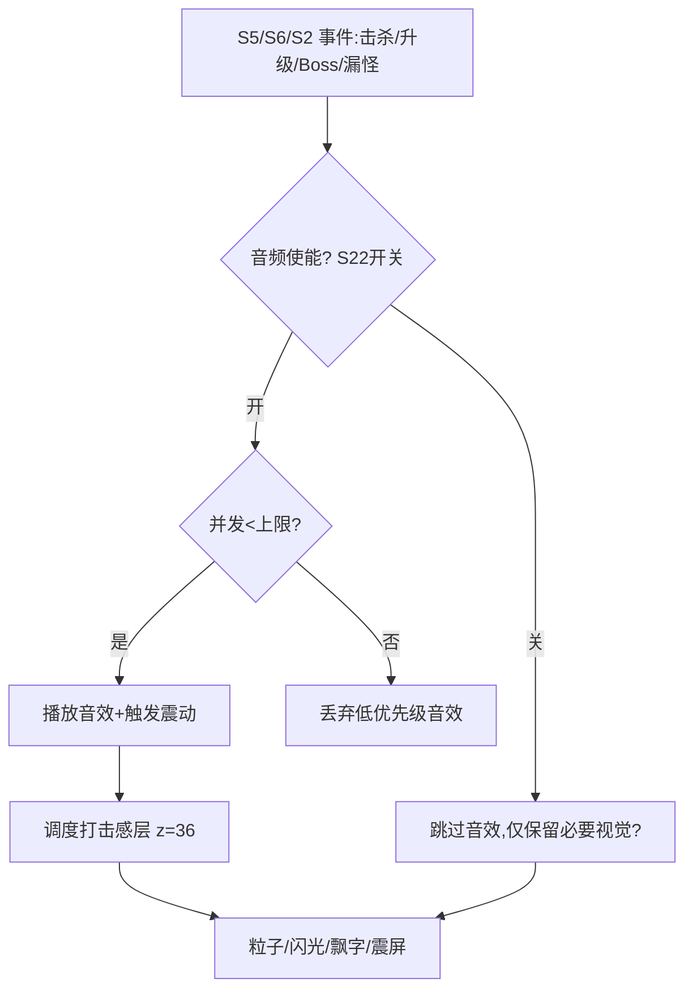
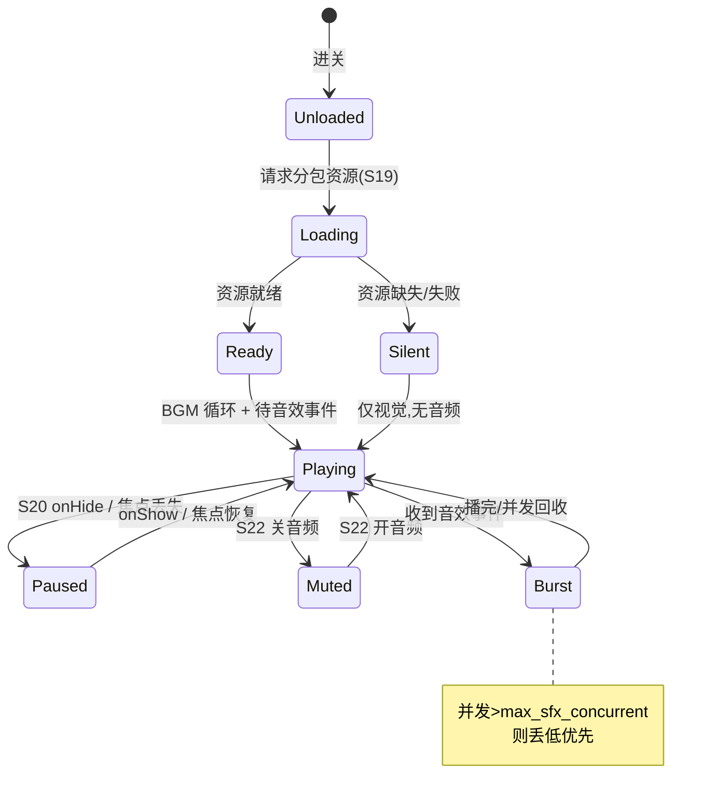
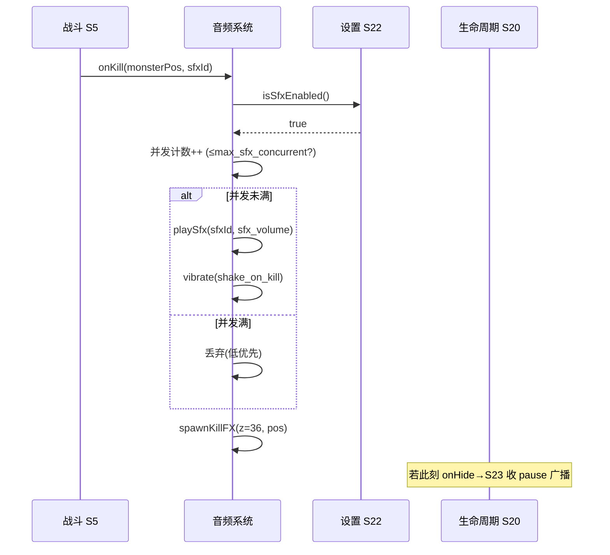

<!-- 编码: UTF-8 -->
# 系统策划案：S23 音频系统 (Audio System)

## 0. 元数据头

- 归属域：C 平台工程运营域
- 层级 / 优先级：增强 / P2
- 关联 F 码：F18 F35
- 关联系统：S5/S6/S2（事件触发反馈）、S22（音频开关镜像）、S19（音频资产 F35）、S20（生命周期暂停/续）、S25（并发超限告警）、S36（打击感增强）
- 版本：v0.2-detailed（2026-07-17）
- 依赖：`wx.vibrateShort`；S19 分包资源；S22 开关状态
- NEEDS-DESIGN 索引：S23-ND1（bgm_volume，NEEDS-DESIGN owner:S23 due:P4-tuning）｜S23-ND2（sfx_volume，NEEDS-DESIGN owner:S23 due:P4-tuning）｜S23-ND3（max_sfx_concurrent，NEEDS-DESIGN owner:S23 due:P4-tuning）｜S23-ND4（shake_intensity，NEEDS-DESIGN owner:S23 due:P4-tuning）

---

### 0.1 修订说明（v0.1 → v0.2 加深点）

| 章节 | v0.1 | v0.2 加深内容 |
|------|------|---------------|
| §1 UI 布局 | 仅文字（打击感层 z=36） | 加 z 层级全表、**打击感层像素线框（世界空间反馈位置）**、交互流程图 |
| §2 逻辑功能 | 模块表 5 行 + 4 异常 | 加**播放管理状态机**、**事件→反馈时序图**、**异常边界用例表（12 类，含音频焦点丢失/并发超限）** |
| §3 配置表 | 单表 6 字段 | `audio_config` 扩字段（加 enable 镜像/优先级）+ **多行示例** |
| §4 美术资源 | 6 行占位 | 加帧数/分辨率/格式/切片（BGM/音效/粒子/闪光/震屏） |

---

## 1. 系统 UI 布局

### 1.1 层级定义（z-order）
| 层级 z | 内容 | 说明 |
|--------|------|------|
| 0–35 | 玩法世界 | 塔/怪/路径 |
| 36 | **打击感层（本系统调度）** | 击杀粒子、升级闪光、飘字、震屏（世界/屏幕空间） |
| 70+ | 暂停/弹窗 | 高于打击感 |

> 无独立设置 UI：音频开关由 S22（bgm/sfx）控制，音量由本系统 `audio_config` 持有。打击感层 z=36 承载所有"爽点放大"视觉反馈，由 S5/S6/S2 事件触发。

### 1.2 像素级线框（750×1334 设计基准 · 打击感层叠在世界空间上）

```
┌──────────── 750px ────────────┐ y=0
│  [世界层 z0-35: 环形路径/塔/怪] │
│                                 │
│   击杀粒子 ✦ (怪死亡处 x,y)  z=36│  (0.4s, 8帧)
│   升级闪光 ✦ (塔位置 x,y)     z=36│  (0.4s, 8帧)
│   飘字 "+120" (伤害/金币处)    z=36│  (上浮动 0.6s)
│   ── 震屏：全屏相机偏移(由 shake_intensity)│ (内部,无图)
└─────────────────────────────────┘ y=1334
   说明：打击感元素随世界坐标投影到屏幕；震屏为相机位移，非独立美术。
```

### 1.3 组件表（打击感层）
| 组件 | 坐标(x,y) | 尺寸(w×h) | z | 响应行为 |
|------|-----------|-----------|---|----------|
| 击杀粒子 | 动态(怪位) | 源 64×64 | 36 | 播放 0.4s 后回收 |
| 升级闪光 | 动态(塔位) | 源 64×64 | 36 | 播放 0.4s 后回收 |
| 飘字 | 动态(受击/产币) | 80×40 | 36 | 上浮动 0.6s 淡出 |
| 震屏 | 全屏相机 | — | 36 | 由 `shake_intensity` 控偏移，不超安全区 |
| （BGM/音效） | — | — | — | 音频无 UI，仅听感 |

### 1.4 交互流程图（事件 → 反馈）


---

## 2. 逻辑功能

### 2.1 模块表
| 模块 | 触发条件 | 处理流程 | 输出 |
|------|----------|----------|------|
| 音频资产(F35) | 进关/用 | 按分包(S19)加载 BGM/音效到内存池 | 资源就绪 |
| 播放管理 | 事件(S5/S6/S2) | BGM 循环 + 音效并发(≤上限) → 震动(wx.vibrateShort) | 听感 |
| 打击感(F36) | 击杀/升级/Boss | 飘字 + 粒子 + 震屏调度（z=36） | 爽点放大 |
| 开关响应 | S22 改 | 静音/音量实时（读 audio_config） | 受控 |
| 焦点管理 | 系统音频中断 | 监听中断→暂停 BGM/音效，恢复后续播 | 不抢资源 |
| 降级 | 音频缺失/不支持 | 跳过播放/静默，不阻玩法 | 静默容错 |

### 2.2 状态机（音频播放管理）


### 2.3 时序图（击杀事件 → 音+视觉）


### 2.4 异常与边界用例表
| 编号 | 场景 | 触发条件 | 预期处理 | 输出/兜底 |
|------|------|----------|----------|-----------|
| E1 | 音效并发超限 | 同帧 >`max_sfx_concurrent` 事件 | 按优先级队列，丢低优先（如普通击中），保关键（Boss/升级） | 不爆音 |
| E2 | 音频加载失败(S19) | 分包音效缺失 | 静默，仅保留视觉打击感 | 不阻玩法 |
| E3 | 震动不支持 | 机型无振动 | `wx.vibrateShort` 静默忽略 | 不报错 |
| E4 | 暂停(S20) | onHide | 停 BGM/音效，恢复续播（从头或续） | 无后台音 |
| E5 | **音频焦点丢失** | 来电/其他音频占用微信音频 | 监听中断→暂停；恢复后续播 | 不抢资源 |
| E6 | 资源缺失单文件 | 某音效文件坏 | 跳过该音效，其余正常 | 局部降级 |
| E7 | 多事件同帧 | Boss+多杀同帧 | 合并为一次 Boss 音 + 单次震屏 | 不堆叠 |
| E8 | 音量极值 | 滑到 0 或 1 | 0=静音不崩；1=不破音（限幅） | 安全 |
| E9 | 开关与 S22 不同步 | S22 改但音频未读 | 开关变更广播即时重读 audio_config | 一致 |
| E10 | 设备静音模式 | iOS 静音拨杆 | 音效照常（微信音频会话独立）；BGM 同 | 正常 |
| E11 | 离线无网络 | 纯本地音频 | 不依赖网络，正常播 | 正常 |
| E12 | 打击感层溢出 | 同屏过多粒子 | 池上限回收最旧粒子 | 不卡帧 |

---

## 3. 配置表设计

### 3.1 表：`audio_config`（音频与打击感，受 S22 开关约束）
| 字段 | 类型 | 取值范围 | 默认值 | 说明 |
|------|------|----------|--------|------|
| bgm_enabled | bool | true/false | true | BGM 总开关（镜像 S22.bgm） |
| sfx_enabled | bool | true/false | true | 音效总开关（镜像 S22.sfx） |
| bgm_volume | float | 0–1 | S23-ND1 · NEEDS-DESIGN (owner: S23, due: P4-tuning) | BGM 音量 **调优杆** |
| sfx_volume | float | 0–1 | S23-ND2 · NEEDS-DESIGN (owner: S23, due: P4-tuning) | 音效音量 **调优杆** |
| max_sfx_concurrent | int | 4–32 | S23-ND3 · NEEDS-DESIGN (owner: S23, due: P4-tuning) | 音效并发上限 **调优杆** |
| shake_on_kill | bool | true | true | 击杀震屏 |
| shake_intensity | float | 0.1–1 | S23-ND4 · NEEDS-DESIGN (owner: S23, due: P4-tuning) | 震屏强度 **调优杆** |
| hit_fx_level | enum | low/mid/high | mid | 打击感档（粒子密度） |
| sfx_priority | json | 事件优先级 | {"boss":9,"upgrade":8,"kill":5,"hit":2} | 并发丢弃依据 |

### 3.2 示例数据（多行）
**示例 A：默认（中打击感）**
```json
{ "bgm_enabled": true, "sfx_enabled": true, "bgm_volume": "S23-ND1", "sfx_volume": "S23-ND2",
  "max_sfx_concurrent": "S23-ND3", "shake_on_kill": true, "shake_intensity": "S23-ND4",
  "hit_fx_level": "mid", "sfx_priority": {"boss":9,"upgrade":8,"kill":5,"hit":2} }
```
**示例 B：低配机/省电（关震屏、低打击感）**
```json
{ "bgm_enabled": true, "sfx_enabled": true, "bgm_volume": "S23-ND1", "sfx_volume": "S23-ND2",
  "max_sfx_concurrent": "S23-ND3", "shake_on_kill": false, "shake_intensity": "S23-ND4",
  "hit_fx_level": "low", "sfx_priority": {"boss":9,"upgrade":8,"kill":5,"hit":2} }
```
> `bgm_volume`/`sfx_volume`/`max_sfx_concurrent`/`shake_intensity` 为试听调优杆，标 `S23-ND1`~`S23-ND4`（NEEDS-DESIGN，见 §0 索引 / §5.6）；开关（`*_enabled`）与外部 S22 保持镜像，避免双源冲突。

---

## 4. 美术资源需求

| 资源 | 类型 | 帧数 | 分辨率 | 格式 | 切片要求 | 用途 |
|------|------|------|--------|------|----------|------|
| BGM（按场景） | 音频 | —（循环） | — | mp3/ogg（≤1MB/首，分包） | 无缝循环点 | 背景乐（大厅/对局/Boss） |
| 音效集 | 音频 | — | — | mp3/ogg（≤50KB/个，分包） | 单文件 | 建/养/击杀/Boss/漏怪 |
| 击杀粒子 | 特效序列 | 8（0.4s@20fps） | 64×64 | PNG 序列/合图 | 8 帧等距扩散切片 | 死亡反馈 z=36 |
| 升级闪光 | 特效序列 | 8（0.4s@20fps） | 64×64 | PNG 序列/合图 | 8 帧爆闪切片 | 升级反馈 z=36 |
| 飘字 | UI 文本/位图 | 1（位图字） | 80×40 | FNT/BMF | 单帧位图字 | "+木/+金/伤害" z=36 |
| 震屏 | 内部特效 | — | — | — | 相机位移（无图） | 冲击感（shake_intensity） |
| （Boss 专属） | 音频/特效 | 见 S36 | 见 S36 | — | — | 增强项，细节在 S36 |

> 音频格式/分包见 S19(F35)；打击感细节（粒子密度/顿帧）见 S36(增强)。所有序列帧合图集，单图 ≤128KB。

---

## 5. 实现契约

### 5.1 输入数据结构
| 字段 | 类型 | 来源 config 字段 / 说明 |
|------|------|------------------------|
| bgm_volume | float | `audio_config.bgm_volume`（S23-ND1） |
| sfx_volume | float | `audio_config.sfx_volume`（S23-ND2） |
| max_sfx_concurrent | int | `audio_config.max_sfx_concurrent`（S23-ND3） |
| shake_intensity | float | `audio_config.shake_intensity`（S23-ND4） |
| bgm_enabled / sfx_enabled | bool | 镜像 `settings_config.bgm` / `.sfx`（S22） |

### 5.2 输出数据结构
| 字段 | 类型 | 说明 |
|------|------|------|
| fx_handles | object | 打击感层 z=36 粒子/闪光/飘字/震屏句柄 |
| concurrent_count | int | 当前音效并发计数 |

### 5.3 跨系统接口调用表
| caller | callee | function | 方向 | 用途 |
|--------|--------|----------|------|------|
| S5/S6/S2 | S23 | `onKill` / `onUpgrade` 等 | in | 事件触发反馈 |
| S22 | S23 | `isBgm/SfxEnabled` | in | 开关约束 |
| S23 | wx | `vibrateShort` | out | 震动 |
| S23 | S19 | 资源就绪 | in | 分包加载资源 |
| S20 | S23 | `pauseBGM` / `resumeBGM` | in | 生命周期 |
| S23 | S25 | `report(并发超限)` | out | 告警 |

### 5.4 错误码表
| E# | 场景 | 兜底 | 涉及系统 |
|----|------|------|----------|
| E1 | 音效并发超限 | 按优先级丢低优先 | — |
| E2 | 音频加载失败 | 静默，仅视觉 | S19 |
| E3 | 震动不支持 | 静默忽略 | wx |
| E4 | 暂停 | 停 BGM/音效 | S20 |
| E5 | 音频焦点丢失 | 监听中断→暂停续播 | — |
| E6 | 资源缺失单文件 | 跳过该音效 | — |
| E7 | 多事件同帧 | 合并为一次 Boss 音+单次震屏 | — |
| E8 | 音量极值 | 0=静音不崩；1=限幅 | — |
| E9 | 开关与 S22 不同步 | 广播即时重读 | S22 |
| E10 | 设备静音模式 | 照常（独立会话） | — |
| E11 | 离线无网络 | 纯本地正常 | — |
| E12 | 打击感层溢出 | 池上限回收最旧 | — |

### 5.5 状态转换表
| state | event | transition | action |
|-------|-------|-----------|--------|
| Unloaded | 进关 | → Loading | 请求分包资源 |
| Loading | 资源就绪 | → Ready | — |
| Loading | 资源缺失/失败 | → Silent | 仅视觉 |
| Ready | BGM 循环+待事件 | → Playing | — |
| Silent | 仅视觉 | → Playing | — |
| Playing | onHide/焦点丢失 | → Paused | 停 BGM/音效 |
| Paused | onShow/焦点恢复 | → Playing | 续播 |
| Playing | S22 关音频 | → Muted | — |
| Muted | S22 开音频 | → Playing | — |
| Playing | 收到音效事件 | → Burst | 播+震屏 |
| Burst | 播完/并发回收 | → Playing | — |

### 5.6 数值消费清单
本系统**无 balance 层数值参数**，纯配置/逻辑；音量/并发/震屏为 config 层（非 balance）调优杆，由 `config/audio_config.json` 持有。开放调优项见 §0 索引：
- `S23-ND1` bgm_volume — NEEDS-DESIGN (owner: S23, due: P4-tuning)
- `S23-ND2` sfx_volume — NEEDS-DESIGN (owner: S23, due: P4-tuning)
- `S23-ND3` max_sfx_concurrent — NEEDS-DESIGN (owner: S23, due: P4-tuning)
- `S23-ND4` shake_intensity — NEEDS-DESIGN (owner: S23, due: P4-tuning)

## 6. 冲突与待裁定

### 6.1 冲突汇总
本系统无 DO 待裁定冲突项；开放调优项见 §0 索引 / §5.6。
