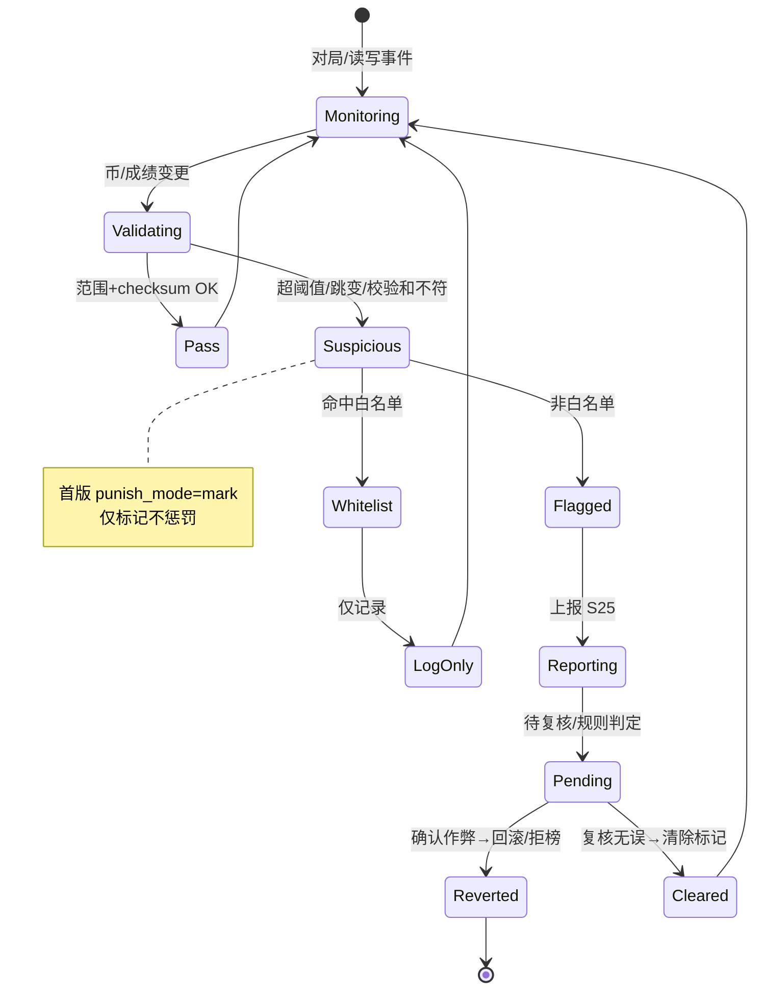
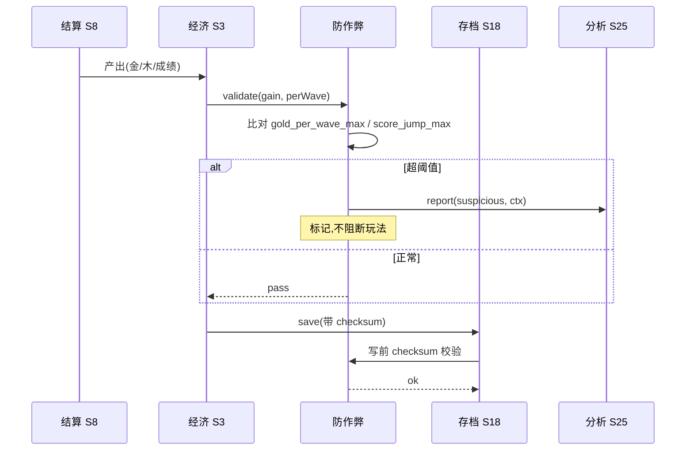

<!-- 编码: UTF-8 -->
# 系统策划案：S24 防作弊系统 (Anti-cheat System)

> 归属域：C 平台工程运营域 · 层级/优先级：增强 / P2 · 关联 F 码：F43 · 关联：SYSTEM_BREAKDOWN §S24 · GDD §6（经济可解性）
> 状态：v0.2-detailed · 日期：2026-07-17
> 上一版：v0.1-draft（仅骨架：模块表 4 行 + 3 异常 + 单表 5 字段，阈值硬编码示例值）

---

## 0. 修订说明（v0.1 → v0.2 加深点）

| 章节 | v0.1 | v0.2 加深内容 |
|------|------|---------------|
| §1 UI 布局 | 仅文字 | 明确"无玩家可见 UI"原则 + 不提示被查策略说明 |
| §2 逻辑功能 | 模块表 4 行 + 3 异常 | 加**校验/检测状态机**、**检测时序图**、**异常边界用例表（12 类，含误伤/离线改档/白名单）** |
| §3 配置表 | 单表 5 字段（含硬编码示例） | `anticheat_config` 扩字段 + **多行示例**，阈值全部改 `[PLACEHOLDER]` 标注调优杆 |
| §4 美术资源 | 2 行占位 | 明确"纯后台无美术" + 内部告警（运营侧，非游戏内） |

> 红线：v0.1 示例把 `gold_per_wave_max: 500` / `score_jump_max: 50` 写成具体数，违反"不捏造平衡数值"。v0.2 全部改为 `[PLACEHOLDER]` + 调优杆标注，实际值由 S25 观测 + GDD §6 通胀检测裁定。

---

## 1. 系统 UI 布局

### 1.1 层级定义（z-order）
| 层级 z | 内容 | 说明 |
|--------|------|------|
| — | **无玩家可见 UI** | 纯后台 |

> 设计原则：作弊检测/惩罚**不对玩家可见**。可疑玩家仅表现为"成绩未上榜"或"成绩被回滚"，不弹任何提示，避免作弊者针对性规避。内部告警走运营后台（非游戏内，见 §4）。

---

## 2. 逻辑功能

### 2.1 模块表
| 模块 | 触发条件 | 处理流程 | 输出 |
|------|----------|----------|------|
| 完整性校验 | 经济(S3)/榜(S13) 写前 + S18 读档 | 关键数值校验和/范围检查（与 S18 checksum 联动） | 放行/拦截 |
| 异常检测 | 单局结算/每 tick | 币增量超阈值 / 成绩跳变 → 标记 | 可疑标记 |
| 离线改档拦截 | S18 读档 | 结构/范围/checksum 校验，坏档→走 S18 损坏流程 | 防改包 |
| 白名单 | 检测命中 | 测试/内部号豁免，仅记录不惩罚 | 免误伤 |
| 上报 | 标记时 | 上报 S25 分析（含上下文） | 数据 |
| 惩罚 | 确认作弊（人工/规则） | 拒榜/回滚成绩（首版仅标记） | 保护公平 |

### 2.2 状态机（检测 + 处置）


### 2.3 时序图（单局结算校验）


### 2.4 异常与边界用例表
| 编号 | 场景 | 触发条件 | 预期处理 | 输出/兜底 |
|------|------|----------|----------|-----------|
| E1 | 校验误伤正常玩家 | 高玩真打出超阈值成绩 | 仅标记不惩罚；人工复核优先（punish_mode=mark） | 零误伤惩罚 |
| E2 | 校验计算错 | 阈值/算法 bug | 跳过该次校验，不阻玩法，告警 S25 | 不崩 |
| E3 | 离线改档(S18) | 手动改 save_main | 读档 checksum/范围校验拦截→走 S18 损坏/重置 | 防改包 |
| E4 | 白名单误判 | 测试号触发 | 白名单豁免，仅记录 | 不误伤 |
| E5 | 阈值过严 | 正常玩法频繁标记 | 监控标记率，超 `[PLACEHOLDER]`% 触发阈值复核 | 防过严 |
| E6 | 阈值过松 | 作弊未被标 | S25 事后聚类发现→调阈值 | 闭环 |
| E7 | 上报失败(S25) | 网络/服务错 | 本地缓存标记，有网补报 | 不丢证据 |
| E8 | 多标记同帧 | 多个指标同帧异常 | 合并为单条工单，附全上下文 | 不刷告警 |
| E9 | checksum 算法缺失 | 旧档无 checksum | 仅做范围校验，补写 checksum | 兼容 |
| E10 | 内存改币(运行期) | 改包内存数值 | 每 tick 采样比对基准曲线，偏离标记 | 本地基础防护 |
| E11 | 回滚导致负资源 | 回滚成绩后数值异常 | 回滚到安全基线（不低于 0） | 不出现负 |
| E12 | 微信接口无关 | 纯本地校验 | 不依赖网络/API，离线可用 | 正常 |

---

## 3. 配置表设计

### 3.1 表：`anticheat_config`（防作弊规则，本地 + 远端可覆盖）
| 字段 | 类型 | 取值范围 | 默认值 | 说明 / 调优杆 |
|------|------|----------|--------|---------------|
| enable | bool | true | true | 总开关 |
| gold_per_wave_max | int | >正常峰值 | `[PLACEHOLDER]` | 单波金币上限 **调优杆** |
| wood_per_wave_max | int | >正常峰值 | `[PLACEHOLDER]` | 单波木头上限 **调优杆** |
| score_jump_max | int | >正常 | `[PLACEHOLDER]` | 成绩跳变上限 **调优杆** |
| best_wave_jump_max | int | >正常 | `[PLACEHOLDER]` | 最佳波数跳变上限 **调优杆** |
| check_interval_ms | int | 100–5000 | `[PLACEHOLDER]` | 采样校验间隔 **调优杆** |
| punish_mode | enum | mark/ban/revert | mark | 惩罚（首版仅标记） |
| whitelist | string[] | 内部号 openid | [] | 豁免名单 |
| checksum_algo | string | "crc32"/"md5" | "crc32" | 完整性算法（本地基础） |
| report_to | string | 分析系统 | "s25" | 上报目标 |
| flag_rate_alert | float | 0–1 | `[PLACEHOLDER]` | 标记率告警线 **调优杆** |

### 3.2 示例数据（多行，阈值均 `[PLACEHOLDER]`）
**示例 A：首版保守（仅标记、宽松）**
```json
{ "enable": true, "gold_per_wave_max": "[PLACEHOLDER]", "wood_per_wave_max": "[PLACEHOLDER]",
  "score_jump_max": "[PLACEHOLDER]", "best_wave_jump_max": "[PLACEHOLDER]",
  "check_interval_ms": "[PLACEHOLDER]", "punish_mode": "mark",
  "whitelist": [], "checksum_algo": "crc32", "report_to": "s25", "flag_rate_alert": "[PLACEHOLDER]" }
```
**示例 B：加强（缩短间隔、回滚）**
```json
{ "enable": true, "gold_per_wave_max": "[PLACEHOLDER]", "wood_per_wave_max": "[PLACEHOLDER]",
  "score_jump_max": "[PLACEHOLDER]", "best_wave_jump_max": "[PLACEHOLDER]",
  "check_interval_ms": "[PLACEHOLDER]", "punish_mode": "revert",
  "whitelist": ["internal_test_openid"], "checksum_algo": "crc32", "report_to": "s25", "flag_rate_alert": "[PLACEHOLDER]" }
```
> 所有阈值 `[PLACEHOLDER]`，由 S25 观测正常分布 + GDD §6 通胀检测裁定；v0.1 硬编码的 `500/50` 已移除，避免捏造平衡数值。`punish_mode` 首版强制 `mark`（仅标记），深惩罚（ban/revert）待合规与误伤评估后开启。

---

## 4. 美术资源需求

| 资源 | 类型 | 帧数 | 分辨率 | 格式 | 切片要求 | 用途 |
|------|------|------|--------|------|----------|------|
| （本身） | — | — | — | — | — | **无玩家可见美术** |
| （内部告警） | — | — | — | — | — | 运营后台看板（非游戏内资源，外部系统） |

> 纯后台系统；深度服务端反作弊为后续（成本考量）。本系统不产生任何游戏内渲染资源；被查玩家无任何提示，保护公平且防规避。
