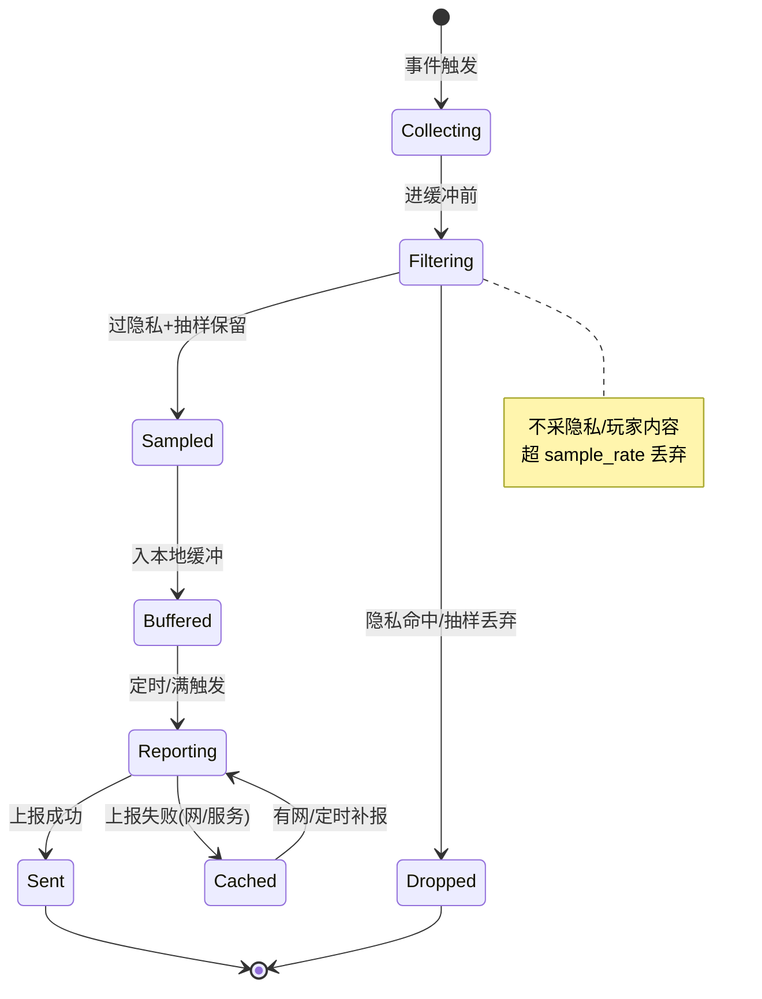
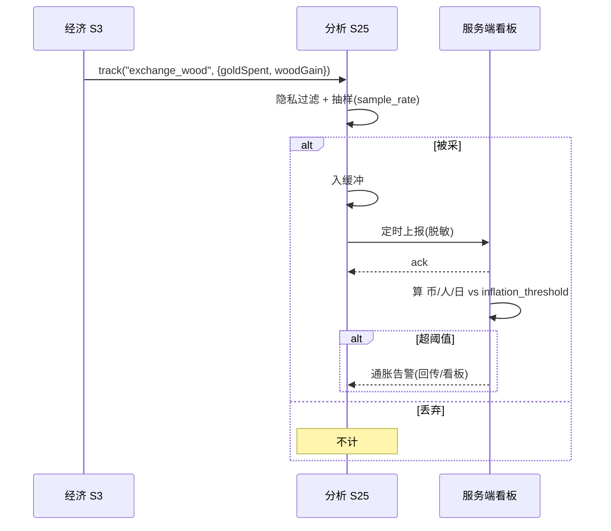

<!-- 编码: UTF-8 -->
# 系统策划案：S25 数据分析系统 (Analytics System)

## 0. 元数据头

- 归属域：C 平台工程运营域
- 层级 / 优先级：增强 / P2
- 关联 F 码：F26 F44
- 关联系统：S3（经济监控）、S24（可疑上报）、各系统（埋点源）、S21（降级告警）、服务端看板
- 版本：v0.2-detailed（2026-07-17）
- 依赖：本地缓冲+脱敏上报；S24 上报通道；服务端看板（外部）
- NEEDS-DESIGN 索引：S25-ND1（sample_rate，NEEDS-DESIGN owner:S25 due:P4-tuning）｜S25-ND2（report_interval，NEEDS-DESIGN owner:S25 due:P4-tuning）｜S25-ND3（buffer_max，NEEDS-DESIGN owner:S25 due:P4-tuning）
- 已设计 value_ref：inflation_threshold→balance/S03_economy.json#econ_inflation_threshold

---

### 0.1 修订说明（v0.1 → v0.2 加深点）

| 章节 | v0.1 | v0.2 加深内容 |
|------|------|---------------|
| §1 UI 布局 | 仅文字 | 明确"无游戏内 UI"，加运营看板（外部）说明 + 数据流向 |
| §2 逻辑功能 | 模块表 5 行 + 4 异常 | 加**采集/上报状态机**、**埋点时序图**、**异常边界用例表（12 类，含上报补报/隐私过滤/采样）** |
| §3 配置表 | 单表 5 字段（阈值写死） | `analytics_config` + `event_catalog`（埋点清单）+ **多行示例**，`sample_rate`/`inflation_threshold` 改 `value_ref`/`NEEDS-DESIGN` 指针 |
| §4 美术资源 | 2 行占位 | 明确"无游戏内美术" + 看板（外部） |

> 红线：v0.1 把 `inflation_threshold: 5000`、`sample_rate: 1.0` 写死为示例值，违反"不捏造平衡数值/采样率"。v0.2 全部改为 value_ref / NEEDS-DESIGN 指针，实际值经试玩观测裁定。

---

## 1. 系统 UI 布局

### 1.1 层级定义（z-order）
| 层级 z | 内容 | 说明 |
|--------|------|------|
| — | **无游戏内 UI** | 纯数据 |
| 外部 | 运营看板 | 服务端/网页，非游戏资源 |

> 数据从客户端经合规脱敏上报到服务端，运营在外部看板查看经济监控（GDD §6 通胀阈值）与留存漏斗。游戏内零 UI。

### 1.2 数据流（客户端 → 服务端）
```
玩法/S3/S24 ──埋点事件──▶ 本地缓冲(采样) ──定时/阈值──▶ 上报(脱敏) ──▶ 服务端看板
                                  │                              │
                            (隐私过滤)                    (失败→本地缓存补报)
```

---

## 2. 逻辑功能

### 2.1 模块表
| 模块 | 触发条件 | 处理流程 | 输出 |
|------|----------|----------|------|
| 埋点 | 各系统事件 | 采 建/养/应急兑换/漏怪/结算/留存 事件 → 隐私过滤 → 采样 | 事件流 |
| 经济监控 | 每局/每日 | 算 币/活跃人/日 → 比通胀阈值(S3/GDD§6) | 告警 |
| 留存漏斗 | 启动→引导→首局→次留→7留 | 算各环节转化 | 漏斗 |
| 异常聚合 | S24/S 各系统告警 | 汇总异常事件 | 运营可见 |
| 上报 | 定时/缓冲满 | 脱敏上报服务端（非隐私） | 看板 |
| 采样 | 每事件 | 按 `sample_rate` 抽样，降量级 | 控成本 |

### 2.2 状态机（采集 → 上报）


### 2.3 时序图（经济事件埋点 + 通胀告警）


### 2.4 异常与边界用例表
| 编号 | 场景 | 触发条件 | 预期处理 | 输出/兜底 |
|------|------|----------|----------|-----------|
| E1 | 上报失败(弱网) | 服务端不可达 | 本地缓存，下次/有网补报 | 不丢数据 |
| E2 | 埋点缺失 | 某系统未发该事件 | 该指标空，漏斗断点标注 | 不崩 |
| E3 | 隐私数据误采 | 事件含 openid/昵称等 | 过滤层剥离隐私字段，仅留匿名 id | 合规 |
| E4 | 量级过大 | 高频事件洪流 | `sample_rate` 抽样 + 缓冲上限丢弃最旧 | 控成本 |
| E5 | 调试事件泄漏 | 开发埋点误带上线 | 按 `event_catalog` 白名单，未知事件丢弃 | 防噪 |
| E6 | 本地缓存满 | 长期离线累积 | 环形覆盖最旧，保最近 | 不炸 |
| E7 | 同事件重复 | 幂等键重复 | 去重（event_id） | 不重复计 |
| E8 | 时间不同步 | 设备时钟错 | 用服务端收报时间，客户端时间仅参考 | 不偏 |
| E9 | 微信 API 无关 | 纯本地采集 | 不依赖微信接口，离线可采 | 正常 |
| E10 | 采样率=0 | 配置误设 | 视为关闭采集（仅关键留存事件保底） | 不空跑 |
| E11 | 通胀阈值缺失 | 配置未给 | 用 econ_inflation_threshold 默认（已设计 value_ref）不告警 | 不误报 |
| E12 | S24 标记上报失败 | 可疑行为上报丢 | 同 E1 本地缓存补报 | 不丢证据 |

---

## 3. 配置表设计

### 3.1 表：`analytics_config`（分析总开关与参数）
| 字段 | 类型 | 取值范围 | 默认值 | 说明 / 调优杆 |
|------|------|----------|--------|---------------|
| enable | bool | true | true | 总开关 |
| sample_rate | float | 0.01–1 | S25-ND1 · NEEDS-DESIGN (owner: S25, due: P4-tuning) | 采样率 **调优杆** |
| inflation_threshold | float | >0 | value_ref: balance/S03_economy.json#econ_inflation_threshold | 复用 S3/GDD §6 通胀线 **调优杆** |
| retain_events | string[] | 事件列表 | ["launch","tutorial_done","first_win","d1","d7"] | 留存事件 |
| report_interval | int | 60–3600 | S25-ND2 · NEEDS-DESIGN (owner: S25, due: P4-tuning) | 上报间隔(s) **调优杆** |
| buffer_max | int | 100–10000 | S25-ND3 · NEEDS-DESIGN (owner: S25, due: P4-tuning) | 本地缓冲上限 **调优杆** |
| privacy_filter | string[] | 隐私字段 | ["openid","nickname","avatar"] | 过滤字段 |

### 3.2 表：`event_catalog`（埋点清单，v0.2 新增）
| event_name | 触发系统 | 参数（脱敏后） | 用途 |
|------------|----------|---------------|------|
| launch | 启动 | {ts, channel} | 启动量 |
| tutorial_done | S9 | {steps} | 引导完成 |
| build_tower | S2 | {tower, slot} | 建造分布 |
| upgrade_tower | S2 | {tower, level} | 养塔曲线 |
| exchange_wood | S3 | {goldSpent, woodGain} | 金木兑换 |
| leak | S6 | {wave, count} | 漏怪 |
| wave_clear | S4 | {wave} | 波次进度 |
| win / lose | S8 | {wave, leak} | 结算 |
| d1 / d7 | S18 | {uid_hash} | 次留/7留 |
| cheat_flag | S24 | {rule} | 作弊标记率 |

### 3.3 示例数据（多行，采样/阈值 `value_ref`/`NEEDS-DESIGN`）
**示例 A：首发（全量+关键告警）**
```json
{ "enable": true, "sample_rate": "S25-ND1", "inflation_threshold": "value_ref:balance/S03_economy.json#econ_inflation_threshold",
  "retain_events": ["launch","tutorial_done","first_win","d1","d7"],
  "report_interval": "S25-ND2", "buffer_max": "S25-ND3",
  "privacy_filter": ["openid","nickname","avatar"] }
```
**示例 B：降本（抽样 + 长间隔）**
```json
{ "enable": true, "sample_rate": "S25-ND1", "inflation_threshold": "value_ref:balance/S03_economy.json#econ_inflation_threshold",
  "retain_events": ["launch","tutorial_done","first_win","d1","d7"],
  "report_interval": "S25-ND2", "buffer_max": "S25-ND3",
  "privacy_filter": ["openid","nickname","avatar","phone"] }
```
> `sample_rate`/`report_interval`/`buffer_max` 标 `S25-ND1`~`S25-ND3`（NEEDS-DESIGN，见 §0 索引 / §5.6）；`inflation_threshold` 已设计为 `value_ref: balance/S03_economy.json#econ_inflation_threshold`（复用 S3/GDD §6 通胀线），v0.1 写死的 `5000/1.0/300` 已移除，避免捏造数值。

---

## 4. 美术资源需求

| 资源 | 类型 | 帧数 | 分辨率 | 格式 | 切片要求 | 用途 |
|------|------|------|--------|------|----------|------|
| （本身） | — | — | — | — | — | **无游戏内美术** |
| （运营看板） | — | — | — | — | — | 外部网页/服务端，非游戏资源 |

> 纯数据系统；合规为先，不采隐私/玩家内容（见 `privacy_filter`）。游戏内零渲染资源。

---

## 5. 实现契约

### 5.1 输入数据结构
| 字段 | 类型 | 来源 config 字段 / 说明 |
|------|------|------------------------|
| sample_rate | float | `analytics_config.sample_rate`（S25-ND1） |
| inflation_threshold | float | value_ref: balance/S03_economy.json#econ_inflation_threshold |
| report_interval | int | `analytics_config.report_interval`（S25-ND2） |
| buffer_max | int | `analytics_config.buffer_max`（S25-ND3） |
| event_catalog | json | `event_catalog` 埋点白名单 |

### 5.2 输出数据结构
| 字段 | 类型 | 说明 |
|------|------|------|
| buffered_events | array | 本地缓冲事件 |
| report_ack | bool | 服务端收报确认 |

### 5.3 跨系统接口调用表
| caller | callee | function | 方向 | 用途 |
|--------|--------|----------|------|------|
| S3 / S24 / 各系统 | S25 | `track(event)` | in | 埋点采集 |
| S25 | Srv | 上报(脱敏) | out | 服务端看板 |
| S25 | Cache | 本地缓冲 | out | 补报 |
| S21 | S25 | `report(降级)` | in | 远端失败告警 |

### 5.4 错误码表
| E# | 场景 | 兜底 | 涉及系统 |
|----|------|------|----------|
| E1 | 上报失败 | 本地缓存补报 | Srv |
| E2 | 埋点缺失 | 指标空，漏斗断点标注 | — |
| E3 | 隐私数据误采 | 过滤层剥离隐私字段 | — |
| E4 | 量级过大 | 采样+缓冲上限丢弃最旧 | — |
| E5 | 调试事件泄漏 | 白名单外丢弃 | — |
| E6 | 本地缓存满 | 环形覆盖最旧 | — |
| E7 | 同事件重复 | event_id 去重 | — |
| E8 | 时间不同步 | 用服务端收报时间 | — |
| E9 | 微信无关 | 纯本地采集 | — |
| E10 | 采样率=0 | 关采集（保关键留存） | — |
| E11 | 通胀阈值缺失 | 用 econ_inflation_threshold 默认不告警 | S3 |
| E12 | S24 标记上报失败 | 本地缓存补报 | S24 |

### 5.5 状态转换表
| state | event | transition | action |
|-------|-------|-----------|--------|
| Collecting | 事件触发 | → Filtering | 进缓冲前 |
| Filtering | 过隐私+抽样保留 | → Sampled | — |
| Filtering | 隐私命中/抽样丢弃 | → Dropped | — |
| Sampled | — | → Buffered | 入本地缓冲 |
| Buffered | 定时/满触发 | → Reporting | — |
| Reporting | 上报成功 | → Sent | — |
| Reporting | 上报失败 | → Cached | 本地缓存 |
| Cached | 有网/定时 | → Reporting | 补报 |
| Sent / Dropped | — | → [*] | — |

### 5.6 数值消费清单
本系统消费的 balance 层参数（已设计，指向既有 param_id）：
- `econ_inflation_threshold` — 来源 `balance/S03_economy.json`（inflation_threshold）

本系统自有的未设计调优项（NEEDS-DESIGN，无 balance param）：
- `S25-ND1` sample_rate — NEEDS-DESIGN (owner: S25, due: P4-tuning)
- `S25-ND2` report_interval — NEEDS-DESIGN (owner: S25, due: P4-tuning)
- `S25-ND3` buffer_max — NEEDS-DESIGN (owner: S25, due: P4-tuning)

## 6. 冲突与待裁定

### 6.1 冲突汇总
本系统无 DO 待裁定冲突项；开放调优项见 §0 索引 / §5.6。
