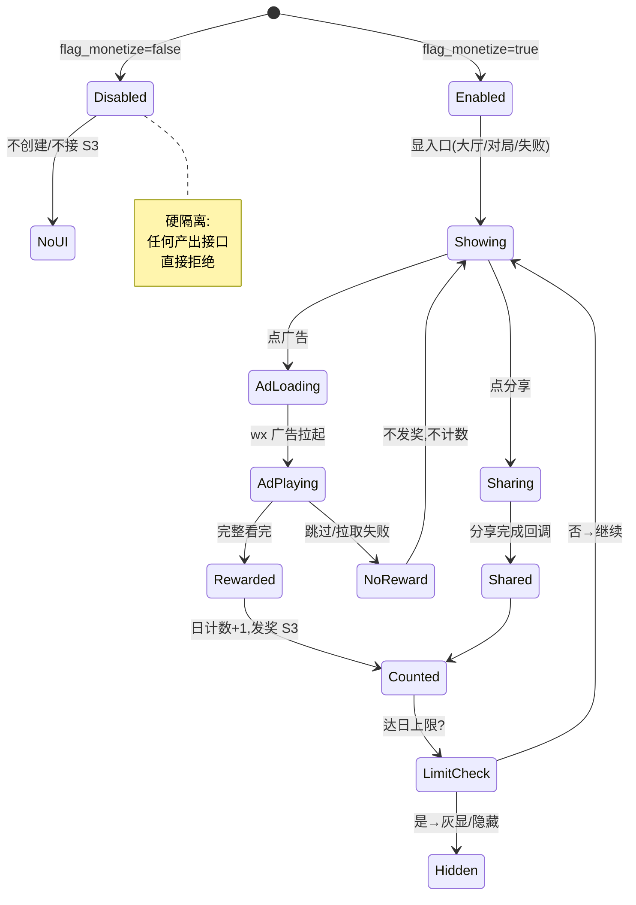
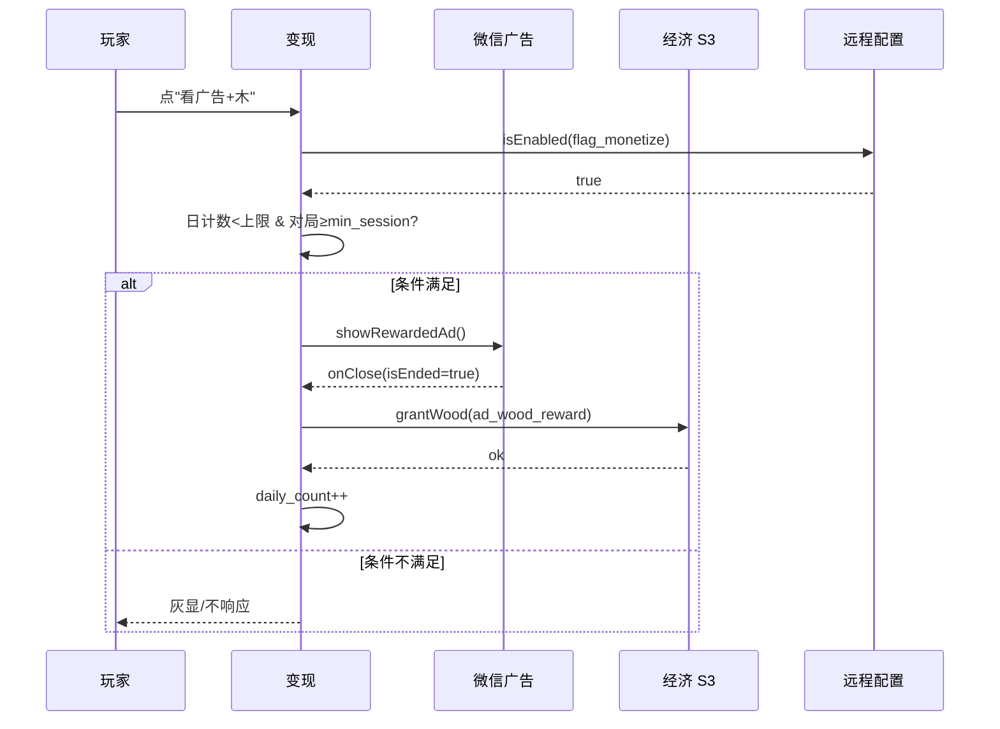

<!-- 编码: UTF-8 -->
# 系统策划案：S26 变现系统 (Monetization System)

> 归属域：C 平台工程运营域 · 层级/优先级：探索 / P3 · 关联 F 码：F19 · 关联：SYSTEM_BREAKDOWN §S26 · GDD §8（合规）/ FEATURE_SCOPE §7#1
> 状态：v0.2-detailed · 日期：2026-07-17
> 上一版：v0.1-draft（仅骨架：模块表 5 行 + 4 异常 + 单表 6 字段，上限写死示例）

---

## 0. 修订说明（v0.1 → v0.2 加深点）

| 章节 | v0.1 | v0.2 加深内容 |
|------|------|---------------|
| §1 UI 布局 | 3 行组件（坐标粗略） | 加 z 层级、**奖励层/失败层像素线框（750×1334 坐标）**、交互流程图 |
| §2 逻辑功能 | 模块表 5 行 + 4 异常 | 加**开关控制状态机**、**广告/分享时序图**、**异常边界用例表（12 类，含开关 off 硬隔离/广告未完成）** |
| §3 配置表 | 单表 6 字段（上限写死） | `monetize_config` 扩字段 + **多行示例**，上限全部改 `[PLACEHOLDER]` |
| §4 美术资源 | 4 行占位 | 加帧数/分辨率/格式/切片（广告/复活/分享按钮） |

> 红线：v0.1 写死 `ad_daily_limit:5`/`ad_wood_reward:20`/`share_reward:10`/`min_session:30`，违反"不捏造广告频次上限/奖励量"。v0.2 全部改 `[PLACEHOLDER]` + 调优杆。**核心约束不变：开关 default off，off 时经济零破环产出（硬隔离）。**

---

## 1. 系统 UI 布局

### 1.1 层级定义（z-order）
| 层级 z | 内容 | 说明 |
|--------|------|------|
| 50 | **奖励弹层（本系统，开关 on 时）** | 看广告 +木 入口（大厅/对局底） |
| 55 | **失败复活层（S8 内，开关 on 时）** | 看广告复活入口 |
| 60 | 广告播放遮罩 | 平台广告层（微信提供，非自绘） |

> 开关 off（默认）时：本系统**不创建任何 UI、不接入 S3**，世界与经济完全不含广告/分享产出。

### 1.2 像素级线框（750×1334 设计基准）

**A. 看广告 +木 入口（z=50，大厅/对局底，开关 on 时显示）**
```
┌──────────── 750px ────────────┐ y=0
│  ... 大厅/对局内容 ...          │
│  ┌── 330px ──┐ (40,1150,330×96)│ y=1150
│  │ 🎁 看广告 +木(2/5)│ 按钮(次数标)│ y=1150
│  └────────────┘                 │ y=1246
└─────────────────────────────────┘ y=1334
```

**B. 失败复活层（z=55，S8 内，revive_enabled 时）**
```
│  ┌── 330px ──┐ (210,900,330×96)│ y=900 (失败层内)
│  │ 🔄 看广告复活        │        │ y=900
│  └────────────┘                 │ y=996
```

**C. 分享按钮（z=50，S8 预留）**
```
│  ┌── 330px ──┐ (40,1050,330×96)│ y=1050
│  │ 📤 分享得奖励         │        │ y=1050
│  └────────────┘                 │ y=1146
```

### 1.3 组件表
| 组件 | 坐标(x,y) | 尺寸(w×h) | z | 响应行为 |
|------|-----------|-----------|---|----------|
| 看广告按钮 | (40,1150) | 330×96 | 50 | 点→播广告→完成→发木(S3，受控)→计数 |
| 复活按钮 | (210,900) | 330×96 | 55 | 点→广告→续命(Lives+)（S8 内） |
| 分享按钮 | (40,1050) | 330×96 | 50 | 点→wx.share→完成→发奖 |
| 广告遮罩 | (0,0) | 750×1334 | 60 | 平台广告层（非自绘） |
| 次数标签 | 按钮内右 | 80×40 | 51 | "n/上限" 动态 |
| （开关 off） | — | — | — | 全部不创建 |

### 1.4 交互流程图
```mermaid
flowchart TD
    A[启动读 S21 flag_monetize] --> B{开关 on?}
    B -- 否 default off --> C[不创建 UI,不接 S3]
    B -- 是 --> D[显入口(大厅/对局/失败)]
    D --> E{用户点广告/分享}
    E -- 广告 --> F[拉 wx 广告→播]
    F --> G{完成?}
    G -- 是 --> H[发奖 S3 受控 + 日计数+1]
    G -- 否 跳过/失败 --> I[不发奖,不计数]
    E -- 分享 --> J[wx.share→完成回调]
    J --> K[发奖+计数]
    H --> L{达日上限?}
    L -- 是 --> M[入口灰显/隐藏]
    K --> M
```

---

## 2. 逻辑功能

### 2.1 模块表
| 模块 | 触发条件 | 处理流程 | 输出 |
|------|----------|----------|------|
| 开关控制 | 读 S21 `flag_monetize` | off→全系统不显不接；on→显入口 | 零破环 / 可变现 |
| 广告激励 | 点 + 开关 on | 播广告(wx)→完成回调→发木/复活(S3) | 奖励 |
| 分享激励 | 点 + 开关 on | wx.share→回调→发奖 | 奖励 |
| 限次防刷 | 每次成功 | 日计数 → 达上限禁用 | 防刷(S24 协同) |
| 隔离 | 开关 off | 拒绝任何外部产出接入 S3 | 经济安全 |
| 最短局限制 | 点广告前 | 对局时长 < `min_session` 不显广告入口 | 防速刷 |

### 2.2 状态机（开关 + 发奖）


### 2.3 时序图（看广告发木）


### 2.4 异常与边界用例表
| 编号 | 场景 | 触发条件 | 预期处理 | 输出/兜底 |
|------|------|----------|----------|-----------|
| E1 | 开关 off 仍调用 | 代码/旧缓存误调 | 硬隔离：拒绝，不产出来源 | 经济零破环 |
| E2 | 广告未完成(跳过) | 用户提前关/点跳 | `onClose(isEnded=false)`→不发奖，计数不增 | 不白送 |
| E3 | 日上限达 | `daily_count>=ad_daily_limit` | 入口灰显/隐藏，不可点 | 防刷 |
| E4 | 广告拉取失败 | wx 广告接口 fail | 提示"稍后再试"，不发奖 | 不崩 |
| E5 | 开关动态切换 | 对局中 flag 变 off | 进行中广告结算后不再显入口；已发奖保留 | 平滑关 |
| E6 | 复活时 Lives 已 0 处理 | 广告期间已判负 | 复活仅回补 Lives+续局，不重复结算 | 安全 |
| E7 | 分享回调失败 | wx.share 无回调/取消 | 不发奖，不计数，提示 | 不崩 |
| E8 | 重复点击 | 连点广告 | 防抖，单次广告流程锁 | 不重复发 |
| E9 | 最短局限制 | 对局 <`min_session` | 不显广告入口（防速刷） | 合规 |
| E10 | 奖励写入 S3 失败 | S3 拒绝(超上限) | 回退计数，提示"领取失败重试" | 不丢计数 |
| E11 | 儿童/合规 | 平台判定不可广告 | 入口不显（开关仍 on 但接口受限） | 合规优先 |
| E12 | 防刷协同 | 异常高频点击 | 计数 + S24 频率标记 | 双保险 |

---

## 3. 配置表设计

### 3.1 表：`monetize_config`（变现参数，受 S21 `flag_monetize` 总控）
| 字段 | 类型 | 取值范围 | 默认值 | 说明 / 调优杆 |
|------|------|----------|--------|---------------|
| enabled | bool | false | false | 总开关（**default off**，镜像 S21.flag_monetize） |
| ad_daily_limit | int | 1–20 | `[PLACEHOLDER]` | 每日广告上限 **调优杆** |
| ad_wood_reward | int | 1–200 | `[PLACEHOLDER]` | 看广告得木 **调优杆** |
| revive_enabled | bool | false | false | 复活开关 |
| revive_lives_gain | int | 1–10 | `[PLACEHOLDER]` | 复活回补 Lives **调优杆** |
| share_reward | int | 0–200 | `[PLACEHOLDER]` | 分享得奖 **调优杆** |
| min_session | int | 0–300 | `[PLACEHOLDER]` | 最短局后才可广告(s) **调优杆** |
| ad_cooldown | int | 0–600 | `[PLACEHOLDER]` | 两次广告间隔(s) **调优杆** |
| position | enum | lobby/ingame/fail | ingame | 广告入口位置 |

### 3.2 示例数据（多行，上限/奖励 `[PLACEHOLDER]`）
**示例 A：默认关（首发必为关）**
```json
{ "enabled": false, "ad_daily_limit": "[PLACEHOLDER]", "ad_wood_reward": "[PLACEHOLDER]",
  "revive_enabled": false, "revive_lives_gain": "[PLACEHOLDER]", "share_reward": "[PLACEHOLDER]",
  "min_session": "[PLACEHOLDER]", "ad_cooldown": "[PLACEHOLDER]", "position": "ingame" }
```
**示例 B：开启试验（限次 + 复活）**
```json
{ "enabled": true, "ad_daily_limit": "[PLACEHOLDER]", "ad_wood_reward": "[PLACEHOLDER]",
  "revive_enabled": true, "revive_lives_gain": "[PLACEHOLDER]", "share_reward": "[PLACEHOLDER]",
  "min_session": "[PLACEHOLDER]", "ad_cooldown": "[PLACEHOLDER]", "position": "ingame" }
```
> 所有上限/奖励标 `[PLACEHOLDER]`，经合规 + S25 观测（确保开关 on 时通胀仍在 GDD §6 阈值内）裁定；v0.1 写死的 `5/20/10/30` 已移除。**硬隔离不变**：`enabled=false` 时 S3 不接收任何外部产出。

---

## 4. 美术资源需求

| 资源 | 类型 | 帧数 | 分辨率 | 格式 | 切片要求 | 用途 |
|------|------|------|--------|------|----------|------|
| 看广告按钮 | UI 状态 | 3（常态/按下/灰显） | 330×96×3 | PNG-8 | 含礼品图标 + 次数标位 | 入口 z=50 |
| 复活按钮 | UI 状态 | 3（常态/按下/灰显） | 330×96×3 | PNG-8 | 含复活图标 | 失败层 z=55 |
| 分享按钮 | UI 状态 | 3（常态/按下/灰显） | 330×96×3 | PNG-8 | 含分享图标 | 入口 z=50 |
| 次数标签 | 文本 | 1 | 80×40（24px） | FNT | 单帧 "n/上限" | 按钮内 |
| 广告遮罩 | — | — | — | — | 平台提供，无自绘 | z=60 微信广告 |
| 奖励飘字 | UI 文本 | 1（位图字） | 120×48 | FNT | 单帧 "+木×N" | 发奖反馈 |

> 开关 off 时全部隐藏；广告播放层由微信平台提供，本系统不自绘。合规审查随平台政策更新（FEATURE_SCOPE §7#1）。
