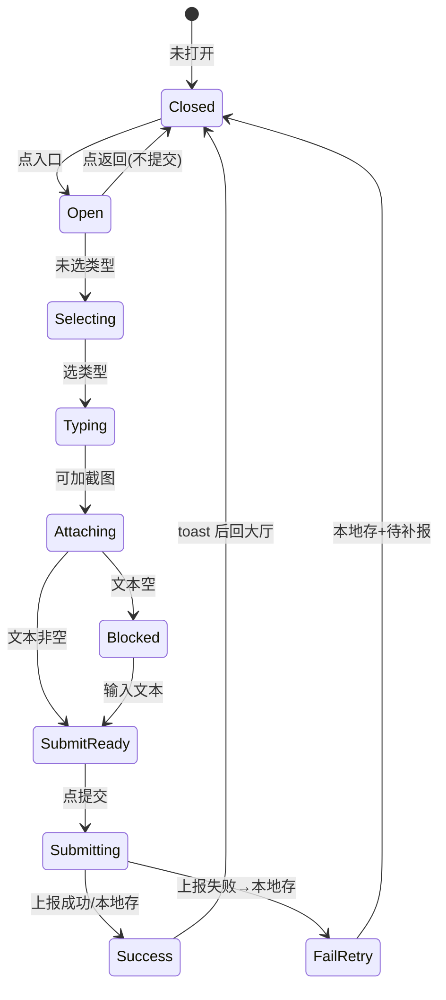
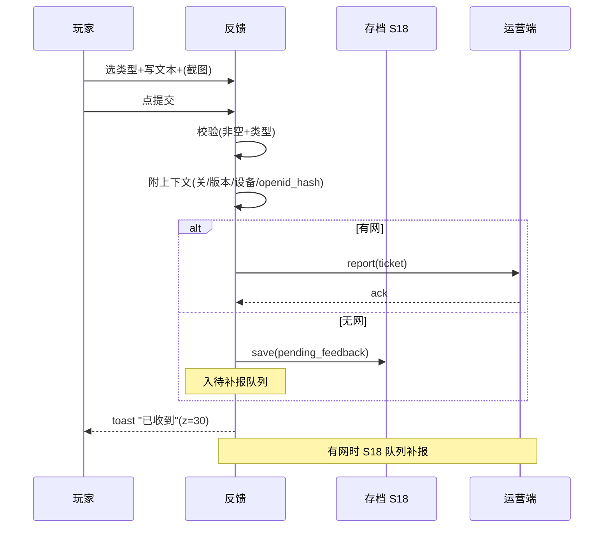

<!-- 编码: UTF-8 -->
# 系统策划案：S27 客服反馈系统 (Feedback System)

> 归属域：C 平台工程运营域 · 层级/优先级：增强 / P2 · 关联 F 码：F41 · 关联：SYSTEM_BREAKDOWN §S27 · GDD §8（适配）
> 状态：v0.2-detailed · 日期：2026-07-17
> 上一版：v0.1-draft（仅骨架：模块表 5 行 + 4 异常 + 单表 5 字段）

---

## 0. 修订说明（v0.1 → v0.2 加深点）

| 章节 | v0.1 | v0.2 加深内容 |
|------|------|---------------|
| §1 UI 布局 | 3 行组件（坐标粗略） | 加 z 层级、**反馈页精确像素线框（750×1334 坐标）**、交互流程图 |
| §2 逻辑功能 | 模块表 5 行 + 4 异常 | 加**表单状态机**、**提交时序图**、**异常边界用例表（12 类，含空提交/无网补报/截图超限）** |
| §3 配置表 | 单表 5 字段 | `feedback_config` 扩字段（截图限制/上下文/冷却）+ **多行示例** |
| §4 美术资源 | 5 行占位 | 加帧数/分辨率/格式/切片（入口/表单底/标签/提交/toast/截图） |

---

## 1. 系统 UI 布局

### 1.1 层级定义（z-order）
| 层级 z | 内容 | 说明 |
|--------|------|------|
| 0–10 | 大厅(S10)底 | 入口常驻 |
| 10 | 反馈页导航栏 | 返回+标题 |
| 20 | 反馈表单（类型/文本/截图/提交） | 中部 |
| 30 | 提交成功 toast | 底部瞬显 |

### 1.2 像素级线框（750×1334 设计基准）

**反馈页（z=0–30）**
```
┌──────────── 750px ────────────┐ y=0
│ [←](40,40,64×64)   反馈(295,40,160×56)│ y=40 (导航 z=10)
│ ───────────────────────────── 分隔(y=120)│
│ 问题类型:                       │ y=160 (z=20)
│ [Bug](40,200,120×48)[建议](180,200,120×48)[其他](320,200,120×48)│ y=200
│ ┌── 文本框 670×200 ──┐ (40,280)│ y=280
│ │ 请输入您的反馈…      │ (placeholder)│ y=280
│ └────────────────────┘          │ y=480
│ [📷](40,520,120×120) 添加截图(180,560,200×40)│ y=520 (z=20)
│  (截图缩略图,可删)              │
│                                 │
│ ┌── 提交 300×96 ──┐ (225,1050)│ y=1050 (z=20)
│ └──────────────────┘           │ y=1146
│  (成功 toast: 居中底 y=1100,300×56 z=30)│
└─────────────────────────────────┘ y=1334
```

### 1.3 组件表
| 组件 | 坐标(x,y) | 尺寸(w×h) | z | 响应行为 |
|------|-----------|-----------|---|----------|
| 入口图标 | (大厅内,自定) | 96×96 | 10 | 大厅/设置常驻，点→开反馈页 |
| 返回图标 | (40,40) | 64×64 | 10 | 点→回大厅 S10 |
| 标题文本 | (295,40) | 160×56 | 10 | "反馈" |
| 类型标签-Bug | (40,200) | 120×48 | 20 | 点→选中(高亮) |
| 类型标签-建议 | (180,200) | 120×48 | 20 | 点→选中 |
| 类型标签-其他 | (320,200) | 120×48 | 20 | 点→选中 |
| 文本框 | (40,280) | 670×200 | 20 | 输入，max_len 限制 |
| 截图缩略 | (40,520) | 120×120 | 20 | 显示已选截图，点×删除 |
| 添加截图 | (180,560) | 200×40 | 20 | 点→调 wx 选图 |
| 提交按钮 | (225,1050) | 300×96 | 20 | 校验→提交；空/未选类型置灰 |
| 成功 toast | (225,1100) | 300×56 | 30 | "已收到"瞬显 1.5s |

### 1.4 交互流程图
```mermaid
flowchart TD
    A[大厅 S10 → 反馈入口] --> B[开反馈页]
    B --> C{选类型?}
    C -- 未选 --> D[提交按钮置灰]
    C -- 已选 --> E{文本非空?}
    E -- 空 --> D
    E -- 非空 --> F[提交可用]
    F --> G[点提交]
    G --> H[附上下文(关/版本/设备)]
    H --> I{有网?}
    I -- 是 --> J[上报运营端]
    I -- 否 --> K[存本地 S18 + 待补报]
    J --> L[成功 toast z=30]
    K --> L
    L --> M[回大厅]
```

---

## 2. 逻辑功能

### 2.1 模块表
| 模块 | 触发条件 | 处理流程 | 输出 |
|------|----------|----------|------|
| 入口 | 大厅/设置 | 路由到反馈页 | 打开 |
| 类型选择 | 点标签 | bug/建议/其他→选中高亮 | 分流标记 |
| 文本输入 | 用户输入 | 受 `max_len` 限制，超长截断/提示 | 内容 |
| 截图附件 | 点添加 | `wx.chooseImage`→压缩→附缩略 | 附件 |
| 表单提交 | 点提交 | 校验非空+类型 → 附上下文 → 上报 | 工单 |
| 本地留存 | 提交时 | 可选存 S18（调试用） | 备份 |
| 回执 | 提交后 | toast"已收到" | 反馈感 |
| 补报 | 有网时 | 本地待报队列重发 | 不丢 |

### 2.2 状态机（反馈表单）


### 2.3 时序图（提交 + 无网补报）


### 2.4 异常与边界用例表
| 编号 | 场景 | 触发条件 | 预期处理 | 输出/兜底 |
|------|------|----------|----------|-----------|
| E1 | 空提交 | 文本空/未选类型 | 提交按钮置灰，提示填内容 | 不提交 |
| E2 | 上报失败(无网) | 运营端不可达 | 存本地 S18 + 待补报队列，有网重发 | 不丢工单 |
| E3 | 截图超限 | 选图 >`screenshot_max_kb` | 压缩到上限或提示重选 | 不崩 |
| E4 | 文本超长 | >`max_len` | 截断到上限 + 提示剩余 | 不溢出 |
| E5 | 截图权限拒绝 | 用户拒相册 | 静默跳过截图，文本仍可提交 | 不阻断 |
| E6 | 连点提交 | 快速多点 | 防抖，单次提交锁 | 不重复建单 |
| E7 | 类型未选提交 | 漏选 | 高亮类型区 + 禁用提交 | 引导补全 |
| E8 | 上下文采集失败 | 读不到版本/关 | 附可得字段，缺字段留空 | 不阻断 |
| E9 | 微信 API 无关 | 纯本地部分 | 本地存可用，上报依赖网络 | 正常 |
| E10 | 待补报队列满 | 长期离线累积 | 环形覆盖最旧，保最近 | 不炸 |
| E11 | 提交中切后台(S20) | onHide 时正在上报 | 上报改为本地存，回前台补报 | 不丢 |
| E12 | 敏感内容 | 文本含个人信息 | 上报前脱敏（隐私过滤，协同 S25） | 合规 |

---

## 3. 配置表设计

### 3.1 表：`feedback_config`（反馈参数）
| 字段 | 类型 | 取值范围 | 默认值 | 说明 |
|------|------|----------|--------|------|
| enable | bool | true | true | 总开关 |
| types | string[] | 类型列表 | ["bug","suggest","other"] | 分类 |
| max_len | int | 100–2000 | `[PLACEHOLDER]` | 文本上限 **调优杆** |
| attach_screenshot | bool | true | true | 是否附截图 |
| screenshot_max_kb | int | 50–2000 | `[PLACEHOLDER]` | 截图体积上限(KB) **调优杆** |
| screenshot_size | int | 200–1000 | `[PLACEHOLDER]` | 截图边长上限(px) **调优杆** |
| attach_context | bool | true | true | 自动附上下文(关/版本/设备) |
| report_target | string | 运营端 | "ops" | 上报目标 |
| submit_cooldown | int | 0–60 | `[PLACEHOLDER]` | 提交冷却(s) **调优杆** |
| pending_max | int | 1–50 | `[PLACEHOLDER]` | 待补报队列上限 **调优杆** |

### 3.2 示例数据（多行）
**示例 A：默认（全开，上限 `[PLACEHOLDER]`）**
```json
{ "enable": true, "types": ["bug","suggest","other"], "max_len": "[PLACEHOLDER]",
  "attach_screenshot": true, "screenshot_max_kb": "[PLACEHOLDER]", "screenshot_size": "[PLACEHOLDER]",
  "attach_context": true, "report_target": "ops", "submit_cooldown": "[PLACEHOLDER]", "pending_max": "[PLACEHOLDER]" }
```
**示例 B：轻量（关截图、短文本）**
```json
{ "enable": true, "types": ["bug","suggest"], "max_len": "[PLACEHOLDER]",
  "attach_screenshot": false, "screenshot_max_kb": "[PLACEHOLDER]", "screenshot_size": "[PLACEHOLDER]",
  "attach_context": true, "report_target": "ops", "submit_cooldown": "[PLACEHOLDER]", "pending_max": "[PLACEHOLDER]" }
```
> `max_len`/`screenshot_*`/`submit_cooldown`/`pending_max` 标 `[PLACEHOLDER]`，按运营负载与合规裁定；v0.1 写死的 `max_len:500` 已改为调优杆。

---

## 4. 美术资源需求

| 资源 | 类型 | 帧数 | 分辨率 | 格式 | 切片要求 | 用途 |
|------|------|------|--------|------|----------|------|
| 反馈入口图标 | UI 状态 | 2（常态/按下） | 96×96×2 | PNG-8(透明) | 单图标，各态 | 大厅/设置入口 |
| 反馈页背景 | UI | 1 | 750×1334 | JPG/PNG(压缩) | 全屏 ≤150KB | 场景底 |
| 返回图标 | UI 状态 | 2 | 64×64×2 | PNG-8 | 各态 | 导航 |
| 标题文本 | 文本 | 1 | 160×56（36px） | FNT | 单帧 | "反馈" |
| 类型标签 | UI 状态 | 3（常态/选中/按下） | 120×48×3 | PNG-8 | 选中高亮态切片 | 类型选择 |
| 文本框底 | UI 九宫 | 1 | 源 64×64（拉伸 670×200） | PNG-8 | 九宫 16px 圆角 | 输入容器 |
| 截图缩略底 | UI | 1 | 120×120 | PNG-8 | 单帧 + 删除角标位 | 截图预览 |
| 添加截图图标 | UI 状态 | 2 | 200×40×2 | PNG-8 | 含相机图标 | 添加入口 |
| 提交按钮 | UI 状态 | 3（常态/按下/灰显） | 300×96×3 | PNG-8 | 含文字"提交" | 操作 |
| 成功 toast | UI 九宫 | 1 | 源 64×64（拉伸 300×56） | PNG-8 | 九宫圆角 | z=30 提示 |

> 表单样式复用通用 UI 组件库；截图用微信 `chooseImage` 能力，本系统只声明体积/边长上限与缩略底切片。所有切片遵循微信单图 ≤128KB、合图集原则（见 S19 F34）。
