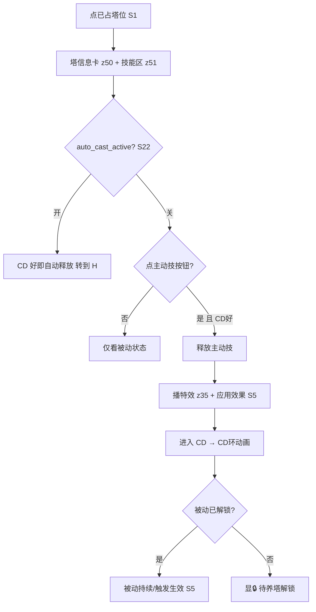
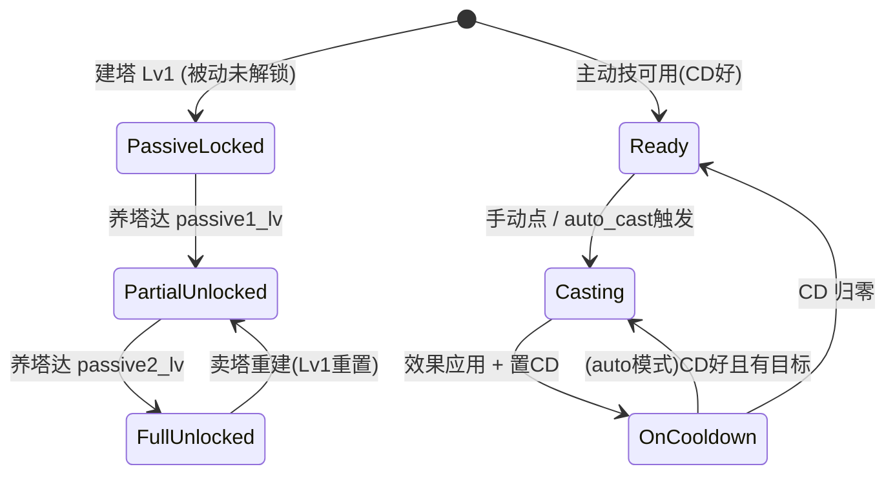
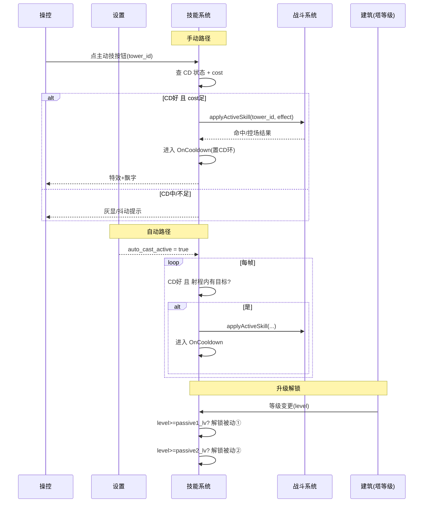

<!-- 编码: UTF-8 -->
# 系统策划案：S28 技能系统 (Skill System)

> 归属域：A 核心战斗域 · 层级/优先级：MVP / P0 · 关联 F 码：F2 F3 F4 F7（技能为塔固有能力，依附建/养/战）· 关联：GDD §5.8（技能系统，本重构新增）；SYSTEM_BREAKDOWN §S28
> 状态：v0.2-detailed · 日期 2026-07-17
> 版本说明：本系统为 DO 裁定"核心玩法新规"耦合重构**新增**系统（v0.2 直接成稿，无 v0.1 前身）。覆盖：①像素级 UI 线框 / 状态机 / 时序图 / 异常边界用例 / 完整配置字段与多行示例 / 美术资源帧数·分辨率·格式·切片 ②为 7 塔种各设计 1 主动 + 2 被动（每塔种三技能均不同）。
> 平衡数值（CD / 技能数值 / 解锁等级 / 应急兑换参数 / 掉率等）保持 `[PLACEHOLDER]`，仅标注"调优杆"，禁止硬编码。
> 设计红线：杜绝主导策略、经济失衡、认知过载、支柱漂移——技能是"养成爽感(P2)"与"每局有取舍(P4)"的放大器，不得取代经济循环(P1)或养塔核心。

---

## 0. 修订/生成说明（新规耦合点）

本系统承接 DO 裁定新规，与下列变更强耦合，落地时须同步对齐：

| 新规 | 对 S28 的含义 |
|---|---|
| R1 每塔种 1 主动 + 2 被动（均不同） | `skill_config` 按 `tower_id` 唯一配置三技能；全 7 塔种见 §2.6 |
| R2 木 = session 货币（仅怪掉、不持久化） | 主动技 **cost 默认 0（纯 CD 触发）**，不与养塔争木；木来源见 S03/S04 |
| R3 塔战斗内初始 Lv1，木升级、每局重来 | 被动技按养塔等级**解锁**（见 §2.5），强化 P2 养成曲线 |
| R4 移除木房，换新风种（**DO 已确认：风塔 / t_wind**） | 新风种定名「风塔 / t_wind」（击退控制），技能见 §2.6； |
| R5 金→木应急兑换（受限、非主源） | 不影响技能；仅说明木稀缺，故技能不消耗木 |
| R6 主动技手动 + 自动释放开关 | 手动：选中塔→技能按钮(有 CD 环)；自动：`auto_cast_active`(S22) |

> **已裁定项**：新风种（风塔 / t_wind）定位/命名已确认（击退控制）；技能数值与是否消耗少量木（当前默认 0）仍待试玩调优。

---

## 1. 系统 UI 布局

### 1.1 布局层级（z 轴，与 S1/S2 对齐）

| 层级 z | 名称 | 说明 |
|---|---|---|
| 30 | 单位层 / 被动光环 | 塔模型 + 被动光环特效（世界空间，属 S28 表现） |
| 35 | 技能命中特效 | 主动技释放特效（攻/控类，接 S23） |
| 50 | 选中塔弹出层 | 塔信息卡（S2）+ **技能按钮区（本系统）** |
| 51 | 技能按钮 / CD 环 | 选中塔时显示 1 个主动技按钮 + 被动状态指示 |
| 52 | 木掉落实时指示 | 怪物掉木时的局内飘字/落点提示（接 S3/S4） |
| 70 | 技能说明弹层 | 长按技能图标 → 技能描述（desc） |

### 1.2 像素级线框（750 × 1334 设计基准 + 分辨率自适应）

```
  (0,0)┌─────────────────────────────────────────── 750 ──┐
       │  顶栏 z45 [金 S3] [第X/Y波 S4] [木 S3] [♥×N S6]    │ y=20..90
       │        ↕ 木掉落实时飘字 +🪵 z52 (怪死亡落点上方)     │
       │                  ╭── 环形路径 z10 ──╮               │
       │    ⬡塔位z20     │    ◯塔(已占)z30    │   ⬡塔位z20  │
       │   (300,400)     │   ⟲被动光环z30     │  (450,400)  │
       │   80×80         │      (内侧)        │   80×80     │
       │                 ╰────────────────────╯              │
       │          选中塔位→射程圈 z40 + 被动光环 z30         │
       │                                                    │
       │  ┌── 塔信息卡 z50 (点已占塔位) ──────────┐          │ y≈700
       │  │ 箭塔 Lv.3  DPS 120  范围 160          │          │
       │  │ [养塔 木×N] [卖塔] [索敌]             │          │
       │  │ ── 技能区 z51 ─────────────────────  │          │
       │  │ [⚔主动技 精准齐射]  CD环▩▩▩░ 12s     │  ← 本系统 │
       │  │  被动①破甲 ✔  被动②连射 ✔(Lv解锁)    │          │
       │  └──────────────────────────────────────┘          │
       │  ── 底部操作条 z50 ─────────────────────────────  │ y=1230
       │  [2x S7]                              [⏸ S7]        │
       └────────────────────────────────────────────── 1334 ┘
```

**分辨率自适应策略（强制）**
- **设计基准** 750×1334（逻辑像素，@1x）；运行时以 `design_size = (750,1334)` 为锚。
- **锚点(Anchor)**：顶栏组件锚定 Top（y 比例 0.0–0.067）；底部操作条锚定 Bottom（y=1334 比例 1.0）；选中塔弹出层锚定"塔位上方 + 安全区"，不可被刘海遮挡。
- **九宫格(Slicing)**：塔信息卡、技能按钮底、CD 环底均九宫（边 16px 圆角 12），拉伸不变形。
- **相对比例(Relative)**：技能按钮尺寸 = `96×96 × safe_scale`，`safe_scale = min(screen_w/750, screen_h/1334)`；CD 环以相对半径绘制。
- **安全区(Safe Area)**：所有可点组件内缩至 `top≥statusbar+20, bottom≥home_indicator+20`（刘海/灵动岛/手势条）；技能按钮最小可点区 ≥ `88×88`（P3 一指可玩）。
- **Letterbox**：渲染分辨率 ≠ 设计基准时，按 **contain** 留黑边（不裁切玩法），HUD 元素相对设计基准定位后整体缩放。
- **DPR**：美术资源按 `design×DPR` 提供 @2x/@3x（见 §4），引擎 `cc.view` 设 `resolutionPolicy = FIT`，`devicePixelRatio` 对齐真机。

### 1.3 组件表（x,y 左上角；w×h；z）

| 组件 | 坐标(x,y) | 尺寸(w×h) | z | 响应行为 |
|---|---|---|---|---|
| 木掉落实时飘字 | 怪物死亡落点动态 | 文本 20px + 🪵 图标 | 52 | 怪掉木时 +🪵N 上浮 0.6s（接 S4 掉率） |
| 被动光环 | 塔位中心，半径=aura | 世界空间 | 30 | 被动解锁后常驻渲染（如减速/击退/光环） |
| 技能按钮（主动） | 信息卡内 (245,820) | 96×96 | 51 | 点→释放主动技(若 CD 好)；CD 中灰显+CD 环 |
| 主动技 CD 环 | 覆盖技能按钮 | 同 96×96 环形 | 51 | 顺时针消退，剩 0 亮起可点 |
| 被动①指示 | 信息卡内 (355,820) | 48×48 | 51 | 解锁✔亮 / 未解锁🔒灰（显解锁等级） |
| 被动②指示 | 信息卡内 (415,820) | 48×48 | 51 | 同上 |
| 技能说明弹层 | 长按技能按钮弹出 (195,560) | 360×240 | 70 | 显 desc + CD + 解锁条件，松手收起 |

### 1.4 交互流程图（mermaid flowchart）



---

## 2. 逻辑功能

### 2.1 功能模块表（触发 / 处理 / 输出）

| 模块 | 触发条件 | 处理流程（正常） | 输出 |
|---|---|---|---|
| 技能定义加载 | 开局读 `skill_config` | 按 `tower_id` 取 active/passive1/passive2 + cd | 技能数据就绪 |
| 主动技释放（手动） | 点技能按钮 + CD 好 + cost 足 | 置 CD → 播特效 → 调 S5 应用效果 | 控/伤/增益生效 |
| 主动技自动释放 | `auto_cast_active` 开 + CD 好 + 有目标 | 同手动（免点） | 同上 |
| 被动生效 | 被动解锁(达等级) + 战斗事件 | 挂常驻/事件钩子(命中/击杀/状态) | 被动效果持续 |
| 技能 CD 管理 | 释放后 | 进 CD 计时；auto 模式到点触发 | CD 环更新 |
| 升级解锁 | 养塔升级(S2) 达 `unlock_lv` | 解锁对应被动/主动 | 技能栏亮起 |

### 2.2 状态机（mermaid stateDiagram-v2 — 单塔主动技生命周期）



### 2.3 时序流程图（mermaid sequenceDiagram — 手动释放 vs 自动释放）



### 2.4 异常与边界用例表

| 场景 | 触发条件 | 处理流程 | 输出 / 兜底 |
|---|---|---|---|
| 网络中断 | 纯本地技能逻辑 | 无网络依赖 | 不受影响 |
| 切后台（S20） | `onHide` | 主动技 CD 计时挂起（不后台推进） | `onShow` CD 续计，零错乱 |
| 数据损坏（S18） | `skill_config` 缺/损坏 | 该塔技能不激活，被动不生效；已建塔仅基础攻击 | 记 S25，不崩 |
| 并发操作 | 同帧多点技能按钮 | 防抖：仅首次释放，其余忽略 | 只进一次 CD |
| 并发操作 | 手动点 + auto 同帧 | auto 优先判定，手动被忽略（避免双释放） | 单次释放 |
| 数值极值 | `cd`≤0 | 钳制最小 `[PLACEHOLDER] 1s`，报 S25 | 技能可用 |
| 数值极值 | 等级跳跃（跳级养塔） | 一次性解锁所有达标被动 | 不丢解锁 |
| 数值极值 | 卖塔重建 | 被动重置回 Lv1 锁定态（session 不保留） | 符合 R3 |
| 配置缺失 | 某塔 `active_skill` 缺 | 该塔无主动技按钮（仅被动，若有） | 降级不崩 |
| 配置缺失 | `passive_lv` 缺 | 默认 Lv1 即解锁（或按兜底等级） | 被动常驻 |
| 目标飞行中死亡 | 主动技锁定目标已死 | 改打最近目标 / 范围技照常 | 不空放（范围技） |
| auto_cast 与 手动冲突 | 自动释放瞬间玩家手动 | 取先到者，后者提示"已释放" | 单次释放 |
| 性能极值 | 多塔同时主动技特效 | 对象池 + 特效上限（接 S23） | 帧率保护 |

### 2.5 升级解锁（技能与养塔等级绑定，强化 P2）

- 主动技：建塔即 Lv1 可用（CD 触发），不依赖升级。
- 被动①：养塔达 `passive1_lv`（默认 `[PLACEHOLDER]`，建议 3 级）解锁。
- 被动②：养塔达 `passive2_lv`（默认 `[PLACEHOLDER]`，建议 5 级）解锁。
- 卖塔重建 → 等级归 Lv1 → 被动重新锁定（session 不跨局，呼应 R3）。
- **调优杆**：解锁等级决定"养塔阈值感"——太低则被动廉价，太高则前期无差异；建议随 growth 曲线调。

### 2.6 各塔种技能设计（7 塔种 · 每塔种 1 主动 + 2 被动，均不同）

> 调性对齐《绿色循环圈》：技能是塔"性格"的延伸，非新资源体系。主动技为 CD 触发（cost 默认 0，不与养塔争木）。数值全 `[PLACEHOLDER]`。

#### 箭塔（arrow · 物理单攻 · 克轻甲）
| 技能 | 名称 | 效果 | CD / 解锁 |
|---|---|---|---|
| 主动 | 精准齐射 | 对当前目标瞬间打出 N 连射，造成 `[PLACEHOLDER]`× 爆发伤害（单体秒杀脆皮） | CD `[PLACEHOLDER]`s；Lv1 |
| 被动① | 破甲 | 攻击有 `[PLACEHOLDER]`% 概率使目标护甲减免 −`[PLACEHOLDER]`% 持续 `[PLACEHOLDER]`s（协同克制链） | 达 `passive1_lv` |
| 被动② | 连射 | 每第 `[PLACEHOLDER]` 次攻击后攻速 +`[PLACEHOLDER]`% 持续 `[PLACEHOLDER]`s（触发型手感） | 达 `passive2_lv` |

#### 炮塔（cannon · 物理溅射 · 克集群/重甲）
| 技能 | 名称 | 效果 | CD / 解锁 |
|---|---|---|---|
| 主动 | 饱和轰炸 | 在怪物最密集处呼叫弹幕，造成大范围 AOE 伤害 + `[PLACEHOLDER]`s 短减速 | CD `[PLACEHOLDER]`s；Lv1 |
| 被动① | 燃烧溅射 | 溅射命中附加持续灼烧 DoT `[PLACEHOLDER]`/s × `[PLACEHOLDER]`s | 达 `passive1_lv` |
| 被动② | 重创 | 对重甲目标额外伤害 +`[PLACEHOLDER]`%（强化克制，呼应 P4） | 达 `passive2_lv` |

#### 冰塔（ice · 控制减速 · 克所有）
| 技能 | 名称 | 效果 | CD / 解锁 |
|---|---|---|---|
| 主动 | 极寒领域 | 范围/全场怪物冻结定身 `[PLACEHOLDER]`s（强控，Boss 波救命） | CD `[PLACEHOLDER]`s；Lv1 |
| 被动① | 霜冻蔓延 | 减速状态结束时有 `[PLACEHOLDER]`% 概率蔓延至附近 `[PLACEHOLDER]` 个怪 | 达 `passive1_lv` |
| 被动② | 冰封易伤 | 被减速/冻结的怪受到其他塔伤害 +`[PLACEHOLDER]`%（支援型，放大组合 P4） | 达 `passive2_lv` |

#### 风塔（wind · **DO 已确认** · 击退控制）
> 定位：继冰塔后的**第二类控制**（位移 vs 减速），与冰塔形成"冻住+吹回"经典 combo；首发 4 塔之一，使起步 kit 控制齐全。
| 技能 | 名称 | 效果 | CD / 解锁 |
|---|---|---|---|
| 主动 | 飓风之眼 | 范围内所有怪大幅**击退**（沿路径后退 `[PLACEHOLDER]` 距离）+ 定身 `[PLACEHOLDER]`s | CD `[PLACEHOLDER]`s；Lv1 |
| 被动① | 持续气流 | 每次攻击有 `[PLACEHOLDER]`% 概率附加小幅击退，延长怪在射程内时间 | 达 `passive1_lv` |
| 被动② | 逆风惩罚 | 被击退过的怪移速 −`[PLACEHOLDER]`%（叠加上限 `[PLACEHOLDER]` 层），变相放大全场 DPS | 达 `passive2_lv` |

#### 魔法塔（magic · 真伤无视护甲 · 魔免克星）
| 技能 | 名称 | 效果 | CD / 解锁 |
|---|---|---|---|
| 主动 | 奥术爆发 | 对单体造成巨额真伤并清除其增益/护盾 | CD `[PLACEHOLDER]`s；Lv1 |
| 被动① | 奥术穿透 | 攻击无视 `[PLACEHOLDER]`% 护甲减免（强化真伤定位） | 达 `passive1_lv` |
| 被动② | 法力充能 | 每次击杀缩短主动技 CD `[PLACEHOLDER]`s（击杀流循环） | 达 `passive2_lv` |

#### 毒塔（poison · 持续 DoT · 克高 HP）
| 技能 | 名称 | 效果 | CD / 解锁 |
|---|---|---|---|
| 主动 | 剧毒新星 | 范围释放毒云，所有命中怪染上强效 DoT `[PLACEHOLDER]`/s × `[PLACEHOLDER]`s + 微减速 | CD `[PLACEHOLDER]`s；Lv1 |
| 被动① | 腐蚀 | DoT 可叠 `[PLACEHOLDER]` 层，越肉掉血越快（强化"越肉越赚"） | 达 `passive1_lv` |
| 被动② | 毒性传染 | 中毒怪死亡时向周围 `[PLACEHOLDER]` 范围爆毒，传染 DoT | 达 `passive2_lv` |

#### 电塔（electric · 连锁 · 克密集）
| 技能 | 名称 | 效果 | CD / 解锁 |
|---|---|---|---|
| 主动 | 雷暴 | 全场随机落雷 `[PLACEHOLDER]` 次连锁，密集怪群毁灭 | CD `[PLACEHOLDER]`s；Lv1 |
| 被动① | 过载 | 连锁跳数 +`[PLACEHOLDER]`，对同目标二次命中增伤 +`[PLACEHOLDER]`% | 达 `passive1_lv` |
| 被动② | 导电 | 被电塔命中的怪"导电"，受到其他塔伤害 +`[PLACEHOLDER]`%（combo 放大 P4） | 达 `passive2_lv` |

> **设计校验（红线）**：
> - 无"主导策略"：7 塔种技能互补（单体/ AOE/ 控/ 真伤/ DoT/ 连锁/ 位移），无单一技能碾压全场。
> - 不争木：主动技 cost=0（纯 CD），木专供养塔（R2/R3），无经济失衡。
> - 认知可控：每塔仅 1 主动（1 按钮）+ 2 被动（自动），无二级菜单深水区（P3）。

---

## 3. 配置表设计

**表名：`skill_config`（技能配置，按 tower_id 唯一）**

| 字段 | 类型 | 取值范围 | 默认值 | 说明 |
|---|---|---|---|---|
| tower_id | string | 关联 `tower_config.tower_id` | — | 塔主键（7 种） |
| active_skill | string | 非空 | — | 主动技名（见 §2.6） |
| active_desc | string | 非空 | — | 主动技描述（技能说明弹层用） |
| active_cd | float | 1–120 | `[PLACEHOLDER]` | 主动技冷却(s)。**调优杆**：技能节奏 |
| active_cost | int | 0–999（默认 0） | 0 | 技能木消耗（默认 0=纯 CD，不争养塔木） |
| passive_1 | string | 非空 | — | 被动①名 |
| passive1_desc | string | 非空 | — | 被动①描述 |
| passive1_lv | int | 1–max_level | `[PLACEHOLDER]` | 解锁所需养塔等级（默认建议 3） |
| passive_2 | string | 非空 | — | 被动②名 |
| passive2_desc | string | 非空 | — | 被动②描述 |
| passive2_lv | int | 1–max_level | `[PLACEHOLDER]` | 解锁所需养塔等级（默认建议 5） |

**多行示例数据（CSV；数值列 `[PLACEHOLDER]` 为待调优占位，名称/描述按 §2.6）**

```csv
tower_id,active_skill,active_desc,active_cd,active_cost,passive_1,passive1_desc,passive1_lv,passive_2,passive2_desc,passive2_lv
t_arrow,精准齐射,对当前目标瞬间N连射造成爆发伤害,[PLACEHOLDER],0,破甲,攻击概率降低目标护甲减免,[PLACEHOLDER],连射,每第K次攻击后攻速提升,[PLACEHOLDER]
t_cannon,饱和轰炸,怪物最密处呼叫弹幕造成大范围AOE+短减速,[PLACEHOLDER],0,燃烧溅射,溅射命中附加持续灼烧DoT,[PLACEHOLDER],重创,对重甲目标额外伤害,[PLACEHOLDER]
t_ice,极寒领域,范围/全场怪物冻结定身,[PLACEHOLDER],0,霜冻蔓延,减速结束概率蔓延至附近怪,[PLACEHOLDER],冰封易伤,减速/冻结怪受他塔伤害增加,[PLACEHOLDER]
t_wind,飓风之眼,范围内所有怪大幅击退+定身,[PLACEHOLDER],0,持续气流,攻击概率附加小幅击退,[PLACEHOLDER],逆风惩罚,被击退怪移速永久降低(叠加),[PLACEHOLDER]
t_magic,奥术爆发,单体巨额真伤并清除增益/护盾,[PLACEHOLDER],0,奥术穿透,攻击无视部分护甲减免,[PLACEHOLDER],法力充能,击杀缩短主动技CD,[PLACEHOLDER]
t_poison,剧毒新星,范围毒云染强效DoT+微减速,[PLACEHOLDER],0,腐蚀,DoT可叠层越肉越赚,[PLACEHOLDER],毒性传染,中毒怪死亡爆毒传染,[PLACEHOLDER]
t_electric,雷暴,全场随机落雷连锁密集怪群,[PLACEHOLDER],0,过载,连锁跳数+1且二次命中增伤,[PLACEHOLDER],导电,被电怪受他塔伤害增加,[PLACEHOLDER]
```

> 说明：`t_wind` 为新风种（**DO 已确认**命名/定位：风塔 t_wind，击退控制）；所有数值 `[PLACEHOLDER]` 及 `active_cost=0` 经试玩调优。配置经 S21 可热更 CD/数值，但技能逻辑结构不可热更。

---

## 4. 美术资源需求

| 资源 | 帧数 | 分辨率 | 格式 | 切片要求 |
|---|---|---|---|---|
| 主动技图标（7 种） | 1（静态）+ disabled(CD中) + pressed | 96×96（@2x 192 / @3x 288） | Atlas | 单格切片，CD 环覆盖层独立 |
| 主动技 CD 环 | 1（静态环形遮罩，程序化扫光） | 96×96 透明 | PNG | 环形，按 CD 比例擦除 |
| 被动①/② 指示 | 2 态（✔解锁 / 🔒未解锁） | 48×48 | Atlas | 单格切片，角标显解锁等级 |
| 技能说明弹层底 | 1（静态，九宫） | 360×240 | PNG | 九宫 16px 圆角 |
| 主动技释放特效（按塔 type，7 种） | 箭6 / 炮8 / 冰6 / 风8 / 魔8 / 毒8 / 电10 | 128×128（@2x 256） | Atlas | 中心爆发，additive |
| 被动光环（按塔 type，7 种） | 循环 4–8 帧（常驻） | 256×256 透明 | Atlas | 锚点中心，按塔位缩放 |
| 木掉落实时飘字 + 🪵 | 文本动画（绿+/木） | 文本 20px + 24×24 图标 | 引擎文本+Atlas | 0.6s 上浮淡出 |
| 技能命中顿帧/震屏 | 接 S23 打击感 | — | — | 与 S5/S23 合并 |

> 所有特效经 S19 分包；帧数/分辨率/DPR(@2x/@3x) 与压缩规范见 S19/S34；打击感与音效合并见 S23。被动光环常驻渲染须评估同屏数量（性能极值见 §2.4）。
