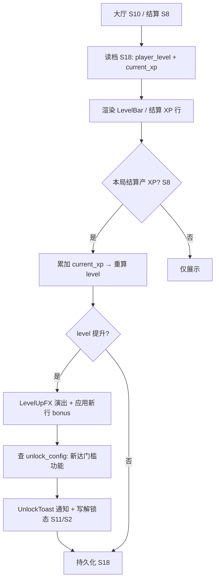
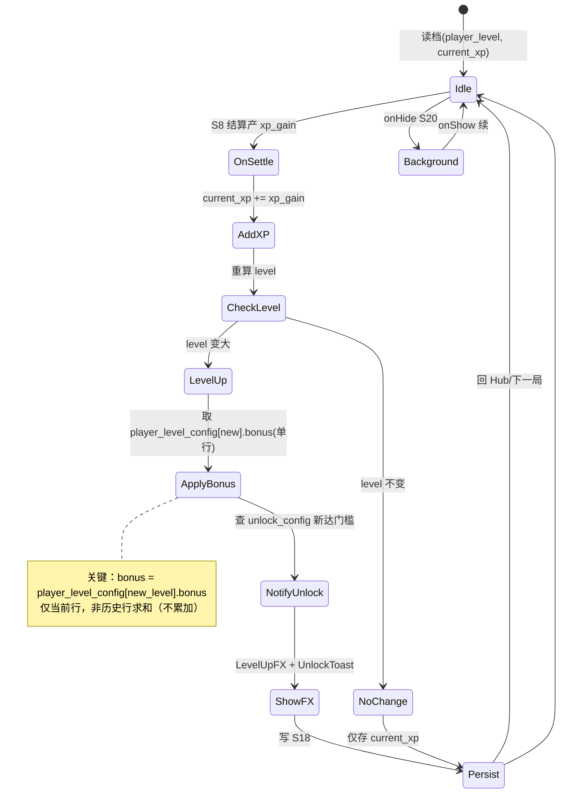

<!-- 编码: UTF-8 -->
# 系统策划案：S29 玩家等级系统 (Player Level System)

## 0. 元数据头

- **归属域**：B 元进度社交域
- **层级/优先级**：增强 / P2（元进度主轴）
- **关联 F 码**：F45（新增）
- **关联文档**：GDD §5.9（玩家等级系统，既有引用撞号见 §6 C-S29-4）；SYSTEM_BREAKDOWN §S29
- **版本/状态**：v0.2-detailed · 2026-07-17
- **设计基准**：UI 750×1334（Cocos Creator 3.8.8 · 微信小游戏）· 安全区：顶部 y<88、底部 y>1290 不放置可点组件
- **数值约定**：凡涉及 `xp_required` / `dmg_mult` / `range_mult` / `atk_speed_mult` / 解锁等级 / 加成幅度的调优量已全部指针化（`value_ref`，见 §3 / §5.6）；终值见 `balance/S29_level_system.json`。禁裸 `[PLACEHOLDER]`。
- **合规边界**：不做付费直购数值（S26 带开关，default off）；解锁为确定性（等级门槛，非抽卡）。
- **NEEDS-DESIGN 索引**：`xp_gain`（每局结算产出，归属 S08 结算系统，本系统不持有；`owner: S08, due: P4-tuning`，见 §0.1 / §5.6）。

### 0.1 设计定位与铁律

- **玩家等级 = 元进度（跨局持久化，存 S18）**，是《短局长线》P5 的留存主轴。
- **等级是功能解锁的统一门槛**：原 S11 资源解锁树改为由等级驱动（资源类解锁货币本就未定，现统一以等级为门槛）。达到 `unlock_config[feature].required_level` 即解锁对应功能（塔种 / 永久升级 / 系统入口）。
- **每级提供额外基础属性（全局塔基础增益）**，规则严格为 **「不累加」**：
  - 维护查表 `player_level_config[level] → bonus_attributes`（该等级对应的**总**增益快照）。
  - 战斗内塔有效属性 = `tower_base × player_level_config[当前等级].bonus`。
  - **仅取当前等级那一行；绝不把 1..N 级的加成求和（非 Σ、非 Π）。** 升级只换"取哪一行"，历史行不叠加。
- **加成自动套到塔上**：开局 / S02 建塔时，按 `session_player_level`（= 读档 `save.player_level` 的快照）查表修正塔基础属性（dmg / range / atk_speed）。玩家零操作、零认知负担。
- **XP 来自每次战斗结算（S08）**：`xp_gain`（NEEDS-DESIGN (owner: S08, due: P4-tuning)）→ 累加 `current_xp` → 跨过 `xp_required` 阈值即升级。

> ⚠️ **铁律重申（务必实现正确）**：`bonus = player_level_config[player_level].bonus`（单行）；**不是** `Σ(player_level_config[1..player_level].bonus)`。任何"每级 +X% 累加"的实现都违反本系统定义。

### 0.2 依赖与边界（信息性，非冲突）

- **依赖**：
  - **S08 结算**：XP 唯一来源（`xp_gain`）。
  - **S18 存档**：持久化 `player_level` / `current_xp` / 解锁态（**需 S18 在 `save_schema` 增加上述字段**，本次未改 S18，见 §6 C-S29-3）。
  - **S11 解锁**：功能解锁门槛由本系统 `unlock_config` 驱动；S11 原资源解锁树改为等级门槛。
  - **S02/S05 战斗**：建塔/战斗初始化时引用 `player_level_config[session_player_level].bonus` 修正塔基础属性（不累加）。
- **边界 / 明确不做**：
  - 不做等级衰减/降级惩罚（等级只增不减，除非 S24 反作弊回滚）。
  - 不做等级专属付费（合规，见 S26）。
  - 不做等级排行榜（排行榜 S13 用波数/塔等级维度）。

---

## 1. 系统 UI 布局

### 1.1 布局层级（元进度/大厅 + 结算 + 覆盖层）

| 层级 z | 名称 | 说明 |
|---|---|---|
| 45 | 等级条 LevelBar | 大厅/元进度顶条：Lv.N + XP 进度条（接 S10/S11 顶区） |
| 70 | 结算 XP 行 | 结算面板(S8)内：本局 +XP 与 XP 条 |
| 80 | 升级演出 LevelUpFX | 全屏闪光 + "LEVEL UP! Lv.N" + 加成摘要 |
| 81 | 解锁通知 UnlockToast | 底部滑入 toast："解锁：魔法塔" |

### 1.2 像素级线框（750 × 1334，含 3 个视图）

**视图 A：大厅/元进度 等级条（顶区）**
```
  (0,0)┌────────────────────────────────────────── 750 ──┐
       │ (20,40)⟲返回   元资源:[P]   Lv.7 ▰▰▰▱▱ 820/1500XP │ y=40  LevelBar z45
       │ ┌──────┐┌──────┐┌──────┐  TabBar                  │ y=120
       │ │解锁树││塔解锁││升级树│                            │
       │ └──────┘└──────┘└──────┘                          │
```

**视图 B：结算面板（在 S8 面板内追加 XP 行）**
```
       │  ┌── 结算面板 z70 ──────────────────────┐          │ y=400
       │  │  胜 利!  [新纪录!]                     │          │
       │  │  撑过 X 波 · 漏 Y 只 · 最高塔 Lv.Z     │          │
       │  │  产出: 🪙 +A   🪵 +B                   │          │
       │  │  ✨ 等级 XP +C   Lv.6→Lv.7 ▰▰▰▱ 820/1500│        │ y≈820 ← S29 新增
       │  └──────────────────────────────────┘          │ y=900
```

**视图 C：升级演出 + 解锁通知（覆盖层）**
```
       │        ┌──── 升级演出 z80 (居中) ────────┐         │ y≈500
       │        │   ✨ LEVEL UP! ✨                │         │
       │        │      Lv.7                        │         │
       │        │   全局伤害 +[P]% · 射程 +[P]%      │         │ ← 当前等级那一行 bonus
       │        └────────────────────────────────┘         │
       │        ┌── 解锁通知 z81 ──┐                       │ y≈1180 底部安全区上
       │        │ 🔓 解锁：魔法塔    │  (滑入 0.3s)          │
       │        └─────────────────┘                       │
```
> `[P]` 为运行时实际值占位（读 `player_level_config[session_player_level]` 当前行 bonus），**非调优 knob**；终值见 `balance/S29_level_system.json#plv.L<level>.<field>`。

### 1.3 组件表（x,y 左上角；w×h；z；分辨率自适应说明）

| 组件 | 坐标(x,y) | 尺寸(w×h) | z | 响应 | 自适应 |
|---|---|---|---|---|---|
| LevelBar 等级徽章 | (20,40) | 120×48 | 45 | 无（展示） | 锚定左上安全区(inset L8/T8)；固定尺寸 |
| LevelBar XP 条 | (150,52) | 560×24 | 45 | 无 | 锚定顶/左，宽 = 父宽×0.75 相对比例，九宫拉伸 |
| 结算 XP 行 | (95,820) | 560×40 | 70 | 无 | 同结算面板内相对定位 |
| LevelUpFX 面板 | (75,500) | 600×334 | 80 | 点空白/自动关 | 锚定 center，letterbox 时保持居中 |
| UnlockToast | (75,1180) | 600×80 | 81 | 自动消失 | 锚定 bottom-center(inset B<44)，宽相对 |

### 1.4 分辨率自适应规格（anchors / 九宫 / 相对比例 / 安全区 / letterbox / DPR）

- **设计基准**：750×1334（@1x 逻辑分辨率）。所有坐标以上表为准。
- **锚点（Anchor）**：
  - LevelBar 等级徽章 / XP 条：锚定 **Top-Left**（SafeArea Top+8 / Left+8），刘海屏自动内缩。
  - UnlockToast：锚定 **Bottom-Center**（SafeArea Bottom+min(44, safeBottom)），横竖屏均贴底居中。
  - LevelUpFX：锚定 **Center**，保证任意分辨率居中。
- **九宫（9-Slice）**：XP 条底、LevelUpFX 面板、Toast 底均用九宫拉伸（capinset 留边），避免拉伸变形。
- **相对比例（Relative）**：XP 条宽度用相对父容器比例（如 `width = parent.width × 0.75`），而非绝对 px，保证宽屏/窄屏一致填充。
- **安全区（Safe Area）**：所有可点/可见组件避让 顶部 y<88、底部 y>1290（iPhone 刘海/Home 指示条）；非刘海机按 0 inset 处理。
- **Letterbox**：当设备宽高比 ≠ 750:1334（如平板/异形屏），采用 **letterbox 黑边** 保持内容比例，UI 以设计分辨率居中，不拉伸变形；战斗场景同理。
- **DPR / 资源分级**：美术资源出 **@1x / @2x / @3x** 三档（见 §4）；引擎按设备 `devicePixelRatio` 选档，文本用引擎 SDF 字体保证任意 DPR 清晰。

### 1.5 交互流程图（大厅/结算 → 等级 → 解锁）



---

## 2. 逻辑功能

### 2.1 功能模块表（触发 / 处理 / 输出）

| 模块 | 触发条件 | 处理流程（正常） | 输出 |
|---|---|---|---|
| 读档快照 | 进局(S1)/建塔(S2) | 读 `save.player_level` → `session_player_level` 快照 | 本局加成基准 |
| XP 入账 | S8 结算产出 `xp_gain` | `current_xp += xp_gain` → 重算 `level = max{L \| xp_required[L] ≤ current_xp}` | 可能升级 |
| 升级判定 | `level` 变大 | 触发 LevelUpFX + 重算 `session_player_level`（下局生效） | 升级演出 |
| 加成应用 | S02 建塔 / S05 初始化 | `tower_eff = tower_base × player_level_config[session_player_level].bonus`（**单行，不累加**） | 塔有效属性 |
| 解锁判定 | `level` 跨过 `unlock_config.required_level` | 标记功能解锁 → 写 S2 可建列表 / S11 升级态 | 新功能可用 |
| 解锁通知 | 解锁发生 | 弹 UnlockToast | 玩家可见 |
| 持久化 | 升级/解锁后 | 写 `player_level`/`current_xp`/解锁态 → S18 | 跨局保留 |

### 2.2 升级状态机（FSM · stateDiagram-v2）



### 2.3 时序流程图（结算产 XP → 升级 → 解锁，跨系统）

```mermaid
sequenceDiagram
    participant S8 as 结算系统
    participant S29 as 等级系统
    participant S18 as 存档
    participant S11 as 元进度/解锁
    participant S2 as 建筑(塔)
    S8->>S29: xp_gain (来源 S08 · NEEDS-DESIGN owner S08)
    S29->>S18: 读 player_level, current_xp
    S18-->>S29: 现值
    S29->>S29: current_xp += xp_gain; level = f(xp_required)
    alt level 提升
        S29->>S29: ApplyBonus(取新行, 不累加)
        S29->>S11: 查 unlock_config 新达门槛
        S11-->>S29: 解锁 feature(s)
        S29->>S2: 标记可建/可用(feature 为塔种)
        S29->>S29: LevelUpFX + UnlockToast
    end
    S29->>S18: 写 player_level, current_xp, 解锁态
    S29-->>S8: 结算完成(可显示 XP 行)
```

### 2.4 异常与边界用例表（12 类）

| 用例ID | 异常类型 | 触发条件 | 预期处理流程 | 输出 / 兜底 | 涉及系统 |
|---|---|---|---|---|---|
| E01 | XP 溢出 | 单局 `xp_gain` 极大，跨多等级 | `level = max{L \| xp_required[L] ≤ current_xp}`，一次跳多级；逐行套新 bonus + 多次解锁通知 | 正确跳级，不卡 | — |
| E02 | 跨级跳 | 离线/补结算致 `current_xp` 直接跨 N 级 | 同 E01，循环触发每级解锁通知（合并 toast 或队列） | 全部解锁生效 | S11 |
| E03 | 加成未生效 | 建塔时 `session_player_level` 未读/读脏 | 建塔前强制 `session_player_level = save.player_level`；缺失则默认 level=1（无加成，安全） | 不崩，降级无加成 | S18/S02 |
| E04 | 存档等级损坏 | `save.player_level` 非数/越界 | 钳制 `level = clamp(1, max_level)`；`current_xp` 损坏则重置 0 | 不崩，可重玩 | S18 |
| E05 | 并发结算 | 两局结算同时回写（防御性） | `isLeveling` 锁；后到结算排队/忽略重复 | 仅一次升级 | S8/S18 |
| E06 | 等级回退 | 反作弊(S24)回滚 / 存档回退 / 账号重置 | 允许 `level` 下降；**重算 bonus 用新（更低）行**；本局已建塔按新行重算（下局生效） | 无负增益残留 | S24/S02 |
| E07 | 解锁漏发 | 跳级时某 `required_level` 恰被跨过，未弹通知 | 升级后**全量重算**已解锁集（diff 旧/新），补齐漏发通知 | 不漏解锁 | S11 |
| E08 | 配置缺失 | `player_level_config` 缺当前/相邻级 | 用相邻级兜底或 level=1 行；告警 S25 | 可战 | S25 |
| E09 | 配置缺失 | `unlock_config` 缺 feature | 该 feature 视为永久解锁或永久锁（按类型，塔种默认锁） | 不崩 | S25 |
| E10 | 数值极值 | `xp_required` 非递增/重复 | 校验为严格递增；非递增则拒绝升级（告警） | 不卡死 | S25 |
| E11 | 数值极值 | `bonus` 字段异常(≤0/溢出) | 钳制到合法区间（如 dmg_mult ∈ [1.0, 5.0]）；对 S24 报可疑 | 塔可战 | S24 |
| E12 | 切后台/中断 | 升级演出中 `onHide` | 演出协程挂起；`onShow` 续；持久化在演出前已完成（先存后演） | 不丢进度 | S20/S18 |

> 设计红线检查：无主导策略（等级增益普惠全塔种，不偏某塔）；无认知过载（全自动零操作）；无支柱漂移（服务 P5 跨局变强）。

---

## 3. 配置表设计

> 数值全部指针化：CSV 示例内 `[PLACEHOLDER]` 改为 `value_ref: balance/S29_level_system.json#<param_id>`（行内多字段用 `.field` 子键，如 `plv.L5.dmg_mult`）。字段表 `默认值` 列同步指向。终值见 `balance/S29_level_system.json`。

### 3.1 表 `player_level_config`（等级 → 加成，不累加）

| 字段 | 类型 | 取值/范围 | 默认值 | 说明 |
|---|---|---|---|---|
| level | int | 1–value_ref: balance/S29_level_system.json#plv_max_level | 1 | 等级（起始 1） |
| xp_required | int | 0–value_ref: balance/S29_level_system.json#plv_max_level 上限 | value_ref: balance/S29_level_system.json#plv.L1.xp_required (L1=0) | **累计** XP 阈值（达到即为此级）。须严格递增。**调优杆**：升级节奏 |
| dmg_mult | float | 1.0–5.0 | value_ref: balance/S29_level_system.json#plv.L1.dmg_mult (L1=1.0) | 该级**全局塔伤害倍率（绝对值，非增量）**。**不累加** |
| range_mult | float | 1.0–3.0 | value_ref: balance/S29_level_system.json#plv.L1.range_mult (L1=1.0) | 该级全局射程倍率（绝对值）。**不累加** |
| atk_speed_mult | float | 1.0–3.0 | value_ref: balance/S29_level_system.json#plv.L1.atk_speed_mult (L1=1.0) | 该级全局攻速倍率（绝对值）。**不累加** |

**示例（CSV；数值列改为 `value_ref` 指针，仅展示结构；L4/L6–L9/L11–L19 逐行按 `balance/S29_level_system.json#plv.L<n>.<field>` 映射）**

```csv
level,xp_required,dmg_mult,range_mult,atk_speed_mult
1,value_ref: balance/S29_level_system.json#plv.L1.xp_required,value_ref: balance/S29_level_system.json#plv.L1.dmg_mult,value_ref: balance/S29_level_system.json#plv.L1.range_mult,value_ref: balance/S29_level_system.json#plv.L1.atk_speed_mult
2,value_ref: balance/S29_level_system.json#plv.L2.xp_required,value_ref: balance/S29_level_system.json#plv.L2.dmg_mult,value_ref: balance/S29_level_system.json#plv.L2.range_mult,value_ref: balance/S29_level_system.json#plv.L2.atk_speed_mult
3,value_ref: balance/S29_level_system.json#plv.L3.xp_required,value_ref: balance/S29_level_system.json#plv.L3.dmg_mult,value_ref: balance/S29_level_system.json#plv.L3.range_mult,value_ref: balance/S29_level_system.json#plv.L3.atk_speed_mult
5,value_ref: balance/S29_level_system.json#plv.L5.xp_required,value_ref: balance/S29_level_system.json#plv.L5.dmg_mult,value_ref: balance/S29_level_system.json#plv.L5.range_mult,value_ref: balance/S29_level_system.json#plv.L5.atk_speed_mult
10,value_ref: balance/S29_level_system.json#plv.L10.xp_required,value_ref: balance/S29_level_system.json#plv.L10.dmg_mult,value_ref: balance/S29_level_system.json#plv.L10.range_mult,value_ref: balance/S29_level_system.json#plv.L10.atk_speed_mult
20,value_ref: balance/S29_level_system.json#plv.L20.xp_required,value_ref: balance/S29_level_system.json#plv.L20.dmg_mult,value_ref: balance/S29_level_system.json#plv.L20.range_mult,value_ref: balance/S29_level_system.json#plv.L20.atk_speed_mult
```

> ⚠️ **不累加铁律在配置层的体现**：`dmg_mult` 等是**该级的总倍率**（绝对值快照），例如 L5 的 `dmg_mult` 表示"在 5 级时塔伤害 ×该值"。**不要**写成"每级 +X%"的增量并求和。战斗内套用公式：
> `tower_eff.dps = tower_base.dps × player_level_config[player_level].dmg_mult`（**单行**）。
> 升级只把 `player_level` 从 3 变 5，套用行从 `player_level_config[3]` 切到 `player_level_config[5]`，**历史 1/2/3/4 行完全不参与计算**。

### 3.2 表 `unlock_config`（等级 → 功能解锁映射）

| 字段 | 类型 | 取值/范围 | 默认值 | 说明 |
|---|---|---|---|---|
| feature_id | string | 唯一 | — | 功能主键 |
| feature_desc | string | ≤20 字 | — | 展示名 |
| required_level | int | 1–value_ref: balance/S29_level_system.json#plv_max_level | value_ref: balance/S29_level_system.json#unlock_<feature>_required_level (见示例) | **解锁所需玩家等级（门槛）**。调优杆：解锁节奏 |
| unlock_type | enum | tower/meta_upgrade/system | tower | 解锁类型（决定写哪） |
| target_ref | string | tower_id / 加成键 / 系统 id | "t_magic" | 解锁对象（**电塔权威 id = `t_electric`，N1 已落地**） |
| effect_value | float | 类型相关 | value_ref: balance/S29_level_system.json#unlock_<type>_effect_value (meta_upgrade 类；tower/system 为 0) | meta_upgrade 数值 |

**示例（CSV；`required_level` / `effect_value` 全改为 `value_ref` 指针；电塔行 N1 统一 `unlock_electric` / `t_electric`）**

```csv
feature_id,feature_desc,required_level,unlock_type,target_ref,effect_value
unlock_magic,解锁魔法塔,value_ref: balance/S29_level_system.json#unlock_magic_required_level,tower,t_magic,0
unlock_poison,解锁毒塔,value_ref: balance/S29_level_system.json#unlock_poison_required_level,tower,t_poison,0
unlock_electric,解锁电塔,value_ref: balance/S29_level_system.json#unlock_electric_required_level,tower,t_electric,0
unlock_gold,永久升级·起始金币+%,value_ref: balance/S29_level_system.json#unlock_gold_required_level,meta_upgrade,start_gold_mult,value_ref: balance/S29_level_system.json#unlock_gold_effect_value
unlock_lives,永久升级·漏怪容错+Lives,value_ref: balance/S29_level_system.json#unlock_lives_required_level,meta_upgrade,leak_tolerance,value_ref: balance/S29_level_system.json#unlock_lives_effect_value
unlock_wood,永久升级·木头产出+%,value_ref: balance/S29_level_system.json#unlock_wood_required_level,meta_upgrade,wood_gain_mult,value_ref: balance/S29_level_system.json#unlock_wood_effect_value
unlock_leaderboard,解锁排行榜,value_ref: balance/S29_level_system.json#unlock_leaderboard_required_level,system,S13,0
unlock_levels,解锁多关卡,value_ref: balance/S29_level_system.json#unlock_levels_required_level,system,S14,0
```

> 注：`unlock_type=meta_upgrade` 的 3 项（start_gold / leak_tolerance / wood_gain）**刻意避开 dmg/range/atk_speed**，以免与 §3.1 等级加成（S29）在战斗基础属性上**双重计算**（见 §6 C-S29-1）。原 S11 的 `dmg_global/range_global` 节点建议改为上述经济/容错类，详见 S11 修订。

---

## 4. 美术资源需求

| 资源 | 用途 | 帧数 | 分辨率(@1x) | 格式 | 切片 / 分级 |
|---|---|---|---|---|---|
| `level_badge` 等级徽章 | LevelBar | 静态 | 120×48 | PNG | 单图；出 @2x/@3x |
| `xp_bar` XP 条底 | LevelBar/结算 | 静态 | 560×24 | PNG 九宫 | 3×3 切片；拉伸 |
| `xp_bar_fill` XP 填充 | LevelBar/结算 | 静态 | 1×24 | PNG 九宫 | 九宫左锚填充 |
| `levelup_fx` 升级闪光 | 升级演出 | 12 帧 | 600×334 | PNG 图集 | 12 等分，0.6s；@2x/@3x |
| `levelup_title` "LEVEL UP!" | 升级演出 | 静态(金边) | 文本 64px | 引擎 SDF 文本 | DPR 自适应 |
| `unlock_toast` 解锁通知底 | Toast | 静态 | 600×80 | PNG 九宫 | 3×3 切片 |
| `unlock_toast_icon` 解锁图标 | Toast | 静态 | 48×48 | Atlas | 单格；@2x/@3x |

> 资源走主包或首分包（S19）；演出音效见 S23。@2x/@3x 由引擎按 `devicePixelRatio` 选档，保证高清屏不糊。

---

## 5. 实现契约（AI 可消费结构化索引）

### 5.1 输入数据结构

| 字段 | 类型 | 来源 | 说明 |
|---|---|---|---|
| xp_gain | int | S08 结算（NEEDS-DESIGN owner S08） | 本局产出 XP，累加 `current_xp` |
| save_level_state | struct | S18 存档 | `{player_level, current_xp, unlocked_features[]}` |
| player_level_config | table | config/player_level_config.json | 等级 → `{xp_required, dmg_mult, range_mult, atk_speed_mult}` 单行快照 |
| unlock_config | table | config/unlock_config.json | `feature → {required_level, unlock_type, target_ref, effect_value}` |

### 5.2 输出数据结构

| 字段 | 类型 | 去向 | 说明 |
|---|---|---|---|
| session_player_level | int | S02/S05 | 进局等级快照，决定加成取哪一行 |
| tower_eff_mult | struct | S02/S05 | `{dmg_mult, range_mult, atk_speed_mult}`（单行，不累加） |
| unlock_notifications | struct[] | S11/S02 | 新达门槛的 `feature_id` 列表 |
| persisted_level_state | struct | S18 | `{player_level, current_xp, unlocked_features[]}` |

### 5.3 跨系统接口调用表

| caller | callee | function | 方向 | 用途 |
|---|---|---|---|---|
| S08 | S29 | `addXp(xp_gain)` | in | 结算产出 XP 入账 |
| S29 | S18 | `loadLevelState()` | in | 读 player_level / current_xp / 解锁态 |
| S29 | S18 | `saveLevelState(state)` | out | 持久化等级 / XP / 解锁态 |
| S29 | S11 | `notifyUnlock(feature_id)` | out | 写解锁态（驱动 S11 节点激活） |
| S29 | S02 | `applyTowerBonus(session_player_level)` | out | 建塔时修正塔基础属性（单行 bonus） |
| S29 | S05/S02 | `getBonusMult(level)` | out | 战斗初始化取单行 bonus |
| S29 | S25 | `reportAnomaly(desc)` | out | 数值异常（E08–E11）告警 |

### 5.4 错误码表

| E# | 场景 | 兜底 | 涉及系统 |
|---|---|---|---|
| E01 | XP 溢出跨多级 | 一次跳多级 + 逐行套 bonus + 多次解锁通知 | — |
| E02 | 离线/补结算跨 N 级 | 同 E01，循环解锁通知 | S11 |
| E03 | 加成未生效（读脏） | 强制 session=save；缺省 level=1 无加成 | S18/S02 |
| E04 | 存档等级损坏 | clamp(1,max_level)；xp 损坏重置 0 | S18 |
| E05 | 并发结算 | `isLeveling` 锁，排队/忽略重复 | S8/S18 |
| E06 | 等级回退 | 重算用更低行；下局生效 | S24/S02 |
| E07 | 解锁漏发 | 升级后全量重算已解锁集 diff | S11 |
| E08 | player_level_config 缺级 | 相邻级兜底或 L1；告警 S25 | S25 |
| E09 | unlock_config 缺 feature | 按类型默认（塔种锁） | S25 |
| E10 | xp_required 非递增 | 校验严格递增；拒绝升级告警 | S25 |
| E11 | bonus 异常(≤0/溢出) | 钳制合法区间；报 S24 | S24 |
| E12 | 切后台/中断 | 先存后演；onShow 续 | S20/S18 |

### 5.5 状态转换表（从 §2.2 FSM 提取，AI 可消费）

| state | event | transition | action |
|---|---|---|---|
| [*] | onBoot | Idle | 读档(player_level, current_xp) |
| Idle | S8 结算产 xp_gain | OnSettle | — |
| OnSettle | — | AddXP | current_xp += xp_gain |
| AddXP | — | CheckLevel | 重算 level |
| CheckLevel | level 不变 | NoChange | — |
| CheckLevel | level 变大 | LevelUp | — |
| LevelUp | — | ApplyBonus | 取 player_level_config[new].bonus(单行) |
| ApplyBonus | — | NotifyUnlock | 查 unlock_config 新达门槛 |
| NotifyUnlock | — | ShowFX | LevelUpFX + UnlockToast |
| ShowFX | — | Persist | 写 S18 |
| Persist | — | Idle | 回 Hub/下一局 |
| NoChange | — | Persist | 仅存 current_xp → Idle |
| Idle | onHide | Background | — |
| Background | onShow | Idle | 续 |

### 5.6 数值消费清单（param_id + 来源文件）

| param_id | module | unit | 来源文件 | 说明 |
|---|---|---|---|---|
| plv_max_level | player_level_config | 级 | balance/S29_level_system.json | 等级上限（Lv1–Lv20） |
| plv.L1.xp_required … plv.L20.xp_required | player_level_config | XP | balance/S29_level_system.json | 20 级累计 XP 阈值（原子化 per-cell，严格递增） |
| plv.L1.dmg_mult … plv.L20.dmg_mult | player_level_config | 倍 | balance/S29_level_system.json | 20 级全局塔伤害倍率（绝对值快照，不累加） |
| plv.L1.range_mult … plv.L20.range_mult | player_level_config | 倍 | balance/S29_level_system.json | 20 级全局射程倍率（绝对值快照，不累加） |
| plv.L1.atk_speed_mult … plv.L20.atk_speed_mult | player_level_config | 倍 | balance/S29_level_system.json | 20 级全局攻速倍率（绝对值快照，不累加） |
| unlock_magic_required_level | unlock_config | 级 | balance/S29_level_system.json | 魔法塔解锁等级 |
| unlock_poison_required_level | unlock_config | 级 | balance/S29_level_system.json | 毒塔解锁等级 |
| unlock_electric_required_level | unlock_config | 级 | balance/S29_level_system.json | 电塔解锁等级（target_ref=`t_electric`，N1） |
| unlock_gold_required_level | unlock_config | 级 | balance/S29_level_system.json | 起始金币+% 解锁等级 |
| unlock_lives_required_level | unlock_config | 级 | balance/S29_level_system.json | 漏怪容错 解锁等级 |
| unlock_wood_required_level | unlock_config | 级 | balance/S29_level_system.json | 木头产出+% 解锁等级 |
| unlock_leaderboard_required_level | unlock_config | 级 | balance/S29_level_system.json | 排行榜(S13) 解锁等级 |
| unlock_levels_required_level | unlock_config | 级 | balance/S29_level_system.json | 多关卡(S14) 解锁等级 |
| unlock_gold_effect_value | unlock_config | % | balance/S29_level_system.json | 起始金币 +% 效果 |
| unlock_lives_effect_value | unlock_config | 条(Lives) | balance/S29_level_system.json | 漏怪容错 +Lives 效果 |
| unlock_wood_effect_value | unlock_config | % | balance/S29_level_system.json | 木头产出 +% 效果 |

> `xp_gain` 为 **NEEDS-DESIGN (owner: S08, due: P4-tuning)**，归属 S08 结算系统，不列入本域消费清单（见 §0 / §2.3）。本系统其余 `[PLACEHOLDER]` 全部已给初值，无其它 NEEDS-DESIGN。

---

## 6. 冲突与待裁定（三要素格式）

### C-S29-1 · S29 等级加成 vs S11 原 dmg_global/range_global（潜在双重计算）
- **current_implementation**：S29 等级加成定为 dmg/range/atk_speed（绝对值快照，单行不累加）；S11 的 `meta_upgrade` 节点已改为主题经济/容错类（start_gold / leak_tolerance / wood_gain），从语义上避免重叠。
- **pending_decision**：DO 确认 S11 原 dmg_global/range_global 节点彻底移除/改主题的最终方案。
- **owner**：S29 + S11（待 DO 终审）

### C-S29-2 · S11 资源货币 TBD
- **current_implementation**：解锁改为等级门槛后，`meta_res` 旧"解锁花费"语义失效；S11 多处标 [OBSOLETE-待定]。
- **pending_decision**：DO 裁定 `meta_res` 最终用途（纯展示 / 未来系统）。
- **owner**：S11（待 DO 终审）

### C-S29-3 · S18 存档 schema 需补字段
- **current_implementation**：S29 未在本次改 S18（不在交付清单）；持久化依赖 `player_level` / `current_xp` / 解锁态集合字段。
- **pending_decision**：S18 `save_schema` 增加上述字段（必跟更新项）。
- **owner**：S18（待排期）

### C-S29-4 · GDD §5.x 编号撞号
- **current_implementation**：本系统顺延新增为 **§5.9 玩家等级系统**，与 SYSTEM_BREAKDOWN/FEATURE_SCOPE 既有的 §5.9 引用撞号（既有不一致，非本任务引入）。
- **pending_decision**：统一 GDD 胜负章节编号或修正外部引用。
- **owner**：GDD 维护者 / DO
