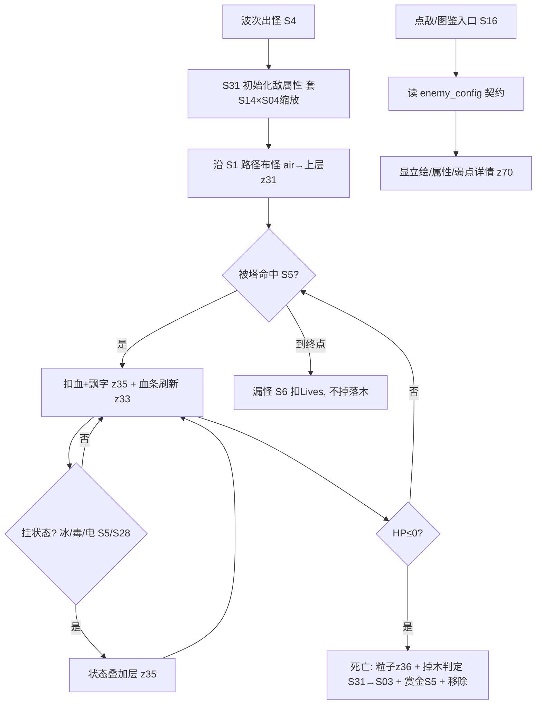
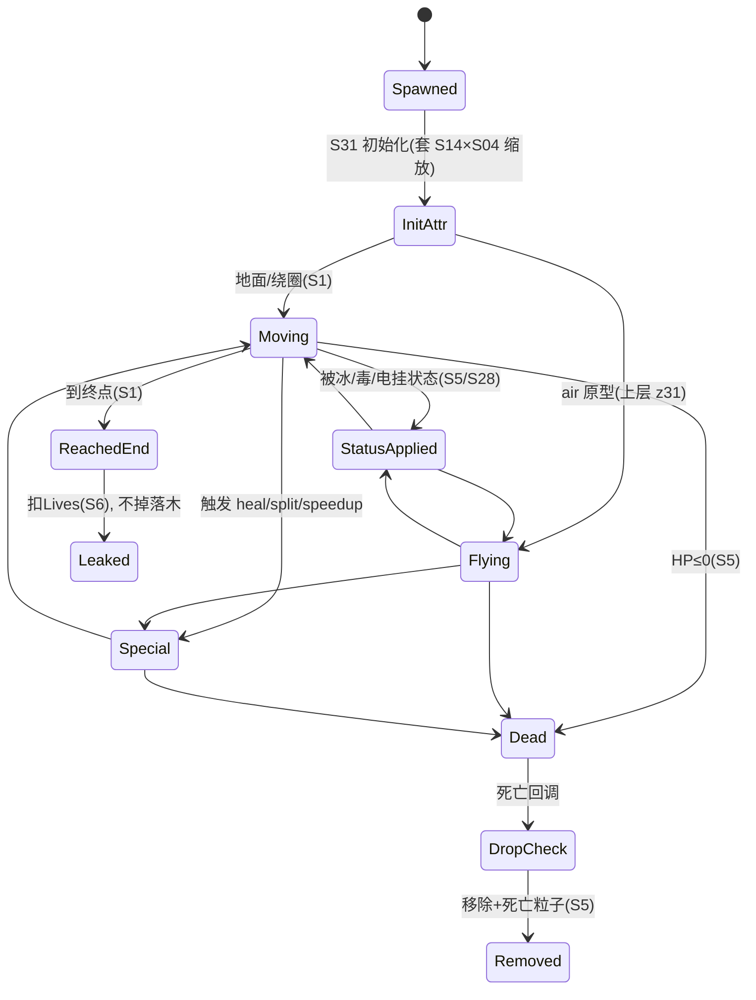

<!-- 编码: UTF-8 -->
# 系统策划案：S31 敌人系统 (Enemy / Monster System)

> 归属域：A 核心战斗域 · 层级/优先级：MVP / P0 · 关联 F 码：F6（波次与敌人）· 关联：GDD §5.5（波次与怪物）；SYSTEM_BREAKDOWN §S5（敌属性与受击）；S04 波次；S03 经济（session 木）；S05 战斗（受击/状态）；S16 图鉴（消费契约）；S14 关卡（关卡缩放）；S28 技能（对敌效果）
> 状态：v0.2-detailed · 日期 2026-07-17
> 版本说明：在 v0.1-draft 基础上补全 像素级 UI 线框 / 状态机 / 时序图 / 异常边界用例 / 完整配置字段与多行示例 / 美术资源帧数·分辨率·格式·切片。
> **本系统定位（必要性）**：FEATURE_SCOPE 的 F6「波次**与敌人**（护甲/克制 + Boss）」此前仅映射到 S4 波次系统，**敌人实体从未被定义**——S04 波表引用的 `enemy_type`/`armor_type` 只是每波字段，没有实体定义源。S31 是**敌人实体的唯一定义源**：所有敌属性（HP/护甲/速度/行为/掉木/美术引用）以 `enemy_id` 为键在本系统定义，S04 波表与 S16 图鉴均**消费**本表。
> **v0.2-rev（耦合重构）**：按 DO 新规——**木 = session 货币，主源 = 怪物概率掉落（S03/S04）**。本系统 `enemy_drop` 表为**逐敌掉木**的权威定义；Boss 为关键木点（额外掉落）。木**不可带出副本、不持久化**（详见 S03）。平衡数值（HP/速度/掉木率/量/Boss 机制）保持 `[PLACEHOLDER]`，仅标注"调优杆"，禁止硬编码。

> **⚠ 依赖缺口声明（NEEDS-DESIGN，必读）**：本任务要求"严格套用 S30 属性系统枚举 / 引用 S30 缩放因子 / 接 S33 状态系统图标 / 关卡槽位引用 S32 关卡系统"，但经 glob + grep 确认，仓库 `docs/design/` 下 **不存在 `S30_attribute.md`、`S32_关卡系统`、`S33_状态系统`**（systems/ 仅至 S29）。本系统采用如下兜底并显式标记，待对应系统建立后须对齐/合并：
> - **敌属性枚举（armor_type / special_behavior / weak_tower）**：暂用 **S04_wave.md + S05_combat.md + GDD §5.5/§5.6** 三处共用的短式枚举（`none/light/heavy/air/magic_immune/poison` 与 `t_arrow/t_cannon/t_magic/t_ice/t_poison/t_electric/t_wind`），而非 S16 的 `light_armor/heavy_armor/immune_magic/air` 长式（见 §3 一致性冲突 A）。**待 S30 属性系统建立后，armor_type 枚举以 S30 为唯一权威，本表改为纯引用。**
> - **缩放因子**：关卡缩放引用 **S14_level.md `diff_mult`**（非 S32，S32 文档缺失）；波次缩放引用 **S04 波表 `base_hp` + balance/S04 `wave_base_hp` 的 1.18^波 因子**（非 S30 缩放因子，S30 缺失）。
> - **状态叠加层图标**：引用 **S05_combat.md §4（减速/毒/电状态图标）+ S28_skill_system.md §4**，而非 S33（S33 缺失）。
> **以上三项为 NEEDS-DESIGN，不阻塞本系统成稿，但须在 S30/S32/S33 建立时回填。**

---

## 0. 修订/生成说明（耦合点）

本系统承接 DO 新规耦合重构，与下列系统强耦合：

| 耦合项 | 对 S31 的含义 |
|---|---|
| 木 = session 货币（R：S03/S04） | `enemy_drop.wood_drop_*` 为 session 木主源（逐敌）；Boss 额外掉木为养塔关键木点；木不可持久化、不带出副本 |
| 护甲克制（S05 `counter_matrix`/`armor_reduce`） | `armor_type` + `weak_tower` 直接决定 S05 命中结算的克制系数；本系统提供枚举，S05 提供系数矩阵 |
| 状态系统（S05 `slow/poison/chain` + S28 被动） | 敌身上"状态叠加层"显示减速/毒/电等图标（接 S05/S28，S33 缺失） |
| 图鉴消费契约（S16 §3.3） | 本系统 `enemy_config` 须满足 S16 的只读消费契约（`enemy_id/name/armor_type/weak_tower/base_hp`），并扩展 `move_speed/special_behavior/sprite_id` 等 |
| 关卡缩放（S14 `diff_mult`） | 敌 HP/速度随关卡 `diff_mult` 缩放（S32 文档缺失，暂用 S14） |
| 波次缩放（S04 `base_hp`/波次） | 敌 HP 随波次指数缩放（S04 引用本系统 `enemy_id`，见 §3 协调点） |

> **设计红线自检（对照 GDD §1 五支柱）**：无主导策略（5 原型各有克制塔，无单敌碾压全场）；无经济失衡（掉木为 session、Boss 额外掉木受 S03 `wood_cap`/`inflation_threshold` 钳制）；无认知过载（敌属性仅 HP/护甲/速度/1 个特殊行为，图鉴两级展示）；无支柱漂移（服务 P4 每局取舍 + P1 循环策略）。

---

## 1. 系统 UI 布局

### 1.1 布局层级（z 轴，战斗内 + 图鉴）

| 层级 z | 名称 | 说明 |
|---|---|---|
| 30 | 单位层（地面敌） | 怪物本体精灵（S31 提供 sprite_id） |
| 31 | 单位层（空军） | 空军(air) 走上层 z，与地面路径分轨（S04） |
| 33 | 敌人血条 | 怪物头顶：HP 条 + 数值（动态，随受击刷新） |
| 34 | 护甲标识 | 怪物头顶/身周：护甲着色环 + 护甲字母（light/heavy/air/magic_immune/poison） |
| 35 | 状态叠加层 | 减速❄/毒💀/电⚡等状态图标（接 S05/S28，S33 缺失），持续至状态结束 |
| 36 | 死亡特效 | 死亡粒子 + 木掉落实时飘字（接 S03/S04） |
| 70 | 敌图鉴（S16 管辖） | 敌立绘/属性/弱点详情弹层（本系统仅提供数据契约，UI 归 S16） |

### 1.2 像素级线框（750 × 1334，战场局部 + 图鉴）

```
  (0,0)┌─────────────────────────────────────────── 750 ──┐
       │ （战场：怪物沿路径行进 z30 / 空军 z31）            │
       │                                                    │
       │   🐉(64×64)  ← 敌本体(sprite_id)                   │
       │   ╭─ HP ▓▓▓▓░░ 120/150 ─╮  z33 (头顶 y-18)        │
       │   [💛 heavy]            z34 (护甲环+字母, 头顶)    │
       │   ❄ 💀 ⚡              z35 (状态叠加层, 身周)      │
       │   | -23 (伤害飘字 z35, 0.5s, 接 S05)               │
       │   ↓ 弹道 / 主动技特效(接 S28)                      │
       │   ✦ 死亡粒子 z36 (0.4s) + 🪵+N 飘字(S03)           │
       │                                                    │
       │  ┌── 敌图鉴(点敌/图鉴入口, S16 管辖) ─────────┐    │ y≈700
       │  │ [敌立绘 80×80]  史莱姆(轻甲)               │    │
       │  │ HP 30  速度 70px/s  护甲:light             │    │
       │  │ 弱点: 箭塔(物理克轻甲)  🔒未解锁显剪影(S16) │    │
       │  └──────────────────────────────────────────┘    │
       └──────────────────────────────────────────── 1334 ┘
```

### 1.3 组件表（x,y 动态；w×h；z）

| 组件 | 坐标(x,y) | 尺寸(w×h) | z | 响应行为 |
|---|---|---|---|---|
| 敌人本体 | 沿路径动态（air=上层 z31） | 64×64 | 30/31 | 受击闪烁；移动 |
| 敌人血条 | 头顶（动态，y-18） | 56×8 | 33 | 受击刷新，HP≤0 消失 |
| 护甲标识环 | 头顶/身周（动态） | 24×24 | 34 | 按 `armor_type` 着色 + 字母 |
| 状态叠加层 | 身周（动态） | 24×24 × N | 35 | 持续显示至状态结束（接 S05/S28） |
| 伤害飘字 | 头顶（动态） | 文本 18–32px | 35 | 命中即飘（接 S05） |
| 死亡粒子 | 死亡点（动态） | 粒子 0.4s | 36 | 自动播放（接 S05） |
| 木掉落实时飘字 | 死亡点（动态） | 文本 20px + 🪵 | 36 | +🪵N 上浮 0.6s（接 S03/S04） |
| 敌图鉴详情 | 弹层（S16 管辖） | 420×360 | 70 | 展示立绘/属性/弱点（数据来自本系统） |

### 1.4 交互流程图（mermaid flowchart — 图鉴查看 + 战斗内敌 widget）



### 1.5 分辨率自适应策略（强制，基准 750×1334）

- **设计基准** 750×1334（逻辑像素，@1x）；运行时以 `design_size = (750,1334)` 为锚（与 S28 §1.2 一致）。
- **锚点(Anchor)**：敌血条/护甲标识锚定"怪头顶上方"（随怪世界坐标投影到屏幕，非固定 HUD）；图鉴详情弹层锚定安全区（同 S28）。
- **九宫格(Slicing)**：敌图鉴详情底、护甲标识底九宫（边 16px 圆角 12），拉伸不变形。
- **相对比例(Relative)**：血条宽 = `56 × safe_scale`，`safe_scale = min(screen_w/750, screen_h/1334)`；状态图标以相对尺寸绘制。
- **安全区(Safe Area)**：图鉴详情弹层内缩至 `top≥statusbar+20, bottom≥home_indicator+20`；可点元素最小可点区 ≥ 88×88（P3）。
- **Letterbox**：渲染分辨率 ≠ 设计基准时，按 **contain** 留黑边（不裁切玩法），敌 widget 相对设计基准定位后整体缩放。
- **DPR**：美术资源按 `design×DPR` 提供 @2x/@3x（见 §4），引擎 `cc.view` 设 `resolutionPolicy = FIT`，`devicePixelRatio` 对齐真机。

---

## 2. 逻辑功能

### 2.1 功能模块表（触发 / 处理 / 输出）

| 模块 | 触发条件 | 处理流程（正常） | 输出 |
|---|---|---|---|
| 敌人生成 | S4 出怪期（按 `enemy_id`/count/interval） | 取 `enemy_config[enemy_id]` → 初始化属性（套 S14 `diff_mult` × S04 波次因子）→ 沿 S1 路径布怪 | 战场敌单位（含 air 上层 z） |
| 属性初始化 | 生成时 | `hp = base_hp × diff_mult(S14) × wave_hp_factor(S04)`；`speed = base_move_speed × diff_mult(S14) × wave_speed_factor`；`armor_type`/`special_behavior` 套用 | 完整敌实例 |
| 行为状态机 | 每帧 | 按 `special_behavior` 执行：move/fly/heal/split/speedup/magic_immune | 移动/特殊表现 |
| 受击结算（消费） | S5 命中 | S5 查 `armor_type` × `tower_type` 的 `counter_matrix` 算伤害；`magic_immune` 时魔法伤害 ×0 | 扣血 + 飘字 |
| 状态施加（消费） | S5/S28 命中 | 挂 slow/poison/chain（接 S05/S28）；状态叠加层 z35 显示 | 减速/DOT/连锁 |
| 死亡回调 | HP≤0 | 播死亡粒子 → 掉木判定 → 赏金(S5) → 移除单位 | 单位销毁 + 产出 |
| 掉木判定 | 死亡时 | 按 `enemy_drop`（本系统权威）掷骰 → 命中向 S03 累加 session 木；若 S04 `drop_wood_*` 存在则按 S04 覆盖（见 §3 协调点） | session 木主源 |
| 漏怪 | 到终点(S1) | 不掉落木；按 `armor_type` 扣 Lives（S6） | 容错扣减 |

### 2.2 状态机（mermaid stateDiagram-v2 — 单敌生命周期）



### 2.3 时序流程图（mermaid sequenceDiagram — 生成→受击→死亡→掉木）

```mermaid
sequenceDiagram
    participant S4 as 波次
    participant S31 as 敌人系统
    participant S1 as 地图(路径)
    participant S5 as 战斗系统
    participant S3 as 经济系统
    participant S6 as 漏怪系统
    S4->>S31: 请求生成(enemy_id, 波次缩放因子)
    S31->>S31: 初始化属性(套 S14 diff_mult × S04 wave因子)
    S31->>S1: 布怪(路径点; air→上层z31)
    loop 每帧移动
        S1->>S5: 沿路径推进
        S5->>S31(enemy): 命中结算(查 armor_type×tower counter; magic_immune魔法×0)
        S5->>S31(enemy): 挂状态(slow/poison/chain)
    end
    alt HP≤0
        S5->>S31: 死亡事件
        S31->>S31: 掉木判定(enemy_drop 或 S04 drop_wood_*)
        S31->>S3: 命中→累加 session 木(不持久化)
        S5->>S3: 赏金(kill_reward_gold)
        S31->>S1: 移除单位 + 死亡粒子 z36
    else 到终点
        S1->>S6: 漏怪(扣Lives), 不掉落木
    end
```

### 2.4 异常与边界用例表

| 场景 | 触发条件 | 处理流程 | 输出 / 兜底 |
|---|---|---|---|
| 网络中断 | 纯本地敌逻辑 | 无网络依赖 | 不受影响 |
| 切后台（S20） | `onHide` | 敌移动/状态计时挂起；`onShow` 恢复 | 战斗零错乱 |
| 数据损坏（S18） | 本局战斗存档损坏 | 按 S8 以当前波进度结算或重开本局 | 记 S25，不崩 |
| 移动速度=0 | `move_speed` 配置=0 或被风塔击退至 0 | 钳制最小移动速度（仍可被塔索敌）；不为 0 则怪滞留但不卡死 | 可被清，不卡关 |
| HP 溢出 | 缩放后 HP 超 `max_hp` 上限 | 钳制至 `max_hp`（结构值，如 1000000） | 不溢出 |
| 掉木异常（双掉） | 同帧死亡事件重复触发 | 死亡回调加 `is_dropped` 标志，幂等；仅首次掉木 | 无重复木 |
| 漏怪不掉木 | 敌到终点(非击杀) | 仅扣 Lives(S6)，不触发 `enemy_drop` | 木仅来自击杀 |
| 魔免中魔法 | 魔法塔打 `magic_immune` | 魔法伤害 ×0（特殊行为规则），物理仍生效 | 魔免正确免疫魔法 |
| 空军无对空 | 场上有 air 但无 electric/对空塔 | 空军仍可被打（地面塔按射程）；无对空则仅靠 electric/范围 | 决策压力（P4） |
| Boss 配置缺失 | `boss_mechanic` 缺 | 用普通高 HP 怪收尾，无特殊机制 | 可结算 |
| 缩放因子缺失 | S14 `diff_mult` / S04 波次因子缺（S30/S32 缺失） | 缩放因子默认 1.0 + 告警 S25 | 不崩 |
| 配置缺失 | `enemy_config[enemy_id]` 缺 | 用内置默认轻甲小怪（HP `value_ref: balance/S31_enemy.json#enemy_hp_light`，默认 30） + 记 S25 | 可战不崩 |
| 配置缺失 | `enemy_drop[drop_id]` 缺 | 不掉木（rate=0），不崩 | 降级 |
| 状态叠加 | 同类型状态再挂 | 刷新时长不叠加层数（接 S05 `status_stack_rule`） | 状态可控 |
| 性能极值 | 同屏大量敌/血条/状态图标 | 对象池 + 血条/状态图标合并 + 同屏敌上限（接 S04 ≤60） | 帧率保护 |
| 分裂死循环 | split 行为递归分裂 | 分裂代数上限（如 ≤2 代），后代 HP 衰减 | 防无限 |

---

## 3. 配置表设计

**表名：`enemy_config`（敌人配置，按 `enemy_id` 唯一 —— 敌人实体的唯一定义源）**

| 字段 | 类型 | 取值范围 | 默认值 | 说明 |
|---|---|---|---|---|
| enemy_id | string | 唯一 | — | 敌主键（如 `e_light_01`/`e_boss_01`） |
| archetype | enum | normal/heavy/air/magic_immune/boss | — | 原型类（5 类） |
| name | string | 非空 | — | 显示名（图鉴 S16） |
| armor_type | enum | none/light/heavy/air/magic_immune（**S30 权威枚举**，弃用 poison 护甲类，poison 降为 status/damage_type） | — | 护甲（**套用 S30 枚举；S30 缺失期暂用 S04/S05 短式**，见依赖缺口声明） |
| weak_tower | enum | t_arrow/t_cannon/t_magic/t_ice/t_poison/t_electric/t_wind/all | — | 克制塔种（弱点；`all`=冰/风全克控制） |
| base_hp | int | 1–1000000 | `value_ref: balance/S31_enemy.json#enemy_hp_<archetype>` | 基础 HP（随 关卡 S14×波次 S04 缩放）。**调优杆**：难度 |
| move_speed | float | 0–500 | `value_ref: balance/S31_enemy.json#enemy_speed_<archetype>` | 移动速度(px/s)（随 关卡 S14×波次 S04 缩放）。**调优杆**：节奏 |
| special_behavior | enum | none/air/heal/split/speedup/magic_immune | none | 特殊行为（air=需对空上层 z；magic_immune=魔法×0；boss=speedup/heal_cut） |
| sprite_id | string | 关联美术(S31§4) | — | 精灵图 id |
| is_boss | bool | true/false | false | 是否 Boss |
| boss_mechanic | enum | null/speedup/heal_cut | null | Boss 特殊机制（加速 / 减疗） |
| drop_id | string | 关联 `enemy_drop.drop_id` | — | 掉木配置引用 |

> **armor_type ↔ weak_tower 克制映射（对齐 GDD §5.5/§5.6，已修正矛盾，见冲突 A）**
> | armor_type | weak_tower（克制塔） | 说明 |
> |---|---|---|
> | light（轻甲） | t_arrow（物理） | 物理克轻甲 |
> | heavy（重甲） | t_cannon（炮溅射）+ t_poison（毒克高HP） | 炮溅射克重甲；毒克高HP |
> | air（空军） | t_electric（electric_vs_air）+ 对空 | 需对空/指定塔种；上层 z |
> | magic_immune（魔免） | t_arrow / t_cannon（物理） | **魔法伤害 ×0**（修正"魔法克魔免"矛盾，见冲突 A） |
> | none（无甲） | all（冰/风全克） | ice_vs_none=1.0 |

**表名：`enemy_drop`（掉木配置，逐敌，接 S03/S04 —— session 木主源）**

| 字段 | 类型 | 取值范围 | 默认值 | 说明 |
|---|---|---|---|---|
| drop_id | string | 唯一 | — | 掉木配置主键 |
| enemy_id | string | 关联 `enemy_config.enemy_id` | — | 敌主键 |
| wood_drop_rate | float | 0–1 | `value_ref: balance/S31_enemy.json#enemy_drop_rate_<archetype>` | 掉木概率（session 木主源）。**调优杆**：养塔木供给节奏 |
| wood_drop_min | int | 1–999 | `value_ref: balance/S31_enemy.json#enemy_drop_min_<archetype>` | 掉木下限（个）。**调优杆** |
| wood_drop_max | int | 1–999 | `value_ref: balance/S31_enemy.json#enemy_drop_max_<archetype>` | 掉木上限（个）。**调优杆** |
| boss_extra_rate | float | 0–1 | `value_ref: balance/S31_enemy.json#enemy_drop_boss_rate` | Boss 额外掉率（叠加/覆盖，Boss 关键木点）。**调优杆** |
| boss_extra_min | int | 1–999 | `value_ref: balance/S31_enemy.json#enemy_drop_boss_min` | Boss 额外掉木下限 |
| boss_extra_max | int | 1–999 | `value_ref: balance/S31_enemy.json#enemy_drop_boss_max` | Boss 额外掉木上限 |

> **掉木结算规则（与 S04 协调，NEEDS-DESIGN 协调点）**：本系统 `enemy_drop` 为**逐敌掉木权威**。若某波 `wave_config.drop_wood_chance/amount`（S04）存在，则**该波以 S04 为准**（逐敌判定时改用 S04 的波级 chance/amount），否则用 `enemy_drop` 逐敌掷骰。木严格 session（S03 `wood_cap` 截断、不持久化）。**建议**：S04 后续改为直接引用 `enemy_id`，将掉木完全委托本系统（待 S04 维护方裁定，本系统不改 S04）。

**多行示例数据（CSV；数值列映射至 balance JSON；枚举/字符串为实值）**

```csv
enemy_id,archetype,name,armor_type,weak_tower,base_hp,move_speed,special_behavior,sprite_id,is_boss,boss_mechanic,drop_id
e_light_01,normal,史莱姆,light,t_arrow,value_ref:balance/S31_enemy.json#enemy_hp_light,value_ref:balance/S31_enemy.json#enemy_speed_light,none,spr_slime,false,null,drop_light
e_heavy_01,heavy,石巨人,heavy,t_cannon,value_ref:balance/S31_enemy.json#enemy_hp_heavy,value_ref:balance/S31_enemy.json#enemy_speed_heavy,none,spr_golem,false,null,drop_heavy
e_air_01,air,飞蝠,air,t_electric,value_ref:balance/S31_enemy.json#enemy_hp_air,value_ref:balance/S31_enemy.json#enemy_speed_air,air,spr_bat,false,null,drop_air
e_magic_immune_01,magic_immune,幽灵,magic_immune,t_arrow,value_ref:balance/S31_enemy.json#enemy_hp_magic_immune,value_ref:balance/S31_enemy.json#enemy_speed_magic_immune,magic_immune,spr_wraith,false,null,drop_magic_immune
e_boss_01,boss,巨龙,heavy,t_cannon,value_ref:balance/S31_enemy.json#enemy_hp_boss,value_ref:balance/S31_enemy.json#enemy_speed_boss,speedup,spr_dragon,true,speedup,drop_boss
```

```csv
drop_id,enemy_id,wood_drop_rate,wood_drop_min,wood_drop_max,boss_extra_rate,boss_extra_min,boss_extra_max
drop_light,e_light_01,value_ref:balance/S31_enemy.json#enemy_drop_rate_light,value_ref:balance/S31_enemy.json#enemy_drop_min_light,value_ref:balance/S31_enemy.json#enemy_drop_max_light,0,0,0
drop_heavy,e_heavy_01,value_ref:balance/S31_enemy.json#enemy_drop_rate_heavy,value_ref:balance/S31_enemy.json#enemy_drop_min_heavy,value_ref:balance/S31_enemy.json#enemy_drop_max_heavy,0,0,0
drop_air,e_air_01,value_ref:balance/S31_enemy.json#enemy_drop_rate_air,value_ref:balance/S31_enemy.json#enemy_drop_min_air,value_ref:balance/S31_enemy.json#enemy_drop_max_air,0,0,0
drop_magic_immune,e_magic_immune_01,value_ref:balance/S31_enemy.json#enemy_drop_rate_magic_immune,value_ref:balance/S31_enemy.json#enemy_drop_min_magic_immune,value_ref:balance/S31_enemy.json#enemy_drop_max_magic_immune,0,0,0
drop_boss,e_boss_01,value_ref:balance/S31_enemy.json#enemy_drop_boss_rate,value_ref:balance/S31_enemy.json#enemy_drop_boss_min,value_ref:balance/S31_enemy.json#enemy_drop_boss_max,value_ref:balance/S31_enemy.json#enemy_drop_boss_rate,value_ref:balance/S31_enemy.json#enemy_drop_boss_min,value_ref:balance/S31_enemy.json#enemy_drop_boss_max
```

> 说明：5 原型（普通轻甲/重甲/空军/魔免/Boss）为权威定义源；`poison` 护甲类型**已弃用**（N3 命名规则：`poison` 降为 damage_type/status，非护甲类；原 poison 高HP肉盾改用 heavy 护甲 + t_poison 弱点表示）。Boss 默认 `heavy` 护甲 + `speedup` 机制（可配 `heal_cut`）。所有数值映射至 `balance/S31_enemy.json`，禁止硬编码。

---

## 4. 美术资源需求

| 资源 | 帧数 | 分辨率 | 格式 | 切片要求 |
|---|---|---|---|---|
| 敌人原型精灵（普通轻甲） | 行走 4–6 帧 + 受击 2 帧 | 64×64 | Atlas | 单格切片，锚点中心；`sprite_id=spr_slime` |
| 敌人原型精灵（重甲） | 行走 4–6 帧 + 受击 2 帧 | 64×64 | Atlas | 单格切片；`spr_golem` |
| 敌人原型精灵（空军 air） | 飞行动 4–6 帧（带扇翅） | 64×64 | Atlas | 上层 z31 渲染；`spr_bat` |
| 敌人原型精灵（魔免） | 行走 4–6 帧 + 半透态 | 64×64 | Atlas | 半透明表现免疫；`spr_wraith` |
| Boss 精灵 | idle 4 + 攻击 4 + 出场 6 | 128×128+ | Atlas / Skeleton | 专属骨骼；`spr_dragon` |
| 敌人血条组件 | 1（静态，九宫） | 56×8 | PNG | 九宫，绿→红渐变 |
| 护甲标识环 | 1（静态，按 armor 着色） | 24×24 | Atlas | 套怪头顶，字母 light/heavy/air/magic_immune/poison |
| 死亡特效（按原型） | 6 帧（碎裂 0.4s） | 64×64 | Atlas | additive；接 S05 击杀粒子 |
| Boss 死亡特效 | 10 帧（大爆 0.8s） | 128×128 | Atlas | additive |
| 状态叠加层图标（减速/毒/电） | 循环 2–4 帧 | 24×24 | Atlas | **接 S05_combat.md §4 / S28_skill_system.md §4（S33 缺失）**；套怪身周 z35 |
| 木掉落实时飘字 + 🪵 | 文本动画 | 文本 20px + 24×24 | 引擎文本+Atlas | 0.6s 上浮（接 S03/S04） |
| 敌图鉴立绘（80×80） | 静态（彩/剪影态） | 80×80 | PNG | **数据来自本系统 enemy_config，UI 归 S16 图鉴** |

> 所有战斗/状态特效经 S19 分包；帧数/分辨率/DPR(@2x/@3x) 与压缩规范见 S19/S34；打击感与音效合并见 S23。状态叠加层图标须与 S05/S28 保持一致（S33 状态系统缺失期间以 S05/S28 为权威）。

---

## 5. 实现契约

### 5.1 输入数据结构

| 字段 | 类型 | 来源 config 字段 |
|---|---|---|
| enemy_id | string | `enemy_config.enemy_id`（本系统） |
| wave_index | int | S4 波次系统（当前波序号） |
| diff_mult | float | S14 关卡系统（运营粗调缩放） |
| wave_hp_factor | float | S04 波次缩放（1.18^波） |
| wave_speed_factor | float | S04 波次缩放（1.0+0.005/波） |
| gold_reward | int | S5 击杀赏金 |
| wood_cap | int | S3 session 木上限 |

### 5.2 输出数据结构

| 字段 | 类型 | 说明 |
|---|---|---|
| enemy_instance | Enemy | 战场敌单位（hp/armor/speed/sprite/behavior） |
| drop_result | {wood:int, rate:float} | 掉木判定结果 → S3 |
| leak_event | event | 到终点通知 → S6 |
| death_event | event | 死亡事件（含击杀金）→ S5 → S3 |

### 5.3 跨系统接口调用表

| caller | callee | function | 方向 | 用途 |
|---|---|---|---|---|
| S4 | S31 | `spawnEnemy(enemy_id, wave)` | in | 波次出怪请求 |
| S31 | S1 | `placeOnPath(enemy, path)` | out | 布怪到路径 |
| S31 | S14 | `getDiffMult()` | in | 查询运营粗调缩放 |
| S5 | S31 | `onHit(enemy, dmg)` | in | 受击回调 |
| S31 | S5 | `onDeath(enemy)` | out | 死亡事件（击杀金） |
| S31 | S3 | `addSessionWood(amount)` | out | 掉木累加 session |
| S31 | S6 | `onLeak(enemy)` | out | 漏怪通知 |
| S5/S28 | S31 | `applyStatusEffect(enemy, status_id)` | in | 挂状态（→S33 消费） |
| S31 | S33 | `showStatusIcons(enemy, icon_list)` | out | 状态图标栏更新 |

### 5.4 错误码表

| E# | 场景 | 兜底 | 涉及 |
|---|---|---|---|
| E01 | 切后台 onHide(S20) | 敌移动/状态计时挂起；onShow 恢复 | S20 |
| E02 | `move_speed`=0 | 钳制最小移动速度（不为 0，可被索敌） | S24 |
| E03 | HP 溢出 | 钳制至 `max_hp`（结构值 1000000） | S24 |
| E04 | 同帧死亡重复触发 | `is_dropped` 幂等标志 | S31 |
| E05 | 漏怪不掉木 | 仅扣 Lives，不触发 `enemy_drop` | S31/S6 |
| E06 | 魔免中魔法 | 魔法伤害 ×0（特殊行为规则） | S5 |
| E07 | Boss 配置缺失 | 用普通高 HP 怪收尾，无特殊机制 | S4 |
| E08 | 缩放因子缺失 | 默认 1.0 + 告警 S25 | S25 |
| E09 | `enemy_config[enemy_id]` 缺 | 用默认轻甲小怪（HP 30）+ 记 S25 | S25 |
| E10 | `enemy_drop[drop_id]` 缺 | 不掉木（rate=0） | S31 |
| E11 | 分裂死循环 | 分裂代数上限 ≤2 代，后代 HP 衰减 | S31 |

### 5.5 状态转换表（自 §2.2 stateDiagram-v2）

| state | event | transition | action |
|---|---|---|---|
| [*] | S4 出怪 | → Spawned | 请求生成 |
| Spawned | 初始化属性 | → InitAttr | 套 S14×S04 缩放 |
| InitAttr | 地面 | → Moving | 沿 S1 路径移动 |
| InitAttr | air 原型 | → Flying | 上层 z31 飞行 |
| Moving/Flying | 被挂状态(S5/S28) | → StatusApplied | 状态图标栏 + tint 更新 |
| StatusApplied | 状态结束 | → Moving | 移除图标 |
| Moving | 到终点(S1) | → ReachedEnd | 漏怪→S6 |
| Moving/Flying | HP≤0(S5) | → Dead | 死亡回调 |
| Dead | 掉木判定 | → DropCheck | 掷骰→S3 |
| DropCheck | 移除 | → Removed | 死亡粒子 + 移除 |
| ReachedEnd | 扣 Lives | → Leaked | 不掉落木 |

### 5.6 数值消费清单

| param_id | 来源 balance 文件 |
|---|---|
| enemy_hp_light / enemy_hp_heavy / enemy_hp_air / enemy_hp_magic_immune / enemy_hp_boss | balance/S31_enemy.json |
| enemy_speed_light / enemy_speed_heavy / enemy_speed_air / enemy_speed_magic_immune / enemy_speed_boss | balance/S31_enemy.json |
| enemy_drop_rate_light / enemy_drop_min_light / enemy_drop_max_light / enemy_drop_rate_heavy / enemy_drop_min_heavy / enemy_drop_max_heavy / enemy_drop_rate_air / enemy_drop_min_air / enemy_drop_max_air / enemy_drop_rate_magic_immune / enemy_drop_min_magic_immune / enemy_drop_max_magic_immune | balance/S31_enemy.json |
| enemy_drop_boss_rate / enemy_drop_boss_min / enemy_drop_boss_max | balance/S31_enemy.json |
| boss_speedup_mult / boss_speedup_interval / boss_heal_cut_rate | balance/S31_enemy.json |
| enemy_level_scale_factor / enemy_wave_hp_growth / enemy_wave_speed_growth | balance/S31_enemy.json |

---

## 6. 冲突与待裁定

| 项 | current_implementation | pending_decision | owner |
|---|---|---|---|
| A: "魔法克魔免" 矛盾 | S31 采用自洽规则：`magic_immune` 魔法伤害 ×0，弱点 = 物理塔(t_arrow/t_cannon) | GDD §5.6/§5.7 措辞改为 "物理克魔免" 或重命名敌种 | DO / GDD |
| B: S30 属性系统缺失 | armor_type 暂用 S04/S05 短式枚举 + S14/S04 缩放因子 | S30 建立后改为纯引用 | S30（A 域） |
| C: S32 关卡系统缺失 | 缩放引用 S14 `diff_mult`（非 S32） | S32 与 S14 关系待裁定（疑似编号错位） | DO / S32 |
| D: S33 状态系统缺失 | 状态图标引用 S05 §4 / S28 §4 | S33 建立后明确状态图标归属 | S33（A 域） |
| E: enemy_config 归属冲突 | S31 为唯一定义源，S04/S16 为消费者 | S16 枚举长式 `light_armor` 须与本系统短式 `light` 对齐 | S16（A 域） |
| F: 掉木双 owner | S04 波级 `drop_wood_*` 与本系统 `enemy_drop` 并存 | 建议 S04 后续委托本系统（当前 S04 存在则优先） | S04（A 域） |
| N3: armor_type 枚举 poison→air | 已弃用 `poison` 护甲类（降为 damage_type/status），S31 枚举为 none/light/heavy/air/magic_immune | S04 `armor_type` 枚举同步改 air；`combat_armor_poison` 删除 | S04（A 域）/ DO |

> 所有 `[PLACEHOLDER]` 已替换为 `value_ref` 指向 balance/S31_enemy.json；共 31 条数值参数已全部映射。armor_type 枚举已按 S30 权威对齐（N5）。
