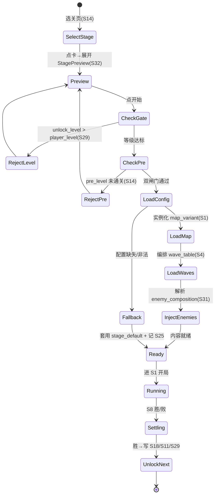
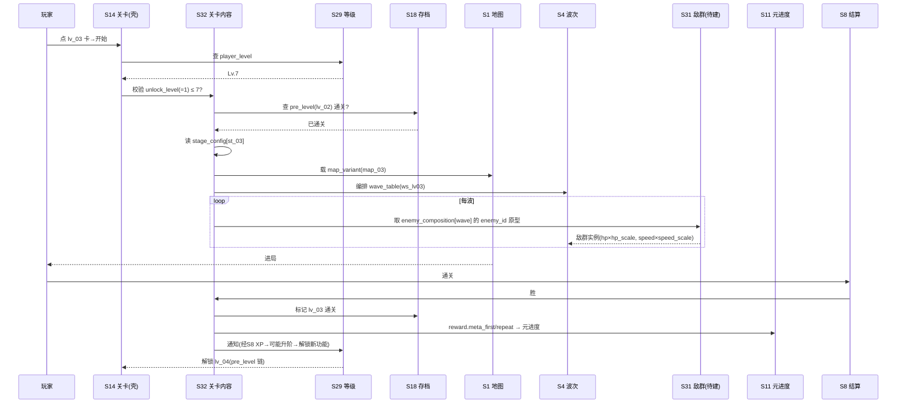

<!-- 编码: UTF-8 -->
# 系统策划案：S32 关卡内容配置系统 (Stage / Level Config System)

> 归属域：A 核心战斗域（内容数据层）· 层级/优先级：增强 / P1 · 关联 F 码：F17（续 S14）· 关联：GDD §5.5/§5.6（波次与怪物、关卡）；SYSTEM_BREAKDOWN §S14（壳层）/§S4/§S1/§S31(待建)
> 状态：v0.2-detailed · 日期 2026-07-17
> 设计基准：UI 750×1334（Cocos Creator 3.8.8 · 微信小游戏）· 安全区：顶部 y<88、底部 y>1290 不放置可点组件
> 数值约定：凡涉及难度曲线/奖励/解锁等级的调优量为 `[PLACEHOLDER]`，标注「调优杆」，禁止硬编码魔法数字。
> **本系统定位**：S14 是"选关/解锁 UI 壳"（关卡选择、解锁条件、地图变体选择、难度星、缩略图）；**S32 是关卡实际内容数据的唯一权威定义源**——每关波表编排、出怪组合、Boss 排程、难度缩放基线、奖励、解锁等级。S32 引用 S1 地图变体 + S4 波次结构 + S31 敌群原型（S31 待建，见 §3/§5 NEEDS-DESIGN）。

---

## 0. 与 S14 的边界（职责切分，不重复、不冲突）

| 维度 | S14 关卡系统（壳层） | S32 关卡内容配置（本系统，权威内容层） |
|---|---|---|
| 职责 | 选关 UI、解锁链 UI、难度星展示、缩略图、粗调旋钮 | 每关**实际内容数据**：波表编排、出怪组合、Boss 排程、难度缩放基线、奖励、解锁等级 |
| 关键字段 | `level_id` / `pre_level`(解锁链) / `difficulty`(星) / `thumbnail` / `map_id`(引用) / `wave_set`(引用) / `diff_mult`(粗调) / `reward_mult`(粗调) | `stage_id`(=level_id 同键) / `map_variant`(引用 S1) / `wave_table`(引用 S4) / `enemy_composition`(引用 S31) / `boss_schedule` / `difficulty_mod(hp_scale,speed_scale)` / `reward` / `unlock_level`(接 S29) |
| 难度缩放 | `diff_mult`/`reward_mult`：**运营级粗调旋钮**（默认 1.0，经 S21 热更；作用于全关卡） | `difficulty_mod.hp_scale/speed_scale`：**逐关作者化难度基线**（"首关低压教学 → 后期高难"曲线） |
| 缩放合成 | — | **最终敌血缩放 = S32.hp_scale × S14.diff_mult**；最终敌速缩放 = S32.speed_scale × S14.diff_mult（二者乘算，互不覆盖，避免双重定义） |
| 奖励 | `level_reward.first_clear_meta/repeat_meta` 视为 **S32.reward 的派生引用视图**（本系统为权威值来源） | `reward.meta_first/meta_repeat/gold_clear` 为权威数值；**木（session）明确排除**（见 §3 红线） |
| 解锁 | `pre_level`：串行通关解锁链（先通关前一关） | `unlock_level`：S29 玩家等级门槛（与 `pre_level` **叠加**为双闸门：既要通关前一关、又要达到等级） |

> ⚠️ **一致性铁律**：S14 的 `map_id`/`wave_set`/`diff_mult`/`reward_mult` 在本系统中被**重定义为"对 S32 的引用 + 运营粗调旋钮"**，S14 不再重复持有逐关内容数值。两份文档共享同一 `level_id`↔`stage_id` 主键。本系统不修改 S14（仅引用）；如需 S14 字段语义对齐，由 Decision Owner 裁定后由 S14 文档侧回填。

---

## 1. 系统 UI 布局（层级 + 像素线框 + 组件表 + 交互流程图）

### 1.1 布局层级

**A. 选关页（S14 已建，本系统补"关卡内信息预览"）**，z=0–55

| 层级 z | 层名 | 说明 |
|---|---|---|
| 0 | 背景层 BgLayer | 选关主题背景（S14） |
| 40 | 关卡网格 LevelGrid | 中部可滚：每关卡片（S14） |
| 41 | 关卡信息预览 StagePreview | **【S32 新增】**选中卡片展开：波数 / 敌种预览 / Boss 预告 / 难度基线（hp_scale/speed_scale 指示） |
| 42 | 解锁门槛标 UnlockTag | 显示 `unlock_level`（S29 等级）要求，未达则灰显 |
| 46 | 返回 BackBtn | 左上回大厅（S14） |

**B. 关内 HUD（战斗内，接 S1/S7）**，z=45

| 层级 z | 层名 | 说明 |
|---|---|---|
| 45 | 关卡标识 StageTag | **【S32 新增】**顶栏左：当前 `stage_name` + "第 X 关 / 共 Y 关"战役进度 |

### 1.2 像素级线框（750 × 1334，ASCII 原型，单位 px）

**视图 A：选关页 — 选中卡片展开"关卡内信息预览"（S32 补）**

```
  0       150      300      450      600      750
  ┌──────────────────────────────────────────────┐ y=0
  │ (20,40)⟲返回        选择关卡                  │ y=40
  │  ┌──────────┐  ┌──────────┐                  │ y=200 卡 320×200
  │  │ ★☆☆      │  │ 🔒 锁     │  2列            │
  │  │[地图缩略]│  │ [缩略]   │  x=40 / x=390   │
  │  └──────────┘  └──────────┘                  │ y=400
  │  ┏━━━ 关卡内信息预览 StagePreview (z41) ━━━━┐  │ y=440 展开面板 670×300
  │  ┃ 第 3 关 · 熔岩回廊        [难度 ▲ hp×1.10 速×1.04] ┃
  │  ┃ 波数：12 波   地图：map_03(熔岩)                    ┃
  │  ┃ 敌种预览：[🐉轻甲][🛡重甲][✨魔免][🦅空军]          ┃
  │  ┃ BOSS 预告：W10 ⚔巨魔王(重甲·加速)  W12 ⚠熔岩魔(终波) ┃
  │  ┃ 解锁要求：玩家等级 Lv.1 (已达 ✓)                   ┃
  │  ┗━━━━━━━━━━━━━━━━━━━━━━━━━━━━━━━━━━━━━━━┛  │ y=740
  │        ┌────────────────────┐                 │ y=1150 StartBtn 300×96
  │        │   开始 (选中 lv_03)  │                 │
  │        └────────────────────┘                 │
  └──────────────────────────────────────────────┘ y=1334
```

**视图 B：关内 HUD — 关卡标识 StageTag（接 S1/S7 顶栏）**

```
  (0,0)┌─────────────────────────────────────────── 750 ──┐
       │[🏷第3关·熔岩回廊] [金] [第X/Y波] [木] [♥×N] │ y=20..90 z45
       │        ↕ 木掉落实时飘字 +🪵 z52                     │
       │                  ╭── 环形路径 z10 ──╮               │
       │                 │   (怪物绕圈行进)    │              │
       │    ⬡塔位z20     │    ◯塔(已占)z30    │   ⬡塔位z20  │
       │                 │   ⟲被动光环z30     │             │
       │                 ╰────────────────────╯              │
       └────────────────────────────────────────────── 1334 ┘
```

### 1.3 组件表（精确坐标 / 尺寸 / 层级 / 响应）

| 组件 ID | 位置(x,y) | 尺寸(w×h) | z | 响应行为 | 备注 |
|---|---|---|---|---|---|
| BgLayer | (0,0) | 750×1334 | 0 | 无交互 | S14 复用 |
| LevelGrid | (0,160) | 750×950 | 40 | 可滚，点卡选中 | S14 复用 |
| Card(i) | (40+(i%2)×350, 200+floor(i/2)×260) | 320×200 | 40 | 点 → 选中 | S14 复用 |
| StagePreview | (40,440) | 670×300 | 41 | 选中卡后展开/收起 | **S32 新增**；读 `stage_config` |
| SP_WaveCount | 面板内 (60,470) | 文本 24px | 41 | 静态 | 显示 `wave_table` 波数 |
| SP_EnemyIcons | 面板内 (60,520) | 600×64 | 41 | 静态 | 敌种预览图标（来自 `enemy_composition`→S31） |
| SP_BossForecast | 面板内 (60,600) | 600×64 | 41 | 静态 | Boss 预告（来自 `boss_schedule`） |
| SP_DiffBar | 面板内 (60,660) | 300×24 | 41 | 静态 | 难度基线指示（hp_scale/speed_scale） |
| UnlockTag | 面板内 (60,710) | 600×24 | 42 | 静态 | 显示 `unlock_level`（S29） |
| StartBtn | (225,1150) | 300×96 | 40 | 选中已解锁→进关 | S14 复用；进关前由 S32 校验 `unlock_level` |
| StageTag | (20,40) | 260×48 | 45 | 静态 | **S32 新增**；关内 HUD 左 |
| BackBtn | (20,40) | 64×64 | 46 | 点 → 回 S10 | S14 复用（选关页） |

### 1.4 分辨率自适应规格（anchors / 九宫 / 相对比例 / 安全区 / letterbox / DPR）

- **设计基准**：750×1334（@1x 逻辑分辨率）。所有坐标以上表为准。
- **锚点**：StagePreview 锚定 **Top-Center**（展开于卡片下方，安全区 y≥88）；StageTag 锚定 **Top-Left**（SafeArea Top+8 / Left+8）。
- **九宫**：StagePreview 底、StageTag 底均九宫（3×3 切片，capinset 16px）。
- **相对比例**：预览面板宽 = `parent.width × 0.89`；难度指示条宽相对父容器比例，避免拉伸变形。
- **安全区**：所有可点/可见组件避让 顶部 y<88、底部 y>1290。
- **Letterbox**：设备宽高比 ≠ 750:1334 时采用 **letterbox 黑边**（contain），HUD 相对设计基准定位后整体缩放，不裁切玩法。
- **DPR**：美术出 @1x/@2x/@3x；引擎 `cc.view.resolutionPolicy = FIT`，`devicePixelRatio` 对齐真机（同 S01/S29）。

### 1.5 交互流程图（选关 → 预览 → 进关）

```mermaid
flowchart TD
    A[大厅 S10 → 选关入口] --> B[读档 S18 + S29: 解锁进度/玩家等级]
    B --> C[渲染卡三态: 锁/可/通(S14)]
    C --> D{点卡}
    D --> E[展开 StagePreview(S32): 波数/敌种/Boss/难度/解锁要求]
    E --> F{点开始}
    F --> G[S32 校验 unlock_level ≤ player_level(S29)?]
    G -- 否 --> H[灰显+提示"需 Lv.N"]
    G -- 是 --> I[S14 校验 pre_level 通关?]
    I -- 否 --> J[显 LockTag + 提示]
    I -- 是 --> K[载 stage_config → S1地图变体+S4波表+S31敌群]
    K --> L[进 S1 开局]
```

---

## 2. 逻辑功能（模块表 + 状态机 + 时序流程图 + 异常边界用例表）

### 2.1 模块表（触发条件 / 处理流程 / 输出）

| 模块 | 触发条件 | 处理流程（正常） | 输出 |
|---|---|---|---|
| 关卡内容加载 | 点开始（已通过 S14.pre_level + S32.unlock_level 双闸门） | 读 `stage_config[stage_id]` → 取 `map_variant` 实例化 S1 → 取 `wave_table` 编排 S4 波次 → 解析 `enemy_composition` 将 S31 `enemy_id` 注入各波 | 战场内容就绪 |
| 敌群注入 | 波次出怪（S4→S5） | 按 `enemy_composition[wave_index]` 取 `enemy_id` 列表 → 查 S31 原型（hp/armor/skin）→ 生成怪物 | 战场怪物流（带皮肤/护甲） |
| 难度缩放应用 | 出怪时 | `eff_hp_scale = difficulty_mod.hp_scale × S14.diff_mult`；`eff_speed_scale = difficulty_mod.speed_scale × S14.diff_mult` → 套到 S31 原型基础值 | 难度曲线生效 |
| Boss 排程 | 到 `boss_schedule` 节点 | 取 `boss_enemy_id`(S31) + `boss_mechanic` → 触发 S4 Boss 预警 + 生成 | 高难威胁（接 S4） |
| 通关判定 | S8 胜 | 校验本关全波清空 + Lives>0 | 胜 |
| 解锁判定 | S8 胜 | 写 S18：标记本关通关（`pre_level` 链前进）；结算 `reward.meta_first/meta_repeat`（首通/重复）→ S11 元进度；`player_level` 经 S8→S29 产 XP 可能升阶 | 进度+ / 解锁下一关 |
| 预览数据聚合 | 选中卡 | 读 `stage_config` → 组装 StagePreview（波数/敌种/Boss/难度/解锁要求） | 预览 UI |

### 2.2 关卡加载状态机（FSM · stateDiagram-v2）



### 2.3 时序流程图（ loading + 通关解锁，跨系统）



### 2.4 异常与边界用例表（程序员可实现级）

| 用例ID | 异常类型 | 触发条件 | 预期处理流程 | 输出 / 兜底 | 涉及系统 |
|---|---|---|---|---|---|
| E01 | 配置缺失(整体) | `stage_config` 全缺 | 仅显首关（默认 `st_01`，pre_level=null）；其余锁 | 可进页 | S25 |
| E02 | 单关配置缺失 | `stage_config[st_03]` 缺字段/非法 | 该卡禁用+灰显，告警 S25；不崩 | 可进页 | S25 |
| E03 | 波表空 | `wave_table` 为空 / 引用 S4 波次集 0 行 | 套用 `stage_default`（默认 8 波普通波）+ 记 S25 | 不阻塞 | S25/S4 |
| E04 | 敌 id 非法 | `enemy_composition` 中 `enemy_id` 不在 S31 原型表 | 跳过该敌、用默认 `e_goblin` 占位 + 告警 S25 | 可战(降级) | S25/S31 |
| E05 | 地图变体缺失 | `map_variant` 引用的 S1 `map_id` 不存在 | 套用 `map_default`(S1) + 记 S25 | 不崩 | S25/S1 |
| E06 | 难度缩放极值 | `hp_scale`/`speed_scale` ≤0 或超上限 | 钳制到 `[1.0, 3.0]`(hp)/`[1.0, 2.0]`(speed) + 告警 | 难度不崩 | S25 |
| E07 | Boss 排程缺失/非法 | `boss_schedule` 空 / `boss_enemy_id` 非法 | 末波强制普通 Boss（默认 `b_goblin_king`）+ 记 S25 | 可结算 | S25/S31/S4 |
| E08 | 奖励缺失 | `reward` 缺字段 | 用内置默认（meta_first=100, meta_repeat=20, gold_clear=0）+ 记 S25 | 不阻塞 | S25 |
| E09 | 解锁等级无效 | `unlock_level` 非数/越界/高于 S29 max_level | 钳制到 `[1, S29.max_level]`；首关强制 1 | 不卡死 | S29/S25 |
| E10 | 越级进关(改内存) | 未达 `unlock_level` 强进 | S24 校验 `player_level` 状态 → 拒绝进关 | 防跳关 | S24 |
| E11 | 并发进关 | 连点 StartBtn | `isEntering` 锁 0.3s，防双进 | 仅一次进关 | — |
| E12 | 分包未加载 S19 | 进关时本关美术/地图资源未就绪 | 进关前预载本关 `art_pack`；未就绪显 loading，就绪再进 | 防白屏 | S19 |
| E13 | 切后台 S20 | 选关/预览 `onHide` | 存选中态(S18)；`onShow` 续原网格位置 | 无丢失 | S20/S18 |
| E14 | 配置 schema 非法 | `stage_config` JSON 解析失败 | 丢弃坏档 → 套用 `stage_default` + 记 S25 | 不崩 | S25 |

> 设计红线检查：无主导策略（关卡为内容消耗，无资源刷取循环；重复通关元进度仅为首通 1/5）；无认知过载（每关单一决策：预览即知敌种/Boss/难度）；无支柱漂移（服务 P5 长线内容）；木排除（reward 不含 session 木，防经济失衡，见 §3 红线）。

---

## 3. 配置表设计（完整字段 + 多行示例）

**表名：`stage_config`（关卡内容配置，按 stage_id 唯一）**

| 字段 | 类型 | 取值/范围 | 默认值 | 说明 |
|---|---|---|---|---|
| stage_id | string | 唯一，如 "st_01" | — | 关卡主键（与 S14 `level_id` 同键映射，见 §0 边界） |
| stage_type | enum | standard/endless | standard | 关卡内容数据类型：**standard**=引用 `wave_table` 的预置关卡（本表逐 `stage_id` 一行）；**endless**=无尽生存模式（不在本表，改由末尾 `endless_config` 全局单行定义，见 §3.1）。仅作类型判别，standard 行恒为 `standard` |
| stage_index | int | 1–N | 1 | 战役序号（HUD "第 X 关 / 共 Y 关"） |
| stage_name | string | 非空 | "第1关" | 关内 HUD 显示名（StageTag） |
| map_variant | string | 关联 S1 `map_id` | "map_01" | 地图变体引用（S1 主题/路径/塔位） |
| wave_table | json | 波次编排 | — | 引用 S4 波定义集：`{wave_set_id, wave_range:[start,end]}`；具体每波结构见 S4 `wave_config` |
| enemy_composition | json | 引用 S31 `enemy_id` | — | 逐波敌群组合：`{wave_index: [{enemy_id, count}]}`；`enemy_id` 为 S31 原型 FK（**S31 待建，NEEDS-DESIGN**，见 §5） |
| boss_schedule | json | 引用 S4 `wave_index` + S31 `boss_enemy_id` | — | Boss 排程：`[{wave_index, boss_enemy_id, boss_mechanic}]`；末波恒为 Boss（高潮） |
| difficulty_mod | json | {hp_scale, speed_scale} | {1.0,1.0} | 本关难度缩放基线。**调优杆**：`hp_scale` 范围 `[1.0,3.0]`，`speed_scale` 范围 `[1.0,2.0]`；最终 = × S14.diff_mult |
| reward | json | {meta_first, meta_repeat, gold_clear} | — | 通关奖励：**meta_first/repeat=元进度(S11)**；`gold_clear`=清场一次性 session 金（结算入元进度）；**木(session)明确排除**（见红线） |
| unlock_level | int | 关联 S29 `player_level` | 1 | 进入本关所需 S29 玩家等级（与 S14.pre_level 串行解锁**叠加**为双闸门） |
| art_pack | string | 关联 S19 | "pkg_stage_01" | 本关美术分包（背景/敌皮/Boss 立绘/难度标识） |

> **红线（木排除）**：`reward` **不含木头**。木为 session 货币（S03），仅来自怪物掉落(S04)+受限应急兑换，不持久化、不在通关奖励发放。关卡奖励仅含元进度(meta) + 一次性清场金(gold_clear，session 结算入 meta)。任何"通关发木"需求须回 Decision Owner 裁定，否则违反 S03 经济铁律。

**多行示例数据（CSV 头部 + 3 行；平衡字段以 `[PLACEHOLDER]` 占位，结构字段给示例值；enemy_id 为 S31  provisional 契约，待 S31 定稿）**

```csv
stage_id,stage_index,stage_name,map_variant,wave_table,enemy_composition,boss_schedule,difficulty_mod,reward,unlock_level,art_pack
st_01,1,青草环·初见,map_01,"{wave_set_id:ws_lv01,wave_range:[1,8]}","{1:[{e_goblin,8}],3:[{e_goblin,10},{e_light,4}],5:[{e_air,6}],8:[{b_goblin_king,1}]}","[{wave_index:8,boss_enemy_id:b_goblin_king,boss_mechanic:speedup}]","{hp_scale:1.0,speed_scale:1.0}","{meta_first:100,meta_repeat:20,gold_clear:50}",1,pkg_stage_01
st_03,3,熔岩回廊,map_03,"{wave_set_id:ws_lv03,wave_range:[1,12]}","{1:[{e_goblin,8}],3:[{e_light,10}],5:[{e_air,8}],7:[{e_heavy,6}],10:[{b_goblin_king,1}],12:[{b_lava_demon,1}]}","[{wave_index:10,boss_enemy_id:b_goblin_king,boss_mechanic:speedup},{wave_index:12,boss_enemy_id:b_lava_demon,boss_mechanic:heal_cut}]","{hp_scale:1.10,speed_scale:1.04}","{meta_first:200,meta_repeat:40,gold_clear:70}",1,pkg_stage_03
st_12,12,终焉之环,map_05,"{wave_set_id:ws_lv12,wave_range:[1,30]}","{1:[{e_goblin,12}],5:[{e_heavy,10}],10:[{b_goblin_king,1}],15:[{e_magic_immune,12}],20:[{b_lich,1}],25:[{e_air,14}],30:[{b_wyrm,1}]}","[{wave_index:10,boss_enemy_id:b_goblin_king,boss_mechanic:speedup},{wave_index:20,boss_enemy_id:b_lich,boss_mechanic:heal_cut},{wave_index:30,boss_enemy_id:b_wyrm,boss_mechanic:speedup}]","{hp_scale:1.71,speed_scale:1.24}","{meta_first:650,meta_repeat:130,gold_clear:160}",4,pkg_stage_12
```

> 说明：`wave_table`/`enemy_composition`/`boss_schedule`/`difficulty_mod`/`reward` 在 CSV 中以 JSON 字符串存储；引擎侧建议直读 JSON 配置表避免转义。数值（hp_scale/speed_scale/波数/reward/unlock_level）全部初值见配套 `balance/S32_stage_config.md`，禁止硬编码。

---

### 3.1 无尽模式（Endless Mode）配置 —— `endless_config`（全局单行，stage_type=endless）

> **形态裁定（Decision Owner）**：无尽模式是**独立生存模式**，不是 standard 关的变体。在大厅(S14)有独立入口；**无胜利、只有失败**（漏光 Lives 即结束）；难度随波**持续递增**、每 N 波必出 Boss；计分 `score = 最高到达波数 × w_wave + 累计击杀 × w_kill`；结束仍给元进度 XP(S29) 与 session 木(S03)，并上榜(S13)。

**无尽模式不引用本表 standard 的 `wave_table`/`enemy_composition`/`boss_schedule`**——敌群由 S04 按 wave 序号代入下方难度公式**程序化生成**（引用 S31 `enemy_id`），Boss 按 `boss_every_n_waves` 周期排程。故 `endless_config` 与 standard `stage_config` 是**两套并列数据**：standard=预置逐关，endless=公式驱动全局单行，互不重叠、避免双重定义。

**表名：`endless_config`（全局单行，唯一键 `mode_id="endless"`）**

| 字段 | 类型 | 取值/范围 | 默认值 | 说明 |
|---|---|---|---|---|
| mode_id | string | 唯一 | "endless" | 模式主键 |
| stage_type | enum | endless | endless | 固定 endless（与 standard 区分） |
| map_variant | string | 关联 S1 `map_id` | "map_01" | 无尽战场地图（首版固定复用标准地图变体；或后续加专属无尽地图，S1 裁定；非调优参数，故不入 balance 数值表） |
| hp_scale_formula | string(formula) | 代入 wave | `1 + (wave-1) × k_hp` | 无尽敌血缩放公式；最终 `enemy_eff.hp = S31.base_hp × hp_scale_formula(wave) × S14.diff_mult`。k_hp 初值见 `balance/S32_stage_config.md` 的 `stg_endless_k_hp` |
| speed_scale_formula | string(formula) | 代入 wave | `1 + (wave-1) × k_speed` | 无尽敌速缩放公式；最终 `enemy_eff.speed = S31.base_move_speed × speed_scale_formula(wave) × S14.diff_mult`。k_speed 初值见 `stg_endless_k_speed` |
| boss_every_n_waves | int | 5–20 | 10 | 每 N 波出 Boss（节拍同 S4 `boss_every`）；无尽无"末波"，Boss 周期来袭。`stg_endless_boss_every` |
| score_weights | json | {w_wave, w_kill} | {100, 5} | 计分权重：`score = wave_reached × w_wave + total_kills × w_kill`。初值 `stg_endless_score_wave` / `stg_endless_score_kill` |
| reward_per_wave | json | {gold, wood} | {10, 2} | 每波结算奖励（总额 = per_wave × wave_reached）：`gold`→元进度(S11/S08)，`wood`→session 木(S03)。初值 `stg_endless_reward_gold` / `stg_endless_reward_wood` |
| unlock_level | int | 关联 S29 `player_level` | `[PLACEHOLDER]`(初值 1，见 `stg_endless_unlock_level`) | 进入无尽所需 S29 等级（与 S14 入口解锁**叠加**为双闸门）。`[PLACEHOLDER]` 待 S29 等级曲线校验 |
| max_wave_cap | int | 0=无 / N>0 | 0 | 无尽封顶波数；`0`=真无限（无上限），`N>0`=软封顶（防极端数值/时长）。结构封顶另由 S4 `wave_total_waves` 上限兜底防溢出 |

**CSV 单行示例（结构字段给示例值，数值初值见 balance）**

```csv
mode_id,stage_type,map_variant,hp_scale_formula,speed_scale_formula,boss_every_n_waves,score_weights,reward_per_wave,unlock_level,max_wave_cap
endless,endless,map_01,"1 + (wave-1) × k_hp","1 + (wave-1) × k_speed",10,"{w_wave:100,w_kill:5}","{gold:10,wood:2}",[PLACEHOLDER]1,0
```

> ⚠ **一致性提示（非阻塞）**：standard 的 `reward` 铁律"不含木头"（S03 木为 session、不持久化）；无尽 `reward_per_wave.wood` 是 DO 裁定的显式例外——无尽结尾仍发 session 木。实现上建议：`wood` 来自本局击杀掉木(S04/S31，即 session 木主源)，`reward_per_wave.wood` 作为结算时一次性额外木发放到**下一局起始 session 池**（仍非持久化）；若 DO 意图"结算后持久化发木"，则与 S03 铁律冲突，须回 DO 确认。本任务不修改 S03。

---

## 4. 美术资源需求（帧数 / 分辨率 / 格式 / 切片）

> 全部资源经 S19 分包加载（`art_pack` 字段指定分包）；压缩规范与图集打包见 S19/S34。每关需明确以下四类资产。

| 资源 | 用途 | 帧数 | 分辨率(@1x) | 格式 | 切片 / 分级 | 归属 |
|---|---|---|---|---|---|---|
| `stage_bg_<id>` 关背景 | 战斗底图 | 静态 | 750×1334 | PNG(≤200KB) | 九宫/平铺，安全区外可裁 | 每关 1 张（12 关 = 12 张） |
| `enemy_skin_<enemy_id>` 敌皮变体 | 关内敌人皮肤 | 行走 4–6 帧 | 64×64 | Atlas | 单格切片，锚中心 | 按 `enemy_composition` 用到的 enemy_id 各 1 套（接 S31） |
| `boss_portrait_<boss_id>` Boss 立绘 | Boss 演出/预警 | idle 4 + 攻击 4 | 128×128+ | Atlas/Skeleton | 专属骨骼 | 按 `boss_schedule` 用到的 boss_id 各 1 套（接 S31） |
| `boss_fx_<mechanic>` Boss 特效 | Boss 机制表现 | 8–12 帧 | 256×256 | PNG 图集 | 12 等分 | 按 `boss_mechanic`(speedup/heal_cut) 各 1 套 |
| `diff_marker` 难度视觉标识 | 预览/选关难度条 | 静态(低/中/高态) | 300×24 | PNG 九宫 | 3×3 切片 | 全局 1 套（3 态） |
| `stage_tag_bg` 关卡标识底 | 关内 HUD StageTag | 静态 | 260×48 | PNG 九宫 | 3×3 切片 | 全局 1 套 |

**每关美术资产清单（首版 12 关，规则化生成）**

| 关 | 背景 `stage_bg` | 敌皮（来自 enemy_composition） | Boss 立绘（来自 boss_schedule） | 难度标识 |
|---|---|---|---|---|
| st_01 | stage_bg_01 | e_goblin, e_light, e_air | b_goblin_king | diff_low |
| st_02 | stage_bg_02 | +e_heavy | b_goblin_king | diff_low |
| st_03 | stage_bg_03 | +e_poison | b_goblin_king, b_lava_demon | diff_mid |
| st_04 | stage_bg_04 | +e_magic_immune | b_lich | diff_mid |
| st_05 | stage_bg_05 | 全 5 常规 + air | b_goblin_king, b_lich | diff_mid |
| st_06 | stage_bg_06 | 全常规 + air | b_goblin_king, b_lava_demon | diff_mid |
| st_07 | stage_bg_07 | 全常规 + air | b_lich, b_wyrm | diff_high |
| st_08 | stage_bg_08 | 全常规 + air | b_goblin_king, b_lich | diff_high |
| st_09 | stage_bg_09 | 全常规 + air | b_lava_demon, b_wyrm | diff_high |
| st_10 | stage_bg_10 | 全常规 + air | b_goblin_king, b_lich, b_wyrm | diff_high |
| st_11 | stage_bg_11 | 全常规 + air | b_lich, b_wyrm | diff_high |
| st_12 | stage_bg_12 | 全常规 + air | b_goblin_king, b_lich, b_wyrm | diff_high |

> 说明：敌皮/Boss 立绘的具体 enemy_id→skin 映射依赖于 **S31 敌群原型系统**（尚未建），当前 `enemy_id` 为 provisional 契约（见 §5 NEEDS-DESIGN）。美术在 S31 定稿前可先按 GDD §5.6 七塔克制对应的常规/空/重/魔免/毒 五类 + 3 个预留 Boss 立绘做占位资产。分包规划（每关一个 `pkg_stage_xx` 或按主题合并）由 S19 裁定。

---

## 5. 依赖 / 边界 / 冲突说明

### 5.1 依赖
- **S01 地图**：`map_variant` → `map_config.map_id`（路径/塔位/主题）。
- **S04 波次**：`wave_table` → `wave_config`（逐波结构：count/interval/hp/armor/is_boss）。
- **S04 波次（无尽生成）**：endless 模式**不引用** `wave_table`，改由 S04 按 `wave` 序号代入 `endless_config` 难度公式**程序化生成**敌群（count 用 S04 `wave_count` 公式、hp/speed 用 `endless_config` 公式、敌种引用 S31 `enemy_id`）——详见 S04 §2.5。
- **S31 敌群原型（待建）**：`enemy_composition`/`boss_schedule` 的 `enemy_id` 为 S31 原型表外键；S31 须提供 `enemy_id → {base_hp, armor_type, skin_res, boss_mechanic}`。**S31 当前未建，是 S32 的唯一硬依赖阻塞项**。
- **S29 玩家等级**：`unlock_level` → `player_level_config` / `unlock_config`（等级门槛）。
- **S14 关卡壳**：共享 `level_id↔stage_id`；`pre_level` 串行解锁 + `diff_mult`/`reward_mult` 粗调旋钮。
- **S11 元进度**：`reward.meta_*` → 元资源入账；通关解锁链写 S18。
- **S18 存档**：解锁进度 / 通关态持久化。
- **S19 分包**：`art_pack` 美术资源加载。
- **S8 结算 / S7 HUD / S20 生命周期 / S24 防作弊 / S25 分析**：跨系统回调。

### 5.2 边界 / 明确不做
- 不做 UGC 关卡（见 FEATURE_SCOPE §6）。
- 不做关卡内随机种子（首版固定，见 SYSTEM_BREAKDOWN §S14）。
- 不做"通关发木"（木为 session，S03 铁律）。
- 不重复持有 S14 壳层字段（map_id/wave_set/diff_mult/reward_mult 重定义为引用/旋钮，见 §0）。

### 5.3 冲突与一致性说明（务必关注）
1. **S32 vs S14 字段重叠（潜在双重定义）**：S14 `level_config` 已含 `map_id/wave_set/diff_mult/reward_mult`。本系统将 S14 这些字段**重定义为"对 S32 的引用 + 运营粗调旋钮"**，S32 持有逐关权威内容。实现时以本系统 `stage_config` 为内容真相源；S14 文档侧需回填语义对齐（**Decision Owner 裁定**，本任务不修改 S14）。
2. **难度双重缩放**：`difficulty_mod.hp_scale/speed_scale`（S32 作者化曲线）× `diff_mult`（S14 运营粗调）= 最终。二者乘算，不互相覆盖；钳制区间 `[1.0,3.0]`(hp)/`[1.0,2.0]`(speed) 防止失控。
3. **奖励与 S14.level_reward 重复**：`reward.meta_first/meta_repeat` 为权威值；S14 `level_reward` 视为其派生视图（不另定义数值）。
4. **NEEDS-DESIGN（唯一硬项）**：**S31 敌群原型系统未建**，`enemy_id` 目录（`e_goblin/e_light/e_heavy/e_poison/e_magic_immune/e_air` + `b_goblin_king/b_lich/b_lava_demon/b_wyrm` 等）为 provisional 契约。S32 的 `enemy_composition`/`boss_schedule` 在 S31 定稿前无法校验 `enemy_id` 合法性（对应 E04 异常兜底）。**须先建 S31 并冻结 enemy_id 目录，S32 才能关闭 E04 兜底**。
5. **unlock_level 与 S29 等级曲线耦合**：`unlock_level` 初值（1,1,1,2,2,2,3,3,3,4,4,4）依赖 S29 `player_level` 可达性；S29 `xp_required`/max_level 为 `[PLACEHOLDER]`，故 unlock_level 初值为暂定值，待 S29 调优后回填（非 NEEDS-DESIGN，已给初值，标注待校验）。
6. **关卡总数初值**：首版 `stage_total_count = 12`（10–20 区间内），为可调初值，非 NEEDS-DESIGN。
7. **endless_config vs standard stage_config（并列双数据）**：endless 不引用 standard 的 `wave_table`/`enemy_composition`/`boss_schedule`，改由 S04 程序化生成；二者为并列数据，互不重叠，避免双重定义。缩放系数 `k_hp`/`k_speed` 与 Boss 周期/`score_weights`/`reward_per_wave`/`unlock_level` 的**单一真理源在 `endless_config`**（balance `stg_endless_*`），S04 生成侧仅消费、不独立调优（见 balance/S04_wave.md 的 `endless_*` 镜像说明）。
