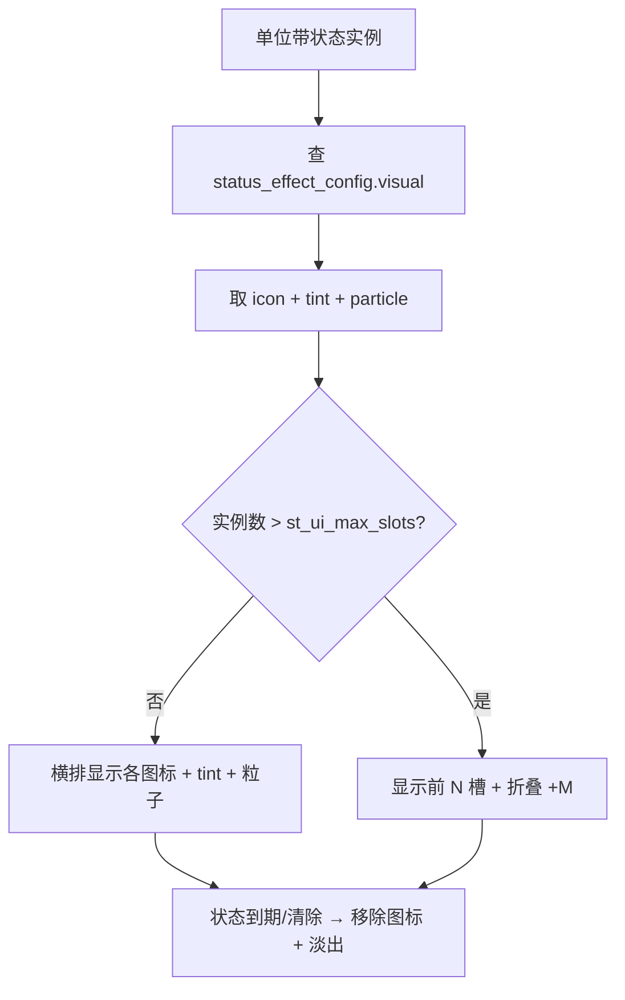
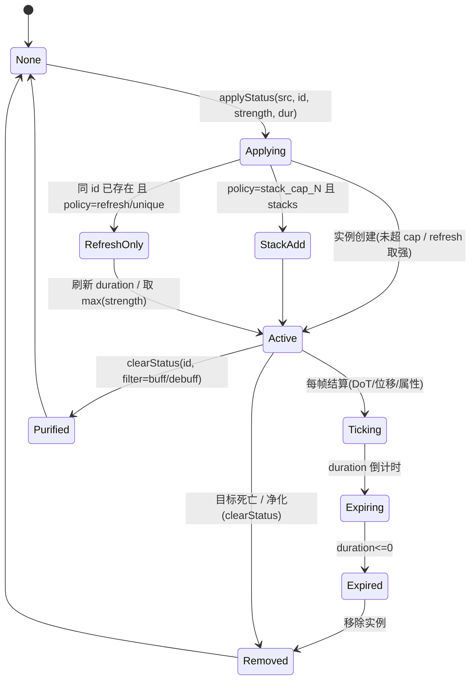
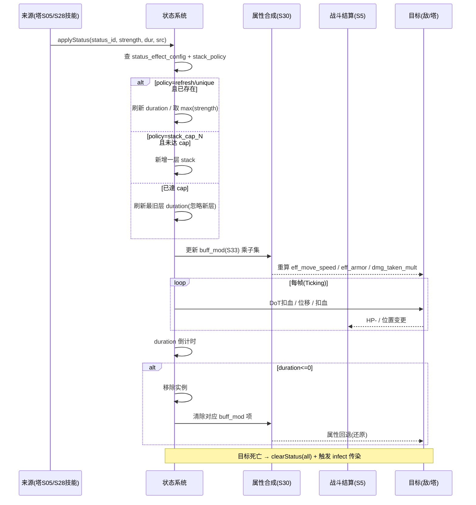

<!-- 编码: UTF-8 -->
# 系统策划案：S33 状态效果系统 (Status Effect / Buff-Debuff System)

> 归属域：A 核心战斗域 · 层级/优先级：MVP / P0 · 关联 F 码：F7（战斗结算·状态半边）· 关联：GDD §5.7 + §5.8（技能经本系统落状态）；SYSTEM_BREAKDOWN §S33；S05 战斗、S28 技能、S30 属性合成（待建）、S31 敌人（待建）、S02 塔配置、S23 表现、S19 分包
> 状态：v0.2-detailed · 日期 2026-07-17
> 版本说明：本系统为 **FEATURE_SCOPE F7「战斗结算（目标/弹道/伤害/**状态**）」状态半边的权威定义源**。状态效果此前散落于 S05 战斗（冰减速/毒 DoT/电连锁/炮溅射燃烧）与 S28 技能（破甲/冰封易伤/导电/腐蚀/毒性传染/逆风惩罚），缺统一系统导致：①战斗 S05 不知"同类状态刷新还是叠加"；②美术不知"状态图标/染色/粒子"做什么。S33 统一承载全部状态的定义、施加/刷新/到期状态机、堆叠规则、对属性的修正结算（接 S30 `buff_mod` 乘子），并被 S05/S28 引用。
> 平衡数值见配套 `balance/S33_status_effect.md`；本系统 §3 给出初值，全部与 S05/S28 已有 concretized 数值对齐（见一致性说明）。

---

## 0. 修订 / 生成说明（前置依赖与 NEEDS-DESIGN）

| 项 | 状态 | 对本系统含义 |
|---|---|---|
| **S30 属性合成（含 `buff_mod(S33)` 乘子）** | **待建（NEEDS-DESIGN）** | 任务要求"必须先读" S30，但 `docs/design/systems/S30_attribute.md` **不存在**。本系统在 §2.7 **定义 `buff_mod(S33)` 乘子契约**（S30 须实现并引用），作为 S33→S30 的集成接口。S30 落地前，本系统属性结算约定以 §2.7 为准。 |
| **S31 敌人（状态叠加层美术位）** | **待建（NEEDS-DESIGN）** | 任务要求"必须先读" S31，但 `docs/design/systems/S31_enemy.md` **不存在**。本系统在 §4 定义"状态叠加层美术位"规格（图标位/染色/tint/粒子），S31 落地时应消费本规格（状态图标位 = `st_ui_max_slots` 横排槽位）。**约束禁止本任务创建/修改其他系统文件**，故 S30/S31 仅引用不建。 |
| S05 战斗（状态半边） | 已存在（v0.2） | S05 §3 的 `slow_factor/slow_duration/poison_dps/poison_duration/chain_count/chain_range/status_stack_rule` 现归本系统权威；S05 应改为引用 `status_effect_config`（见 §3 一致性说明）。 |
| S28 技能（被动/主动落状态） | 已存在（v0.2） | S28 被动/主动效果（破甲/冰封易伤/导电/腐蚀/逆风惩罚/剧毒/雷暴/饱和轰炸/飓风/霜冻蔓延/毒性传染）均经本系统 `applyStatus` 落状态；S28 应引用本系统 `status_id`（映射见 §2.5）。 |
| S02 塔配置 `status_effect` 枚举 | 已存在（v0.2） | S02 `tower_config.status_effect = none/slow/poison/chain/knockback` 应扩展引用本系统 11 个 `status_id`（见 §3 一致性说明）。 |

> **设计红线自检（本系统）**：无主导策略（11 状态互补控制/DoT/护甲/增伤，无单一状态碾压全场）；不争木（状态为纯战斗结算，与木经济无关）；无认知过载（状态以图标+tint+粒子被动呈现，玩家零操作，无二级菜单）；无支柱漂移（服务 P1 战斗策略/P4 每局取舍）。

---

## 1. 系统 UI 布局

### 1.1 布局层级（z 轴，与 S1/S5/S28 对齐）

| 层级 z | 名称 | 说明 |
|---|---|---|
| 30 | 单位层 | 怪物 / 塔 sprite（状态 **tint 染色** 叠加于 sprite 上，属本系统表现） |
| 35 | 状态图标栏 + 命中/持续粒子 | 怪物/塔身上方**横排状态图标**；状态粒子（减速雪花/毒泡/火焰/电链等，接 S23） |
| 36 | 击杀/净化反馈 | 状态清除淡出（接 S5/S23） |

### 1.2 像素级线框（750 × 1334 设计基准 + 分辨率自适应）

```
  (0,0)┌─────────────────────────────────────────── 750 ──┐
       │  战场(环形路径) z10                              │ y…
       │        🐉 敌怪(64×64) z30                        │
       │        ┌─ 状态图标栏(敌身上方, 横排叠加) ─┐ z35  │
       │        │ ❄ │ 💀 │ 🔥 │ ⚡ │ ⛓ │ 🛡│ … │    │      │ ← 24×24/槽
       │        │ 蓝│ 绿│ 橙│ 黄│ 黄│ 灰│   │(+N)│    │      │ 超出 st_ui_max_slots 折叠
       │        └────────────────────────────────┘        │
       │        ↕ 身上 tint：中毒绿 / 燃烧橙 / 减速蓝        │ z30
       │   🏹塔(已占) z30                                  │
       │        ┌─ 状态图标栏(塔身上方, 预留 buff 位) ─┐ z35│
       │        │ (当前 scope 塔多为施加者；位预留未来塔增益) ││
       │        └────────────────────────────────────┘      │
       └──────────────────────────────────────────── 1334 ┘
```

**分辨率自适应策略（与 S28 §1.2 对齐，强制）**
- **设计基准** 750×1334（逻辑像素 @1x）；运行时 `design_size = (750,1334)` 为锚。
- **锚点**：状态图标栏锚定"单位头顶上方 + 安全区"，随单位世界坐标投影到屏幕，不随 HUD 缩放漂移。
- **相对比例**：单图标尺寸 = `24×24 × safe_scale`，`safe_scale = min(screen_w/750, screen_h/1334)`；图标间距 2px×safe_scale。
- **安全区**：图标栏整体内缩 `top≥statusbar+20`；单位贴边时图标栏翻转至单位下方避免出屏。
- **Letterbox**：渲染分辨率 ≠ 设计基准时按 **contain** 留黑边（不裁切玩法）；图标按相对基准定位后整体缩放。
- **DPR**：图标/粒子资源按 `design×DPR` 提供 @2x/@3x（见 §4）；引擎 `cc.view` 设 `resolutionPolicy = FIT`。

### 1.3 组件表（x,y 动态投影；w×h；z）

| 组件 | 坐标(x,y) | 尺寸(w×h) | z | 响应行为 |
|---|---|---|---|---|
| 敌状态图标栏 | 敌怪头顶（动态投影） | 横排 N×24×24，上限 `st_ui_max_slots=6` | 35 | 持续显示至状态结束；超上限折叠为「+N」 |
| 塔状态图标栏 | 塔头顶（动态投影） | 横排 N×24×24（预留） | 35 | 当前 scope 塔位多为空，预留塔增益显示 |
| 状态 tint | 单位 sprite 叠加 | 同 sprite | 30 | 持续染色（减速蓝/中毒绿/燃烧橙/电黄等），按最高优先级状态 tint |
| 状态粒子 | 单位位置（动态） | 粒子 0.3–0.6s 循环 | 35 | 循环播放（毒泡/火焰/电链），接 S23 对象池 |
| 净化/到期淡出 | 单位位置 | 0.2s | 36 | 状态清除时图标碎裂淡出（接 S23） |

### 1.4 交互流程图（mermaid flowchart — 状态图标呈现）



---

## 2. 逻辑功能

### 2.1 功能模块表（触发 / 处理 / 输出）

| 模块 | 触发条件 | 处理流程（正常） | 输出 |
|---|---|---|---|
| 状态施加 | 塔命中（S05）/ 技能主动（S28）/ 被动钩子（S28） | 查 `status_effect_config(status_id)` → 按 `stack_policy` 建/刷/叠实例 → 写 `buff_mod(S33)` | 单位获得状态 + 属性修正 |
| 堆叠判定 | 同类状态再次施加 | 按 `stack_policy`（refresh / stack_cap_N / unique）处理 | 刷新时长 / 加层 / 忽略 |
| 状态结算 | 实例 Active 每帧 | DoT 扣血 / 位移 / 重算 `buff_mod` → 驱动 S30 重算有效属性 | HP−/位置变/属性变 |
| 到期移除 | `duration` 倒计时 ≤0 | 移除实例 → 清对应 `buff_mod` 项 → S30 属性回退 | 状态消失 |
| 清除/净化 | 单位死亡 / 魔法塔 active 净化 | `clearStatus(target, filter)`：死亡清全部；净化仅清 buff（增益/护盾） | 状态移除 |
| 传染触发 | 中毒单位死亡 | 若有 `infect` → 向 `infect_radius` 内敌怪施加 `poison_dot` | DoT 扩散 |
| 属性合成接口 | S30 每帧 / 每次变更 | 汇总单位全部状态实例 → 输出 `buff_mod(S33)` 乘子集 | 供 S30 合成有效属性 |

### 2.2 状态机（mermaid stateDiagram-v2 — 单状态实例生命周期）



### 2.3 时序流程图（mermaid sequenceDiagram — 施加→结算→到期→属性回流）



### 2.4 异常与边界用例表

| 场景 | 触发条件 | 处理流程 | 输出 / 兜底 |
|---|---|---|---|
| 状态无限叠加 | 多源反复施加同类可堆状态 | 所有可堆状态有 `stack_cap`；`refresh/unique` 不增层 → 钳制 | 状态可控，防无限 |
| 速度归零 / 除零 | `slow_k`→0 或 `move_speed` 计算 | `slow_k` 钳 `min=0.1`（move_speed 永不为 0）；定身用 `move_locked` flag 非 0 速 | 不卡死、不崩 |
| 护甲除零 / 负甲 | `armor_break`+`corrosion` 叠满 | `eff_armor = max(0, …)`；`armor_reduce` 钳 `[0, 0.9]` | 不溢出、不免疫 |
| 易伤/导电叠加溢出 | 多源增伤叠满 | `incoming_dmg_mult` 钳 `≤3.0` | 防秒杀崩 |
| 冲突状态（定身 vs 减速） | 同时 freeze + slow | `move_locked=true` 压过 slow 速度乘子（slow 仍显示 tint/图标） | 控制优先级清晰 |
| 净化 vs 减益 | 魔法塔 active 净化 | `clearStatus(filter=buff)` 仅清增益/护盾，不清 debuff | 减益正常生效 |
| 目标死亡 | 状态实例存活时死亡 | 移除全部实例；若有 `poison_dot` 触发 `infect` 向周围爆毒 | 无残留 + DoT 扩散 |
| 切后台（S20） | `onHide` | 状态计时挂起；`onShow` 续计 | 零错乱 |
| 数据损坏（S18） | 本局战斗存档损坏 | 按 S8 以当前波进度结算或重开本局 | 记 S25，不崩 |
| 配置缺失 | `status_effect_config` 缺某 `status_id` | 该状态不施加；其余正常 | 降级不崩（记 S25） |
| 同帧多源同类 | 多塔同帧打同怪同状态 | `refresh` 取最强；`stack_cap` 守 cap | 最终一致 |
| 位移越界 | 击退推出路径 | 位移钳至路径最近点，不脱离路径 | 怪仍在场 |
| 性能极值 | 同屏大量状态图标/粒子 | 图标合并 + 粒子上限（接 S23/S19 对象池） | 帧率保护 |

### 2.5 状态全枚举与权威定义（覆盖 S05 + S28 全部状态）

> `status_id` 全局唯一，作为 S05/S28/S02 引用主键。`strength` 初值见配套数值表；此处给语义与权威定义。

| # | status_id | 类别 | 来源（塔/S28 技能） | 影响属性 | 机制 | 初值（语义） | 时长 | stack_policy | 触发 |
|---|---|---|---|---|---|---|---|---|---|
| 1 | `slow` | 控制/减益 | 冰塔命中；S28 冰封 / 霜冻蔓延 | `move_speed` | `move_speed × slow_k` | `slow_k=0.5`（×0.5） | 2.0s | **refresh** | 命中即挂 |
| 2 | `knockback` | 控制/位移 | 风塔命中；S28 飓风之眼 / 持续气流 | 位置 + `move_locked` | 沿路径后退 `kb_dist` + 定身 `stun` | `kb_dist=120px`, `stun=1s` | 定身 1s（位移瞬时） | **unique** | 命中即位移 |
| 3 | `poison_dot` | DoT/减益 | 毒塔命中；S28 剧毒新星 / 毒性传染 | HP | 持续 `poison_dps` 扣血 | `poison_dps=15/s` | 4.0s | **refresh** | 命中即挂 |
| 4 | `burn` | DoT/减益 | 炮塔命中；S28 燃烧溅射 | HP（溅射） | `burn_dps` + 半径 `burn_splash` 溅射 | `burn_dps=30/s`, `burn_splash=80px` | 3.0s | **refresh** | 命中即挂 |
| 5 | `chain` | 结算/控制 | 电塔命中（S28 过载加成） | 伤害跳数 | 命中后向 `chain_range` 内跳 `chain_count` 敌 | `chain_count=3`, `chain_range=150px` | 瞬时（0，结算时） | **unique** | 命中即链式结算 |
| 6 | `armor_break` | 护甲/减益 | S28 箭塔被动①破甲 | `armor` | `eff_armor × (1−armor_break_val%)` | `armor_break_val=20%` | 3.0s | **refresh** | 概率命中触发 |
| 7 | `vulnerable` | 增伤/减益 | S28 冰塔被动②冰封易伤 | 受伤乘子 | `dmg_taken × (1+vuln_k%)` | `vuln_k=20%` | 3.0s（随减速存在） | **refresh** | 目标被减速/冻结 |
| 8 | `conductive` | 增伤/减益 | S28 电塔被动②导电 | 受伤乘子 | `dmg_taken × (1+conductive_k%)`（combo 放大） | `conductive_k=20%` | 3.0s | **refresh** | 被电塔命中 |
| 9 | `corrosion` | 护甲/减益 | S28 毒塔被动①腐蚀 | `armor` | `eff_armor × (1−corrosion_val%)^stack` | `corrosion_val=15%/层` | 4.0s | **stack_cap_5** | 命中触发叠层 |
| 10 | `infect` | 触发/减益 | S28 毒塔被动②毒性传染 | HP（扩散） | 中毒怪死亡 → `infect_radius` 内爆毒传染 `poison_dot` | `infect_radius=120px`, 传染 `poison_dot(15/s,3s)` | 触发型（死亡） | **unique** | 中毒怪死亡 |
| 11 | `headwind` | 减益 | S28 风塔被动②逆风惩罚 | `move_speed` | `move_speed × (1−headwind_slow%)^stack` | `headwind_slow=15%/层` | 5.0s | **stack_cap_3** | 被击退触发 |

> **S28→S33 映射（供 S28 引用）**：精准齐射(无状态)/破甲→`armor_break`；饱和轰炸(短减速)→`slow`；燃烧溅射→`burn`；极寒领域(冻结)→`slow`(强度覆盖, `move_locked`)+`vulnerable`；霜冻蔓延→`slow`(蔓延)；冰封易伤→`vulnerable`；飓风之眼→`knockback`；持续气流→`knockback`(小幅)；逆风惩罚→`headwind`；剧毒新星→`poison_dot`(强度覆盖)；腐蚀→`corrosion`；毒性传染→`infect`；雷暴→`chain`；过载→`chain`(跳数+)；导电→`conductive`。

### 2.6 堆叠规则（铁律）

> **铁律**：同类状态按 `stack_policy` 处理，**异类状态可共存**（互不排斥，分别结算实例）。所有"可堆"状态均设 `stack_cap` 防无限叠加。

| status_id | stack_policy | 判定逻辑 | 取值规则 |
|---|---|---|---|
| `slow` | refresh | 同类再施加：刷新 `duration`，强度取 `max`（更强减速覆盖弱） | `slow_k = min(existing, new)`（速度乘子取最小=最慢） |
| `knockback` | unique | 同目标再击退：重定位移 + 刷新定身；不叠层 | 位移取 `max` 距离，定身取 `max` 时长 |
| `poison_dot` | refresh | 同类再施加：刷新 `duration`，`poison_dps` 取 `max` | 不叠 dps（防无限） |
| `burn` | refresh | 同 `poison_dot` | `burn_dps` 取 max；溅射按配置 |
| `chain` | unique | 单次命中仅一次链式结算；过载被动在 S28 加跳数不改策略 | 结算时消费 |
| `armor_break` | refresh | 同类再触发：刷新时长，`armor_break_val` 取 `max` | `eff_armor` 取最强削减 |
| `vulnerable` | refresh | 同类再触发：刷新；`vuln_k` 取 `max` | 与 `conductive` 异类 → 乘算叠加 |
| `conductive` | refresh | 同 `vulnerable` | 与 `vulnerable` 乘算：`dmg_taken = (1+vuln)×(1+cond)` |
| `corrosion` | stack_cap_5 | 每触发加 1 层（上限 5）；满层后新触发刷新最旧层 `duration` | `eff_armor × (1−val%)^stack`，stack≤5 |
| `infect` | unique | 每死亡仅触发一次传染；不叠 | 触发型 |
| `headwind` | stack_cap_3 | 每被击退加 1 层（上限 3）；满层刷新最旧层 | `move_speed × (1−slow%)^stack`，stack≤3 |

### 2.7 `buff_mod(S33)` 乘子契约（供 S30 属性合成实现）

> **背景**：任务要求 S33 引用 S30 的 `buff_mod(S33)` 乘子；但 S30 尚未创建（NEEDS-DESIGN）。本系统在**此定义契约**，S30 落地时须实现并消费，使 S33 成为状态→属性的唯一修正源。

**`buff_mod(S33)` 结构**：每个单位维护一组乘子项（默认 1.0）：
```
buff_mod(S33) = {
  move_speed_mult : float = 1.0,   // slow / headwind 修改
  dmg_taken_mult  : float = 1.0,   // vulnerable / conductive 修改（受伤放大）
  armor_mult      : float = 1.0,   // armor_break / corrosion 修改（敌 armor）
  atk_speed_mult  : float = 1.0,   // 塔增益（当前 scope 无，预留）
  range_mult      : float = 1.0,   // 塔增益（当前 scope 无，预留）
  dmg_mult        : float = 1.0    // 塔增益（当前 scope 无，预留）
}
```

**S30 属性合成公式（契约，S33 定义）**：
```
// 敌方有效属性（状态主要作用于敌）
eff_move_speed   = base_move_speed × Π_{s∈enemy.status} buff_mod(s).move_speed_mult
eff_armor        = max(0, base_armor × Π_{s∈enemy.status} buff_mod(s).armor_mult)
incoming_dmg_mult= clamp( Π_{s∈enemy.status} buff_mod(s).dmg_taken_mult , 1.0, 3.0 )

// 塔有效属性（本 scope 状态多为 debuff；系统支持 tower buff 乘子，默认 1）
eff_dmg       = base_dmg × S29_level_mult(单行,不累加) × growth^cultivate_lv × counter × Π buff_mod.dmg_mult
eff_atk_speed = base_atk_speed × S29_level_mult × … × Π buff_mod.atk_speed_mult
eff_range     = base_range × S29_level_mult × … × Π buff_mod.range_mult
```

**各状态对 `buff_mod` 的贡献映射**：
| status_id | 贡献项 | 表达式 |
|---|---|---|
| `slow` | `move_speed_mult` | `= slow_k`（refresh 取 min） |
| `headwind` | `move_speed_mult` | `= (1−headwind_slow%)^stack`（cap 3） |
| `knockback` | （位移事件 + `move_locked`，无持续乘子） | — |
| `armor_break` | `armor_mult` | `= (1−armor_break_val%)`（refresh 取 min） |
| `corrosion` | `armor_mult` | `= (1−corrosion_val%)^stack`（cap 5） |
| `vulnerable` | `dmg_taken_mult` | `= (1+vuln_k%)` |
| `conductive` | `dmg_taken_mult` | `= (1+conductive_k%)` |
| `poison_dot` / `burn` / `chain` / `infect` | （无属性乘子，走 DoT/位移/结算） | — |

**全额伤害结算（接 S05 伤害公式）**：
```
raw   = eff_dmg                                              // 已含 S29/growth/counter/buff_mod.dmg_mult
mitig = raw × (1 − armor_reduce(eff_armor))                  // armor_reduce: eff_armor→减伤%, 钳[0,0.9]
final = max(0, mitig × incoming_dmg_mult)                    // vuln/conductive 放大
```
> 注：S05 原公式 `base×S29(不累加)×growth^lv×counter − armor_reduce` 中的 `armor_reduce` 现由 `eff_armor`（含 `buff_mod.armor_mult`）驱动；`incoming_dmg_mult`（vuln/conductive）为新增乘子项。S05 应引用本契约（见 §3 一致性说明）。

---

## 3. 配置表设计

**表名：`status_effect_config`（状态效果配置，按 `status_id` 唯一）**

| 字段 | 类型 | 取值范围 | 默认值 | 说明 |
|---|---|---|---|---|
| status_id | string | 全局唯一 snake_case | — | 状态主键（§2.5 枚举 11 个）；S05/S28/S02 引用键 |
| display_name | string | 非空 | — | 状态显示名（i18n key） |
| category | enum | control/debuff/buff/dot/trigger | — | 类别（控制/减益/增益/持续伤/触发） |
| source | json | 来源塔/技能列表 | — | 来自哪些塔/S28 技能（见 §2.5） |
| attr_target | enum | move_speed/armor/dmg_taken/hp/position/none | — | 影响属性（接 S30 `buff_mod`） |
| strength_init | json | 强度初值（见数值表） | — | `slow_k/poison_dps/armor_break_val/…`；具体见 `balance/S33_status_effect.md` |
| duration | float | 0–15（0=瞬时） | — | 持续时长(s)；`chain/infect`=0（结算/触发型） |
| stack_policy | enum | refresh/unique/stack_cap_N | "refresh" | 堆叠铁律（§2.6） |
| stack_cap | int | 1–20（仅 stack_cap_N 用） | — | 叠层上限（`corrosion=5`/`headwind=3`） |
| visual | json | icon/tint/particle | — | 图标/染色/粒子（见 §4，供 S31/S05 引用） |
| trigger | enum | on_hit/on_death/passive_proc/active | — | 触发方式 |

**多行示例数据（CSV；数值列引 `balance/S33_status_effect.md` 初值）**

```csv
status_id,display_name,category,source,attr_target,strength_init,duration,stack_policy,stack_cap,visual,trigger
slow,减速,control,"ice_tower,S28_ice_freeze,S28_frost_spread",move_speed,"{slow_k:0.5}",2.0,refresh,1,{icon:slow,tint:#4FC3F7,particle:snow},on_hit
knockback,击退,control,"wind_tower,S28_hurricane,S28_gust",position,"{kb_dist:120,stun:1.0}",1.0,unique,1,{icon:knockback,tint:#B2EBF2,particle:wind},on_hit
poison_dot,中毒,dot,"poison_tower,S28_toxic_nova,S28_infect",hp,"{poison_dps:15}",4.0,refresh,1,{icon:poison,tint:#8BC34A,particle:bubble},on_hit
burn,燃烧,dot,"cannon_tower,S28_burn_splash",hp,"{burn_dps:30,burn_splash:80}",3.0,refresh,1,{icon:burn,tint:#FF7043,particle:flame},on_hit
chain,连锁,control,"electric_tower,S28_overload",none,"{chain_count:3,chain_range:150}",0,unique,1,{icon:chain,tint:#FFD54F,particle:spark},on_hit
armor_break,破甲,debuff,"S28_arrow_passive1",armor,"{armor_break_val:0.20}",3.0,refresh,1,{icon:armor_break,tint:#9E9E9E,particle:crack},passive_proc
vulnerable,易伤,debuff,"S28_ice_passive2",dmg_taken,"{vuln_k:0.20}",3.0,refresh,1,{icon:vulnerable,tint:#EF5350,particle:mark},passive_proc
conductive,导电,debuff,"S28_electric_passive2",dmg_taken,"{conductive_k:0.20}",3.0,refresh,1,{icon:conductive,tint:#9575CD,particle:link},passive_proc
corrosion,腐蚀,debuff,"S28_poison_passive1",armor,"{corrosion_val:0.15}",4.0,stack_cap_5,5,{icon:corrosion,tint:#689F38,particle:acid},passive_proc
infect,传染,trigger,"S28_poison_passive2",hp,"{infect_radius:120,infect_dot_dps:15,infect_dot_dur:3}",0,unique,1,{icon:infect,tint:#558B2F,particle:cloud},on_death
headwind,逆风惩罚,debuff,"S28_wind_passive2",move_speed,"{headwind_slow:0.15}",5.0,stack_cap_3,3,{icon:headwind,tint:#81D4FA,particle:gust},passive_proc
```

**一致性说明（待裁定 / 对齐项，不修改他系统）**
- **S05 `combat_config` 重叠字段**：S05 §3 的 `slow_factor/slow_duration/poison_dps/poison_duration/chain_count/chain_range/status_stack_rule` 现归本表权威；建议 DO 裁定将 S05 这些字段标记 deprecated/redirect 至 `status_effect_config`（初值已与 `balance/S05_combat.md` 对齐：slow_k=0.5 / slow_dur=2.0 / poison_dps=15 / poison_dur=4.0 / chain_count=3）。
- **S02 `tower_config.status_effect` 枚举**：当前 `none/slow/poison/chain/knockback` 应扩展引用本系统 11 个 `status_id`（建议 S02 改为 `status_ids:[]` 数组）。
- **S28 技能效果**：S28 §2.6 被动/主动应引用本 `status_id`（映射见 §2.5），数值初值已从 `balance/S28_skill_system.md` 对齐（破甲20%/易伤20%/导电20%/逆风15%cap3/腐蚀cap5/传染半径120/燃烧30/击退120+定身1/剧毒40）。

---

## 4. 美术资源需求

> 每个状态含：图标（状态栏 24×24 基础，@2x/@3x）、单位 tint 染色、持续/命中粒子。供 **S31 敌人（状态叠加层美术位，待建）** 与 **S05 战斗表现** 引用。帧数/分辨率/格式/切片遵循 S19/S34 规范。

| 状态 | 图标（24×24 @2x 48 / @3x 72） | tint 染色 | 粒子（持续/命中） | 切片/格式 |
|---|---|---|---|---|
| `slow` 减速 | 雪花 ❄ 静态+循环 2 帧 | 蓝 `#4FC3F7`（单位整体淡蓝） | 飘落雪花 0.4s 循环 | Atlas 单格 |
| `knockback` 击退 | 风纹 ↻ 静态 | 青白 `#B2EBF2` | 横向风线 0.3s | Atlas 单格 |
| `poison_dot` 中毒 | 毒泡 💀 循环 2–4 帧 | 绿 `#8BC34A` | 冒泡 0.5s 循环 | Atlas 单格 |
| `burn` 燃烧 | 火焰 🔥 循环 4 帧 | 橙 `#FF7043` | 火苗 0.4s 循环 + 溅射圈 | Atlas 单格 |
| `chain` 连锁 | 电链 ⚡ 静态+连线 | 黄 `#FFD54F` | 闪电链 0.2s（多目标连线） | Atlas 单格 |
| `armor_break` 破甲 | 裂痕 🛡 静态 | 灰 `#9E9E9E` | 碎裂 0.3s | Atlas 单格 |
| `vulnerable` 易伤 | 红标 ⚠ 静态 | 红 `#EF5350` | 标记脉冲 0.3s | Atlas 单格 |
| `conductive` 导电 | 紫电 ✦ 静态 | 紫 `#9575CD` | 电弧 0.3s | Atlas 单格 |
| `corrosion` 腐蚀 | 酸蚀 ◍ 循环 2 帧 | 深绿 `#689F38` | 腐蚀滴落 0.4s | Atlas 单格 |
| `infect` 传染 | 毒云 ☁ 静态 | 暗绿 `#558B2F` | 爆毒云 0.3s | Atlas 单格 |
| `headwind` 逆风 | 逆风 ↜ 静态 | 淡蓝白 `#81D4FA` | 尾流 0.3s | Atlas 单格 |

| 资源 | 帧数 | 分辨率 | 格式 | 切片要求 |
|---|---|---|---|---|
| 状态图标（11 种） | 静态 1（+循环 2–4 帧） | 24×24（@2x 48 / @3x 72） | Atlas | 单格切片，居中 |
| 单位 tint 着色器参数 | — | — | 引擎 tint | 取上表 hex，叠加 sprite |
| 状态粒子（11 种 + 溅射/连线） | 2–6 帧循环 | 48×48（@2x 96） | Atlas | additive，对象池（接 S23/S19） |
| 图标栏底（折叠 +N） | 1 静态 | 24×24 | Atlas | 单格 |

> 所有特效经 S19 分包；帧数/分辨率/DPR(@2x/@3x) 与压缩规范见 S19/S34；打击感与音效合并见 S23。状态图标位（敌/塔头顶横排，上限 `st_ui_max_slots=6`）由 **S31 敌人（待建）** 消费本规格落地。

---

## 5. 实现契约

### 5.1 输入数据结构

| 字段 | 类型 | 来源 config 字段 |
|---|---|---|
| status_id | string | `status_effect_config.status_id`（本系统） |
| strength | float | `status_effect_config.strength_init`（本系统 → balance） |
| duration | float | `status_effect_config.duration` |
| stack_policy | enum | `status_effect_config.stack_policy` |
| stack_cap | int | `status_effect_config.stack_cap`（仅 stack_cap_N 用） |
| source_entity | Entity | 施加者（塔/技能 id） |
| target_entity | Entity | 受击单位（敌/塔） |

### 5.2 输出数据结构

| 字段 | 类型 | 说明 |
|---|---|---|
| status_instance | StatusInstance | 状态实例（含剩余时长/层数/强度） |
| buff_mod_update | BuffMod | `{move_speed_mult, dmg_taken_mult, armor_mult, ...}` 更新 → S30 |
| dot_tick | {dmg:float, target:Entity} | DoT 每帧扣血 → S5 |
| visual_update | {icon_list, tint, particle} | UI 表现更新 → S31 |
| clear_event | event | 状态移除/到期/净化 → S5/S23 |

### 5.3 跨系统接口调用表

| caller | callee | function | 方向 | 用途 |
|---|---|---|---|---|
| S5 | S33 | `applyStatus(status_id, strength, dur, src, target)` | in | 命中挂状态（slow/poison/chain） |
| S28 | S33 | `applyStatus(status_id, strength, dur, src, target)` | in | 技能挂状态（破甲/易伤/导电/腐蚀/逆风） |
| S33 | S30 | `updateBuffMod(target_id, buff_mod)` | out | 更新属性乘子 |
| S30 | S33 | `getBuffMod(target_id)` | in | 查询当前 buff_mod 值 |
| S33 | S5 | `doDotDamage(target, dmg)` | out | DoT 扣血回调 |
| S33 | S31 | `updateStatusIcons(target, icon_list)` | out | 状态图标栏刷新 |
| S33 | S23 | `playStatusEffect(target, fx_id)` | out | 状态粒子/染色表现 |
| S33 | S33 | `clearStatus(target, filter)` | internal | 死亡清全部/净化清 buff |
| S33 | S33 | `infectSpread(source, radius)` | internal | 传染触发（中毒怪死亡） |

### 5.4 错误码表

| E# | 场景 | 兜底 | 涉及 |
|---|---|---|---|
| E01 | 状态无限叠加 | 所有可堆状态有 `stack_cap`；refresh/unique 不增层 | S33 |
| E02 | 速度归零/除零 | `slow_k` 钳 min=0.1；定身用 `move_locked` flag | S24 |
| E03 | 护甲除零/负甲 | `eff_armor = max(0, …)`；`armor_reduce` 钳 [0,0.9] | S24 |
| E04 | 易伤/导电叠加溢出 | `incoming_dmg_mult` 钳 ≤3.0 | S24 |
| E05 | 冲突状态（定身 vs 减速） | `move_locked=true` 压过 slow 速度乘子 | S33 |
| E06 | 净化 vs 减益 | `clearStatus(filter=buff)` 仅清增益/护盾 | S33 |
| E07 | 目标死亡时状态残留 | 移除全部实例；poison_dot 触发 infect | S33 |
| E08 | 切后台 onHide(S20) | 状态计时挂起；onShow 续计 | S20 |
| E09 | 配置缺失（某 status_id） | 该状态不施加；其余正常 + 记 S25 | S25 |
| E10 | 同帧多源同类 | refresh 取最强；stack_cap 守 cap | S33 |
| E11 | 位移越界（击退） | 钳至路径最近点，不脱离 | S1 |
| E12 | 性能极值（多图标/粒子） | 图标合并 + 粒子上限（接 S23/S19） | S23 |

### 5.5 状态转换表（自 §2.2 stateDiagram-v2）

| state | event | transition | action |
|---|---|---|---|
| None | applyStatus() | → Applying | 查 config + stack_policy |
| Applying | 同 id 已存在 + policy=refresh/unique | → RefreshOnly | 刷新 duration / 取 max(strength) |
| Applying | policy=stack_cap_N + stacks<cap | → StackAdd | 新增一层 |
| Applying | 已达 cap | → RefreshOnly | 刷新最旧层 duration |
| Applying | 新实例（无冲突） | → Active | 创建状态实例 |
| RefreshOnly | 刷新完成 | → Active | 属性重算 |
| StackAdd | 层数增加 | → Active | 属性重算 |
| Active | 每帧结算 | → Ticking | DoT/位移/属性修正 |
| Ticking | duration 递减 | → Expiring | 倒计时 |
| Expiring | duration≤0 | → Expired | 移除实例 |
| Active | 目标死亡 | → Removed | 清全部；触发 infect |
| Active | clearStatus(filter) | → Purified | 按 filter 移除匹配项 |
| Purified/Removed | 移除完成 | → None | buff_mod 回退 → S30 |

### 5.6 数值消费清单

| param_id | 来源 balance 文件 |
|---|---|
| st_ui_max_slots | balance/S33_status_effect.json |
| st_slow_k / st_slow_duration | balance/S33_status_effect.json |
| st_knockback_kb_dist / st_knockback_stun | balance/S33_status_effect.json |
| st_poison_dps / st_poison_duration | balance/S33_status_effect.json |
| st_burn_dps / st_burn_splash / st_burn_duration | balance/S33_status_effect.json |
| st_chain_count / st_chain_range | balance/S33_status_effect.json |
| st_armor_break_val / st_armor_break_duration | balance/S33_status_effect.json |
| st_vuln_k / st_vuln_duration | balance/S33_status_effect.json |
| st_conductive_k / st_conductive_duration | balance/S33_status_effect.json |
| st_corrosion_val / st_corrosion_duration / st_corrosion_max_stack | balance/S33_status_effect.json |
| st_infect_radius / st_infect_dot_dps / st_infect_dot_dur | balance/S33_status_effect.json |
| st_headwind_slow / st_headwind_duration / st_headwind_max_stack | balance/S33_status_effect.json |

> ⚠ **N6 命名冲突**：本系统 balance param_id 前缀为 `st_`，但 N6 白名单要求前缀为 `status_`。建议统一为 `status_`（如 `status_slow_k`）以符合白名单，当前 balance 仍用 `st_`，需 DO 裁定是否改 prefix。

---

## 6. 冲突与待裁定

| 项 | current_implementation | pending_decision | owner |
|---|---|---|---|
| 1. S30 属性合成（含 `buff_mod(S33)`） | 未建；本系统 §2.7 已定义乘子契约与伤害公式 | S30 须实现并消费本系统 `buff_mod` 乘子接口 | S30（A 域） |
| 2. S31 敌人（状态叠加层美术位） | 未建；本系统 §4 已定义图标位/tint/粒子规格 | S31 须消费状态图标栏规格（`st_ui_max_slots=6`） | S31（A 域） |
| 3. S05 `combat_config` 状态字段重定向 | S05 持有 slow/poison/chain/status_stack_rule 旧定义 | S05 改为引用 `status_effect_config`（初值已对齐） | S05（A 域）/ DO |
| 4. S02 `status_effect` 枚举扩展 | 当前 none/slow/poison/chain/knockback | 扩展为 11 个 `status_id` 引用数组 | S02（A 域） |
| 5. N2: `corrosion` 语义分歧 | 本系统按 brief 实现为护甲削减（`st_corrosion_val=15%/层`，stack_cap_5） | S28 原文写「腐蚀=DoT 可叠 N 层」——已改，待 DO 终审确认 | DO / S28 |
| 6. 状态强度随养塔等级缩放 | 当前固定 `strength_init`，不随 source 塔等级缩放 | 若需缩放：`strength = base × growth^lv` | S05（试玩后） |
| 7. `vulnerable`/`conductive` 与减速绑定 | 默认独立 3.0s（不依赖 slow 存在期） | 是否严格绑定 slow 存在期（slow 消失则易伤提前结束） | DO |
| N6: param_id 前缀 `st_` vs `status_` | 本系统 balance 使用 `st_` 前缀 | N6 白名单要求 `status_`——需裁定统一（改 balance prefix 或扩展白名单） | DO |

> 除上表待裁定项外，本系统所有初值均已填实（共 27 条：1 全局 UI + 26 状态参数），无残留 `[PLACEHOLDER]`。跨文档对齐已与 balance/S05_combat.md（slow 0.5/2.0、poison 15/4.0、chain 3）及 balance/S28_skill_system.md 完成一致性校验。
